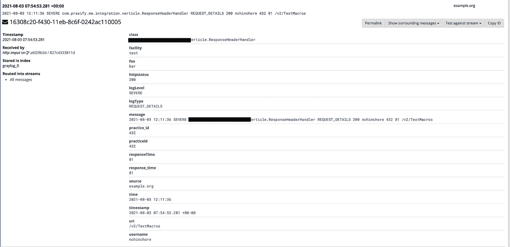
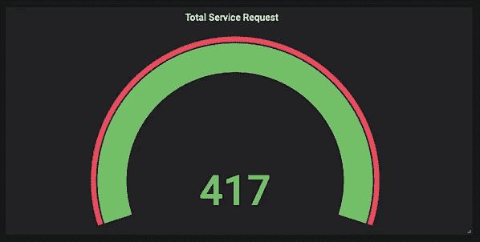
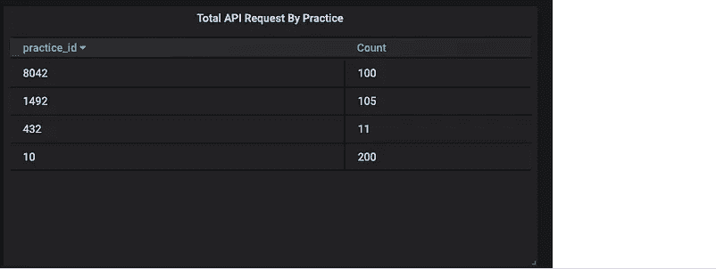
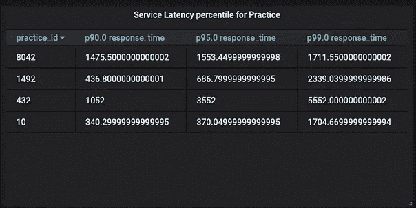
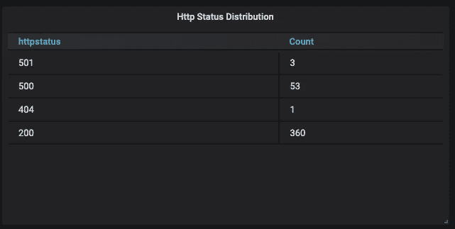
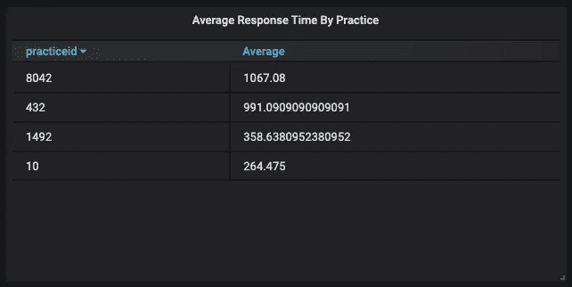
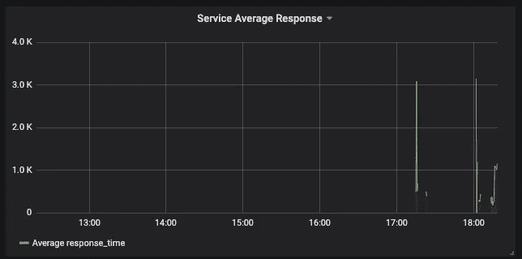
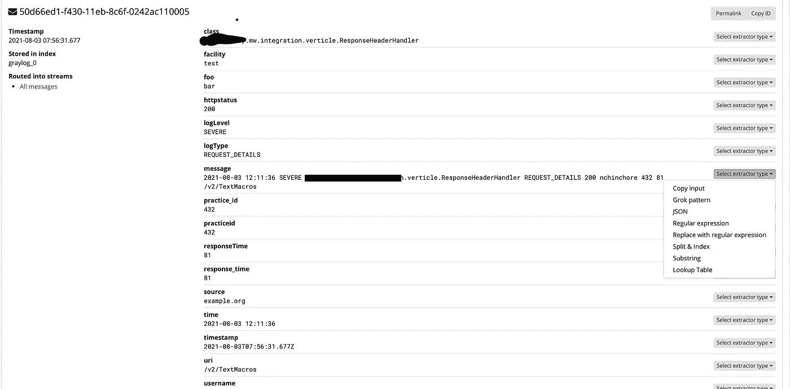
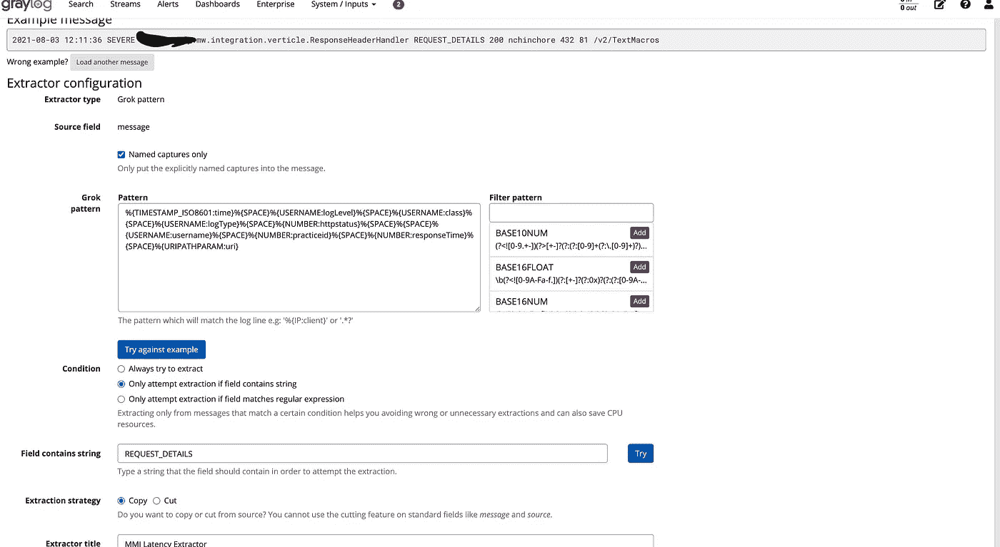
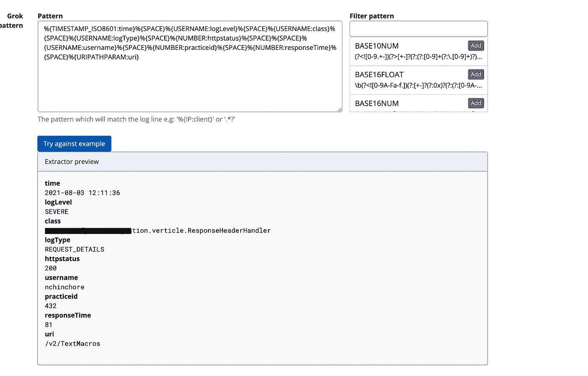

# 使用 Graylog 的 API 监控仪表板。

> 原文：<https://medium.com/geekculture/api-monitoring-dashboard-using-graylog-804bce3d4983?source=collection_archive---------15----------------------->


API Monitoring Dashboard using Graylog.

API 是一种微服务语言。他们本质上是其他团队可以访问的唯一元素。API 响应时间和 API 的一致性是每个团队定义的两个主要 SLA。API 监控是微服务监控必不可少的一部分。API 监控有不同的形式，如 API 监控频率、API 响应时间、API 调用模式、API 成功率等。所有这些都是需要监控的基本属性。监控这些属性并对其中发现的问题采取行动是保持微服务健康的唯一方法。

我们在过去也遇到过问题，特别是一个客户端(上下文)面临延迟问题，我们花了相当多的时间来识别有延迟问题的 API。为了识别存在延迟问题的 API，我们必须深入研究审计日志。通过这次事件，我们发现我们的 API 监控还有改进的空间。

因此，我们决定构建一个仪表板，在这里我们可以在粒度级别上跟踪 API 的性能。我们已经确定了一些可以改进监测的领域。以下是我们希望在新的控制面板中监控的属性。

*   **API 级延迟**
*   **上下文级延迟**
*   **上下文相关 API 使用量**
*   **API 明智用法**
*   **实践智慧 API 延迟**
*   **用户智能 API 延迟**
*   **API 错误洞察。**
*   **服务平均延迟**
*   **服务响应时间百分比**
*   **服务提供的 API 请求总数。**

我们用来创建新仪表板的内容。

*   灰色日志
*   **格拉夫纳**
*   **弹性搜索**

# **灰色日志**

我们使用 Graylog 作为我们服务的日志聚合器。虽然我们的服务服务于任何 API 请求，但它拥有创建新仪表板所需的所有细节。为了监控我们的服务以达到上述目的，我们需要一些正在被服务的请求的细节。下面是我们监控 API 性能所需的关键信息

*   **API 正在被调用**
*   **请求的练习 id**
*   **请求的用户**
*   **以毫秒为单位的请求响应时间**
*   **Http 状态码**

我们只在服务中添加了一个简单的日志行来记录这些细节。这个简单的日志行如下所示。

```
LOGGER.error(“REQUEST_DETAILS {0} {1} {2} {3} {4} {5}”, statusCode , userDetails.getString(“username”),
 request.getHeader(PRACTICE_ID), request.response().headers().get(“x-response-time”), request.path());
```

该日志行将导致下面的简单日志。

```
2021-08-03 12:11:36 SEVERE com.companydomain.mw.integration.verticle.ResponseHeaderHandler REQUEST_DETAILS 200 nchinchore 432 81 /v2/TextMacros
```

有了这个日志行，我们就有了我们想要记录的所有细节来生成一个新的仪表板，但是所有这些细节都是消息字段的一部分。但是要查询 API 请求的每个属性，我们需要将这些属性作为单独的字段添加到弹性搜索中。

因此，为了从日志消息中提取字段，我们使用了一个 Graylog [提取器](https://docs.graylog.org/en/4.0/pages/extractors.html)。我们使用 grok extractor 从消息字符串中提取字段。Grok extractor 使用 Grok 语言从字符串中提取数据。到 Grok 提取器文档的链接是这里的。我们提取了像上下文 id、HTTP 状态、请求的响应时间、Api URI、用户名这样的字段。我们已经编写了下面的 Grok 模式来从消息字段中提取细节。

```
Condition Will only attempt to run if the message includes the string REQUEST_DETAILS Configuration grok_pattern: %{TIMESTAMP_ISO8601:time}%{SPACE}%{USERNAME:logLevel}%{SPACE}%{USERNAME:class}%{SPACE}%{USERNAME:logType}%{SPACE}%{NUMBER:httpstatus}%{SPACE}%{SPACE}%{USERNAME:username}%{SPACE}%{NUMBER:practiceid}%{SPACE}%{NUMBER:responseTime}%{SPACE}%{URIPATHPARAM:uri} named_captures_only:
```

*   从语义上讲，用 grok 模式提取任何字段后，这些字段将被存储为字符串，但是字符串字段不能应用平均和百分比度量。
*   因此，为了将**response time**和 p**racce id**从字符串数据类型转换为数字数据类型，我们添加了两个**复制输入**提取器。
*   在应用了所有 3 个提取器后，我们的日志线看起来会像下面的灰色日志。



Extracted log details with grok pattern

# **格拉夫纳**

提取所有这些字段后，我们使用 Grafana 进行可视化和弹性搜索，作为 Grafana 的数据源。在所有这些变化之后，我们能够构建非常好的仪表板，在那里我们可以在粒度级别跟踪我们的 API 的性能，如上所述。

下面是我们新仪表板的一些屏幕截图。**请注意，响应时间以毫秒为单位。**

下面是一些新 Grafana 仪表板的屏幕截图。



Grafana DashBoard Images

## 如何为您的服务创建仪表板

您还可以使用 Graylog、Grafana 和 Elastic search 为您服务构建类似的仪表板。按照以下步骤构建仪表板。

*   **代码变更**

在您的服务代码中添加日志，其中包含您希望在 [Graylog.eg](http://Graylog.eg) 中包含的所有详细信息:在我们的示例中，我们添加了 logger . error(" REQUEST _ DETAILS { 0 } { 1 } { 2 } { 3 } { 4 } { 5 } "、statusCode、user DETAILS . getstring(" username ")、request.getHeader(PRACTICE_ID)、request.response()。标题()。get("x-response-time ")，request . path())；

*   **灰色日志变化**

1.在消息字段上创建 grok 提取器，以提取响应时间和您想要查询的其他字段。在我们的例子中，我们提取了实践 id、响应时间、用户名、请求路径、Http 状态代码，以便我们可以查询每个字段。

**2。创建 grok 模式的步骤**

*   登录灰色日志
*   导航到系统/输入→输入→您的日志输入(我们的日志输入是默认的 GELF 输入)→管理提取器→添加提取器→开始→加载带有消息 id 和灰色日志索引的消息



*   然后创建一个 grok 模式并测试它，看看是否提取了所需的字段
*   然后创建一个 grok 模式并测试它，看看是否提取了所需的字段



Try Extracting fields with grok pattern



Log fields will get extracted

# 格拉夫纳变化

*   登录 Grafana
*   添加弹性搜索作为数据源
*   然后创建 dashboardAdd 小部件，并根据需要编写小部件的查询。