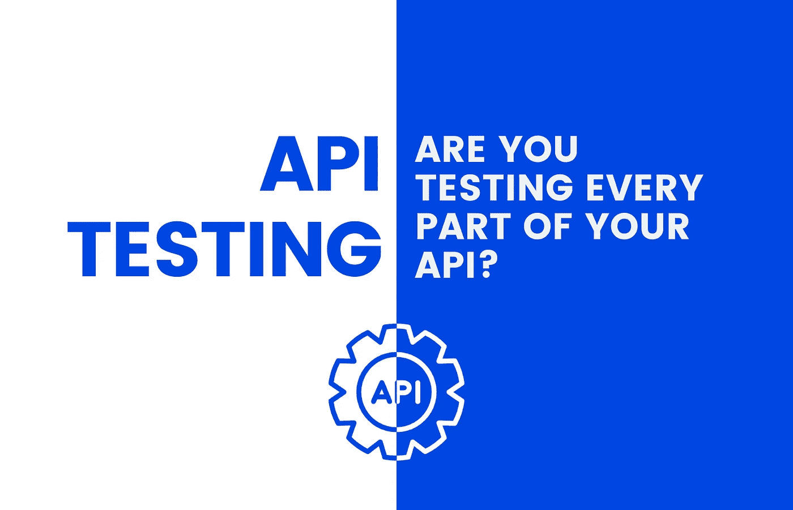

# API 测试:你在测试你的 API 的每一部分吗？

> 原文：<https://medium.com/geekculture/api-testing-are-you-testing-every-part-of-your-api-4581441d202?source=collection_archive---------17----------------------->

期望你已经熟悉 API，什么是 API 测试等等。在这些话题上不做过多的细节探讨，让我们简单总结一下。

API 测试是指应用测试策略、概念和技术，以验证测试中的 API 完全符合其预期功能。它还确保您的 API 遵循…