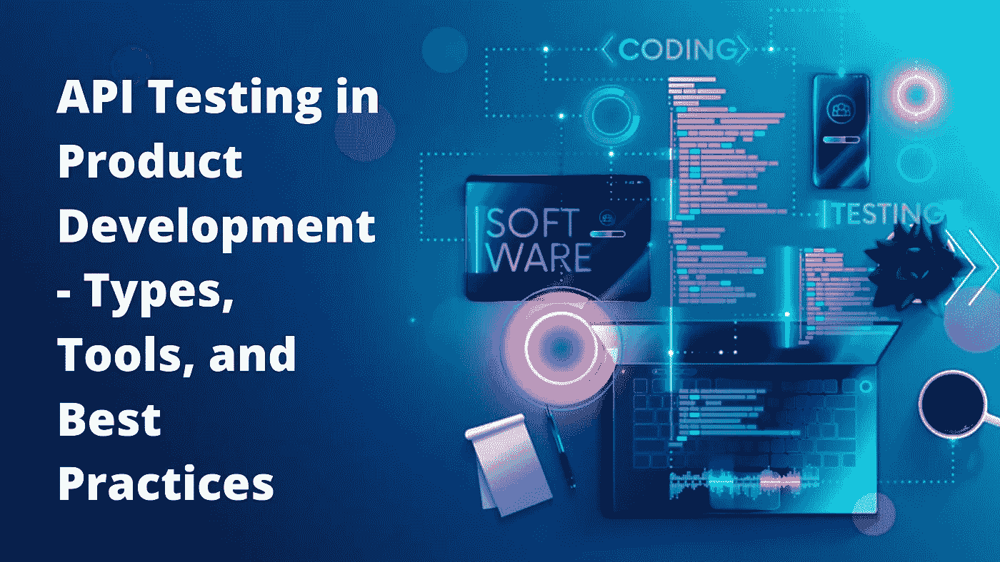
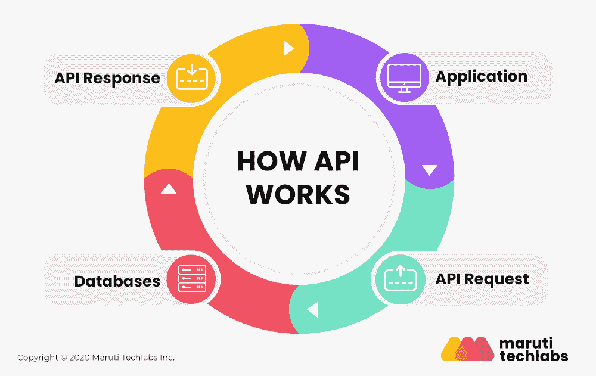
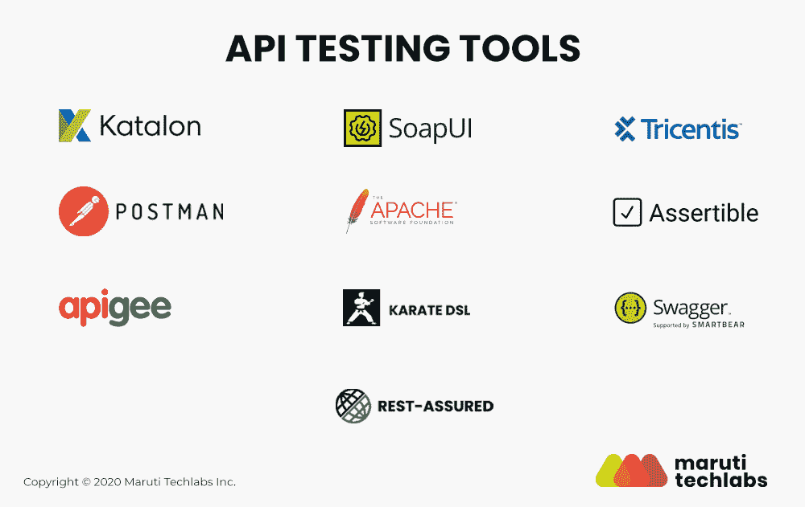

# 产品开发中的 API 测试——类型、工具和最佳实践

> 原文：<https://medium.com/geekculture/api-testing-in-product-development-types-tools-and-best-practices-843941d8fb60?source=collection_archive---------4----------------------->

API 的效率可以决定你产品的成败。API 充当数据库和应用程序用户界面之间的桥梁。因此，在过去的几年里，产品开发中的 API 测试理所当然地变得越来越重要。虽然 API 测试的好处很多，但是在持续开发和敏捷环境中，很容易陷入 API 测试的合并和管理的困境。

在这里，让我们更好的了解什么是 API 测试，它的好处，各种 API 测试工具，以及详细的流程。请继续阅读！

# 什么是 API 测试？

顾名思义，API 测试是一个帮助确保软件产品质量的过程。API 测试包括各种 QA 行为，包括使用多个参数的 API 调用、输出和响应验证。在这里，我们更倾向于寻找数据准确性、HTTP 状态代码、数据格式和错误代码。

我们用来测试 API 的方法取决于你所创造的产品的类型。无论你有 web 服务 API，OS API，DB API，还是远程访问资源的 API， [API 测试](https://marutitech.com/quality-engineering-services/)还是必要的。

# API 测试有哪些不同的类型？

既然“什么是 API 测试”这个问题已经回答了，那么让我们来看看 API 测试的类型。下面，我们讨论了 8 个 API 测试，这些测试回答了我们首先使用 REST API 测试的常见问题。这些问题是:

*   根据输入理解 API 的返回值
*   验证 API 是返回错误答案还是什么都不返回
*   检查 API 是否正在调用其他 API 或调用事件
*   确定 API 是否连接到数据结构

现在，让我们看看您可以使用的 API 测试类型。

# 1.功能测试

功能测试是 API 测试的一种，它验证产品的操作需求。这些函数使用特定的场景来确保 API 按照预期的参数运行。如果结果不是预期的，则错误被纠正或管理。

例如，如果您正在测试一个为在线平台上订购音乐而创建的 API，功能测试可以检查分层的场景。它表明用户通常通过曲目或艺术家的名字进行搜索，功能测试将使用多个场景来了解是否提供了正确的输入。

# 2.可靠性测试

当我们将一个 API 连接到多个设备时，有必要检查它是否有任何断开。可靠性测试让我们可以准确地检查这一点。通过这个测试，您可以看到这个 API 在任何特定的环境中是否能够正常运行，并提供一致的结果。

# 3.负载测试

顾名思义，负载测试检查 API 是否有能力处理一定量的负载。它回顾了一个特定的 API 在比它应该处理的负载更高的负载下是如何工作的。

在这种类型的测试中，测量响应时间，检查恶劣条件，分析吞吐量，并评估其他类似的因素。整个目标是观察系统如何反应以理解高负载场景。

# 4.创造力测试

任何 API 的创造性都在于它能够以独特的方式使用。这就是创造性测试在 API 中检查的内容。它评估我们是否能以多种方式使用一个特定的 API。如果不是，创造性测试揭示 API 写得很差。

# 5.安全测试

安全测试包括 API 的安全需求。它包含权限、认证和访问控制。

*   API 所需的身份验证
*   保护敏感数据安全所必需的加密
*   对资源管理进行授权检查和控制

总的来说，这三者揭示了 API 的安全结构。

# 6.能力测试

能力验证与原料药的性能有关。它衡量它为开发人员提供的能力以及执行 API 操作的可行性程度。

# 7.API 文档测试

文档经常被忽视，但是对于开发团队来说却是至关重要的。API 文档包含使用 API 的过程。每个复杂的需求、技术需求和工程需求都在 API 文档中进行了描述。理解这个文档是否能指导用户从 API 中提取价值是 API 文档测试的真正目的。

# 8.阴性测试

消极测试检查您的 API 是否被设计为优雅地处理意外的和无效的用户响应。例如，如果用户在字母字段中键入一个数字，您会对用户说什么，或者会显示什么消息？您可以简单地显示“无效响应”。请输入一个字母。

类似地，每个错误的用户输入都包含在这个测试中。

# 在开发中使用 API 测试的好处

在测试驱动的开发中包含 API 测试有很多好处。整个[产品开发](https://marutitech.com/software-prototyping-services/)得到改进，这有助于向最终用户提供高质量的服务。

API 测试过程对于一个组织来说至关重要，这有五个重要的原因。请继续阅读，了解这些好处。

# 1.质量

经验法则是，您应该在开发生命周期中开发 API 测试，并且这些测试应该连续检查 API。如果您不能实现这一点，那么一旦您完成了开发，您将别无选择，只能开发 API 测试。这背后的错误是，你更关注 API 应该如何执行，而不是检查其他可能的漏洞。

当您在整个开发过程中使用 [Selenium](https://www.selenium.dev/) 集成 API 测试时，您可以获得健壮和全面的 API 测试。这些测试揭示了长期的好处，并且这些测试影响了 API 的整体质量。

# 2.表演

API 测试评估 API 如何与其他 API 集成，它的功能，以及它的性能。API 测试过程有助于:

*   你可以验证代码，看看代码中有没有 bug。这使我们不必在以后修改代码的重要部分。
*   无论是通过自动化测试还是手动测试，您都可以发现编码中的问题。
*   API 测试了解你产品的核心功能，判断功能是否符合用户的预期。

API 测试是一项必不可少的活动，它可以确保最终产品的最高性能。通过以上所有措施，API 测试直接或间接地改善了 API 的性能。

# 3.灵活

毫无疑问，正如我们所说的，敏捷方法的使用正在增加。仅仅进行 GUI 测试不能给我们所需的结果。这也表明，一旦开发人员完成了工作，就允许测试人员开始工作是不对的。这根本没有效率。

您需要在开发周期的早期开始 API 测试，以确保开发的每个端点都被覆盖和检查。API 测试本身的敏捷特性为团队提供了更好的管理能力，并为产品提供了更好的性能/质量。

# 4.测试覆盖率

当你需要创建一个高质量的产品时，你需要覆盖每一个软件故障点。它有助于建立客户信任，提高产品的可靠性。

幸运的是，当在开发阶段进行 API 测试时，可以发现网络、API、服务和服务器中的问题。一旦产品进入部署阶段，这些问题可能就不容易解决了。

这是因为一旦你的产品进入生产阶段，你已经有责任为未来和发展中的用例创建新的测试。你在开发过程中测试，在生产过程中测试，最终提供用户期待的产品。API 测试创建了一个敏捷的环境来实现这一点。

# 5.测试重用

您将看到的 API 测试工具的好处之一是能够在多种环境中运行测试。您可以复制和重用测试，也可以共享这些测试。例如，您的 QA 团队可以为一个登台环境构建 API 测试，DevOps 团队将在生产环境中使用它。分析的可重用性增加了 API 测试过程的效率和质量。

# 十大 API 测试工具

为了 API 测试自动化和高效的结果，使用正确的 API 测试工具是必要的。出于这个原因，我们在下面讨论十个最好的 API 测试工具。

1.  [卡塔隆工作室](https://www.katalon.com/)

Katalon Studio 是一个用于多种应用程序的自动化工具，例如移动、web、桌面和 API。它支持 Rest 和 SOAP，并为您的团队提供与 CI/CD 相关的集成。

2.[肥皂泡](https://www.soapui.org/)

SoapUI 是一个用于功能测试的专用无头工具，它使用户能够毫无困难地测试 SOAP、Rest 和 Web 服务 API。它支持数据驱动测试以及 CI/CD 集成。

此外，您可以重用在 SoapUI 中创建的任何测试代码。

3.[特里森蒂斯托斯卡](https://www.tricentis.com/products/automate-continuous-testing-tosca/)

Tricentis Tosca 是另一个神奇的工具，可以帮助开发和敏捷。它支持各种协议，如 TIBCO EMS、IBM MQ 等。您也可以在这个 API 测试工具中重用测试代码来实现测试自动化。

4.[顶点](https://docs.apigee.com/)

Apigee 是一个很棒的 API 测试工具，可以测试产品的性能和质量。它还支持在 Apigee、Swagger 等其他应用程序的帮助下创建的 API。通过这个工具，您可以使用错误率、API 流量和响应时间度量来跟踪 API 的性能。

5.[邮递员](https://www.postman.com/)

Postman API testing 是一个浏览器插件，现在可以在 Windows 和 Mac 操作系统上使用。对于那些对处理集成开发环境编码不感兴趣的测试人员和 QA 团队来说，这是非常好的，开发人员也使用这种语言。

对于 QA 团队来说，使用 Postman 进行 API 测试既简单又省事。

6. [JMeter](https://jmeter.apache.org/)

JMeter 最初是为负载测试而开发的。但是，它通常用于功能测试。它支持测试结果重放和资源的动态性能测试。在这个工具上，您可以处理 CSV 文件并查找 API 测试的参数。

7.[放心](http://rest-assured.io/)

放心，您可以轻松地测试 Rest APIs。它具有多种特性，用户不需要从头开始编写代码。要使用这个 API 测试工具，用户不需要具备专家级的 HTTP 知识。

8.[可断言](https://assertible.com/)

可断言 API 测试工具是为可靠性和自动化而设计的。通过这个工具，您可以在 CI/CD 管道中自动化您的 API 测试。QA 团队还可以对测试进行特定的修改，这些修改会自动更新。

9.[大摇大摆](https://swagger.io/)

Swagger API 测试工具非常适合性能、安全性和功能测试。它的平台使得 QA 团队更容易快速地管理、创建和使用 CI/CD 管道中的 API 测试。

10.[空手道 DSL](https://github.com/intuit/karate)

空手道是一个稳定且独特的 API 测试工具。它检查产品的性能，并在空手道中自行编写步骤定义。由于该工具自动管理该需求，您可以直接开始测试您的产品。

对于初学者来说，空手道是正确的选择。

# API 测试—最佳实践

在您开始使用 API 测试工具之前，我们有一些建议。下面，我们讨论了 API 测试的十个最佳实践。这些建议会帮助你迈出正确的一步。

1.  首先，测试预期结果或典型结果。
2.  通过在系统中包含多个负载测试来使用压力。
3.  总是测试失败。你需要知道你的 API 的失败点。
4.  根据不同的类别进行分组测试。
5.  使用 API 函数调用使团队加速测试变得更简单。
6.  使用最大数量的变量，并保持最大隔离。
7.  检查 API 如何管理未知负载和问题。
8.  使用预先计划的通话顺序。
9.  对 API 的每个输入组合使用测试用例。
10.  尽可能通过 API 测试工具自动化 API 测试。

# 结论

API 测试测试非常关键的一层——逻辑处理决定应用程序的事务和工作。产品开发中强大的 API 测试确保了产品质量、更短的上市时间和完美的性能。

从长远来看，在产品开发周期的早期利用 API 测试是节省时间和资源的关键，也是让涉众满意的关键。从 API 测试到 UI 测试，马鲁蒂 Techlabs 为您提供各种[质量工程服务](https://marutitech.com/quality-engineering-services/)测试服务的一站式解决方案。[联系我们的质量保证专家](https://marutitech.com/contact-us/)。

原刊[此处](https://marutitech.com/api-testing-in-product-development/)