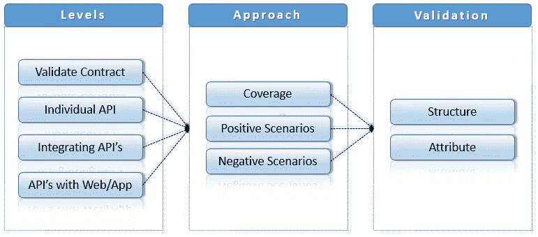
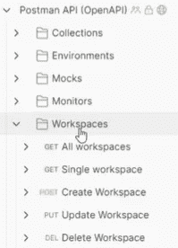

# API 测试策略

> 原文：<https://medium.com/geekculture/api-testing-strategy-384af1ff43f6?source=collection_archive---------5----------------------->

[**API 测试**](https://en.wikipedia.org/wiki/API_testing) 是一种软件测试，包括直接测试应用编程接口(API)，并作为集成测试的一部分，以确定它们是否满足功能、可靠性、性能和安全性的预期。API 测试在消息层执行，因为 API 没有 GUI。API 测试对于自动化测试至关重要，因为 API 目前是应用程序逻辑的主要接口。在推导 API 测试策略之前，不管 Postman 还是[restassed，](https://rest-assured.io/)确定测试范围是至关重要的。

API Testing strategy

## 什么应该超出范围？

任何第三方接口。大多数应用程序都有一个或多个不在 API 测试范围内的第三方接口。假设一个这样的接口是 [Google Pay](https://developers.google.com/pay/api) ，那么场景可以继续测试余额不足或无效卡超出范围的支付。这些是由支付提供商提供的功能。

## 范围内应该包括什么？

一个好的方法是随着测试的成功进行扩大范围。在每个级别组织 API 测试将有助于实现这一点。测试合同可以是第一级测试的一个例子。这种测试应该验证协议是按照规范记录的，并且可以使用这些 API。一个很好的例子就是 [Swagger](https://swagger.io/tools/swaggerhub/?&utm_medium=ppcg&utm_source=aw&utm_term=swagger&utm_content=511271175059&utm_campaign=%7bcampaign%7d&awsearchcpc=1&gclid=Cj0KCQjw8IaGBhCHARIsAGIRRYrZzUkZ5EPFefi17VDwYyr-2rOl5VdPx4-SNA__cc5LdbVqQo8NeggaAmkyEALw_wcB&gclsrc=aw.ds) 的用法。成功完成这一步应该是下一阶段测试的开始。

每个 API 请求和响应都必须单独验证；这些案例应该构成 API 测试的最小构件。例如，从`POST`请求开始创建一个资源。成功创建资源后，响应将包含一个自动生成的 id。就像上一级一样，这些案例的成功完成应该为下一级的 API 测试打开质量大门。

在第三级中，重点应该是测试一系列模仿用户动作的请求。例如，从`POST a a` 请求开始创建一个资源。成功创建资源后，响应将包含一个自动生成的 id。在下面的请求中，使用这个先前生成的 id 并触发一个`GET` 请求来检索新创建的资源的详细信息。随后是更新新创建资源的细节的请求。下一步，您可以使用`DELETE` 请求删除该资源。最后，通过调用`GET` 请求来确保资源不再存在。

甚至可以将 API 测试提升到一个新的层次，将 API 测试与自动化 UI 测试集成在一起。结合这两种类型的测试可以利用 API 测试和 UI 测试的优势，并且这两种测试都可以减少缺陷。例如，API 测试很快，而 UI 测试可能很耗时，因此如果单独执行，集成它们可以增加覆盖率并减少时间。

## 作为 API 测试的一部分，需要验证什么？

在定义了级别和最终确定了范围之后，重点是确定 API 测试中需要有效的内容。锁定应该验证的内容，排除不应该验证的内容，将有助于优化 API 测试以及未来的计划和增强。

从一个矩阵开始，以获取功能或业务需求的测试覆盖范围。Swagger 或类似的东西可以帮助确保端点被正确命名，资源的数据类型是正确的，没有缺失或重复的功能。

该策略应涵盖快乐之路或*阳性测试*。在此阶段，必须验证`REQUEST` 和`RESPONSE` 。也许为了减少最初的测试工作，可以开始只验证强制字段，并最终计划扩展到可选字段、标题、查询参数等。

*消极测试*可以更有效地用于 API 测试，这也需要成为策略的一部分。在进行负 API 测试时，属性值应该包括有效值和无效值。有效值的一个例子是删除已经删除或不存在的资源。无效值的一个例子是试图在没有授权令牌的情况下访问。

## 如何验证？

无论是`REQUEST` 还是`RESPONSE` 验证都必须以两种形式进行。如何验证的深度将取决于项目时间表、预算和风险偏好。

将整个`REQUEST` 或`RESPONSE` 正文内容与合同进行比较。这种比较可以是自上而下的方法，每次触发`REQUEST` 或`RESPONSE` 将其与合同进行比较。这种比较将是识别 API 变化的最佳位置。RestAssured 为 JSON 模式验证提供了一些出色的特性来完成这类任务。

将`REQUEST` 或`RESPONSE` 中的每个属性值与契约进行比较，有时这些值可以用于 UI 验证或数据过滤。这种验证可以是一种自底向上的方法，以特定值为目标，甚至与正则表达式相匹配。Hamcrest 就是这样一个工具，它精确地挑选出被测试的属性，并描述它应该具有的值，达到一个受控的精度水平。当被测属性的行为偏离预期行为时，这样的测试就会失败。

## API 测试管理

Public Postman API

传统上，在软件测试策略文档中会有一个部分专门用于捕获测试管理活动。本节并不试图捕捉这样的信息，而是着眼于管理 API 测试的选项。组织 API 端点有助于管理 API 测试。包含 API 端点将有助于创建高覆盖率的场景并提高集成。组织 API 端点将是开发过程中的一个额外步骤，但是好处将超过努力。在 [Postman 的案例中，](https://learning.postman.com/docs/getting-started/introduction/)他们已经隔离了所有的 API。这种方法支持重用或共享标准的信息片段，如资源类型、路径等。将 API 测试与类似的端点结构结合起来将有助于识别和扩展 API 测试。