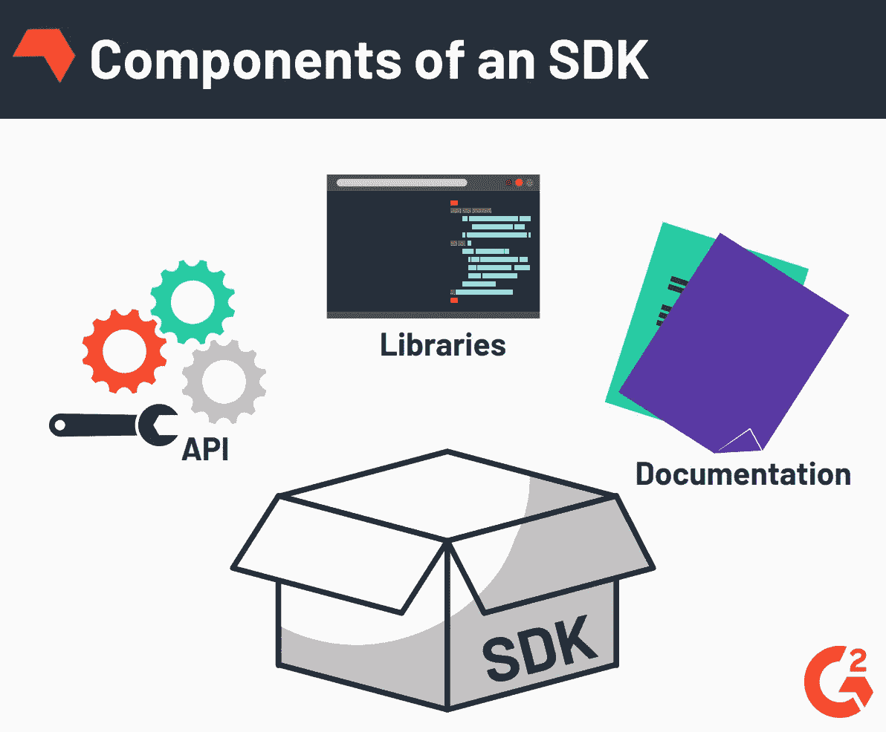

# API 和 SDK

> 原文：<https://medium.com/geekculture/apis-and-sdks-adfe896e2ec7?source=collection_archive---------79----------------------->

[Source](https://media.kairos.com/blog-images/kairos-blog-the-difference-between-api-and-sdk.jpg)

软件有各种形状和大小，伟大的应用程序创意往往是我们不知道自己想要或需要的东西。一旦这个想法形成，它可以被打包并形成可用的部分，全世界的开发者都可以访问。这通常有两种形式，SDK(软件开发工具包)和/或 API(应用程序编程接口)。

从表面上看，这两者似乎非常相似。他们有能力通过整合来自单独位置的数据来帮助简化您的网站界面，然后这些数据可以在前端呈现给消费者。这些数据可以是产品信息、电影对白或国家地标的形式。如果您可以对其进行分类，可能会有适合您需求的 API 或 SDK。

API 只是某种组织格式的数据集合，可以按照某种规则以一致的方式访问。这样，如果添加了新数据，或者有新人试图访问这些数据，数据看起来总是一样的。某个对象有一个数据模型。汽车的 API 就是一个例子。你可以有一辆特定的汽车，它有“品牌”、“型号”和“颜色”的数据现在，您添加到 API 中的每辆汽车都应该有相关的数据，这样，如果有人试图访问它，他们就知道可以从 API 中获得什么数据。您可以通过多种方式与该 API 进行交互。您可能会要求它将某个“品牌”制造的所有汽车发送给您，或者您可能希望它将某个“颜色”的所有汽车发送给您。规则将取决于为您使用的 API 的构建者。一旦你学会了规则和如何访问信息，你就可以请求数据，API 会以一致的格式返回给你。

[API data flow](https://www.google.com/imgres?imgurl=https%3A%2F%2Fwww.guru99.com%2Fimages%2F2%2F090720_0532_WhatisanAPI1.png&imgrefurl=https%3A%2F%2Fwww.guru99.com%2Fwhat-is-api.html&tbnid=YhkEa5Qj3ysseM&vet=12ahUKEwjuws_F36jxAhXFV98KHR3xDKoQMygGegUIARDXAQ..i&docid=s9Q8SRdC-txjAM&w=755&h=380&q=api%20pictures&ved=2ahUKEwjuws_F36jxAhXFV98KHR3xDKoQMygGegUIARDXAQ)

SDK 可以比 API 更全面一些，通常与 API 一起工作以使特性发挥作用。一个好的经验法则是 SDK 有 API，但不是所有的 API 都有 SDK。除了像 API 一样将数据返回给客户端，SDK 还将工具和代码特性打包在一起，供创建应用程序的人使用。代码以具有一致函数的库的形式出现，这些函数可以在 SDK 文档中引用。这可以减少应用程序的生产时间，因为工具和知识已经打包到一个整洁的可重用容器中。您现在只需要找到 SDK 的规则，并将其添加到您的项目中。

[SDK Components](https://learn.g2crowd.com/hubfs/Screen%20Shot%202019-03-22%20at%2010.03.46%20AM.png)

例如，您决定开发一个应用程序，让您可以比较多家零售商的常见商品价格。您知道每个商品都有一个唯一的条形码，所有零售商都用它来扫描商品并告诉您它们的具体价格。如果有一种方法可以让您快速扫描商品，找到条形码信息，并使用条形码信息在许多不同的零售商处搜索商品，会怎么样？

你可以集成一个来自“Scandit”公司的 SDK。这个 SDK 带有代码，可用于访问几乎任何设备的摄像头，并将其转换为条形码阅读器。这将允许您从条形码中获取 UPC(通用产品代码)。一旦您从 scan dit API 获得了条形码信息，您就可以使用它来搜索免费的 UPC APIs，以获得具有该特定代码的商品可在哪里购买的列表。然后你可以快速比较，看看哪个地方的价格最好。这是通过集成资源来访问摄像机、从产品中获取条形码信息，并使用该信息来查找其他产品而实现的。现在有人可以将所有这些打包在一起，作为自己的 SDK 使用，并让其他人能够使用他们的产品。

API 和 SDK 是人们跨平台连接数据的强大工具。它们允许软件开发人员使用其他人构建的工具来扩展和成长。这是开发者站在巨人肩膀上的最好例子。