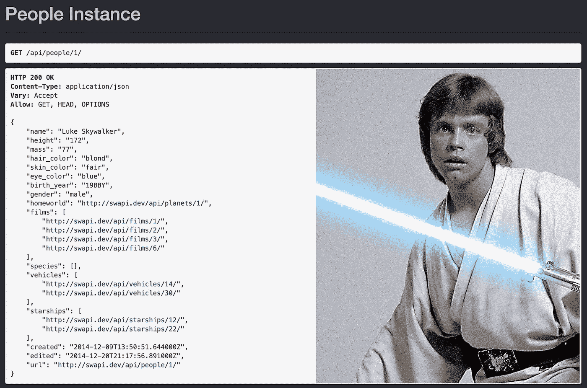
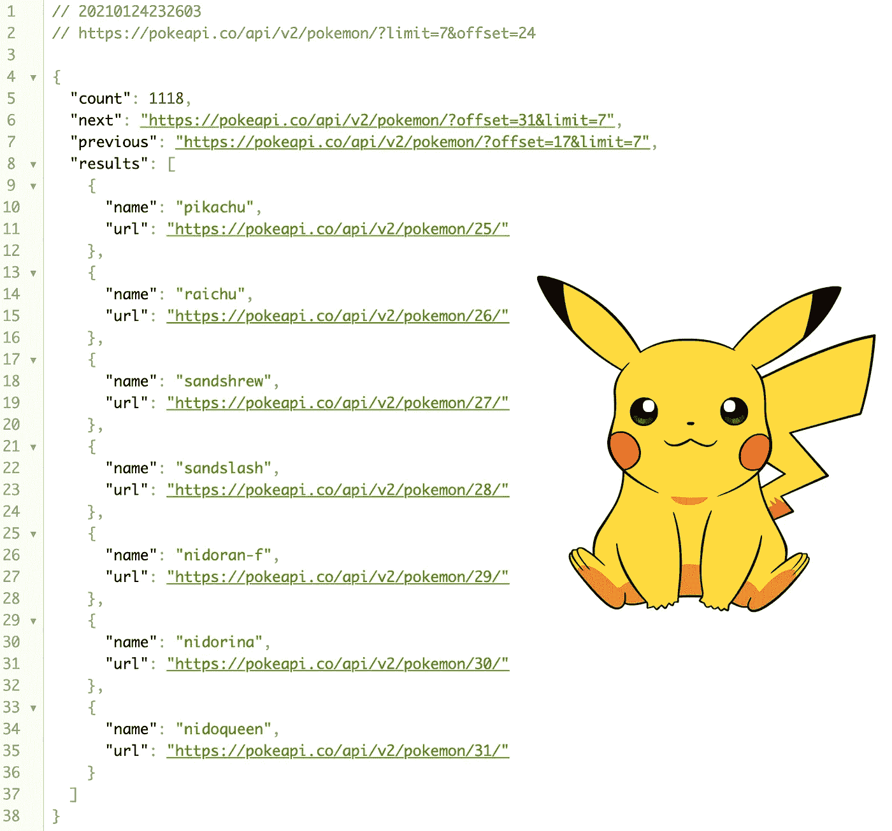
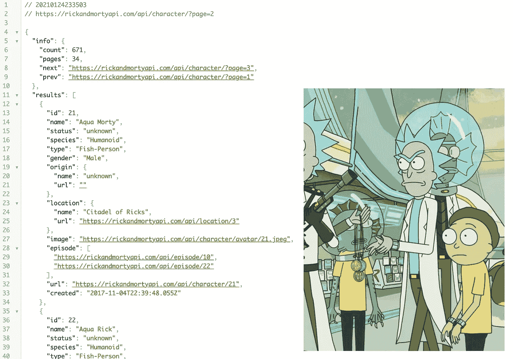
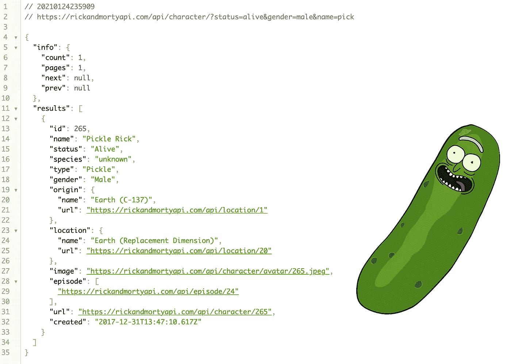

# API 和查询字符串参数

> 原文：<https://medium.com/geekculture/apis-query-string-parameters-f7f0c060b1?source=collection_archive---------0----------------------->

*如何让它们为你工作*


在过去的十年中，API 的普及和使用持续增长。它们已经成为应用程序基础设施的重要组成部分，随着公司继续使用和开发它们，适当的 API 设计是成功实现的关键。无论是公共的还是内部使用的，好的 API 设计都可以提高性能和整体开发人员体验。

最常见的 API 遵循 RESTful 架构，使用 HTTP 请求来访问和使用数据。因此，它们被设计成可以操纵 HTTP 请求，使用参数返回所需的数据，通常是 JSON (JavaScript Object Notation)格式。

# 因素

当使用 API 时，第一件要做的事情是**阅读文档**。这样做可以防止以后出现错误，并且理解如何使用内置参数只会让您的工作更轻松，尤其是在处理大型数据库时。有几种类型的参数。

**头** **参数**包含在请求头中，通常与授权相关。大多数私有或订阅 API 都需要在头参数中有一个唯一的键来接收响应。

**路径参数**在端点的路径内。端点是 API 访问返回响应所需信息的地方。通常，路径参数由`/`分隔。这方面的一个例子是下面对星球大战 API 的请求:

```
https://swapi.dev/api/***people***/***1***/
```

`swapi.dev/api/`是端点的基本 URL。后面跟有`1`的`people`是获取特定 person 实例的路径参数。在这种情况下，*卢克·天行者*



The Star Wars API returns a nicely rendered HTML of the instance(s), photo not included.

如果`1`没有被添加到端点，`/people`将返回星球大战宇宙中的所有人或角色。在这里亲自尝试一下。

**查询字符串参数**出现在端点`?`之后。问号`?`后面是参数及其值，通常称为“查询字符串”。如果使用得当，这为向 RESTful APIs 添加基本过滤提供了最简单的方法。

# 如何使用查询字符串参数

在使用查询字符串参数之前，请务必参考 API 的文档。并非每个 API 的设计都相同，也并非每个查询字符串格式都适用于该 API。但是，有一些标准规则可以帮助您入门并轻松过滤数据。

要添加查询字符串参数，在基本 URL 和路径参数(如果有的话)后面的端点上添加一个问号(`?`)。在`?`之后是指定特定参数和值的查询字符串。

```
http://exampleAPI.com/{*path-parameter}*?**parameter=value**
```

这些参数可以一个接一个地串连起来，用一个“与”符号(`&`)将它们分开。参数的具体顺序无关紧要。

API 之间的查询字符串各不相同。因此，再次强调，参考文档来理解这些功能是非常重要的。对于较大的 API 数据库，常见的查询字符串参数包括`limit`、`offset`和`page`。Limit 提供了您想要返回的资源/实例的数量，而 offset 规定了从哪里开始计数。它们经常相互结合使用，就像下面的 Pokemon API 的例子一样。

```
[https://pokeapi.co/api/v2/pokemon/?**limit=7&offset=24**](https://pokeapi.co/api/v2/pokemon/?limit=7&offset=24)
```

在`?`之后的查询字符串是`limit=7&offset=24`。这要求 Pokemon API 发送回 7 个 Pokemon 实例，从编号 25 开始。



The API information is returned in a simple JSON format with links to the specific endpoints to get a specific Pokemon’s information.

Page 类似于 limit & offset，除了已经有一个关于渲染多少实例的内置限制，开发人员只需要一个 page 参数来访问下一个/上一个数据集。下面这个来自 Rick & Morty API 的例子有一个内置的限制，每页显示 20 个字符。

```
[https://rickandmortyapi.com/api/character/?**page=2**](https://rickandmortyapi.com/api/character/?page=2)
```



*Brief cameo of Aqua Morty and Aqua Rick from* S01E10 “Close Rick-counters of the Rick Kind”*.*

如上图所示，Rick 和 Morty API 的第二页只显示了 id 为 21–40 的字符。随着页码的增加或减少，显示的字符将变为下一个或前 20 个。

虽然限制响应实例的数量非常有用，但是一些 API 能够使用实例的属性形成查询字符串。可能的疑问总是列在文档中。Rick 和 Morty API 允许基于几个字符属性的查询，包括姓名、状态、物种、类型和性别，可以这样使用:

```
[https://rickandmortyapi.com/api/character/?**status**=**alive**&**gender**=**male**&
**name**=**pick**](https://rickandmortyapi.com/api/character/?status=alive&gender=male&name=pick)
```

该端点搜索 API 中所有状态为 alive、性别为男性、*和*姓名包含 pick 的字符。结果如下。



Pickle Rick!

# 最后

当从 API 访问信息时，查询字符串参数是有用的工具。在最基本的情况下，使用正确的查询字符串可以限制返回的响应数量，而其他人则能够在一个端点上嵌入多个表和数据库。可能性是无穷无尽的。

随着 API 的不断发展，有一个设计合理的框架来实现易用性是至关重要的。使用参数(尤其是查询字符串参数)过滤和排序数据的能力只会优化 API 并为开发人员提供更多工具。最后，永远记得阅读文档！

*关于 API 或本文引用的 API 的更多信息:*

*   [星球大战 API](https://swapi.dev/documentation)
*   [口袋妖怪 API](https://pokeapi.co/docs/v2)
*   [瑞克和莫蒂 API](https://rickandmortyapi.com/documentation/)
*   [RESTful API](https://searchapparchitecture.techtarget.com/definition/RESTful-API)
*   [REST API 设计:过滤、排序和分页](https://www.moesif.com/blog/technical/api-design/REST-API-Design-Filtering-Sorting-and-Pagination/)
*   [针对参数和查询字符串用法的 REST API 设计最佳实践](https://www.moesif.com/blog/technical/api-design/REST-API-Design-Best-Practices-for-Parameters-and-Query-String-Usage/)