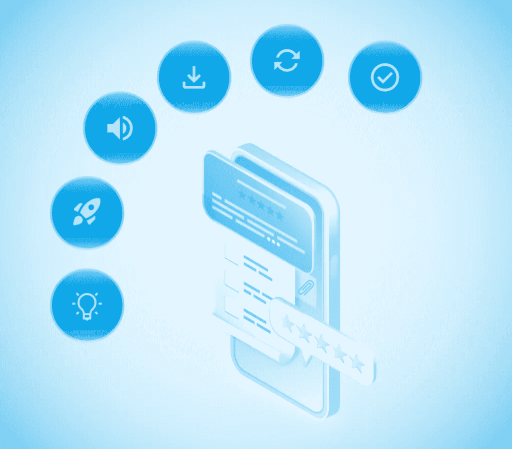
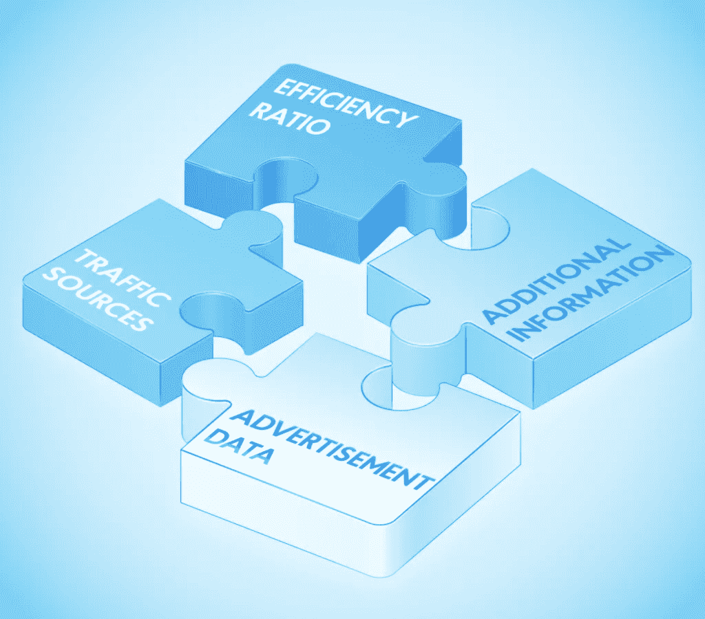
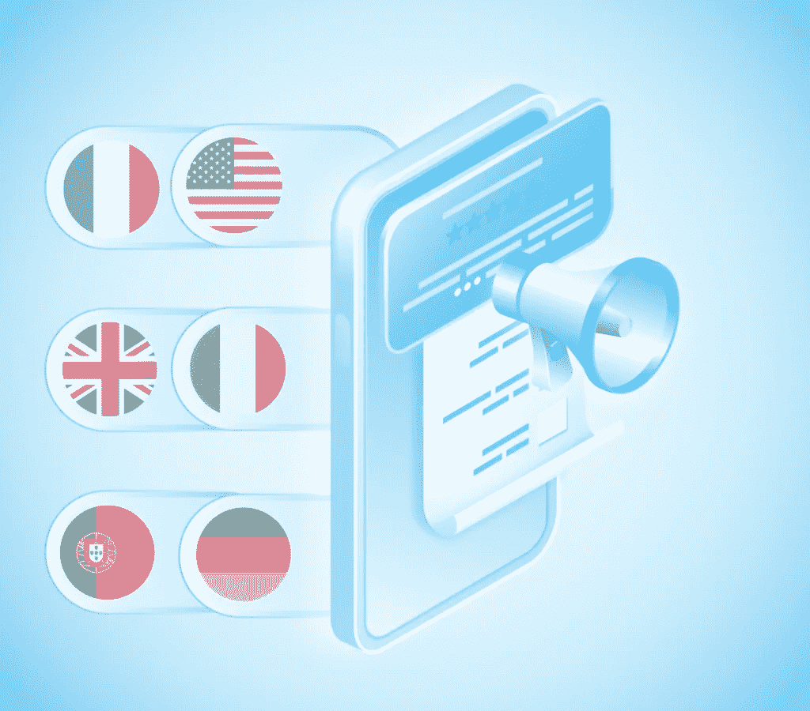

# 应用商店优化 101:建立成功的 ASO 战略——NIX United

> 原文：<https://medium.com/geekculture/app-store-optimization-101-build-a-successful-aso-strategy-nix-united-21d189bab84c?source=collection_archive---------16----------------------->

想象一下[应用程序开发服务](https://nix-united.com/services/mobile-app-development/)已经结出了果实，你已经收到了一个现成的移动应用程序，现在你想把它展示给你的目标受众。这并不是你成功之路的终点，因为，如果没有适当的推广，即使是最高端的产品也有留在竞争对手阴影下的风险。

你可能知道，移动应用商店是推广应用的主要场所。这种推广有自己的特点和名称:应用商店优化(ASO)。特别是，ASO 技术是专门为 App Store 和 Google Play 开发的。

如果你不使用 ASO 来提高你的应用程序的搜索排名，你将错过你的应用程序最大的用户获取渠道之一。因此，让我们考虑一下下面的 ASO 指南。

如果你想了解更多的数字营销，你可以阅读我们的[网络营销服务](https://nix-united.com/services/digital-marketing/)。

# ASO 是不是相当于手机 app 的 SEO？

本质上，在数字营销中，ASO 有点类似于 SEO。但如果在第二种情况下，专家与网站合作，在第一种情况下，正如你已经理解的那样，他们与移动应用商店(App Store 和 Google Play)中预装的移动应用进行交互。

事实上，ASO 专家的主要任务是确保相关用户请求的应用程序的可见性(也就是说，当输入他们的请求时，用户应该首先看到您的应用程序)。因此，ASO 专家的主要职责包括选择搜索查询，编译语义核心，以及向 App Store 和 Google Play 搜索机器人索引的文本元数据添加关键词。

此外，ASO 专家应该努力确保最终用户搜索的便利性:应用程序的名称和描述应该信息丰富、易于理解和阅读(而不仅仅是为搜索算法量身定制)。

最后，重要的是要理解 ASO 专家不仅要将 ASO 实践应用于讲英语的受众，还要应用于其他受众，并针对不同的语言本地化调整应用商店优化策略。

ASO 的最终目标是在 app store 中为你的应用程序页面带来更多流量，以便用户下载。

# 如何知道你的 ASO 是否达到了目标？

app store 应用商店优化的主要成功指标是从应用印象(特定用户与应用图标或下载页面的视觉接触)到安装的转化。至于 Google Play，在这种情况下，转换的是应用所在位置的安装数与页面浏览量的比值。

重要的是要理解 ASO 是一个过程，而不是一套一次性的措施。每天都有应用程序发布并上传到应用商店，就像你一样，这些应用程序背后的营销团队也会定期发布应用程序。因此，即使仅仅停滞了几个星期，您的应用程序也可能会失去以前的位置。

你还应该做好准备，随着时间的推移，你的应用商店优化策略将不得不改变，以适应你的业务领域的新现实。因此，那些以前有效的工具，经过一段时间后，可能对您的应用程序毫无用处。

另一个需要记住的因素是，越早开始 ASO 越好。举个例子，如果我们说的是 App Store，当应用没有定期更新的时候，这个 Store 就把它移除了。由于有时发布更新的决定性因素是第一个应用程序发布的利润，所以你需要尽快开始采取旨在从你的产品中赚钱的行动。

总的来说，做好持续工作和优化你的 app store 优化策略的准备，你一定会成功的！

# 影响 ASO 成功的因素有哪些？

app store 优化活动的有效性取决于许多因素，其中许多因素 ASO 专家无法影响，但可以考虑制定真正有效的 app store 优化策略。让我们看看这些因素:

*   应用评级和评论数量
*   行为因素(例如，用户在你的应用下载页面上花费的时间)
*   应用程序质量(安全级别、可用性、对目标受众的有用性等。)
*   更新的规律性
*   应用程序本地化
*   应用程序的名称(特别是，它包含的关键字很重要)
*   描述中使用的关键字(这对于应用商店中的应用推广尤其重要，因为甚至有一个特殊的字段需要填写)
*   字幕(这个和 App Store 有关)
*   应用程序的描述(这对于 Google Play 尤其重要，因为这个商店直接从搜索引擎索引搜索查询)
*   广告文本(此选项仅在 App Store 中可用)
*   应用内购买
*   开发商公司的名称(这仅与 Google Play 相关)
*   图标
*   截图(分别针对智能手机和平板电脑)
*   面向入职用户的视频
*   应用程序大小(这是影响用户下载该应用程序意愿的间接好处之一)

从这个列表中可以清楚地看到，ASO 专家的任务不仅仅是优化应用程序的文本，还包括与之配套的视觉效果，以及开发人员的工作质量。

因此，ASO 专家的职责应该扩展到与设计部门和开发部门的互动。前者将为应用程序提供高质量的截图，并创建一个有吸引力和可识别的图标，而后者将确保用户的反馈落实到定期更新中。

当然，不分析应用程序的目标受众是不行的。将来，这将为您创建合适的语义核心带来一些好处，并为您提供一个使用正确的关键字和短语来构成应用程序页面上内容的文本部分的机会。

# 麻生为什么这么重要？

与用户通常通过浏览器中的搜索引擎找到的网站和网络应用程序不同，在移动应用程序的情况下，谷歌及其类似物并不经常使用。相反，移动用户求助于应用商店内置的搜索引擎。这使得这一渠道成为吸引目标受众的最有效方法之一。

因此，ASO 可以帮助你超越你的竞争对手，并积极影响你的应用程序的排名和创收。

您的应用商店优化的有效性可以通过三个目标的实现来跟踪。所以，如果你的应用程序在搜索引擎结果页面(SERP)中排名前三，那么你就达到了第一个目标。同时，在 SERP 中的位置并不能保证用户会想去你的应用程序的下载页面:他们可能不喜欢你的名字，图标，最后，评级。这就是为什么提前解决所有这些问题是如此重要(当然，评级除外)。下一个目标是通过深思熟虑的描述和丰富多彩的截图鼓励用户下载并安装你的应用。

# ASO 应该使用哪些工具和数据？

ASO 专家通常使用 App Store Connect 在 App Store 上推广应用程序，使用 Google Play 控制台在 Google Play 上推广应用程序。他们还经常使用工具来跟踪关键查询的位置，建立语义核心，跟踪评论和评级，并与用户反馈、竞争情报、截图编辑器和各种 A/B 测试工具一起工作。针对所有描述的类别的可用解决方案列表非常广泛，因此我们决定直接为您提供特定解决方案的选择。

至于在分析和建立有效的应用商店搜索优化策略方面为您带来额外好处的数据，包括以下内容:

*   效率比率。其中包括有机流量增长、转化率、用户评级和评论、用户对应用的平均评级、应用所在类别的平均数据、竞争对手数据以及应用中存在的漏洞。请注意，其中一项价值的降低会对你的晋升产生显著的负面影响，反之亦然。
*   流量来源。这些数据包括关键词、特色应用、相关应用、相关应用和热门用户查询。
*   广告数据。其中包括 App Store 和 Google Play 上的搜索广告指标。
*   附加信息。这些数据包括季节性、假日事件、旗舰智能手机发布、突发趋势(如新冠肺炎疫情)以及 App Store 和 Google Play 的更新。

# Google Play 上的 ASO vs App Store 上的 ASO:有区别吗？

如果你的应用有两个本地版本，或者你求助于 [Xamarin 开发](https://nix-united.com/blog/the-complete-guide-to-xamarin-mobile-app-development-in-2023/)，你需要为每个应用商店应用 ASO 提示。

特别是，如果你仔细分析过直接或间接影响应用商店优化的因素列表，你应该明白 Google Play 的 ASO 和 App Store 的 ASO 是有一些区别的。尤其是 App Store 以封闭系统著称，开发者在那里呈现应用更加困难。这意味着该商店的竞争将少于 Google Play，特定关键词的排名将更容易。

此外，App Store 和 Google Play 有几个特定因素是特定商店独有的。所以，要在 App Store 上推广，你需要仔细考虑副标题、描述(必须包含关键词)，以及广告文本。至于 Google Play，在这里，应用程序开发公司的名称在推广中起着决定性的作用。那么，ASO 步骤呢？跟着下一节！

# 有效 ASO 的 9 个技巧

最后，我们已经到了你已经有了问题的答案的地步:“什么是应用商店优化？”以及“影响你战略成功的主要因素是什么？”所以，是时候考虑应用商店优化步骤了，这将帮助你在最受欢迎的应用商店推广你的应用。

# 了解你的目标受众对你的期望

让我们从你的客户的角度出发，开始我们的应用商店优化技巧列表。这意味着你要了解他们是谁，他们的兴趣是什么，他们的痛点和欲望是什么。您的应用程序应该至少解决其中一个难点，或者帮助实现至少一个愿望。

所有这些都应该通过独特的销售主张(USP)来表达，您将通过上传产品的 app store 页面上的广告和内容向目标受众展示。

# 注意可接受的应用程序大小

大于 100 MB 的移动应用程序会在下载前发出警告。事实是，就下载过程的实现而言，这种应用程序是资源密集型的，因此并不适合所有的智能手机型号。

注意，绝大多数将应用上传到应用商店的开发者都遵守这些要求，所以今天你不太可能在他们的类别中的领先产品中找到这样重量级的软件。

我们之前已经讨论过定期更新的重要性，所以让我们来回顾一下:它们不仅对于开发者修复漏洞和优化你的应用程序是必要的，而且还可以证明你向那些对你的应用程序留下负面评价的用户提供了积极的反馈。但是，在计划下一次更新之前，您应该执行 A/B 测试，以确保特定功能需要优化。否则，您将面临降低用户体验和失去用户的风险。

# 针对不同语言定制您的应用

虽然你的应用程序最明显的目标受众可能是美国、英国和其他以英语为官方语言的国家，但照顾其他语言偏好的潜在用户也很重要。例如，西班牙语是世界上第四大流行语言，因此忽视为西班牙语国家的居民本地化应用程序的能力是错误的。即使您的应用程序仍然只有英语，您至少可以将页面与它一起适应其他几个本地化版本。

# 特别注意语义核心的编写

为了编译语义核心，ASO 专家通常使用 Google Keyword Planner 或 Serpstat。这些自动化了搜索关键词的过程，几分钟后，你就有了一个现成的列表。至于它们的用法，你要知道你不需要把这些词互相组合(也不需要在标题中加入你已经用过的词)。您可以用逗号分隔它们。

你应该开始你的 SEO 的第一件事是为你的应用取一个名字。如果你的开发公司还不是很出名，如果你在那里包含一个关键词或者它的修改会更好。标题的最大长度是 50 个字符。

接下来，你需要在描述上下功夫——这将向你的目标受众解释他们将如何从安装和使用你的应用程序中获益。这个描述有两个部分:ATF 和 BTF。第一部分仅限于一两句话，然后是“更多”这个词。这就是为什么这部分应该包含关于你的应用程序的最重要的东西。这里你也必须使用关键字。请记住，描述的最大长度是 100 个字符。

SEO 的另一个极其重要的方面是互联网上链接的存在，这些链接指向应用程序商店中你的应用程序的下载页面。这些链接的质量取决于它们所在网站的搜索引擎排名。

# 为你的用户提供信息丰富的截图

在你的应用的下载页面提供给你的用户的截图是决定是否下载的决定性因素之一。因此，它们不仅要在视觉上吸引人，还要能提供信息。请记住，您只有五个用于放置截图的插槽，并且它们必须兼容所有适合下载应用程序的设备格式。

# 优化应用类别

几年前，应用程序的类别对其推广的有效性起了很大的作用，然而，我们今天不应该忘记它们。特别是，你的用户在寻找你的产品时应该不会遇到任何困难。这意味着你需要为它选择最合适的类别。

# 确保你的应用有很高的评价

高排名完成了我们的应用程序商店优化技巧列表。

显然，积极的评论对你的应用程序的排名有非常积极的影响，并有可能在未来给你带来非常好的转化率。这一点的关键是社交证明(即，如果其他用户说你的应用很酷，那么他们的评论是可信的)。

这里需要澄清的一点是，应用商店会显示你的应用最新版本的评分和评论。这意味着如果你的更新不成功，你可以否定你过去的成功。此外，应用商店也与本地化有关。那么如何给一个 app 获得正面评价呢？很简单:让它真的很酷(是的，我们知道这很难)。

# 执行 ASO 时可能会犯的错误

除了上述我们的应用商店优化技术，记住不好的技术总是很重要的，这将使你避免在应用商店搜索优化方面的错误和适得其反的行为。以下是其中的一些。

*   您没有针对不同的本地化调整应用程序的页面。这种方法自动剥夺了下载和安装您的应用程序的潜在用户的最大份额。即使你的应用程序只有一个语言版本(通常是英语)，你也要明白说英语的人分散在世界各地。
*   您的开发团队会随着更新而放慢速度。更新不仅是消除发布后发现的错误，也是一种 ASO 提示技巧，允许您通过引入适应数字行业当前趋势的功能来吸引潜在用户。
*   你的更新太全球化了。通过发布覆盖大量功能的更新，你将无法确切了解哪些帮助你扩大了目标受众，哪些反而疏远了以前的用户。最好是定期上传新的更新(比如几个月一次)。此外，这种方法更具成本效益和时间效率，因为更新将更频繁地推出，您将逐渐花费预算来实现它们。
*   你使用过时的数据。如果您使用过时的数据，即使是 app store 优化最佳实践也可能无效。因此，定期更新分析很重要，这有助于您评估应用程序在搜索结果中的当前位置及其下载和卸载的动态。

# 最后的想法

随着应用商店中应用数量的增长(截至 2022 年 11 月，Google Play 上有[约 360 万个应用](https://www.statista.com/statistics/266210/number-of-available-applications-in-the-google-play-store/)，App Store 上有[160 万个](https://www.statista.com/statistics/276623/number-of-apps-available-in-leading-app-stores/)，它们之间的竞争变得日益激烈。因此，我们希望我们的 app store 优化最佳实践能为您带来便利。

所以，为了让你的产品在内置的搜索引擎中排名，并通过这些商店给你带来好的转化，尽早开始 app store 搜索优化很重要。如果您正在寻找将 ASO 最佳实践应用于您的应用的最佳营销专家，请[联系我们](https://nix-united.com/blog/app-store-optimization-aso-main-tips-and-techniques/#contact-us)。此外，在阅读我们的 ASO 指南后，您可以在本文中了解更多关于[移动应用营销](https://nix-united.com/blog/mobile-app-marketing-a-friend-for-your-business/)的信息。

*原载于 2022 年 12 月 16 日 https://nix-united.com**的* [*。*](https://nix-united.com/blog/app-store-optimization-aso-main-tips-and-techniques/)