# 苹果 ai rpods 3——详细主题演讲

> 原文：<https://medium.com/geekculture/apple-airpods-3-keynote-in-detail-4edd2e4abac8?source=collection_archive---------18----------------------->

## 重新构思的设计。重新设计的表单。重制的声音。

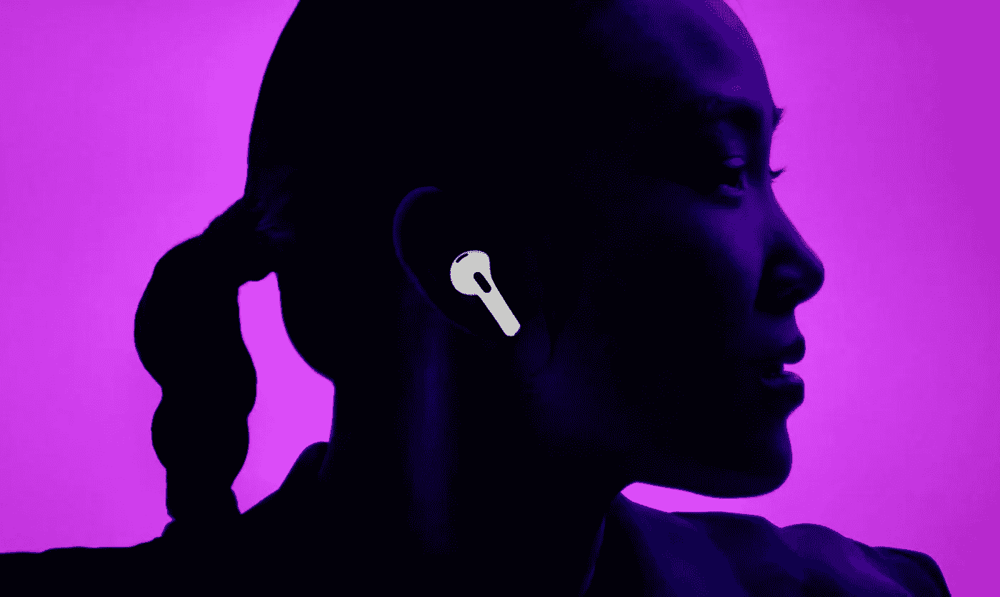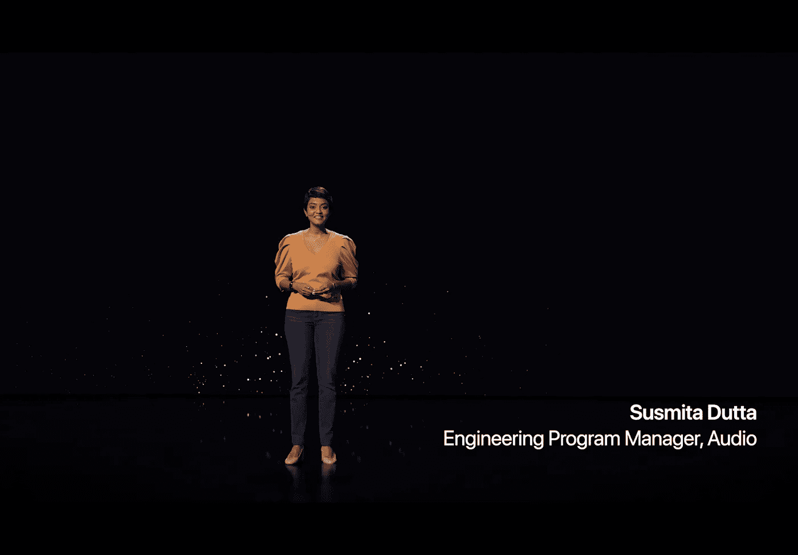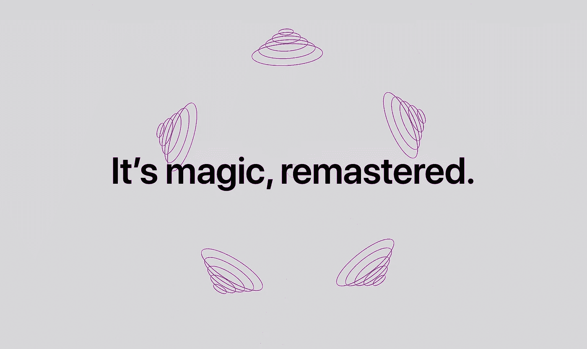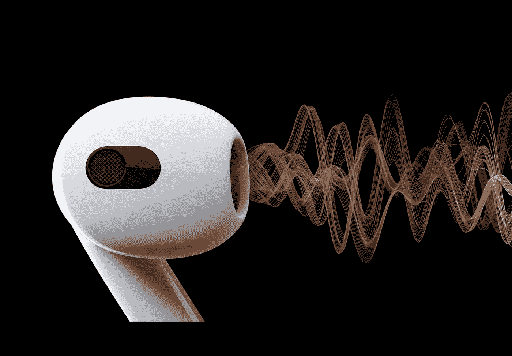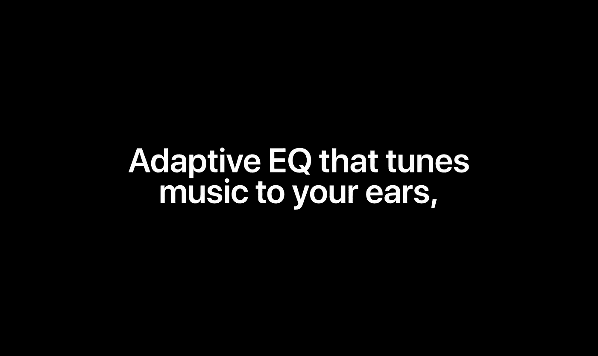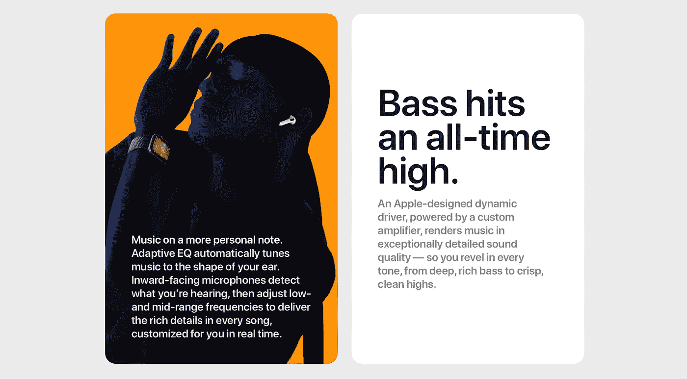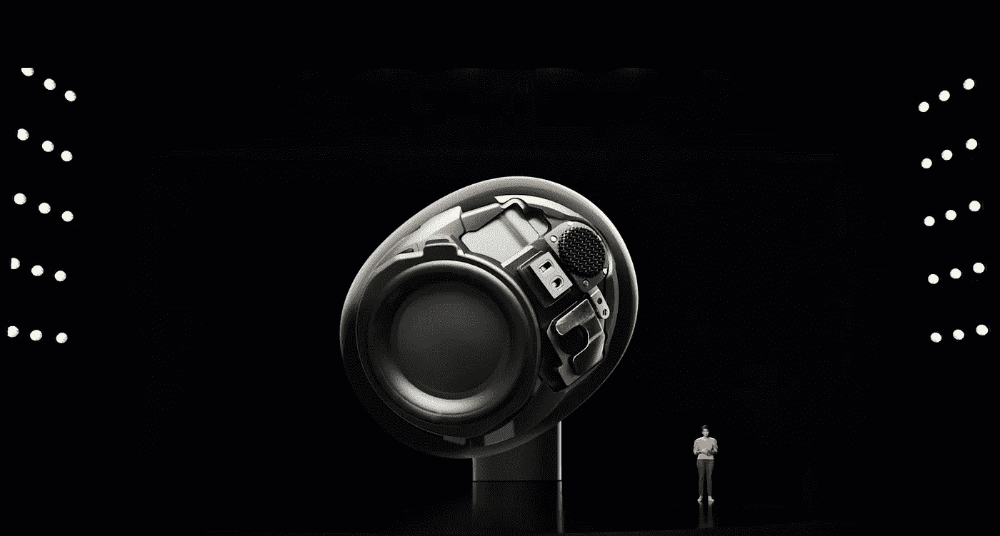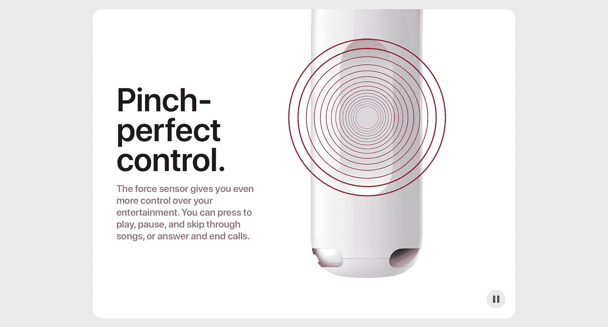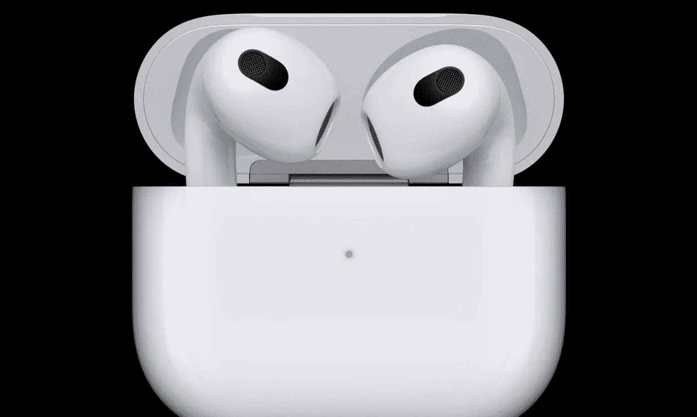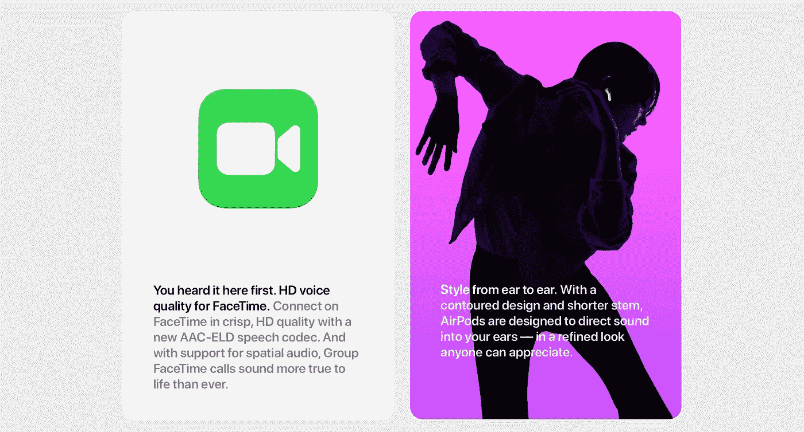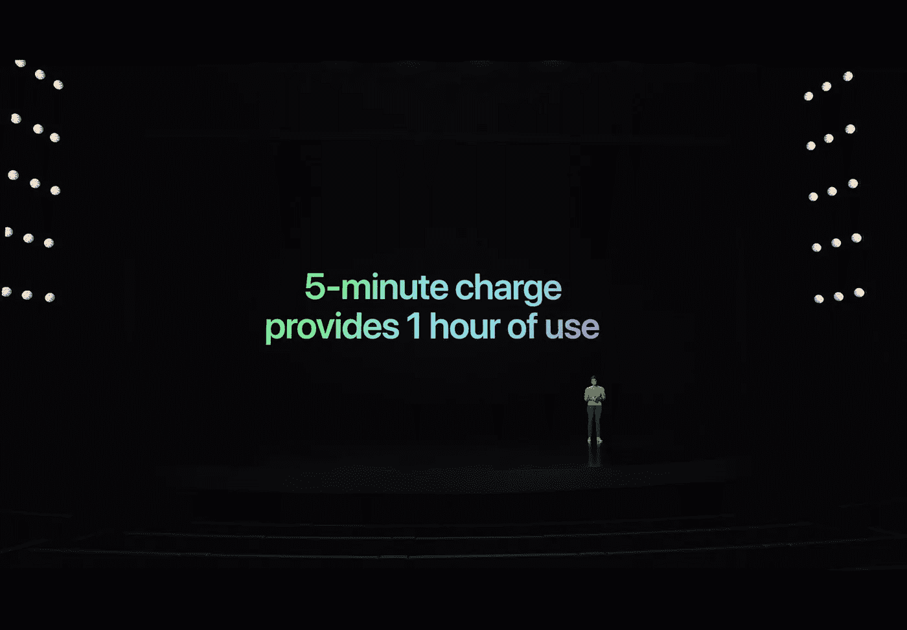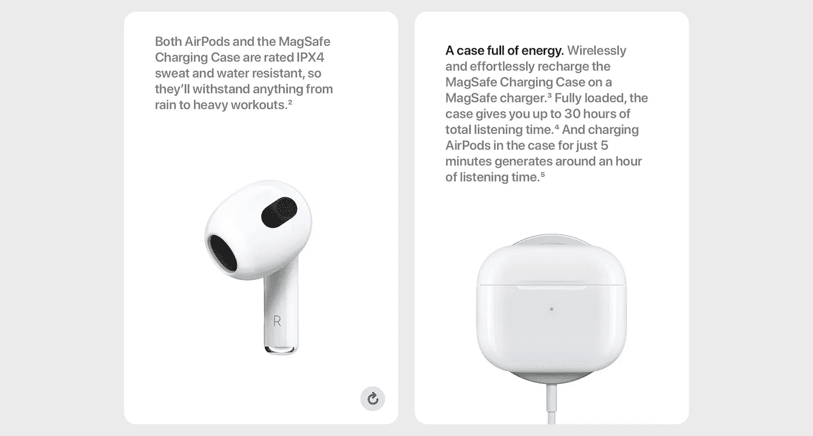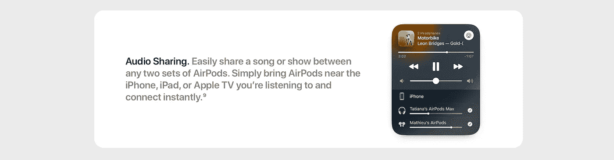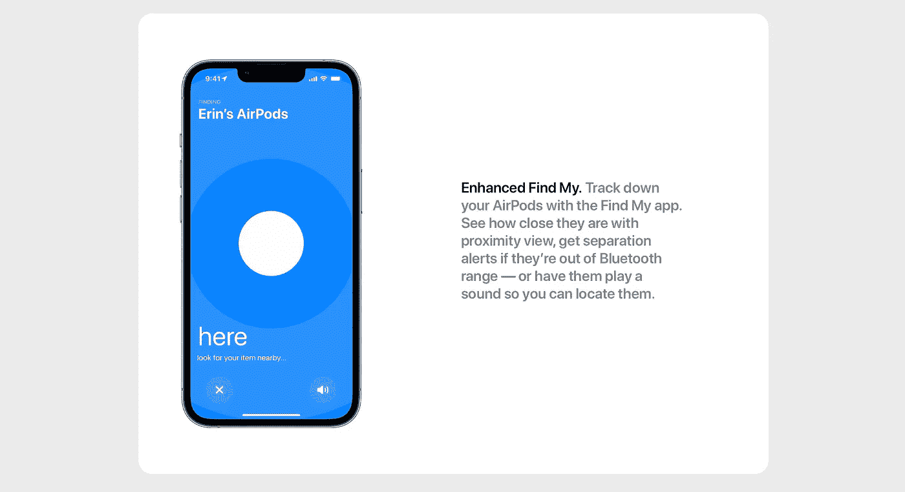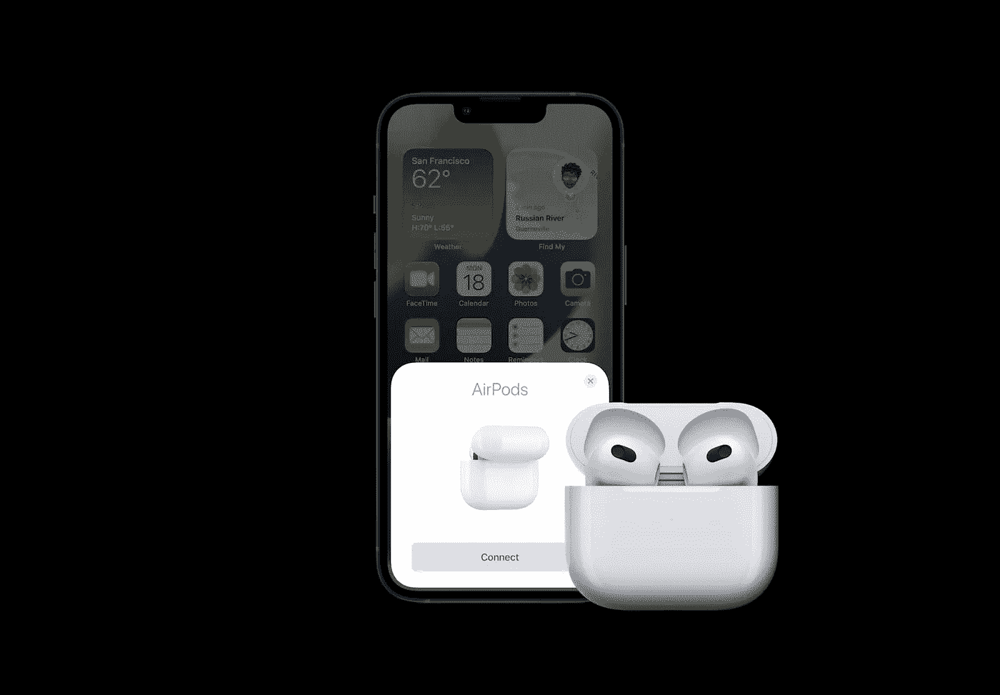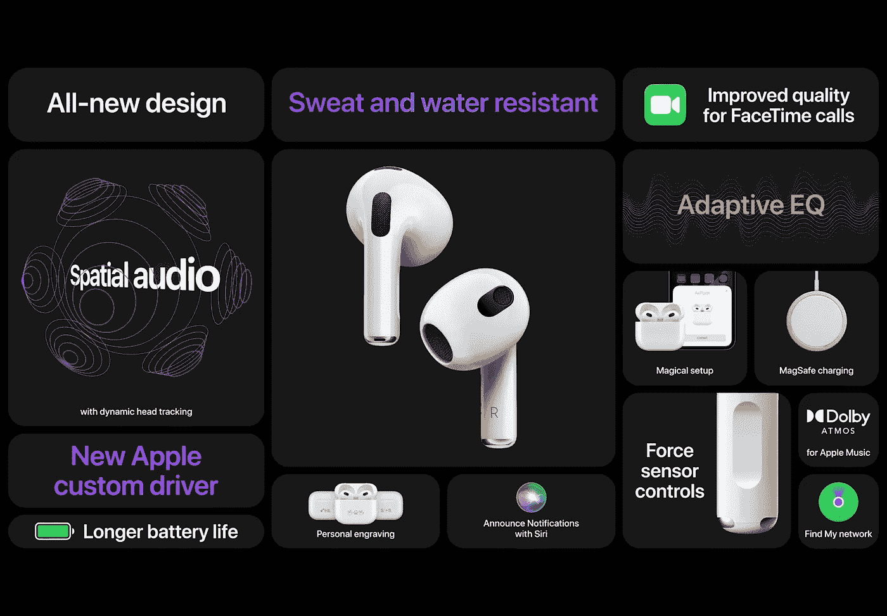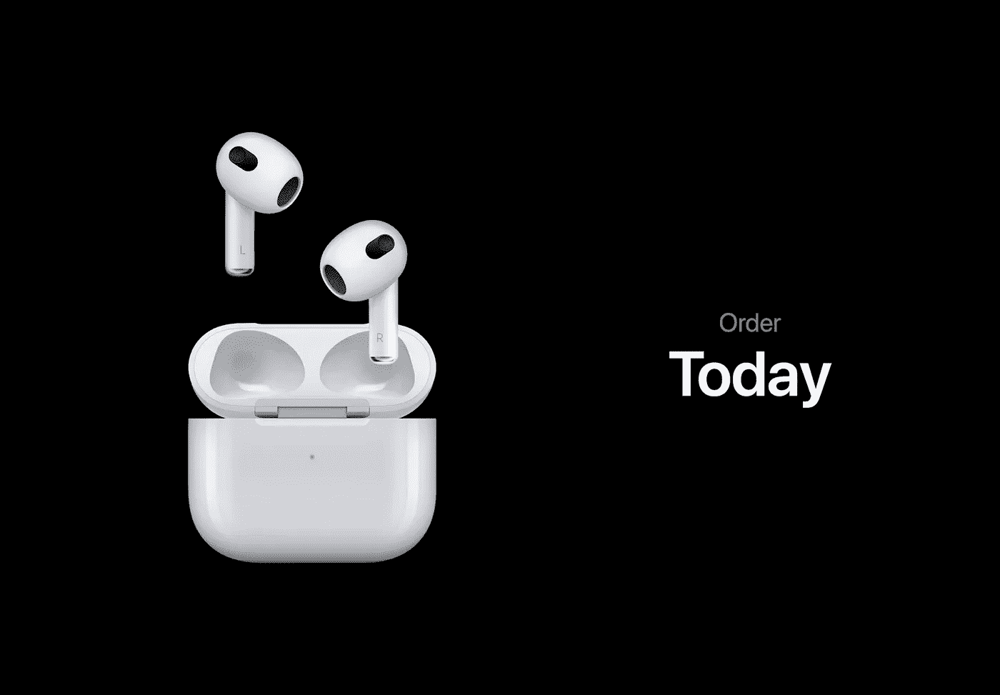

Image Source: All the above-used images are from [Apple](https://www.apple.com/in/airpods/)