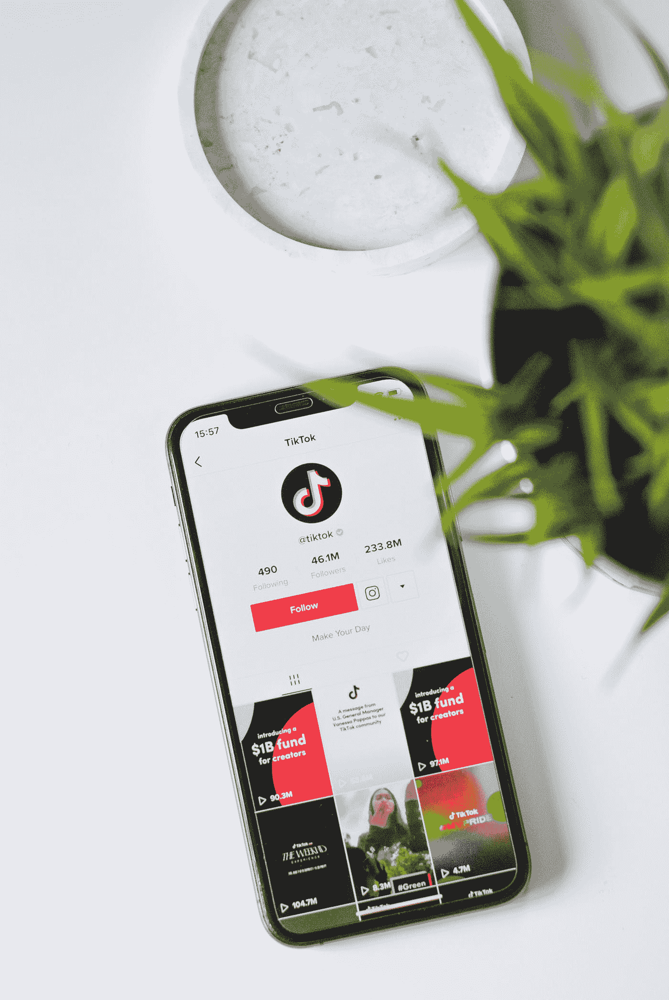

# 苹果和谷歌要求禁止抖音！

> 原文：<https://medium.com/geekculture/apple-and-google-asked-to-ban-tiktok-33dd89f1a665?source=collection_archive---------12----------------------->

## 病毒平台的未来会是怎样的？

Photo by [Hello I'm Nik](https://unsplash.com/@helloimnik?utm_source=medium&utm_medium=referral) on [Unsplash](https://unsplash.com?utm_source=medium&utm_medium=referral)

众所周知，一些科技公司正处于中国和西方地缘政治紧张的十字路口。对中国科技公司最大的指控是他们[收集美国公民的个人数据，并可能导致美国的安全问题](https://www.cnet.com/news/privacy/tiktok-accused-of-secretly-gathering-user-data-and-sending-it-to-china/)。而那些声音在…