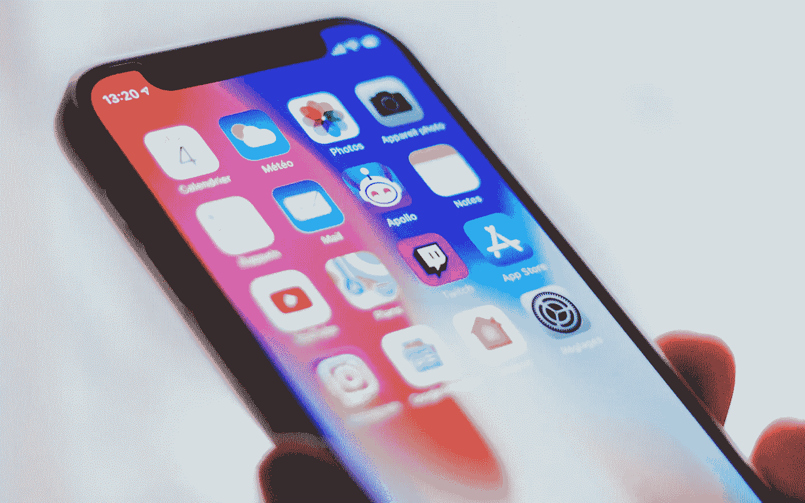

# 苹果改变了对 iOS 14 的想法，没有告诉任何人

> 原文：<https://medium.com/geekculture/apple-changes-its-mind-about-ios-14-tells-no-one-about-it-7210b5583c3d?source=collection_archive---------11----------------------->

## 库比蒂诺巨人已经把它的安全更新搞得一团糟，现在正迫使数百万消费者出手

Apple surprised everyone last year when it claimed that it would allow consumers to not upgrade to the latest version of iOS if they wished to. It turns out it was too good to be true. (Image: Adrien, Unsplash)

**谈到苹果的政策，以及它在一些大大小小的问题上的选择，它并不是任何透明奖的主要候选人，但是这个…**