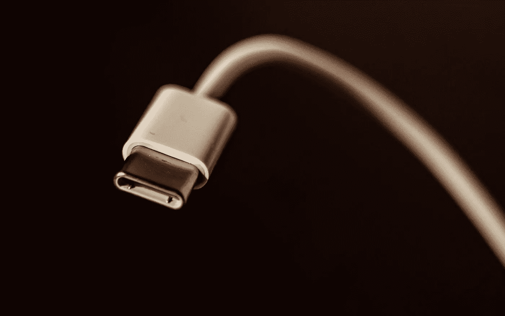

# 到 2024 年，苹果 iPhones 被迫转向 USB-C 或无端口

> 原文：<https://medium.com/geekculture/apple-iphones-forced-to-go-usb-c-or-portless-by-2024-81153cab3013?source=collection_archive---------5----------------------->

## 欧盟委员会兑现了之前的声明，现在库克和他的朋友们必须做出决定

Announced as a mere plan almost a year ago, it will be the law in September: all portable devices sold in the EU have to be charged via USB-C by 2024… and now Apple’s hand is forced. (Image: Mishaal Zahed, Unsplash)

这确实花了很长时间——这让你不禁想知道布鲁塞尔的那些人到底在做什么，不是吗？—但是在 2021 年 9 月[第一次表达的仅仅是一个提议](https://debugger.medium.com/european-commission-all-portable-devices-to-use-usb-c-4779582da217)现在…