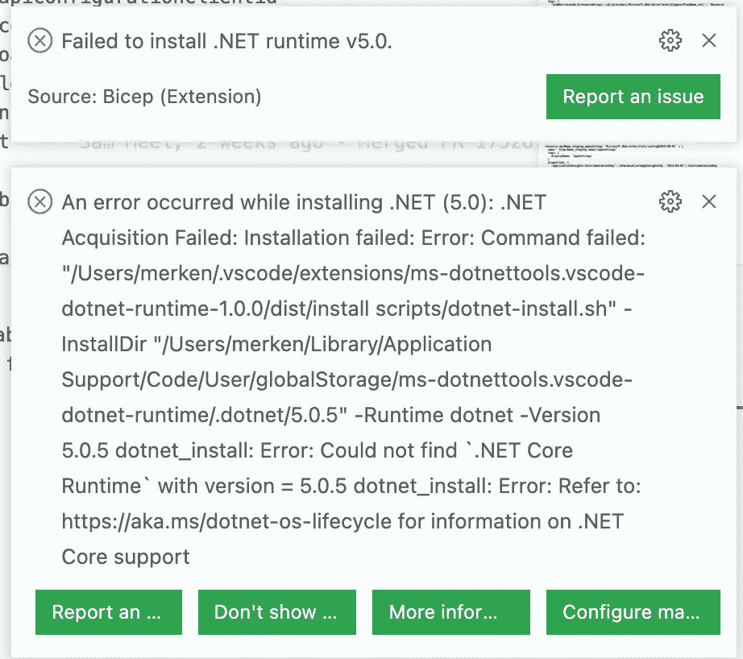
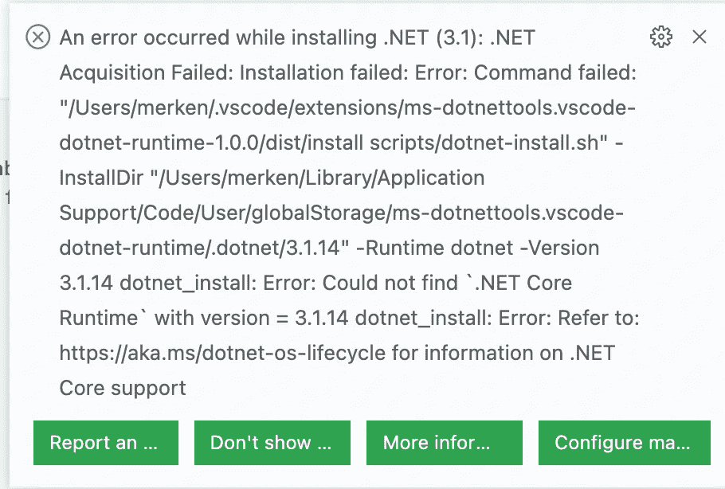
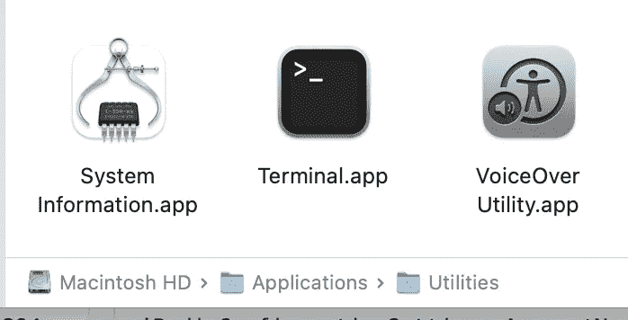
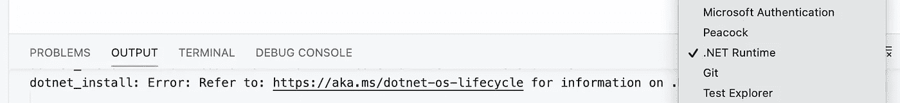
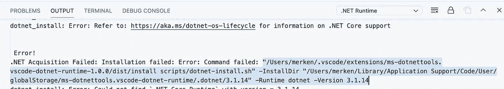
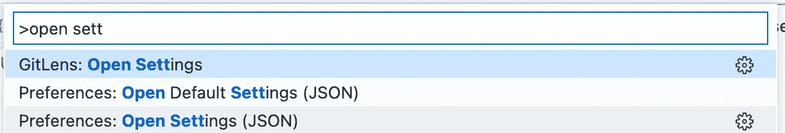

# 苹果 M1 + VS 代码:ARM 模板和模板语言服务

> 原文：<https://medium.com/geekculture/apple-m1-vs-code-arm-template-and-template-language-service-bb38bcadc99b?source=collection_archive---------8----------------------->


Azure Bicep 目前越来越受欢迎，几个月前我们开始为 Azure ARM 采用这种新的 DSL，现在我们已经完全转向使用 Bicep 来支持基于 ARM 的模板。

在 M1 Mac 上安装 Azure ARM 和 Bicep 扩展后，您可能会看到以下错误:



修复是双重的，你需要使用 **Rosetta 终端**在你的机器上**安装**3.1 和 5.0 **dotnet 运行时**，并且你需要**配置扩展**来使用那个运行时安装

## 罗塞塔终端

如果你还没有一个 Rosetta 终端，你可以通过从**应用程序/实用程序**目录中复制**终端.应用程序**来自己制作一个。



选择终端.应用程序

⌘ + C

⌘ + V

复制后，将新的 **Terminal.app** 重命名为 **Rosetta Terminal.app**

右击 **Rosetta Terminal.app** 并选择**获取信息。**

选择复选框**使用 Rosetta** 打开


关闭信息窗口。

## 使用 Rosetta 终端安装 dotnet 运行时

启动新的 **Rosetta Terminal.app**

在 VS 代码中打开一个 ARM 模板文件，会看到如下错误:


选择。NET 运行时输出流。



选择此扩展试图执行的安装程序命令:



在您的 **Rosetta Terminal.app.** 中粘贴并运行您在上面选择的命令


打开一个 Bicep 文件，你应该在 dotnet 5.0 运行时得到同样的错误…


重复前面的步骤，从**输出**窗口中选择命令，粘贴到 **Rosetta Terminal.app.** 中

## **配置扩展**

现在我们需要配置这些扩展来使用正确的 dotnet 命令。

开放 VS 代码。

按下⌘ + SHIFT +P 并键入'**打开设置**，选择**打开设置(JSON)** 选项:



将以下内容添加到 settings.json 文件中:

```
"dotnetAcquisitionExtension.existingDotnetPath": [ { "extensionId": "msazurermtools.azurerm-vscode-tools", "path": "/usr/local/share/dotnet/dotnet" }, { "extensionId": "ms-azuretools.vscode-bicep", "path": "/usr/local/share/dotnet/dotnet" }]
```


保存并重新加载，你现在应该可以启动 **ARM 模板**和 **Bicep** 语言服务器了！