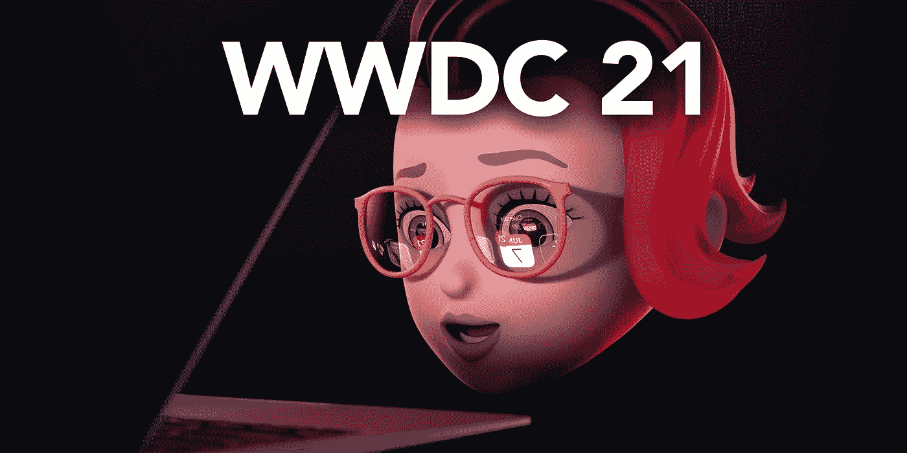
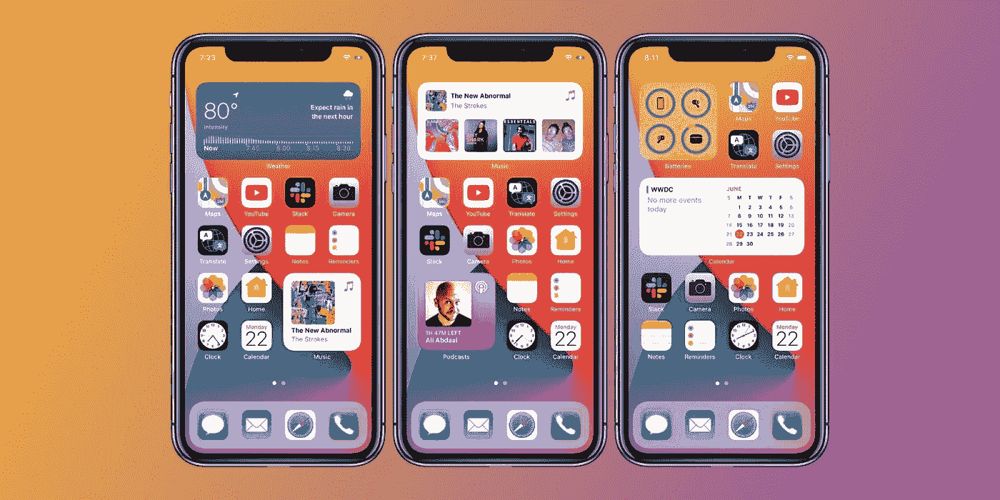
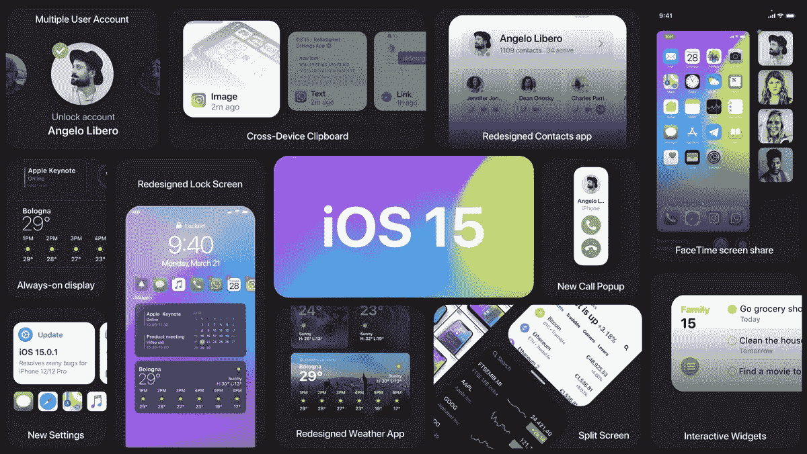
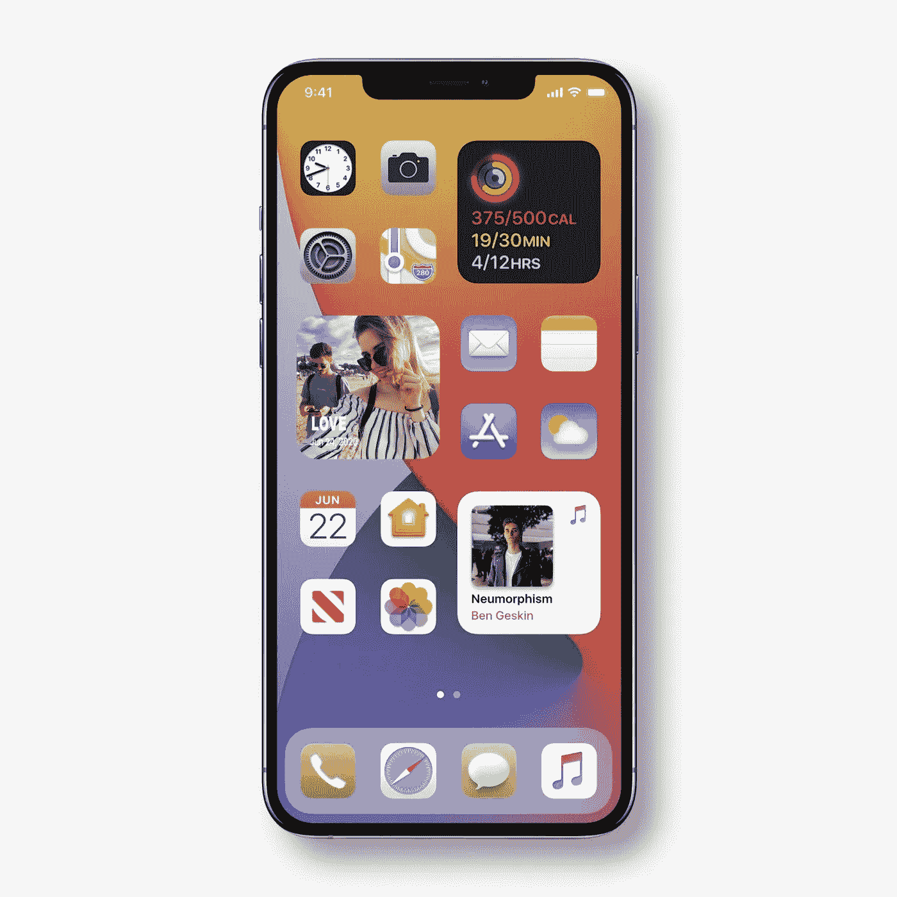
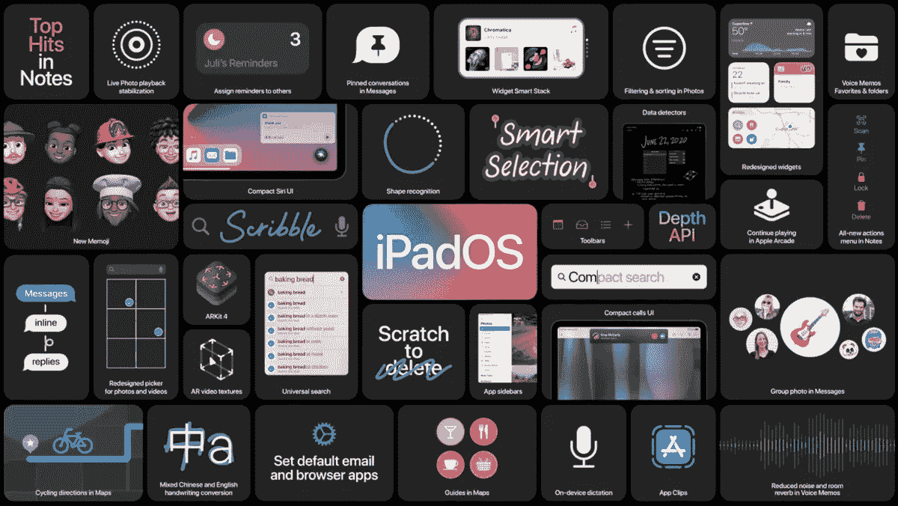
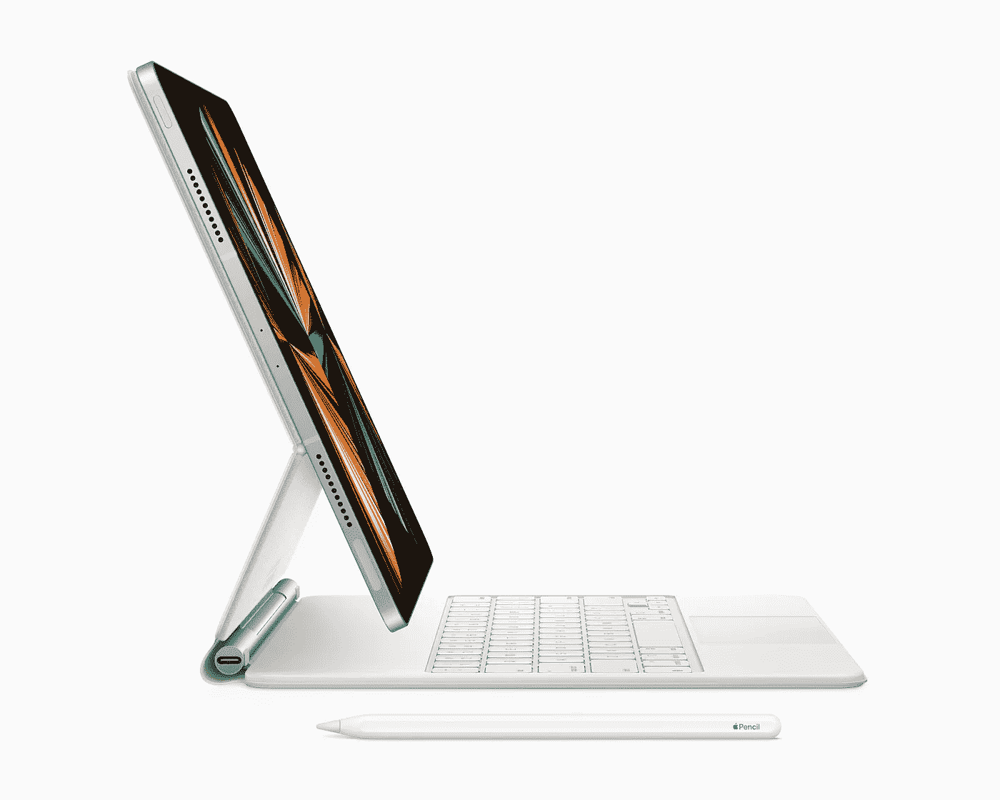
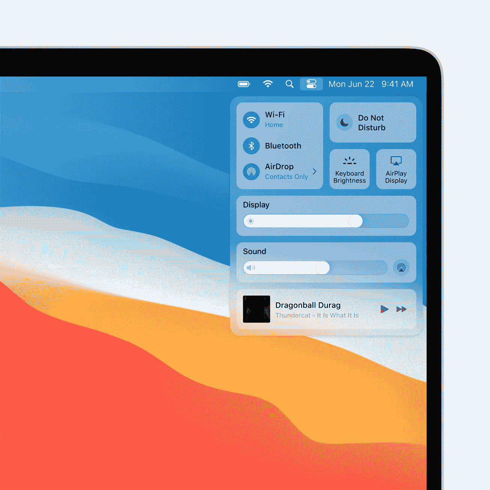
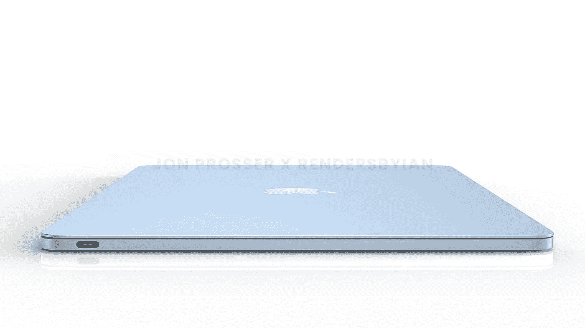
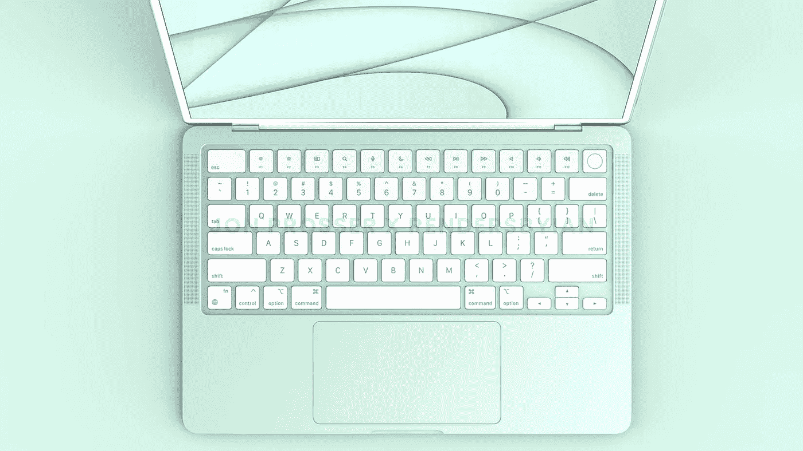
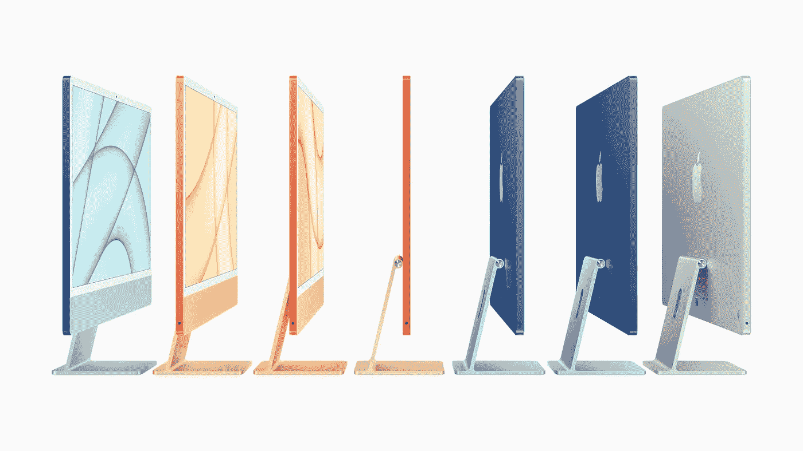

# 苹果准备宣布重大更新。

> 原文：<https://medium.com/geekculture/apple-prepare-to-announce-major-updates-42a0aa52b86?source=collection_archive---------35----------------------->

今年在 WWDC 我们应该期待什么？

现在是夏季，这意味着 6 月 7 日的 WWDC 2021 大会上，苹果又一次迎来了下一次重大软件更新。

期待 iPhone，iPad，Apple Watch 和 Mac 的更新，甚至可能是一些传闻中苹果 M2 硅的硬件展示。

去年，我们在 MacOS Big Sur UI 改革、iPad 上的 Scribble 和 iOS 上的主屏幕小工具方面有了一些重大惊喜，所以我希望苹果继续给我们带来惊喜。

让我们从大的开始…

**iOS 15**

去年，随着 iOS 14 和小工具的到来，我们对 iPhone 主屏幕进行了重大更新，不幸的是，它们现在是静态和非交互式的小工具，所以在 iOS 15 中，我希望我们能够像在 Android 上一样，在主屏幕的小工具中滚动电子邮件或笔记。

**iOS 14 home screen widgets.**

自从苹果在 2014 年的 iPhone 6 Plus 上加大了显示屏以来，分屏多任务也是 iPhone 早就应该实现的事情，我喜欢在观看 youtube 剪辑或直播活动时滚动浏览 Reddit。

据传，通知终于在今年得到了彻底的改革，谢天谢地，因为我发现它在目前的状态下完全没有用，锁屏可能会得到一个永远显示的功能，但一些报道称，它可能会保留到今年秋天的 iPhone 13 机型上展示。

**iOS 15 Concept** | Image from [Angelo Libero](https://www.instagram.com/angelolibero_designs/).

通过始终显示，我们可以拥有类似于 Apple Watch 的复杂功能，只需扫一眼，你就可以知道你有多少条短信或电子邮件，甚至不用触摸你的设备。

**Big Sur Icons on iOS concept.** | Image from [Ben Geskin](https://twitter.com/bengeskin?s=21)

最后，一些用户界面更新，希望一些默认应用程序，如联系人，天气和电话，得到一个新的设计用户界面。

去年，我很高兴终于看到了 iOS 主屏幕的变化，自 iOS 7 以来没有任何真正的变化，静态屏幕变得如此乏味，甚至连壁纸都无法改善它，但现在小工具使它变得更加个性化，我喜欢它。我只是希望 UI 变化的下一个阶段将是图标，如果他们将使用大苏尔设计，那么我们在整个苹果生态系统中有一个统一的外观。

**iPadOS 15**

iPad 已经成为科技界非常特殊和独特的东西，因为它是许多人唯一真正选择的平板电脑，并经常被视为笔记本电脑的替代品。

**iPadOS 14 in 2020.**

上个月，iPad Pro 系列获得了 M1 芯片和 thunderbolt 端口的大规模硬件升级，这些都是笔记本电脑级别的升级，加上去年发布的神奇键盘，这使得 iPad Pro 比以往任何时候都更接近于笔记本电脑的替代品。

在我看来，该软件一直阻碍着 iPad 的发展，直到苹果用 iPadOS 取代了 iOS，他们终于开始为 iPad 提供一些真正的桌面功能，如文件应用程序、外部硬盘支持和真正的多任务处理能力。

在 iPadOS 14 中，我们获得了一些不错的功能，如 scribble 和智能选择，Apple Pencil 的改进功能和一个新的照片应用程序，但我发现在静态保持位置缺少风景模式之外的主屏幕小工具，并且没有多用户支持，这有点令人失望。

**iPad Pro with Magic Keyboard and Apple Pencil.**

感觉上，苹果终于给了 iPad，尤其是 iPad Pro 成为笔记本电脑的真正替代品的所有机会，苹果铅笔、魔法键盘、M1 SoC 和 Thunderbolt 端口，但在软件方面，它已经落后了，但关于 Final Cut Pro、多用户支持、iPhone 等主屏幕小工具和完整的应用程序库的传言将使 iPad 成为冠军。

iPad Air 仍然是那些只想在笔记本电脑上配备一台出色平板电脑的人的最佳选择，基本款 iPad 最适合孩子，iPad Pro 仍然适合铁杆技术粉丝、专业人士或那些实际上想用一台平板电脑取代笔记本电脑的人。

**MacOS 12 和 WatchOS 8**

对这两者几乎一无所知，所以今年很难解决，去年 MacOS 收到了 Big Sur 的重大更新，它给了我们一个完整的 UI 大修。

**MacOS Big Sur redesign.**

这一次很可能会对新的用户界面进行更小的改进，也许会有一些小功能，但目前为止还没有什么真正泄露出来。

至于 WatchOS，今年还是一样，没有什么真正泄露的消息，除了可能会有一些新的手表表面和传闻已久的血糖传感器，但这需要一个新的传感器，并且仅限于 Apple Watch Series 7，所以我们很怀疑今年年初能否看到。

也许对一些应用程序的重新设计也是我们可以期待的。

**采用 M2 芯片的 MacBooks】**

这是一个很长的镜头，但不是不可能的，最近有传言称苹果将发布配备新 M2 SoC 的 MacBook Air 和 MacBook Pro，并对这两款机型进行了彻底的重新设计。

Air 和 Pro 多年来看起来都一样，早就应该加入苹果公司 的 [**当前设计潮流，iMac 上个月终于在 9 年后得到了设计更新，7 种颜色看起来棒极了。**](/swlh/looking-ahead-to-the-future-of-apple-design-6533a336291d)

我先从 MacBook Air 说起，因为最近乔恩·普罗瑟[发布了一些空气可能会是什么样子的图片，这是泄露最多的。](https://twitter.com/jon_prosser)

**New MacBook Air in blue.** | Image by [Jon Prosser](https://twitter.com/jon_prosser)

它采用了全新的完全扁平的更薄设计，带有白色边框，不再呈锥形，白色键盘带有触控 ID，类似于新款 iMac，包括 7 种颜色。普罗瑟仍然不知道屏幕尺寸和边框尺寸，所以我们必须等待，看看 Air 这次是否会有 14 英寸的显示屏。

**New green MacBook Air keyboard.** | Image by [Jon Prosser](https://twitter.com/jon_prosser)

‌MacBook Air‌的底部也将看到设计的变化，不再有四个橡胶脚来支撑。取而代之的是，将会有两个长的垂直条带。

**The 7 colours of the iMac will come to the new MacBook Air.**

除了两个 Thunderbolt 端口之外，我们不应该期待其他任何东西，希望我们不会看到价格上涨，如果这些报道是正确的，那么我认为这很可能是我的下一台 MacBook。

还有 **MacBook Pro。**

这有点难以预测，因为许多报告说，2021 年下半年发布，但这是我们所知道的。

pro 将有 14 英寸和 16 英寸的显示屏，重新设计，M2 SoC，可能会在新的 12.9 英寸 iPad Pro 上找到液态视网膜 XDR 显示屏(迷你 LED)。

我们还没有泄露它们的任何图像，但我会假设它们类似于泄露的 MacBook Air，但略厚。他们还应该推出更多端口和 MagSafe 充电的回归，这是为了推动“pro”功能。

据泄密者称，touch bar 也正在被移除，这有点遗憾，但它从未受到开发者的欢迎，并成为浪费的空间。

也不要指望专业型号会有五颜六色的选择，我的预测是银色或黑色。

**最后**，今年将会是一个有趣的 WWDC，M1 足球队在比赛中大获全胜，M2 队有望像智能手机中的 A14 一样轻松获胜。iPhone 的持续变化，在经历了多年的停滞后，iOS 14 终于出现了重大变化，iOS 15 应该会继续这一旅程。

MacOS Big Sur 给了我们一个全新的 UI，它肯定会成为新 iMac、MacBook Air 和 MacBook Pro 设计的代名词，这只会在 2021 年得到改进。

Apple Watch 仍然是目前最好的智能手表和健身追踪器，电池和轻微的 UI 更新可能是我们在硬件方面应该进行设计变革的一年中所能得到的一切。

iPad 仍然是笔记本电脑的最佳替代品，因为 iPadOS 让它变得更加不可思议，它的硬件已经领先于许多笔记本电脑，只需要少量的操作系统变化就可以成为最佳选择。

对于苹果来说，这无疑将是在硬件领域继续占据主导地位的一年，现在我们只需要看看软件是否能够利用所有这些力量。

**WWDC 21 开始于 6 月 7 日至 11 日。**