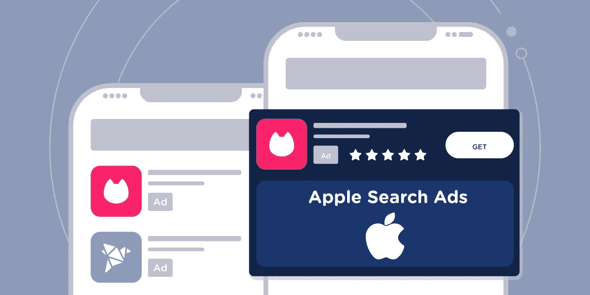
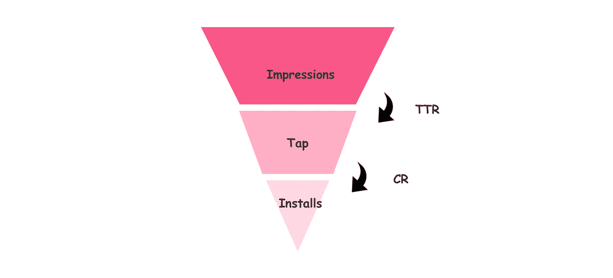
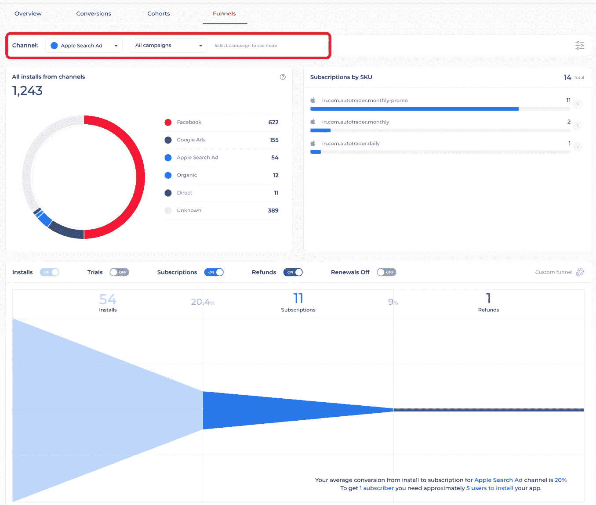

# 苹果搜索广告:标准、好处和如何衡量

> 原文：<https://medium.com/geekculture/apple-search-ads-metrics-benefits-and-how-to-measure-686da424e031?source=collection_archive---------8----------------------->

[Apple Search Ads](https://www.appflow.ai/blog/what-are-the-benefits-of-apple-search-ads-for-user-acquisition)

苹果搜索广告是一个平台，是应用商店优化的一个子集，是一个通过认真遵循苹果商店设定的指导方针和政策来提高 iOS 应用可见性的有效过程。这是一种付费营销服务，其算法专注于用户搜索的关键词。就像 ASO 一样，苹果搜索广告也需要一个组织良好、优化的主页来抓住用户的注意力。

在 iOS 应用的用户获取方面，苹果搜索广告比其他平台更有优势。它拥有高达 50%的转化率，几乎 65%使用搜索栏的用户最终下载了他们寻找的应用程序。这清楚地表明，庞大的用户群与获得更多收入直接相关。

# 苹果搜索广告指标:

*   **花费:**花在苹果搜索广告活动上的总费用。
*   **Avg CPA(每次收购成本):**每次收购成本是每次转换花费的平均成本。CPA =转换总成本/转换总次数。
*   **平均 CPM(每千次展示成本):**每千次展示的平均成本。平均 CPM =(总成本/总展示次数)*1000
*   **平均 CPT(每次点击成本):**消费者每次点击的成本。特定广告活动的平均 CPT =(总成本/点击总数)。
*   **平均每日花费:**在苹果搜索广告上推广你的应用程序所需的营销技巧的每日花费。
*   **印象:**你的广告展示给用户的次数。
*   **点击:**用户点击广告以重定向到您的产品页面的相应链接的次数。
*   **安装:**用户从 AppStore 下载你的应用的次数。
*   **TTR(点击率):**点击量与印象数的比率。通过 TTR =点击/印象计算。它给出了广告如何成功地引起用户好奇心的粗略想法。
*   **CR(转换率)** : CR =安装数/点击数。它有助于我们评估你的应用在说服用户下载/安装你的应用方面的有效性。

[Apple Search Ads: Metrics You Need to Know](https://www.appflow.ai/blog/apple-search-ads-metrics)

*   **新下载:**用户首次下载你的应用的次数。
*   **重新下载:**用户下载超过一次的次数。

# 苹果搜索广告对用户获取有什么好处？

苹果搜索广告是在目标受众面前提供正确访问应用程序的 X 因素。多项声明表明，通过苹果搜索做广告是最简单可靠的营销方法之一，并有成功的例子支持这些声明。好处如下

*   **最高可见性:**app store 中的大部分应用程序都是通过搜索选项下载的，因此将广告放在首要位置非常重要。这些广告在有机搜索结果上获得位置。
*   **基于意图的搜索:**苹果商店中针对用户的广告根据关键词匹配而不是基于 id 的搜索历史来显示。与基于个人行为的广告算法相比，这一属性赋予了它压倒性的优势。
*   **精准锁定用户:** ASA 是一种基于关键词的广告方式，因此你的所有广告都会展示给对特定类别应用感兴趣的潜在客户。与其提高定位广告受众的准确性，不如关注广告创意。这是让苹果搜索广告成为 iOS 应用获取用户的最高准确率/转化渠道的关键原因之一。
*   **每次点击/安装成本低廉:**较小的公司通常负担不起在这种知名平台上发布广告，但在苹果搜索广告的情况下，每次点击的成本据说低至 25 美分，这甚至给了较小的公司与领先者竞争的公平机会。
*   **极其容易设置:**苹果应用商店平台非常人性化。它有清晰的说明和简单的选项，使得[导航和发布所需的广告活动](https://searchads.apple.com/help/ad-groups/0017-understand-and-create-ad-groups)变得非常容易。
*   **安排你的广告:**这个技巧主要用于季节性应用的好处。这种技术允许我们在旺季时推广应用程序，在淡季时节省现金。它也可以用来显示您的广告在特定的时间框架。

# 如何衡量苹果搜索广告？

了解当前广告活动的效果或效率是非常重要的。这一指标描绘了更广阔的图景，使我们能够了解如何进一步优化营销活动，提高收入。最佳实践如下:

*   **确定正确的指标:**必须分析影响有效性的正确参数。这些指标用于识别目标受众的行为。有了对受众心理的正确理解，我们就能提高活动的效率。
*   **支出:**分析广告活动的总支出。通过计算诸如每次点击成本、每次获取成本、转换率等参数，可以绘制出这一支出的准确图像。这使我们更具成本效益，从而提高整体效率。
*   **收入:**需要维护产生的收入的适当标签。通过计算和分析总体收入、平台收入、佣金、产生最大收入的地点和 LTV 等参数，可以获得最佳结果。
*   **试用:**试用通常是一段时间，用户有足够的权限来熟悉应用程序，但不能访问所有的功能。这一试用期决定了应用程序的成败，在试用期内从安装中获取的数据安装到试用价格和试用到购买价格用于进一步优化。
*   **订阅:**需要对订阅进行分析，以找出客户寿命以及人们对所提供的订阅计划的吸引程度。以上可以通过计算新的、活跃的、更新的和取消的订阅以及[流失率](https://www.appflow.ai/blog/churn-for-subscription-apps)来优化。

**使用 Appflow.ai 漏斗分析实时跟踪 ASA 绩效**

Appflow.ai 漏斗分析可以让你检查每个渠道的效率，以及整个订阅事件的转化率。这样，你可以很容易地检查你的苹果搜索广告的效果，然后做出更明智的营销决策。

[Appflow.ai — Funnel Analysis](https://demo.appflow.ai/#/analytics/funnels?)

# 结论

公司和企业通过投入大量的工作和精力来开发应用程序。该公司广告团队的第一个目标是增加下载量，建立一个忠实的用户群。希望这篇文章能让你深入了解苹果搜索广告的益处，以及增加和衡量你的应用覆盖范围和增长的不同策略。