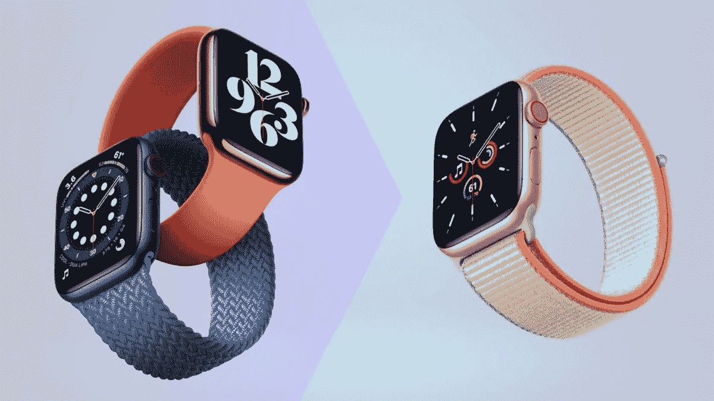
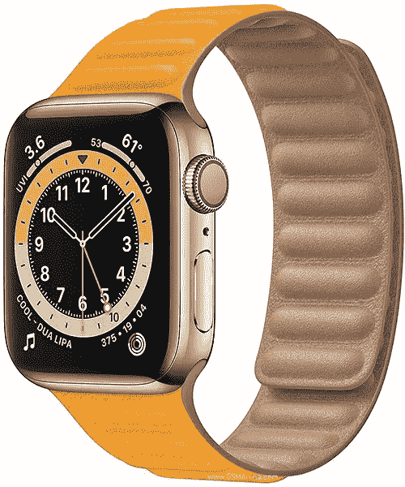
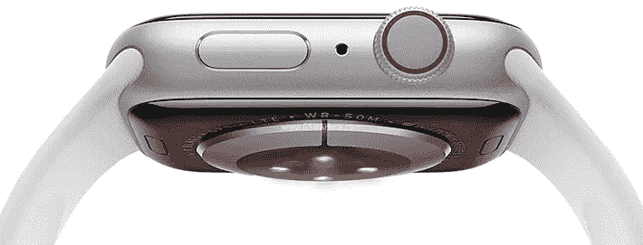

# Apple Watch 6 背面

> 原文：<https://medium.com/geekculture/apple-watch-6-back-side-4c5778b16591?source=collection_archive---------24----------------------->

# 介绍

[Apple Watch 6 是苹果公司的一款奇葩产品。这是对正在进行的工业 4.0 浪潮的巨大贡献。在本文中，我们将了解令人惊叹和有趣的 Apple Watch 6 背面。](https://www.technologiesinindustry4.com/)

这是 2021 年的技术。Apple watch 背面有 8 个传感器，一直接触佩戴者的皮肤。这些传感器可以单独工作，也可以以多种组合方式工作，提供大量数据，包括心率、血压、心电图、行走步数、消耗的卡路里等。

[手表连接到 iPhone，iPhone 有 apple watch 专用的应用程序，连接到苹果全球的数据中心。](https://www.technologiesinindustry4.com/2021/11/ai-in-the-digital-factories.html)这些数据中心正在进行云计算&对手表佩戴者的健康状况进行实时大数据分析，这是一项令人惊叹的技术。

# 描述

[苹果公司在 1984 年以麦金塔的轮廓改变了个人技术。目前，](https://www.technologiesinindustry4.com/2021/11/ai-in-the-digital-factories.html)苹果凭借 iPhone、iPad、Mac、Apple Watch 和 Apple TV 在创新方面领先世界。它的五个软件平台提供的服务包括 App Store、Apple Pay、Apple Music 和 iCloud。

苹果按照他们的惯例推出了革命性的血氧功能。它完全重新定义了手表的功能。它可以为用户的整体健康带来更多的愿景。Apple Watch Series 6 提供了几项杰出的硬件改进。包括一些产品；

*   更快速的 S6 系统级封装(SiP)
*   下一代持续高度计
*   最丰富多彩的阵容
*   [展示全新表壳和表带的迷人色彩。](https://www.technologiesinindustry4.com/2021/11/ai-in-the-digital-factories.html)

# Apple Watch 6 强大的功能

*   watchOS 7 采用家庭设置，
*   睡眠追踪，
*   [自动洗手检测，](https://www.technologiesinindustry4.com/about-the-industry-4-0-author-mansoor)
*   新的锻炼类型，
*   管理和分享手表面孔的能力，
*   鼓励顾客更加积极，
*   保持联系，并以新的方式管理他们的健康。
*   [血氧传感器和 app。](https://www.technologiesinindustry4.com/terms-and-conditions)

# Apple Watch 6 和健康功能

*   Apple Watch Series 6 通过一项新功能扩大了早期 Apple Watch 型号的健康功能。
*   这些特征适当地处理用户血液的氧饱和度。
*   因此，他们可能很清楚自己的整体健康状况。
*   SpO2 或氧饱和度表示红细胞从肺部到身体其他部分接受的氧的百分比。
*   它显示了含氧血液是如何被带到全身的。
*   [血氧传感器由四组绿色、红色和红外发光二极管组成，以补偿皮肤的自然差异并提高准确性。](https://www.technologiesinindustry4.com/)
*   Apple Watch 的背面晶体上有四个光电二极管，光可以从血液中反射回来。
*   Apple Watch 使用了血氧应用程序中现成的渐进式定制算法。它被设计用来测量 70%到 100%之间的血氧含量。

# 设计和展示

*   Apple Watch Series 6 在重新设计的硬件上推进了演示。
*   它在同样小巧的设计中集成了更多的功能和强大的功能。
*   使用 iPhone 11 中基于 A13 Bionic 的新双核处理器，高级 S6 SiP 的运行速度提高了 20%。
*   这使得应用程序的启动速度提高了 20%，同时保持类似的全天 18 小时电池续航时间。
*   Apple Watch Series 6 采用 U1 芯片和超宽带天线，将允许短程无线定位，以帮助新的体验，例如，下一代数字汽车钥匙。
*   Apple Watch Series 6 充电速度更快，一次充满电不到 1.5 小时。它的电池续航时间更长，可用于跟踪某些锻炼，例如室内和室外跑步。
*   Apple Watch Series 6 上的一个改进的永远在线视网膜显示比 Apple Watch Series 5 高 2.5 倍。
*   用户现在可以类似地访问通知中心和控制中心。
*   轻按“问题”,然后滑动以改变不需要唤醒手表屏幕的面孔。

# Apple Watch Nike 等系列

*   它为 Nike Sport Band 和 Nike Sport Loop 带来了新的颜色。
*   新的 Nike Compact 手表表面可解决许多 Nike Run Club 难题。
*   Apple Watch Hermès 采用银色和太空黑不锈钢表壳，搭配各种充满活力的新颜色的单双游款式。
*   秋季系列也展示了爱马仕 Attelage 单巡回和更苗条的 Attelage 双巡回乐队。
*   其与表壳的复杂连接再现了品牌的马术传统。
*   全新的爱马仕 Circulaire 腕表为解决问题提供了更多选择。

更多详情请访问我的网站:

【https://www.technologiesinindustry4.com/ 