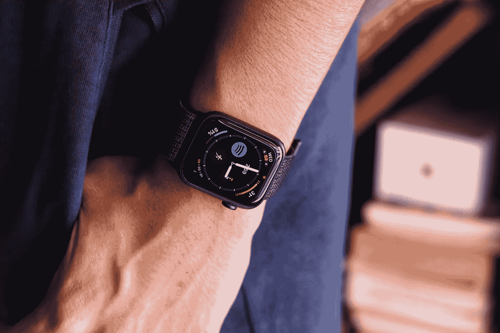
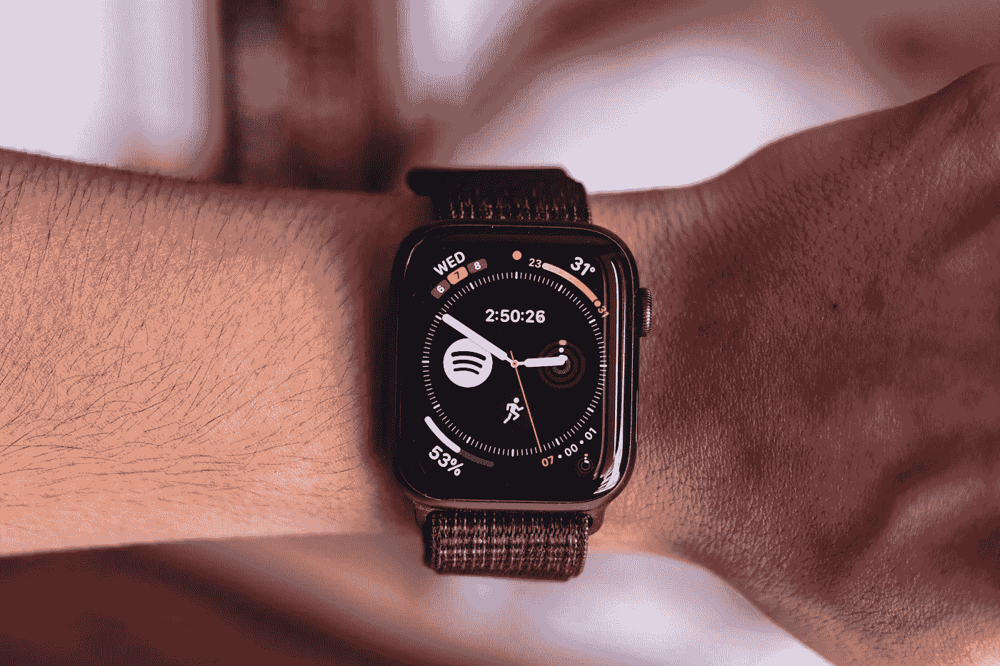
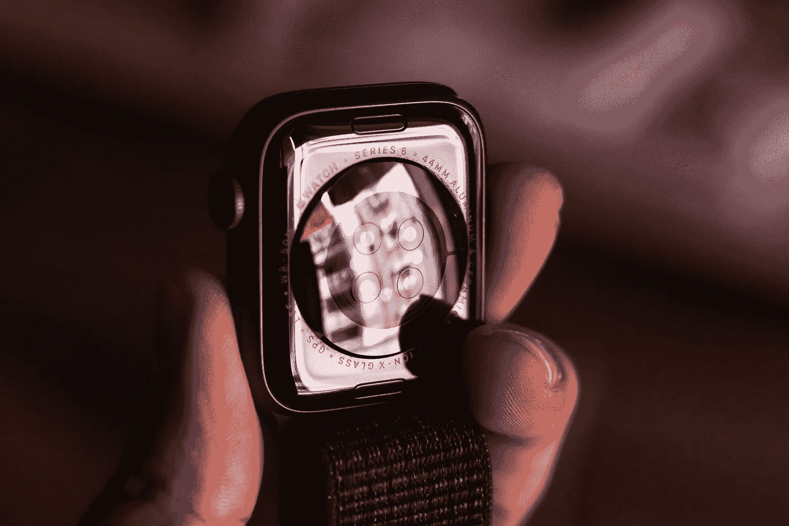
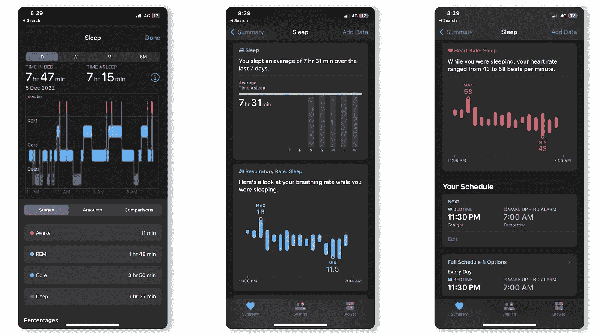
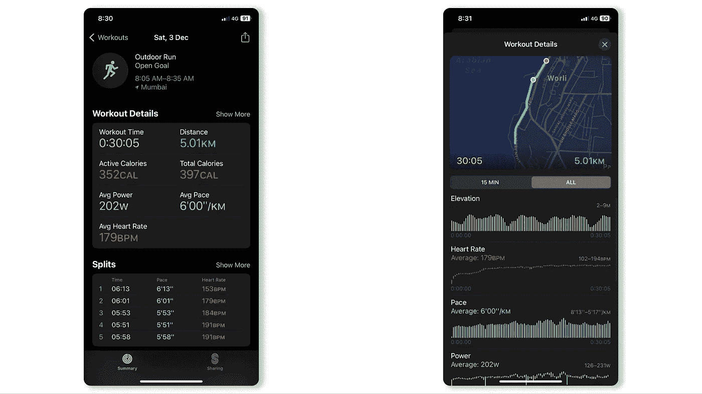

# 2022 年 Apple Watch 系列 6:不败。

> 原文：<https://medium.com/geekculture/apple-watch-series-6-in-2022-undefeated-24c252b73c46?source=collection_archive---------14----------------------->

## 这是我对使用 Apple Watch 的看法，以及为什么它仍然领先于竞争对手。

你可能已经猜到，我强烈支持苹果产品，因为它们为用户提供了卓越的硬件和软件体验。Apple Watch 没有什么不同，都带有相同的苹果 DNA。

自从我爸升级到 Apple Watch Ultra 后，他很好心地把他的旧 Apple Watch Series 6 给了我。Apple Watch S6 于 2020 年 9 月上市。以前的 Apple Watch 的电池健康状况已经下降到 78%，但由于它仍然在 AppleCare 的保护下(及时)，我可以免费更换。

我用过三星、Garmin 和 Fitbit 等多个品牌的智能手表，但没有一款像 Apple Watch 那样吸引我。如果你是 iPhone 用户，Apple Watch 是显而易见的。这并不意味着 Apple Watch 是完美的，因为它有自己的利弊。

# 设计

众所周知，苹果不会频繁改变产品设计，这是一把双刃剑。较慢的设计变化速度让老产品老化得更好，感觉不那么“过时”，但同时也阻碍了创新。系列 6 与系列 4 和系列 8 具有相同的设计，使得现有用户不太需要升级。系列 6 有铝、不锈钢、钛和陶瓷表壳可供选择(尺寸为 40 毫米和 44 毫米)。矩形表壳可能不会吸引所有人，但外观是主观的。Apple Watch 的整体制造质量确实不错，但铝制外壳不如不锈钢耐用，容易出现划痕和油漆碎片。我强烈建议从 Spigen、Rhinoshield 或 Pitaka 等品牌购买表壳，以保护你的手表免受日常磨损。我喜欢 Apple Watch 的设计，矩形外壳最大化了屏幕空间，可以显示更多信息。

# 显示

系列 6 配备了一个**永远在线的视网膜 LTPO 有机发光二极管显示器**(峰值亮度:1000 尼特)，这是 Vivoactive 3 上的透反射像素内存显示器带来的真正乐趣。它流畅、反应灵敏，并且具有很高的分辨率(368 x448 像素)，使得在旅途中阅读通知更加容易。与有机发光二极管相比，透反式显示屏的室外能见度要好得多，但我更喜欢鲜艳/彩色的显示屏，不介意用室外能见度来换取它(像大多数 Apple Watch 用户一样)。铝制型号的显示屏由 Ion-X 玻璃保护，我认为这种玻璃不太耐用，很容易划伤。不锈钢型号由蓝宝石水晶保护(Apple Watch Ultra 也有)，在日常使用中几乎不会损坏。观看这个[视频](https://www.youtube.com/watch?v=A72Ckh990j0&t=642s)了解更多。

新款 Apple Watch 的显示屏略大，分别为 41 毫米和 45 毫米。这改善了观看体验，但并不是一个障碍，因为它在日常使用中并不明显。

# 电池寿命

Ceramic Back

由于这是替换单元，电池寿命到目前为止还不是问题。它持续了我大约一天半的时间，考虑到它运行的是最新的 WatchOS 9 软件，这已经相当不错了(按照 Apple Watch 的标准)。我每天给它充电一次，并将充电率保持在 30%-90%之间，以延长电池的寿命。6 系列与 7、8 系列和 Ultra 系列一样不兼容快速充电。从 20%到 100%充电大约需要 55-60 分钟。尽管这是蜂窝变体，但由于运营商的问题，我没有使用该功能。使用蜂窝连接时，电池寿命会大大降低。总的来说，Apple Watch Series 6 上的电池续航时间还过得去。

# 表演

S6 SiP 中的 Apple Watch 系列 6 包基于苹果 A13 架构。两年后，S6 芯片组仍然提供无延迟的体验，在 WatchOS 9 中导航轻而易举。由于我喜欢跑步和骑自行车，我使用 Apple Watch 的大部分时间都是通过高度依赖 GPS 的过程来跟踪我的活动。GPS 连接是即时的，这对 Garmin 来说是一个严重的问题。与 Apple Watch Ultra 不同，Series 6 没有双频 GPS。单频 GPS 在绘制路线时不太精确。如果你是一名职业运动员，并且将使用 Apple Watch 跑马拉松和铁人三项，这对你来说可能是一个坏消息。Apple Watch Ultra 对你来说是一个值得的升级。

# 软件

WatchOS 是我选择 Apple Watch 而不是其他任何智能手表的唯一原因。用起来是**无缝**。Series 6 是随 WatchOS 7 推出的，现在运行 WatchOS 9。它拥有 [WatchOS 9](https://www.apple.com/in/watchos/watchos-9/) 的大部分功能，但我用得最多的是睡眠追踪。跟踪准确率为 90-95%，并提供一些关键的见解，如睡眠阶段，呼吸频率和心率。Apple Watch 上的闹钟是一个被低估的功能，仅使用触觉反馈就能有效地将我从深度睡眠中唤醒。

Sleep Tracking on Apple Watch Series 6

活动跟踪很棒，但不如 Garmin 全面。系列 6 也遗漏了现在系列 8 中存在的跑步步幅长度。此外，你不能像 Garmin 一样在自定义的时间间隔内查看你的活动详情。WatchOS 9 增加了心脏区域和多运动活动等功能，但在活动和锻炼方面仍有改进的空间。

Workout tracking in WatchOS 9

# 裁决

Apple Watch Series 6 正式停产，现在的阵容包括 Apple Watch SE 第二代、Series 8 和 Ultra。我回顾了 Apple Watch Series 6，因为它对我来说是可访问的，我目前正在使用它。如果你在市场上购买新的 Apple Watch，新的 Apple Watch SE(起价 29，900 印度卢比或 299 美元)应该可以满足大多数人的需求。在我看来，Apple Watch Series 8(起价 45900 印度卢比或 429 美元)似乎有些多余。不锈钢系列 8 的价格高达 79900 印度卢比(799 美元)，比 Apple Watch Ultra 便宜 10000 印度卢比(100 美元)，使 Ultra 看起来更物有所值。

苹果可能会继续进行这些小更新，但这并不意味着你需要跟上它们。如果你有一个旧的苹果手表，仍然对你有好处，继续使用它。