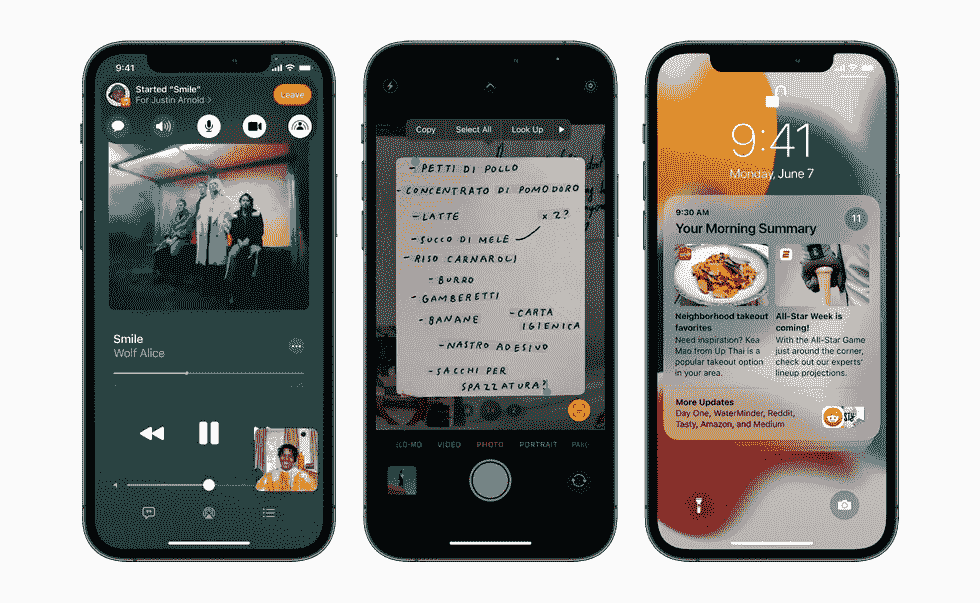

# 苹果 WWDC 2021 主题演讲亮点

> 原文：<https://medium.com/geekculture/apple-wwdc-2021-keynote-highlights-e31cb95d13ef?source=collection_archive---------12----------------------->

以下是苹果关于 iOS、watchOS、macOS 和隐私的**更新的要点。**

Watch out — [Apple WWDC 2021 (Image: Apple)](https://youtu.be/0TD96VTf0Xs)

苹果第二部流播 [***WWDC 2021***](https://youtu.be/0TD96VTf0Xs) 昨天发布。我发现了一个相当令人印象深刻的名单，考虑到它已提交给🖥在事件。

# iOS 15 有什么新功能？📱

**iOS 15** 拥有令人难以置信的功能，可以帮助你与他人联系，并使用*强大的智能*用 iPhone 做比以往更多的事情。

1.  [**face time**](https://youtu.be/1GZy3YBi7h4)**:**推出了 ***SharePlay】，*** 在观看电视节目和电影、听音乐或共享屏幕时，保持通话。在 facetime 中添加了“ ***空间音频“*** ”，其中包括“V *声音隔离”*和“*宽频谱*”，这将使环境声音不被过滤。这是上音乐课的理想场所🎶 🤩。下一个是 **" *网格视图"*** *，其中*以相同大小的磁贴显示您通话中的人。扬声器会自动突出显示。**大新闻是**face time 现在可以通过网络浏览器在 Android 和 Windows 上得到支持。
2.  [**文字直播:**](https://youtu.be/TfRMXk53wPY) 有了 iOS 15，iPhone 相机将能够识别照片中的文字。实时文本将识别文本、电话号码、链接等。它可以截图，快速浏览，理解七种语言。多酷啊！！😎
3.  **聚光灯:**聚光灯搜索现在支持照片。
4.  [**照片**](https://youtu.be/_1llx0epyWA) **:** 用户可以通过后台播放更智能的音乐建议来混搭回忆。
5.  **聚焦模式:**你可以将手机切换到不同的、可定制的模式——比如“工作”模式，只显示与工作相关的应用，或者“个人”模式，可以将所有工作应用和小工具隐藏在后台。
6.  **通知批量发送:**你现在可以告诉 iOS 将不太重要的通知批量发送到一起，在特定的时间发送(比如在你醒来之后，而不是让它们在整个晚上慢慢出现)。

iOS 15 introduces SharePlay in FaceTime, Live Text using on-device intelligence, redesigned Notifications, and more.

# 苹果地图🗺

全新的看待世界的方式。探索城市前所未有的道路，社区，树木，建筑等细节。苹果一向非常重视用户意见。现在苹果改变地图，用 3D 建筑和路线看起来更真实。比如在接近桥梁或者隧道的时候，苹果地图 zoom app，在你的方向看得更清楚。目前，它可以在美国、英国和一些欧洲国家使用。

# 隐私🔐

隐私是一项*基本人权*。苹果公司一直围绕其软件功能来保护隐私。👍

*   “设置”中的“应用隐私报告”选项现在将总结任何给定应用访问你的位置、照片等的频率。希望能标记出任何意想不到的行为。
*   邮件应用程序现在会自动掩盖你的 IP 地址/位置，从那些看不见的跟踪像素营销商。
*   Siri 的语音识别现在将在设备上进行，将录音从苹果的服务器上移除，并允许在没有互联网连接的情况下使用 Siri 命令。
*   您可以将恢复联系人添加到您的 iCloud 帐户，允许您选择朋友，如果您被锁定，他们可以帮助您重新进入 iCloud 帐户。

# ⌚手表 8:

向内看。一次飞跃

*   [健康](https://youtu.be/cHpUzr_s2zM)——增强的呼吸应用程序具有新的动画，**反映**通过睡眠监测功能帮助您集中注意力并帮助心理健康、呼吸频率(每分钟呼吸次数)。
*   健身-新的锻炼模式(普拉提和太极)，健身加内容，艺术家聚焦系列。
*   用户界面——人像观察脸，重新设计的照片应用程序，通过信息或邮件分享照片，GIF 支持
*   文本输入正在 watchOS 上进行微妙的改革，将“涂鸦”手写识别功能整合到了文本视图中。您可以使用顶部来放置文本光标，然后在文本上方绘制所需的字母/符号。

# 新马科斯—⛰蒙特里

*   [通用控制](https://youtu.be/3PcKvaW5jzw) —单个鼠标控制不同设备上的屏幕，在设备间拖放文件。
*   AirPlay 至 Mac —在大屏幕上共享屏幕。
*   快捷方式—预先构建的快捷方式，可以更快地完成工作。
*   safari——新的标签设计、标签组、即时同步、重新设计的侧边栏。标签栏根据网站颜色改变颜色。
*   扩展— Web 扩展。
*   所有上述 SharePlay 的东西——允许你通过 FaceTime 与朋友同步观看视频和听音乐——都将出现在 macOS 上。

# 开发的东西👩‍💻

*   新的 API 可以与 SharePlay、Focus 等挂钩。
*   iOS 正在获得一个内置的 3D 对象扫描系统，开发人员可以将其绑定到他们的应用程序中，允许他们集成 3D 扫描风格的功能，而不必重新发明轮子。
*   开发者现在可以为同一个应用建立多个应用商店产品页面——用不同的图标、截图等。—看哪一个最能引起共鸣。
*   test flight——在苹果手机/平板电脑/手表操作系统上私下分发预发布/测试版应用的服务——即将登陆 macOS。
*   xcode Cloud——这是一种新的持续集成和交付云服务，专门为苹果开发者设计。Xcode 13 cloud 为各种规模的开发人员和团队提供了一种快速而简单的方式，可以更高效地构建、测试和交付高质量的应用。它可以在云中自动构建应用程序，以释放开发人员的 MAC 电脑来执行其他任务。
*   Swift 它包括内置的并发支持，这意味着开发人员可以更轻松地编写并行工作的代码，这是构建响应用户输入同时在后台做更多工作的应用程序的关键。

# 其他开发人员工具和 API💻📨

*   **Xcode 13** 包括非常适合与 Xcode Cloud 和 GitHub、Bitbucket 以及 GitLab 协作功能配合使用的功能。
*   有了 **SharePlay** ，像 Disney+、ESPN+、HBO Max、Hulu、MasterClass、Paramount+、抖音和 Twitch 这样的热门应用正在为 iPhone、iPad 和 Mac 上的用户建立新型的共享体验。
*   **第三方视频通话**应用可以利用最新的 FaceTime 增强功能，包括语音隔离、宽频谱音频和肖像模式。
*   包括 Slack 和微信在内的消息应用现在可以在对话中分享用户状态；像 Uber Eats 这样的应用程序可以让 Siri 宣布收到的消息，新的通知 API 可以让应用程序的高优先级和通信通知突破勿扰或焦点。
*   **新的相机 API**允许更好地融合图像，并增加了在同一会话中捕捉高质量静止图像和 1080p 视频的能力。
*   在 Mac 上使用 **TestFlight** ，开发者可以测试应用内购买和其他伟大的 Mac 应用功能。
*   **StoreKit 2** 确保应用内购买对客户来说是安全的，现在提供了新的 API，用于处理产品授权和订户状态，并在 Xcode 和 Apple sandbox 环境中提供测试支持。
*   包括 Grammarly 和 Honey 在内的网络开发者现在正在 Safari 中构建**扩展，可以在 iPhone、iPad 和 Mac 上使用。**
*   **第三方导航**应用程序现在可以在车辆的仪表组显示屏上显示地图视图，新的 Mac 版 CarPlay 模拟器极大地提高了测试效率。
*   应用程序可以提供剧院般的空间音频体验，并在周围放置声音，使其内容栩栩如生。
*   **ShazamKit** 使开发者能够将 Shazam 的音频识别技术直接集成到他们的应用中，使音乐与 Shazam 的大量歌曲目录相匹配，并将任何预先录制的音频与开发者创建的定制结果相匹配。

# 正在总结…🏁

这一切都被掩盖在一个简短的方式来了解苹果的事件。我希望这篇文章激发了你对这个事件的更多了解，或者教会了你一些新的东西。真心鼓掌！！👏。我会在页面末尾留下一个链接列表，欢迎评论或[回复我们](https://coretechies.com/contact-core-techies/)。

# 有用的资源🔖

*   **macOS Monterey 预览**:[https://www.apple.com/macos/monterey-preview/](https://www.apple.com/macos/monterey-preview/)
*   **watchOS 8 预告:**[https://www.apple.com/watchos/watchos-preview/](https://www.apple.com/watchos/watchos-preview/)
*   **iOS 15 预告:**[https://www.apple.com/ios/ios-15-preview/](https://www.apple.com/ios/ios-15-preview/)
*   **Dev News**:[https://www . apple . com/News room/2021/06/apple-introduces-new-developer-tools-and-technologies-to-create-even-better-apps/](https://www.apple.com/newsroom/2021/06/apple-introduces-new-developer-tools-and-technologies-to-create-even-better-apps/)
*   **IP ados:**[https://www . apple . com/news room/2021/06/apple-previews-new-ipad-productivity-features-with-IP ados-15/](https://www.apple.com/newsroom/2021/06/apple-previews-new-ipad-productivity-features-with-ipados-15/)
*   [https://www . apple . com/news room/2021/06/MAC OS-Monterey-introduces-powerful-features-to-get-more-done/](https://www.apple.com/newsroom/2021/06/macos-monterey-introduces-powerful-features-to-get-more-done/)
*   **隐私:**[https://www . apple . com/news room/2021/06/apple-advances-its-Privacy-leadership-with-IOs-15-IP ados-15-MAC OS-Monterey-and-watch OS-8/](https://www.apple.com/newsroom/2021/06/apple-advances-its-privacy-leadership-with-ios-15-ipados-15-macos-monterey-and-watchos-8/)