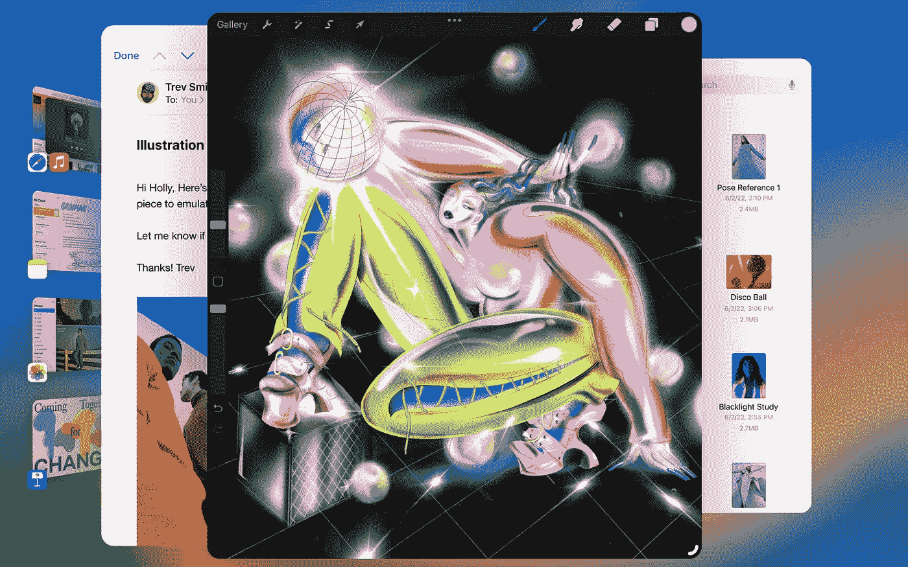

# 苹果的新操作系统功能更多，但并不令人兴奋

> 原文：<https://medium.com/geekculture/apples-new-operating-systems-offer-more-fail-to-excite-7a504755a57f?source=collection_archive---------7----------------------->

## iOS、iPadOS 和 macOS 中增加了几个受欢迎的功能，但该公司显然正在努力竞争或给人留下深刻印象

No, your eyes are not deceiving you: these are iPad app windows overlapping. Too bad that it’s one of only a handful actually important new features Apple offers with iPadOS 16\. (Image: Apple)

一个小小的值得注意的新增功能列表能把一个新操作系统的发布标记为有趣，更不用说令人兴奋了吗？这是一个以前在一个…