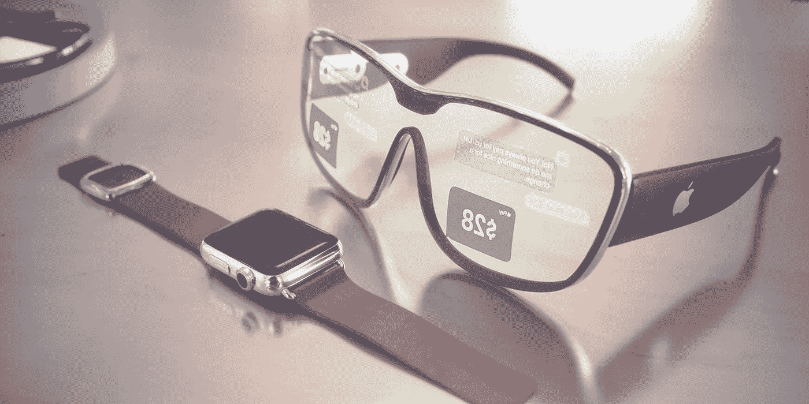
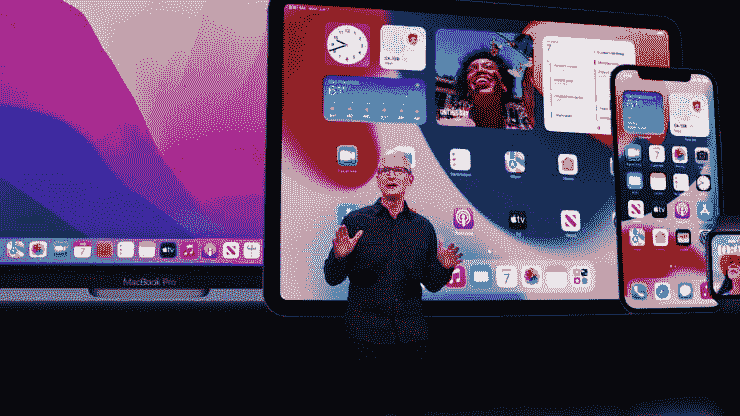
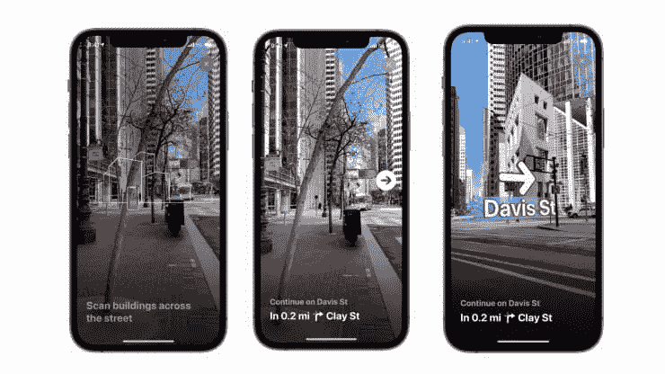

# 苹果的下一代“大黑仔”:AR

> 原文：<https://medium.com/geekculture/apples-next-generation-big-killer-ar-23a1e14e0637?source=collection_archive---------50----------------------->

Image Credits**:** [9to5mac](https://9to5mac.com/2021/01/04/heres-everything-we-know-about-apples-plans-for-an-ar-headset/)

[苹果今年的开发者大会](https://www.youtube.com/watch?v=0TD96VTf0Xs) ( **WWDC** )似乎并没有给粉丝带来太多惊喜，主要集中在软件和操作系统升级上。但如果你仔细观察这次开发者大会，不难发现苹果正在专注于一个技术领域——**增强现实** (AR)。

Image Credits**:** Apple

苹果在周一的开幕会上并没有花太多的时间介绍 AR，而是在技术部分宣布了几项更新，并为软件厂商发布了几款新的 **AR 工具和技术**，表明 AR 仍然是苹果长期的核心项目之一。

> [**CEO 库克**也曾说过，AR 是科技领域](https://www.cnbc.com/2021/06/10/apple-ar-announcements-at-wwdc-2021.html#:~:text=Apple%20CEO%20Tim%20Cook%20has,the%20%E2%80%9Cnext%20big%20thing.%E2%80%9D)的*下一件大事*。

要在 AR 设备上取得成功，归根结底需要大量的软件支持，就像**苹果地图**、 **YouTube 和 Safari 浏览器**等应用推动第一代 iPhone 的出道。苹果现在正在为开发者推出新的 AR 工具和技术，允许他们参与软件开发，这无疑为苹果创造一个或多个“**杀手级应用** s”的机会铺平了道路。

目前，苹果尚未宣布任何发布 AR 硬件的计划，但市场传言早已铺天盖地。[苹果可能最早在明年发布 AR 耳机](https://www.macrumors.com/roundup/apple-glasses/)。而苹果的“*一哥*”[**郭**](https://www.macrumors.com/guide/ming-chi-kuo/) 在早前的一份[研究报告中表示，苹果将在 2022 年第二季度推出首款 AR 头盔。](https://www.cnbc.com/2021/06/10/apple-ar-announcements-at-wwdc-2021.html)

## **不起眼的 WWDC 还是苹果创新风暴前的平静**

[Loup Ventures 创始人、资深苹果分析师 GeneMunster](https://twitter.com/munster_gene?ref_src=twsrc%5Egoogle%7Ctwcamp%5Eserp%7Ctwgr%5Eauthor) 指出:“从高层的角度来看，今年或明年的苹果全球开发者大会(WWDC)是苹果创新风暴之前的平静。目前，苹果正在努力围绕 AR 开发可穿戴设备。设备和 AR 运输技术的新产品类别。”

## **2021 苹果 WWDC AR 技术及产品亮点一览**

主会场关于苹果 AR 产品的新闻主要集中在软件和开发平台更新上。以下几点值得注意:

*   苹果地图有望在几个特定城市开放 AR 导航功能；
*   苹果更新了 RealityKit2 框架，推出了新的开发者工具 Object Capture
*   ARKit 5 更新，锚点功能升级；
*   iOS 15 增加了实时文本识别功能。

## **标杆谷歌苹果地图将支持 AR 导航**

新系统 [**iOS 15**](https://www.apple.com/ios/ios-15-preview/) 、 **iPadOS 15** 、 **macOSMonterey 的**苹果设备将开辟类似于*谷歌地图* AR 实时导航的功能。在特定的城市，通过摄像头拍摄附近的风景，然后利用数据库进行比对，提供 3D 风格的徒步导航功能。

Apple’s new city navigation feature in Apple Maps. [Image Credits**:** Apple]

与传统导航地图不同，新版苹果地图支持 3D 导航，可以显示用户附近的三维街景和建筑物，更容易更好地指示复杂路段的地理环境。目前该功能仅支持*伦敦、洛杉矶、纽约、费城、圣地亚哥、华盛顿。*

新版地图将会更新，包括新的细节，如商业区、码头、建筑等。，例如海拔、新道路颜色和标签设置。如果司机使用苹果地图，会更直观地看到转弯车道、中线、公交专用道等。；使用苹果地图的行人会看到*人行道和十字路口*。

这些城市街道新功能的细节变化比谷歌地图的更新更有竞争力。苹果不仅会更新夜间 3D 景观光影改造，实时街景也在逼近谷歌。苹果表示，未来将更新人行道和自行车道的显示。

## **RealityKit 2 框架更新支持快速生成 AR 预览**

[**RealityKit**](https://developer.apple.com/documentation/realitykit) 是苹果为增强现实从头开始构建的渲染、动画、物理和音频框架。借助原生 *Swift API、ARKit 集成、高清渲染*等。，开发者可以轻松原型化，制作出高质量的 AR 体验。结合 iPad Pro 上的激光雷达扫描仪，可以使用视频纹理、场景理解、位置锚点、人脸跟踪和改进的调试工具进行 AR 开发。

*对象捕获*是 RealityKit2 中新的开发工具。所有开发者都可以使用苹果设备在几分钟内拍摄 **2D** 照片并创建 **3D** 物体；macOS Monterey 可以将这些照片导入 4D 影院，并生成 AR 预览。

## **ARKit 5:主播功能升级增加“立即识别”功能**

[**ARKit**](https://developer.apple.com/augmented-reality/arkit/)**是新一代的 AR 应用，苹果希望改变人们与周围世界的联系方式。**

**用户可以使用定位锚将虚拟对象与现实世界的经度、纬度和高度联系起来。使用**激光雷达**扫描并获得 iPad Pro 上的深度场景显示。**

**据悉，新版 **ARKit 5** 已经更新，使用定位主播，人们更容易感受到基于位置的 AR 体验。该功能允许开发者构建更好的 AR 体验。苹果表示，开发者在使用 ARKit 5 时可以轻松发现并准确定位自己的虚拟内容。**

**定位锚点功能可以让开发者的 AR 对象固定在设定的*纬度、经度、高度*上，用户可以在 AR 对象周围移动，进行观察。该功能目前支持 **iPhone XS、iPhone XS Max、iPhone XR** ，仅部分城市可用。**

**ARKit 5 还改进了运动跟踪，并支持 iPadPro(第五代)超广角相机中的人脸跟踪。借助新的 App Clip Code anchor，用户可以将 App Clip 或 ARKit 应用程序中的虚拟内容固定为印刷或数字化的 App Clip 代码。**

## ****iOS 15 新文字识别有望嵌入 AR 眼镜****

**苹果相机现在可以帮助你提取照片中的文本(手写或打印)，将其数字化，以便你可以在网上搜索，如果是电话号码，可以复制粘贴该文本——拨打该号码。除此之外，它还有其他智能功能，包括识别动物种类、地标等**

**该功能类似于图像识别软件，允许系统在照片中查找信息，例如识别花卉品种或地标或为未来的苹果 ar 眼镜提供技术支持。目前，用户可以在 iPhone、iPad 和 Mac 上体验该功能。**