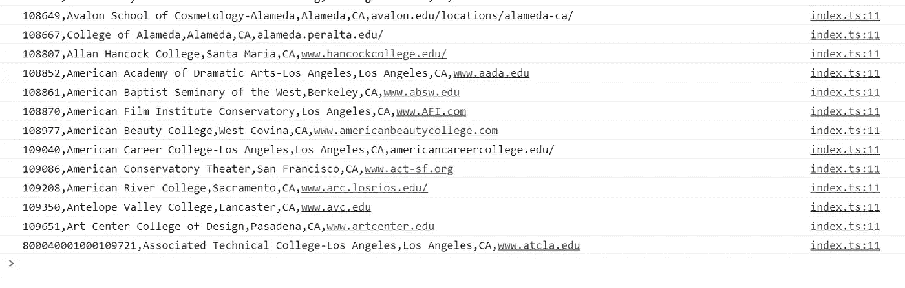

# Streams API 在 JavaScript 中的应用

> 原文：<https://medium.com/geekculture/applicance-of-streams-api-in-javascript-fd26d2cf67bf?source=collection_archive---------11----------------------->

Streams API 是一个实验性实现的特性，它是 ES 标准的一部分。


Photo by [Christopher Burns](https://unsplash.com/@christopher__burns?utm_source=unsplash&utm_medium=referral&utm_content=creditCopyText) on [Unsplash](https://unsplash.com/s/photos/data-flow?utm_source=unsplash&utm_medium=referral&utm_content=creditCopyText)

让我们仔细看看如何应用它们来转换数据，执行副作用，并编写我们自己的 csv 数据转换器，它可以有效地与 fetch 一起工作，通过动态流来转换数据。

我们将转换一个 1Mb 的 CSV 文件，chrome 在获取时会将它分成两部分(所有的源代码都可以在这里访问)。

我将在本文中使用 TypeScript，但是如果你不熟悉它，不要害怕，在纯 js 中它都是一样的。


Streams concept from MDN ([https://developer.cdn.mozilla.net/en-US/docs/Web/API/Streams_API](https://developer.cdn.mozilla.net/en-US/docs/Web/API/Streams_API))

# 使用流处理响应正文

响应被表示为一个 Uint8Array 流，我们希望它是一个文本流。让我们用`TextDecoderStream`来做这件事

JS 中的流允许用`pipeThrough`将它们映射到另一种数据类型

```
fetch('edu-scorecard.csv')
  .then((response) => response.body!
    .**pipeThrough**(new **TextDecoderStream**()))
```

之后，我们可以访问文本数据，并将其发送到我们自己的流，这将允许从它读取，它本身将访问以前的流的数据。

```
.then((text) => text
    .pipeThrough(new **CSVDecoderStream**()))
```

## 正在创建 CSVDecoderStream

我们的流将表示可读和可写对，这就是为什么我们将有 2 个属性——可读和可写。这就是为什么它实现了`GenericTransformStream`接口:

```
interface **GenericTransformStream** {
    readonly readable: **ReadableStream**;
    readonly writable: **WritableStream**;
}
```

此外，为了拆分每一行并将其作为流中的一段数据发送出去，我们将实现 CSVDecoder。

```
export class **CSVDecoderStream** implements **GenericTransformStream**{
  readable: **ReadableStream**;
  writable: **WritableStream**;
  decoder = new **CSVDecoder**();
}
```

## CSV 解码器

这个类将有回调函数，它将在每个数据块和方法上被调用以开始解码。

```
export class **CSVDecoder** {
  private onChunk: (data: string) => void = null!;
  public registerOnChunk(fn: (data: string) => void): void {
    this.onChunk = fn;
  } private partialChunk = '';
  decode(data: string) {}
}
```

`decode`方法将如下所示:

```
**decode**(data: string) {
  const normalisedData = this.partialChunk + data;
  const chunks = normalisedData.split('\n');
  this.partialChunk = chunks.pop()!;
  chunks.forEach(this.onChunk);
}
```

这里，我们应该考虑到数据可能以不可预测的部分在网络上发送。并且可以部分发送最后一个块。这就是为什么我们有 partialChunk 道具。

在解码方法中，我们将部分数据块添加到新数据中(最初这个属性是一个空字符串，我们什么也不添加)。然后我们用换行来分割数据——这是一个简单的方法，只是为了演示我们的用例。

当我们拥有了所有的数据行并且保存了部分数据行时，我们为除部分数据行之外的每一行调用我们的`onChunk`回调函数。

## CSVDecoderStream

在我们的流中，我们在构造函数中设置了一个用于发送解码数据的可写流和一个用于进一步传递解码数据的可读流。

```
constructor() {
    this.readable = new ReadableStream({
      start: (controller) => {
        this.decoder.registerOnChunk(
          **chunk => controller.enqueue(chunk)**
        );
      }
    }); this.writable = new WritableStream({
      write: (data) => {
        **this.decoder.decode(data);**
      }
    });
  }
}
```

为了将数据进一步发送给数据消费者，我们使用`controller.enqueue(chunk)`

# 把所有的放在一起

要记录我们从 CSV 解码器获得的每一行，或者可以简单地提供一个可写的流来登录控制台，如下所示。

所以，这条管道看起来会像这样:

```
fetch('edu-scorecard.csv')
  .then((response) => response.body!
    .pipeThrough(new TextDecoderStream()))
  .then((text) => text
    .pipeThrough(new CSVDecoderStream()))
  .then(stream => stream.pipeTo(new WritableStream({
    write(data) {
      console.log(data);
    }
  })
```

我们在控制台中分别得到每一行:



Logged CSV rows data