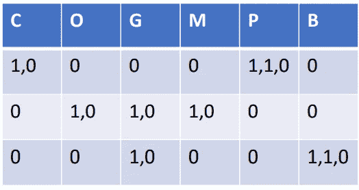
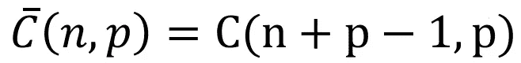
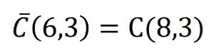
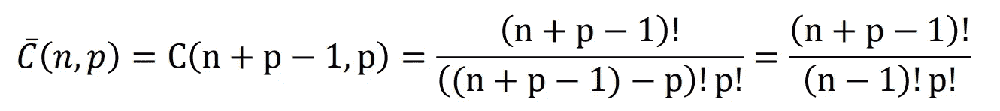

# 重复组合的应用

> 原文：<https://medium.com/geekculture/applications-of-combinations-with-repetition-36c5c6656433?source=collection_archive---------10----------------------->

为了理解重复组合是如何工作的，你需要理解它们出现的实例。

当我们处理的事件在样本空间中有足够数量的不同值时，我们使用重复组合。

一个这样的例子是比萨饼上的浇头。

我们可以额外订购任何给定的配料，所以重复是允许的。然而，我们**不在乎浇头放在披萨上的顺序**，所以我们不能使用变体。

类似的例子包括为圣代冰淇淋挑选口味，或者为梦幻足球队挑选球员。

# **披萨的例子**

为了更好地掌握我们拥有的组合的数量，让我们探索一个具体的例子。

你在当地的披萨店点了一份 3 层的披萨，但是因为时间晚了，他们只剩下 6 层了。

浇头如下:—

切达 **C** heese， **O** nions， **G** 青椒，**M**ush roos， **P** epperoni 和 **B** acon。

你的比萨饼可以有 3 种不同的浇头，或者你可以重复浇头多达 3 次。

你可以点一份有三种不同配料的披萨，一份有三种相同配料的披萨，或者一份有两种不同配料但其中一种配料是双倍剂量的披萨。

# **方法论**

我们用于这种组合的方法是相当抽象的。我们喜欢用 0 和 1 的特殊序列来代表每一种比萨饼。为此，我们首先需要为可用的配料选择一个特定的订单。

我们可以重复使用我们之前写下的顺序:—

切达奶酪 **C** 赫斯、 **O** 尼翁斯、 **G** 青椒、 **M** 乌什霍斯、 **P** 埃佩罗尼和 **B** 阿康。

为了方便起见，我们可以用我们突出显示的字母来指代每种配料(例如，“ **C** 表示奶酪，而“ **O** 表示洋葱)。

为了构建每种独特披萨的顺序，我们遵循 2 条规则，按照我们之前写下的顺序检查配料。

1.  如果我们不想从某个浇头得到更多，我们写一个 **0 并移动到下一个浇头**。
2.  如果我们想包含某个顶层，我们写一个 **1 并停留在同一个顶层。**【不进入下一个浇头允许我们在继续之前，通过再加一个 1 来表明我们是否想要额外的。比方说，如果我们想让我们的比萨饼有额外的奶酪，序列将从“1，1”开始。此外，我们总是在移动到另一个浇头之前应用规则 1，所以序列实际上将从“1，1，0”开始]

# **披萨和套餐**

如果我们需要在每个顶点后写一个“0”，那么每个序列将由 6 个 0 和 3 个 1 组成。

让我们来看看一些比萨饼和他们表达的序列。

Pizzas and their sequences

一个有**奶酪**和**超辣香肠** *(第一行)*的披萨由序列 1，0，0，0，0，1，1，0，0 表示。

一个有**洋葱、青椒**和**蘑菇** *(第 2 行)*的纯素食比萨饼将由序列 0，1，0，1，0，1，0，0，0 表示。

现在，序列 0，0，1，0，0，0，1，1，0 代表哪种比萨饼？

我们可以将该序列放入表中，并看到它代表一个带有**青椒**和**额外培根** *(第 3 行)*的披萨。

# **总是以 0 结尾**

请注意，我们检查的所有序列都以 0 结尾。

1.  1，0，0，0，0，1，1，0， **0**
2.  0，1，0，1，0，1，0，0，0， **0**
3.  0，0，1，0，0，0，1，1， **0**

这不是巧合，因为根据我们算法的规则 1，我们需要在序列的末尾添加一个“0 ”,不管我们是否想要熏肉。

这意味着，只有序列的前 8 个元素可以取不同的值。

每一个比萨饼都以序列中 3 个“1”的位置为特征。因为序列中只有 8 个位置可以取值“1”，所以不同比萨饼的数量将是 8 个位置中任意 3 个位置的组合。

# 位置

如前所述，我们有 3 个“1”和 8 个不同的位置。因此，我们能得到的比萨饼的数量将是从一组 8 个元素中选择 3 个元素的组合的数量。这意味着我们可以将有重复的组合**转换成没有**重复的组合**。**

让我们观察值 3 和 8 一会儿，并尝试推广该公式。“3”代表我们需要挑选的浇头数量，所以还是相当于“p”。

“8”代表我们可用于“1”的位置数。我们总共有 3 + 6 = 9 个位置，但我们知道最后一个不能包含“1”。因此，我们有“n + p-1”个可能包含 1 的位置。

# **最后一步**

现在，我们已经知道了有的组合**和没有**重复的组合**的数量之间的关系，我们可以将“n+p-1”代入没有**重复的组合**的公式来得到:—**

这与我们在之前的博客中看到的[中的公式完全相同。](https://vijaygadre.medium.com/probability-combinatorics-for-data-science-5e75e6b33500)

# **总结**

1.  我们首先对可能的值进行排序，并将每个组合表示为一个序列。
2.  我们检查了序列中只有某些元素可能不同。
3.  我们的结论是，每个独特的序列可以表示为“1”值的位置的组合。
4.  我们发现了有重复和无重复组合的公式之间的关系。
5.  我们使用所述关系来创建具有重复的组合的一般公式。