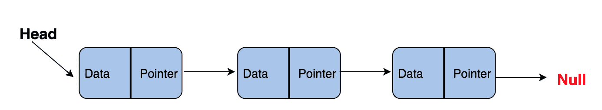
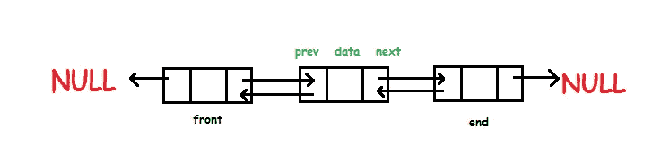
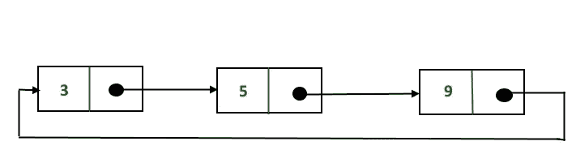
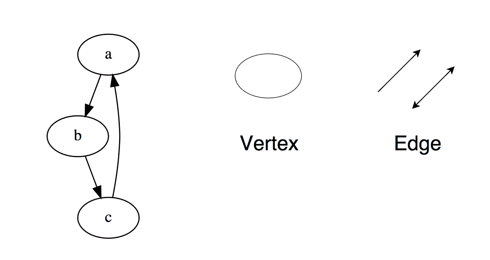
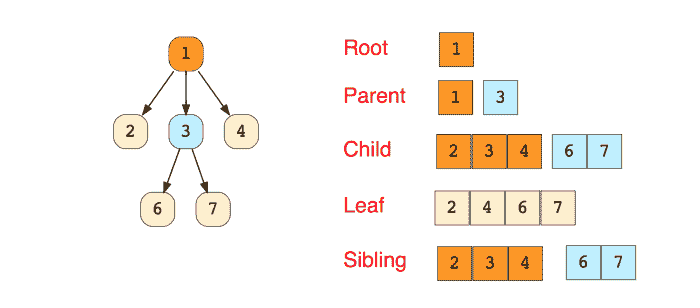

# 数据结构的应用

> 原文：<https://medium.com/geekculture/applications-of-data-structures-6ab9920ea3e5?source=collection_archive---------1----------------------->

> 数据结构是一种组织数据的方式，使得数据变得容易且快速地可访问。

Photo by [Shahadat Rahman](https://unsplash.com/@hishahadat?utm_source=medium&utm_medium=referral) on [Unsplash](https://unsplash.com?utm_source=medium&utm_medium=referral)

数据结构是值的集合；这些值之间有关系，它们可以应用函数。每个功能都是独一无二的，专门针对它自己的东西。它们是构建强大算法的关键组件，使代码更清晰、更容易理解。

在讨论数据结构的应用之前，我们需要理解抽象数据类型的概念。它是数据结构的抽象。它提供了数据结构必须遵循的接口。这种数据类型被称为“抽象”，因为它只是一个理论概念，每种编程语言都有不同的方法来实现这些概念。

**数组:**一个固定长度的容器，包含 n 个元素，范围从[0，n-1]例如:如果一个数组包含 5 个元素，范围将是[0，5–1](n = 5)=>[0，4]。这个范围也称为可索引范围。可索引意味着数组的每个槽都可以用一个称为索引键的数字来引用(它是从零开始的)。这种索引允许随机访问数组的任何元素。静态数组的大小是有限的，也就是说，程序员定义了数组的长度。高级编程语言有动态数组的概念，其中数组增长/调整大小，并允许向其添加更多元素。

*阵列的应用:*

一、手机联系人

二。以表格格式存储数据

三。固定计数的矩阵和二叉树元素的存储

四。其他数据结构的构建块元素，如堆、向量等

动词 （verb 的缩写）在线订票系统——如果用户想在 C-4 中预订一个座位，数组就变成 seat[C][4]或 seat[3][4]

**栈:**一种线性数据结构，具有预定义的容量。它遵循后进先出(LIFO)顺序或先入后出(FILO)顺序。每次使用 Push 操作添加元素时，它都位于堆栈顶部，并且可以借助 Pop 操作从堆栈顶部移除该元素。

*堆栈的应用:*

I .文本编辑器中的撤消和重做功能

二。虚拟机

三。表达式转换(中缀到后缀，反之亦然)

四。字符串的反转

动词 （verb 的缩写）浏览器和文件浏览器中的后退/前进按钮

**单链表:**以随机方式存储在内存中的称为节点的对象集合。一个节点由两部分组成，一部分是存储在特定地址的数据，另一部分是包含内存中下一个节点地址的指针。这种类型的列表的最后一个节点包含一个指向 NULL 的指针。

*单链表的应用:*

I .防止散列图中数据之间的冲突

二。在记事本中撤消、重做或删除操作

三。照片查看器，用于在幻灯片放映中连续查看照片

四。如果想增加一个转向架，他们可以在最后增加一个新的转向架，或者在两个转向架之间增加一个新的转向架。

动词 （verb 的缩写）音乐播放器的下一首曲目功能

**双向链表:**一种复杂类型的链表，其中一个节点包含一个指向序列中上一个和下一个节点的指针。

*双向链表的应用:*

在游戏中代表一副牌

二。用于表示游戏的各种状态

三。撤消或重做功能

四。由浏览器用来实现被访问网页的向后和向前导航

动词 （verb 的缩写）音乐播放器的下一首曲目和上一首曲目功能

**循环链表:**链表的最后一个节点包含一个指向链表第一个节点的指针。我们可以有循环单向链表，也可以有循环双向链表。

*循环链表的应用:*

I .操作系统中所有正在运行的应用程序都保存在一个循环链表中，操作系统给所有应用程序分配一个固定的运行时间。操作系统一遍又一遍地重复这个列表，直到所有的应用程序都完成

二。在基于角色的多人游戏中，所有玩家都被保存在一个循环链表中，当玩家的机会结束时，指针会继续向前移动

三。手机中的贪吃蛇游戏，其中列表头是蛇的头，列表尾是蛇的尾巴

四。音乐播放器中的重复功能，其中用户将连续重复收听播放列表，也就是说，当播放列表中的歌曲结束时，播放第一首歌曲

**图:**由节点和边组成的非线性数据结构。它们用于表示网络。该网络包括城市中的路径、电话网络或电路网络。

*图表的应用:*

一.一个组织的资源利用和可用性

二。社交媒体和其他基于网络的平台的互联

三。设置用户首选项的电子商务应用程序

四。从 A 点到 B 点的最短路径可以在某些算法的帮助下找到

**队列:**一种线性结构，遵循操作必须执行的特定顺序。排队的顺序是先入先出，即先排队的人将首先得到服务。

*队列的应用:*

I .在单个共享资源上处理请求，例如打印机、CPU 任务调度

二。在呼叫中心，队列被用来让人们按顺序呼叫他们，直到服务代表有空为止

三。实时系统中中断的处理

四。用于浏览器文件下载操作的优先级队列

**树:**表示分层数据的非线性数据结构。这是一个分层结构，因为该树中的元素排列在多个级别上。最顶层的节点称为根节点，该节点下的每个节点称为子节点。

*树木的应用:*

I .在计算机系统、目录和文件系统中

二。网站导航结构的实现

三。视频游戏中的决策

四。然后在人工智能、机器人和视频游戏中实现的路径寻找算法

这篇文章是我的同事写的—

## Amber Upadhyay、Kedar Trivedi、Ashwin Sapariya 和 Rohan Pandav (me)是我们的数据结构和算法教师给我们的项目。