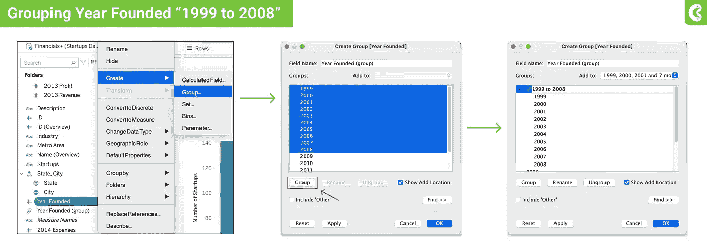
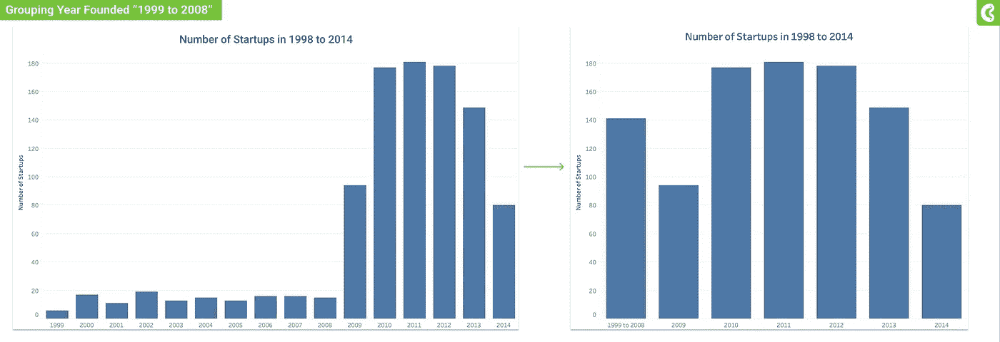
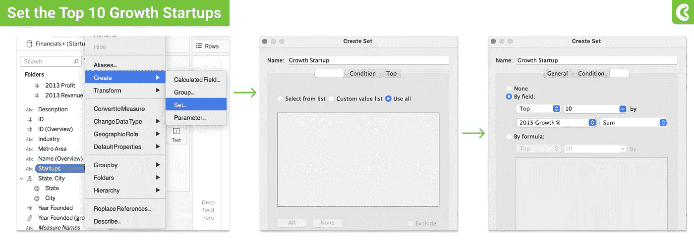
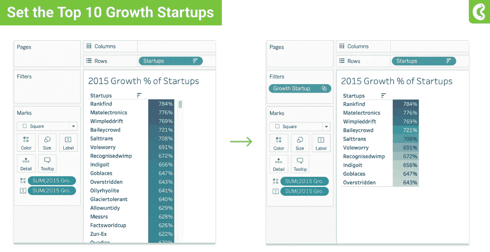
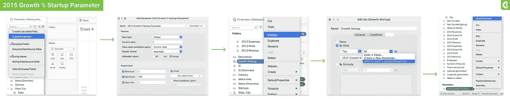
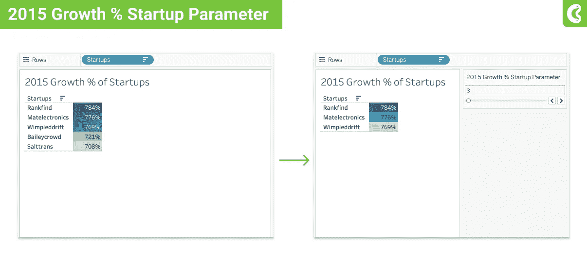
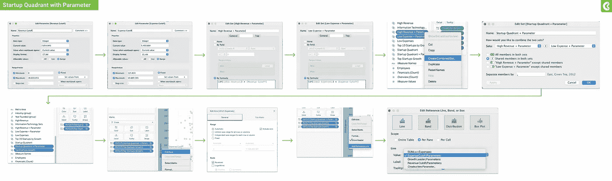
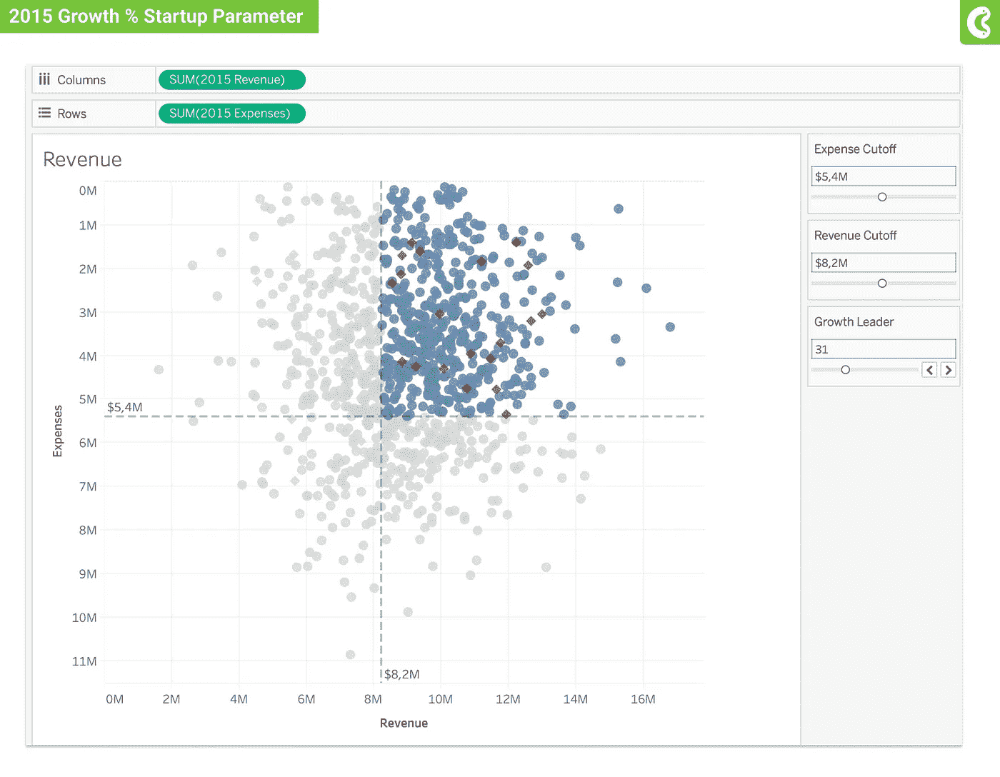
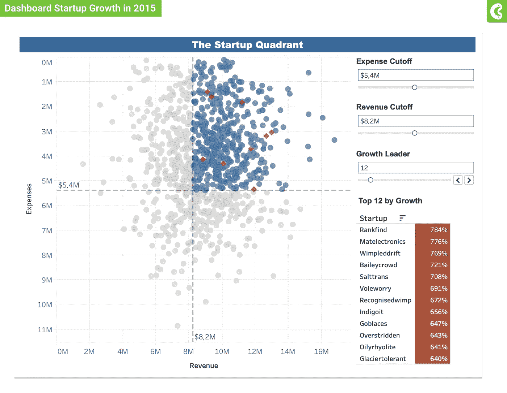

# 应用于表中报表和仪表板的组、集合和参数

> 原文：<https://medium.com/geekculture/applied-group-set-and-parameter-for-report-and-dashboard-in-tableau-6e401873031f?source=collection_archive---------23----------------------->

用于分析的终极便捷动态过滤器

Image by [Clay Banks](https://unsplash.com/@claybanks) from [Unsplash](https://unsplash.com/photos/_Jb1TF3kvsA)

> 对于那些刚刚开始使用 Tableau 分析数据的人来说，本文将帮助您理解 Tableau 的一个基本特性。对于熟悉 Tableau 的人来说，让我们重温一下我们的课程。

## 内容

在这篇文章中你会得到四样东西:

1.  **分组**，合并一个字段中的相关成员
2.  **设置**，将选中的数据和其他数据进行比较
3.  **参数**，用您确定的阈值替换常数值
4.  **练习**利用组，设置&参数解决业务问题

## 首先要做的事

在了解组、集合和参数之前。我要感谢 [*【基里尔·叶列缅科*](https://www.linkedin.com/in/keremenko/) 和团队，他们提出了寻找任何潜在投资创业公司(虚拟数据)的挑战，这些挑战可以应用于其他类似案例。你可以在 [**我的库**](https://github.com/densaiko/data_science_learning/blob/main/dataset/Startups%20Data.xlsx) 下载数据集，这里是挑战。

Image is created by Author

## 组

在 Tableau 中，group 用于组合字段中的相关成员。例如，您有从 1999 年到 2008 年的小数据点，您决定将它们放在一个名为“1999 年到 2008 年”的成员中，而不是每年都将它们放在可视化中。

我将向您展示如何使用 [**启动数据集**](https://github.com/densaiko/data_science_learning/blob/main/dataset/Startups%20Data.xlsx) ，步骤如下:

1.  在数据窗格中，右键点击**年创建**并选择**创建>组**
2.  将 1999 年到 2008 年分块，点击**组**
3.  命名群组并点击**确定**
4.  将**字段组**放入**列**，将**指标**放入**行**

Image is created by Author

你将得到的结果如下

Image is created by Author

## 一组

在 Tableau 中，set 用于比较选中的数据，并将其转换为子集数据。例如，董事会需要找到 2015 年十大成长型创业公司。以下是查看 10 大增长领导者的步骤:

1.  在数据窗格中，右键单击字段**名称**并选择**创建**设置>设置
2.  填写名称“成长启动”并点击**使用所有**数据
3.  选择**>点击**按字段** >填充 **10** >选择 **2015 年增长%****
4.  **将字段**生长启动**放入**过滤盒****

****

**Image is created by Author**

**你将得到的结果如下**

****

**Image is created by Author**

## **参数**

**在 Tableau 中，参数用于将计算中的常数值替换为您确定的阈值。例如，董事会希望看到排名前 N 的创业公司，需要一个实时过滤器来实现这一点。以下是实现这一点的步骤:**

1.  **在数据窗格中，右键单击字段**名称**并选择**创建** > **参数****
2.  **填写名称“2015 增长%启动参数”，并像图中一样填写属性**
3.  **转到字段“增长启动”和**编辑设置****
4.  **将前 10 项更改为“2015 年增长%启动参数”并确定**
5.  **在参数>字段上点击右键**显示参数****

****

**Image is created by Author**

**你将得到的结果如下**

****

**Image is created by Author**

**恭喜你，现在你明白 Tableau 的几个基本概念了。现在，是时候利用它们来解决问题了。这是董事会对你的要求:**

*   **预期的截止收入过滤器**
*   **截止费用的预期过滤器**
*   **在象限可视化中显示它们**

**为了做到这一点，让我们通过查看下面的流程来简化它:**

****

**Image is created by Author**

**启动象限的结果应该是这样的**

****

**Image is created by Author**

## **最后一击**

**现在，您已经准备好将它们全部放入仪表板中的一个中。您可以转到新仪表板，将**增长启动**表和**启动象限**表放入您的仪表板。结果应该是这样的**

****

**Image is created by Author**

## **结论**

**你可能会在本教程中遇到一些困难，让我们把它作为你的探索，因为我相信你会得到更多是否添加一些功能或其他分析。你可以在这里找到画面。我希望你喜欢这个，请关注我的 [**LinkedIn**](https://www.linkedin.com/in/ariprabowo/) 和 [**Github**](https://github.com/densaiko) 。我很高兴收到对未来文章的任何积极反馈。快乐学习！！**