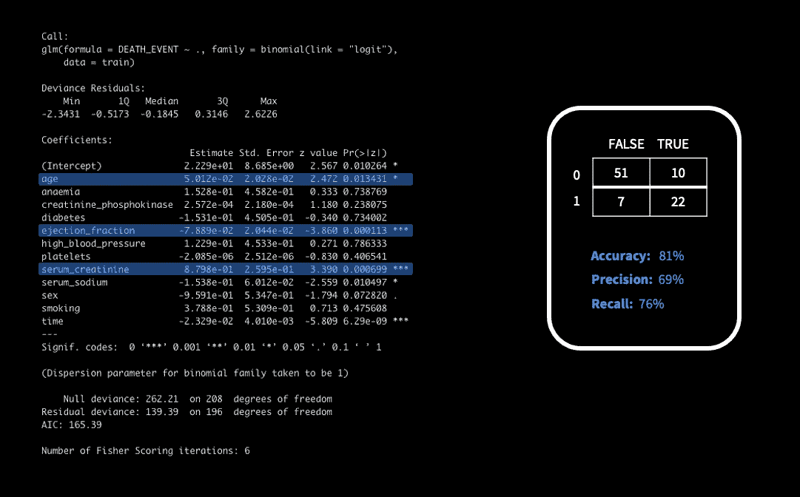
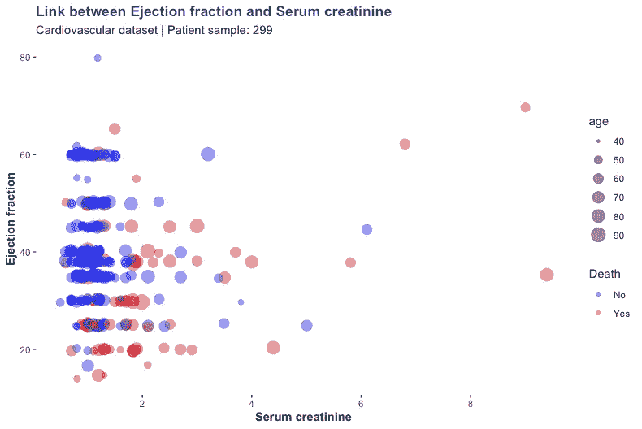

# 医疗数据集上的应用机器学习——数学而非魔法

> 原文：<https://medium.com/geekculture/applied-machine-learning-on-a-healthcare-dataset-maths-not-magic-8bd7e013b055?source=collection_archive---------4----------------------->

Photo: Günter Valda

20 世纪 60 年代末开创了一个计算机开始支持决策的时代。术语“分析”开始流行起来，并在多年中不断发展。然而，在过去的二十年里，数据聚合和数据利用呈指数级增长。数据云系统和数据处理平台的可用性在构建新的商业生态系统、催生新产业方面发挥了关键作用。

多年来，机器学习的应用已经成熟，它的子领域正在推动大量嵌入我们日常生活的技术，如图像识别、搜索等。这些技术利用过去的数据来预测未来的结果，几乎在每个行业都发挥作用。

[机器学习(ML)在医疗保健领域的应用](https://www.nature.com/articles/s41563-019-0360-1)已经逐渐扩展到各个医疗保健部门，从诊断和预后到研发和流行病学。尽管医生和研究人员知道严重疾病涉及的因素，但机器学习已经证明了它在确认怀疑方面的有效性，并从以前的数据集揭示了新信息。支撑机器学习算法的是已经存在了几十年的数学模型。

在这篇博客中，我将使用一个简单的[心脏病学数据集](https://www.kaggle.com/andrewmvd/heart-failure-clinical-data)深入机器学习的幕后，该数据集包含各种测量结果以及患者是否存活。

将哪种机器学习算法应用于训练数据集取决于问题的性质，因为每种算法都有独特的用途。在这里，我不会进入不同类型的机器学习算法的细节，因为我的重点是应用一种方法(逻辑回归)来处理我们的数据集。[逻辑回归(LR)](https://www.sciencedirect.com/topics/medicine-and-dentistry/logistic-regression-analysis) 可以帮助我们识别显著导致导致死亡的严重症状的测量值和因素。但是 LR 如何帮助我们呢？简而言之，LR 使用对数比值比(2 个事件发生的几率，例如通过/失败)和迭代最大似然(拟合分布的最佳方式)来预测二元结果。

Logistic Regression on a Cardiology dataset

当运行“glm”命令以基于所有测量值(变量)预测死亡概率时，模型在训练数据集中标记与死亡相关的三个主要因素*(年龄、射血分数&血清肌酸酐)*。当模型预测与测试数据集进行比较时，我们获得了 81%的准确率。从混淆矩阵中得到的关键信息是，该模型预测每个结果的准确率超过 50%，但是，该模型的整体准确率远远低于医疗保健机构的要求，在医疗保健机构中，错误识别的病例可能会带来严重的风险。

我们的模型擅长预测可能存活的患者，因为它准确预测了测试集中 83%的存活患者。为了提高模型的准确性，我们需要增加样本量，并通过增加更多的测量值使数据集更加丰富。

# **疾病生物学**

在现实生活的医疗保健设置中，这些结果没有什么价值，因为标记的变量并不令人惊讶。射血分数和血清肌酐水平异常可导致严重疾病。肌酸酐是磷酸肌酸的副产品，由于肌肉组织中的蛋白质代谢而产生。[血液中的正常肌酐水平](https://www.mayoclinic.org/tests-procedures/creatinine-test/about/pac-20384646)可以在 0.84 到 1.21 mg/dl 之间变化，并且该范围在性别之间略有不同。

正常功能的肾脏定期过滤肌酸酐，但是，并发症如肾病可导致血清中肌酸酐水平升高。较高的血清肌酐水平可能意味着一系列问题，包括流向肾脏的血流量减少，导致由于过滤不良导致的高肌酐水平。

射血分数是衡量心脏收缩时血液离开心脏的百分比。这是医生可以用来评估个人心脏状况的众多测试之一。一般来说，射血分数(LVEF)低于 30%被认为是严重异常，是心力衰竭的信号。射血分数和血清肌酸酐之间的联系可以通过绘制患者数据来进一步探索。

Link between ejection fraction & serum creatinine in cardiovascular patients

乍一看，人们可以看到一个射血分数<20% is strongly linked to death. While no clear correlation exists between the two variables, the plot helps us visualise the interplay between age, ejection fraction and creatinine levels and their influence in causing death as predicted by our model.

# **ML 在医疗保健中的未来作用**

通过自动化机器学习平台，如亚马逊的 SageMaker、谷歌云 auto-ML 和 IBM Watson，ML 在各个行业的采用已经变得很容易。这些平台已经通过强大的数据处理和机器学习模型的自动生成确立了它们的有效性。
利用医疗保健数据的全部力量需要临床医生的参与，他们也是优秀的数据科学家，并利用机器学习模型从大数据中提取意义。随着技术在医疗保健领域的采用加速，丰富数据和自动化 ML 平台的可用性可以让研究人员和医生在日常决策中使用机器学习。