# 在 Titanic 数据集上应用 7 种分类算法

> 原文：<https://medium.com/geekculture/applying-7-classification-algorithms-on-the-titanic-dataset-278ef222b53c?source=collection_archive---------3----------------------->

*寻找最精确的算法！*


Photo by [Olisa Obiora](https://unsplash.com/@oobiora22?utm_source=unsplash&utm_medium=referral&utm_content=creditCopyText) on [Unsplash](https://unsplash.com/s/photos/titanic?utm_source=unsplash&utm_medium=referral&utm_content=creditCopyText)

如果你刚开始接触数据科学，Kaggle 上的 [**Titanic:机器从灾难中学习**](https://www.kaggle.com/c/titanic) 项目是学习分类算法的最好方法之一！在这篇文章中，我讲述了如何在这个数据集上应用不同的分类算法，并找出哪种算法能给我们最好的准确度。

我甚至将这些模型提交给了 Kaggle 竞赛，因此我们可以确切地了解每个模型在未知数据上的表现！

首先，如果你要使用这些模型中的任何一个，你必须清理你的数据。在这篇 文章中，我已经通过各种方式来清理和可视化泰坦尼克号数据集。因此，如果您想知道如何处理那些丢失的值，并想知道每个特性如何与**幸存的**列相关联，那么请先查看那篇文章。

[](https://eshitagoel.medium.com/eda-on-titanic-machine-learning-from-disaster-6b518bb97e17) [## 泰坦尼克号上的 EDA:从灾难中学习机器

### 学习机器学习中的基本 EDA 技术

eshitagoel.medium.com](https://eshitagoel.medium.com/eda-on-titanic-machine-learning-from-disaster-6b518bb97e17) 

让我们看看制作模型的先决条件:

## 将我们的数据存储在变量中

Kaggle 的数据可在。csv 文件，我们将数据存储到变量中。

```
X = train[["Pclass","Sex","Age","Fare","Cabin","Prefix","Q","S","Family"]]
Y = train["Survived"]
X_TEST = test[["Pclass","Sex","Age","Fare","Cabin","Prefix","Q","S","Family"]]
```

## 数据的标准化

尽管并非所有算法都需要标准化，但逻辑回归和 K 近邻等算法需要标准化，因为它们使用欧几里德距离或曼哈顿距离。因此，我们将数据标准化。

```
**from** **sklearn.preprocessing** **import** StandardScaler
sc = StandardScaler()
X = sc.fit_transform(X)
X_TEST =  sc.transform(X_TEST)
```

注意，我们仅使用训练数据来训练标准标量。这防止了训练和测试数据之间的任何信息泄漏。

## 训练-测试-拆分

我们对训练数据执行训练-测试-分割

```
**from** **sklearn.model_selection** **import** train_test_split
X_train, X_test, y_train, y_test = train_test_split(X,Y,test_size = 0.2, random_state=1)
```

# 制作模型

## 1.k-最近邻算法

如果选择了正确的 K 值，K-最近邻算法对于分类很有效。我们可以使用一个小的 for 循环来选择正确的 k 值，该循环测试 1 到 20 之间的每个 k 值的精度。

```
**from** **sklearn.neighbors** **import** KNeighborsClassifier
**from** **sklearn.metrics** **import** accuracy_score

acc = []

**for** i **in** range(1,20):
    knn = KNeighborsClassifier(n_neighbors = i)
    knn.fit(X_train,y_train)
    yhat = knn.predict(X_test)
    acc.append(accuracy_score(y_test,yhat))
    print("For k = ",i," : ",accuracy_score(y_test,yhat))
```

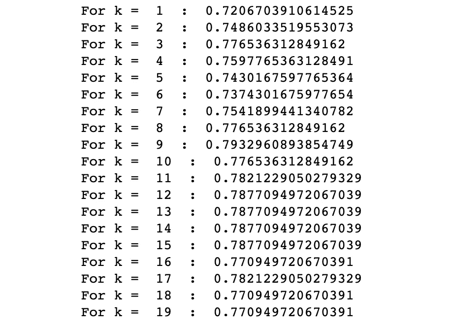

Image by Author

为了直观显示和比较这些值，我们绘制了一个线图，以找出哪个 k 值给出了最佳精度:

```
plt.figure(figsize=(8,6))
plt.plot(range(1,20),acc, marker = "o")
plt.xlabel("Value of k")
plt.ylabel("Accuracy Score")
plt.title("Finding the right k")
plt.xticks(range(1,20))
plt.show()
```

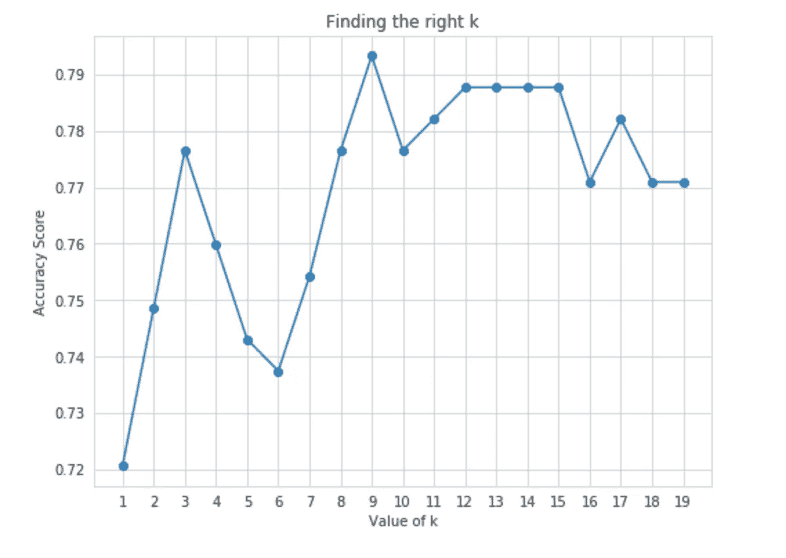

Image by Author

给出最高精度的 k 的优选值是 **k = 9。** 我们现在可以使用这个 k 值来制作我们的模型:

```
KNN = KNeighborsClassifier(n_neighbors = 9)
KNN.fit(X,Y)
y_pred = KNN.predict(X_TEST)df_KNN = pd.DataFrame()
df_KNN["PassengerId"] = test2["PassengerId"]
df_KNN["Survived"] = y_pred
```

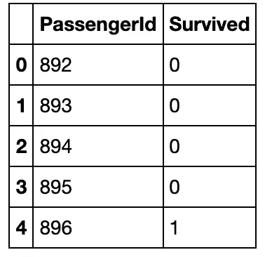

KNN Output

当我们将这个模型提交给 Kaggle 竞赛来看看我们的模型表现如何时，我们得到的准确率分数是 **77.27%**

## 2.决策树算法

我们尝试了决策树算法来解决这个分类问题。我们需要找到决策树分割数据的正确深度，因为没有指定最大深度，模型很容易过度拟合。

这可以使用交叉验证来完成，但是对于初学者来说，一个简单的 for 循环也可以帮助你比较选择哪个深度。

```
**from** **sklearn.tree** **import** DecisionTreeClassifier

depth = [];

**for** i **in** range(1,8):
    clf_tree = DecisionTreeClassifier(criterion="entropy", random_state = 100, max_depth = i)
    clf_tree.fit(X_train,y_train)
    yhat = clf_tree.predict(X_test)
    depth.append(accuracy_score(y_test,yhat))
    print("For max depth = ",i, " : ",accuracy_score(y_test,yhat))
```

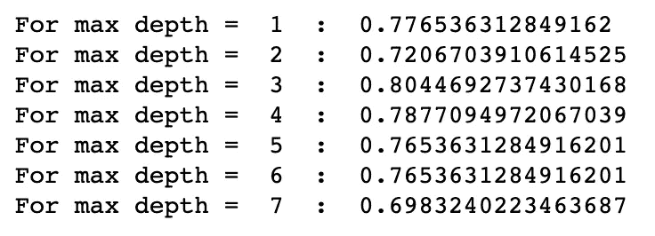

Image by Author

在这里，我们也可以绘图，看看哪个深度给我们最准确的预测:

```
plt.figure(figsize=(8,6))
plt.plot(range(1,8),depth,color="red", marker = "o")
plt.xlabel("Depth of Tree")
plt.ylabel("Accuracy Score")
plt.title("Finding the right depth with highest accuracy")
plt.xticks(range(1,8))
plt.show()
```


Image by Author

深度= 3 时精度最高，我们现在用这个深度进行训练和预测。

```
clf_tr = DecisionTreeClassifier(criterion="entropy", random_state = 100, max_depth = 3)
clf_tr.fit(X,Y)
pred_tree = clf_tr.predict(X_TEST)df_TREE = pd.DataFrame()
df_TREE["PassengerId"] = test2["PassengerId"]
df_TREE["Survived"] = pred_tree
df_TREE.head()
```

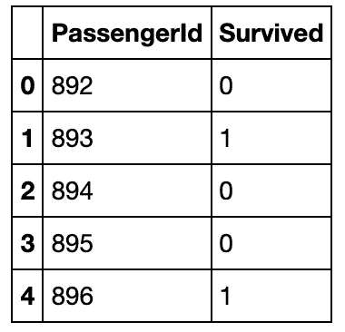

Decision Tree Output

当我们将这个模型提交给 Kaggle 竞赛来看看我们的模型表现如何时，我们得到的准确率分数是 **78.46%**

## 3.随机森林算法

随机森林是使用多个决策树的集成技术之一。我们可以看到它在我们的数据上的表现:

```
**from** **sklearn.ensemble** **import** RandomForestClassifier

clf_forest = RandomForestClassifier(random_state=0)
clf_forest.fit(X_train,y_train)
yhat = clf_forest.predict(X_test)
print("Accuracy for training data : ",accuracy_score(y_test,yhat))**Accuracy for training data :  0.776536312849162**
```

我们现在保存它并提交给 Kaggle

```
clf_for = RandomForestClassifier(random_state=0)
clf_for.fit(X,Y)
y_forest = clf_for.predict(X_TEST)df_FOREST = pd.DataFrame()
df_FOREST["PassengerId"] = test2["PassengerId"]
df_FOREST["Survived"] = y_forest
df_FOREST.head()
```

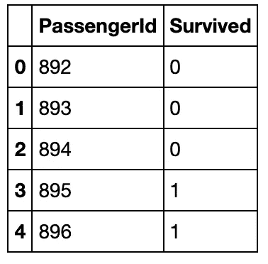

Random Forest Output

我们在 kaggle 上提交我们对这个模型的预测，参加**泰坦尼克号:从灾难中学习机器** Kaggle 竞赛，并检查我们的准确性。

我们的准确率是 **77.27%**

## 4.支持向量机

我们尝试了支持向量机算法来解决这个分类问题。

```
**from** **sklearn.svm** **import** SVC
clf_svm = SVC(gamma='auto')
clf_svm.fit(X_train,y_train)
yhat = clf_svm.predict(X_test)clf_SVM = SVC(gamma='auto')
clf_SVM.fit(X,Y)
pred_svm = clf_SVM.predict(X_TEST)df_SVM = pd.DataFrame()
df_SVM["PassengerId"] = test2["PassengerId"]
df_SVM["Survived"] = pred_svm
df_SVM.head()
```

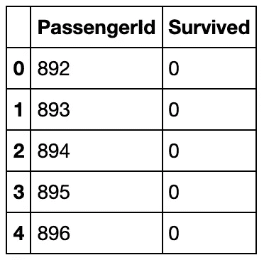

SVM Output

我们在 Kaggle 上提交我们对这个模型的预测，参加**泰坦尼克号:从灾难中学习机器** Kaggle 竞赛，并检查我们的准确性

我们的准确率是 **77.51%**

## 5.朴素贝叶斯算法

我们尝试了朴素贝叶斯算法来解决这个分类问题。

```
**from** **sklearn.naive_bayes** **import** GaussianNB
clf_NB = GaussianNB()
clf_NB.fit(X_train,y_train)
y_hat = clf_NB.predict(X_test)
print("Accuracy for training data : ",accuracy_score(y_test,y_hat))
```

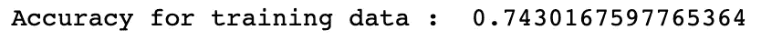

```
clf_NB = GaussianNB()
clf_NB.fit(X,Y)
pred_NB = clf_NB.predict(X_TEST)df_NB = pd.DataFrame()
df_NB["PassengerId"] = test2["PassengerId"]
df_NB["Survived"] = pred_NB
df_NB.head()
```

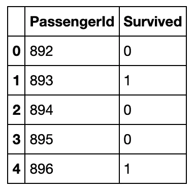

Naive Bayes Output

我们在 kaggle 上提交了我们对这个模型的预测，用于**泰坦尼克号:从灾难中学习机器** Kaggle 竞赛，并检查我们的准确性

我们的准确率是 **72.72%**

## 6.逻辑回归算法

我们尝试使用逻辑回归算法来解决这个分类问题。

```
**from** **sklearn.linear_model** **import** LogisticRegression
regr = LogisticRegression(solver='liblinear', random_state=1)
regr.fit(X_train,y_train)
yhat = regr.predict(X_test)
print("Accuracy for training data : ",accuracy_score(y_test,y_hat))
```

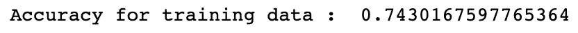

```
reg = LogisticRegression(solver='liblinear', random_state=1)
reg.fit(X,Y)
y_LR = reg.predict(X_TEST)df_LR = pd.DataFrame()
df_LR["PassengerId"] = test2["PassengerId"]
df_LR["Survived"] = y_LR
df_LR.head()
```


Logistic Regression Output

我们在 kaggle 上提交了我们对这个模型的预测，用于**泰坦尼克号:从灾难中学习机器** Kaggle 竞赛，并检查我们的准确性

我们的准确率是 **76.55%**

## 7.随机梯度下降分类器

我们尝试使用随机梯度下降分类器来解决这个分类问题。

```
**from** **sklearn.linear_model** **import** SGDClassifier

clf_SGD = SGDClassifier(loss="squared_loss", penalty="l2", max_iter=4500,tol=-1000, random_state=1)
clf_SGD.fit(X_train,y_train)
yhat = clf_SGD.predict(X_test)
print(accuracy_score(y_test,yhat))
```

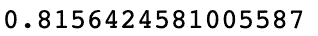

Training Accuracy

```
clf_SGD = SGDClassifier(loss="squared_loss", penalty="l2", max_iter=4500, tol=-1000, random_state=1)
clf_SGD.fit(X,Y)
y_SGD = clf_SGD.predict(X_TEST)df_SGD = pd.DataFrame()
df_SGD["PassengerId"] = test2["PassengerId"]
df_SGD["Survived"] = y_SGD
df_SGD.head()
```

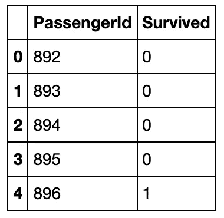

SGD Classifier Output

我们在 kaggle 上提交了我们对这个模型的预测，用于**泰坦尼克号:从灾难中学习机器** Kaggle 竞赛，并检查我们的准确性

我们的准确率是 76.79%

# 决赛成绩

让我们试着画出目前为止我们得到的各种精度，看看哪个模型对我们来说表现最好:

```
plt.figure(figsize=(8,6))
plt.plot(range(1,8),[KNN_accuracy,TREE_accuracy,FOREST_accuracy,SVM_accuracy,NB_accuracy,LR_accuracy,SGD_accuracy],marker='o')
plt.xticks(range(1,8),['KNN','Decision Tree','Random Forest','SVM','Naive Bayes','Log Regression','SGD'],rotation=25)
plt.title('Accuracy of Various Models')
plt.xlabel('Model Names')
plt.ylabel("Accuracy Score")
plt.show()
```

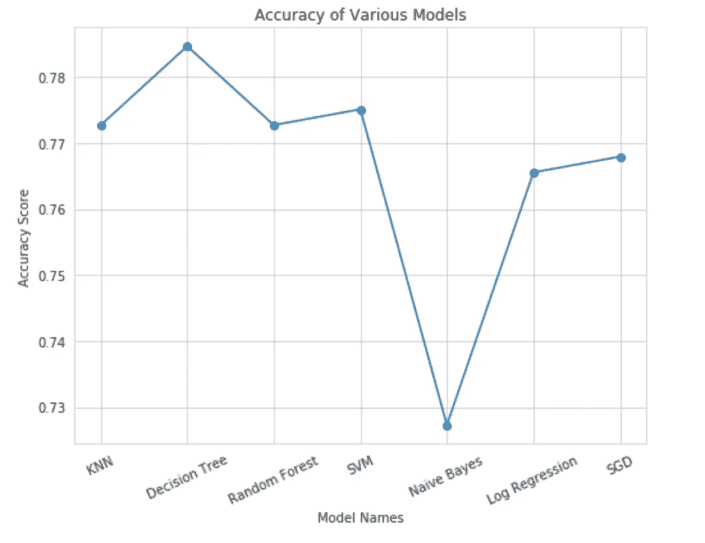

Image by Author

显然，**决策树**似乎给了我们最好的准确性。我们需要注意的是，这是我们在没有任何超参数调整或交叉验证的情况下直接应用模型时的情况。当我们采取额外的步骤时，我们的准确度一定会提高。但是这个简单的应用程序是学习将模型应用于分类问题的好方法！

这标志着我们的**泰坦尼克号:机器从灾难中学习**项目的结束！

*你可以在我的 GitHub 上查看所有步骤的完整代码——清理数据、预处理、标准化和应用模型:*

[](https://github.com/eshitagoel/Titanic_Survival/blob/master/Titanic%20Survival.ipynb) [## eshitagoel/泰坦尼克号 _ 生存

### 预测泰坦尼克号上乘客的生还几率

github.com](https://github.com/eshitagoel/Titanic_Survival/blob/master/Titanic%20Survival.ipynb)