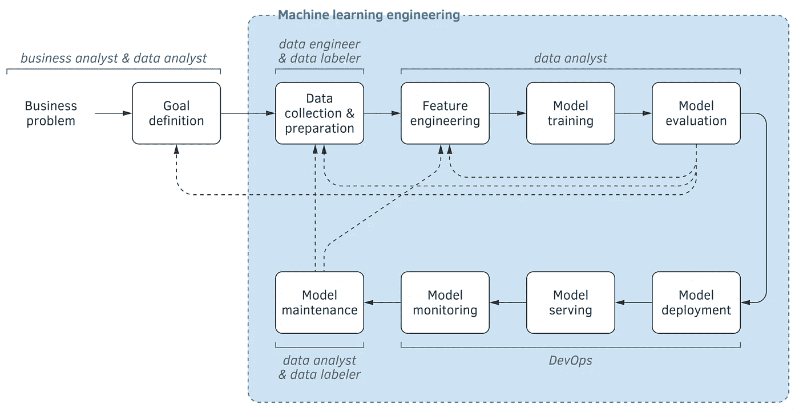
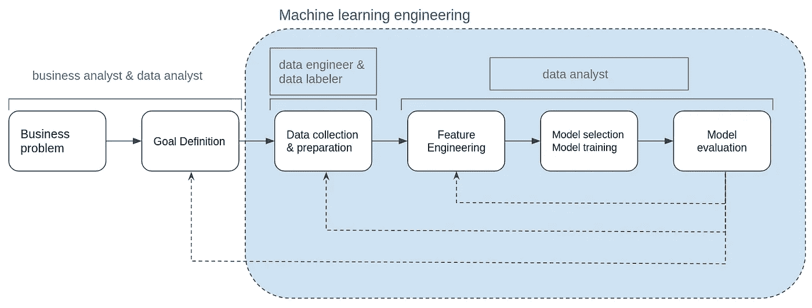
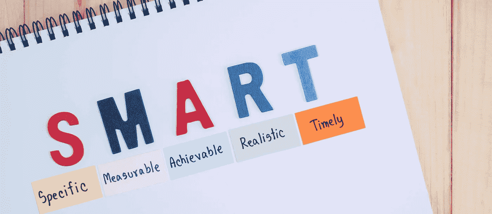

# 应用人工智能转型行动手册

> 原文：<https://medium.com/geekculture/applying-ai-transformation-playbook-cfeaf206572d?source=collection_archive---------51----------------------->

## 我们如何在最初不知道的情况下应用吴恩达提出的人工智能转型剧本。

“AI is the new electricity!” by Andrew Ng

就在一年多前，我的一个朋友向他的一个开公司的朋友提议，做一个试点项目来证明他在数据科学方面的知识。之后，我的朋友告诉我，如果我想在这一个工作，我说是的！

> 出于项目保密的原因，我不会给出技术细节。我将贡献所使用的工具以及整个过程中的经验。还有，我们是如何通过反复试验发现我们正在做一个关于 ML 的重要项目的什么被框入了**【ML 项目的工作流程】**稍后在 [**【吴恩达】**](https://www.deeplearning.ai/program/ai-for-everyone/) 中看到的《面向所有人的 AI》以及安德烈夫·布尔科夫在他的书 [**【机器学习工程】**](http://www.mlebook.com/) 中提出的架构。

我们使用 medium、TDS、kdnuggets 等网站上的不同技术资源和文章，从头开始这个项目的工作。

这个项目是成功的，但它并没有在短期内产生很高的价值，正如吴恩达在《AI for Everyone》第三周的一个视频中所说，这是可能发生的事情。

# 人工智能转型剧本

第一次见到 [AI 改造剧本](https://landing.ai/ai-transformation-playbook/)是在看《AI 为大家》的时候。在视频中，安德鲁说了以下内容:

> 任何企业都有可能遵循这个剧本，成为强大的人工智能公司…
> 
> …这些是我推荐的用人工智能改造企业的步骤…
> 
> **1。执行试点项目以获得动力**
> 
> **2。建立内部人工智能团队**
> 
> **3。提供广泛的人工智能培训**
> 
> **4。开发人工智能战略**
> 
> **5。发展内部和外部交流**

# **1。实施试点项目以获得动力**

定义一个入口点很重要，这个架构是一个很好的起点

Machine learning project life cycle by Andriy Burkov

然而，该项目仅关注顶部，我们认为这是第一阶段最重要的部分，因此如下所示:

Machine learning project life cycle, first stage

**a .业务问题**

我们定义了公司的具体问题，深入到业务分析师的皮肤中，问自己这样的问题:

*   他们有什么问题？他们想出了什么办法来解决这个问题？
*   他们完成这道题的任务花了多少时间？
*   实现任务的过程是怎样的？
*   他们有关于这个问题的数据吗？在这种情况下，这些数据是如何帮助他们的？这些数据将如何帮助我们？
*   …我们团队的一个内部问题是，一旦探索了业务问题，我们还需要哪些其他信息来源来更详细地探索问题？

**b .目标定义**

在这一点上，我们知道需要定义目标，最好的方法是使用 [SMART 标准](https://en.wikipedia.org/wiki/SMART_criteria)。用这些标准定义目标有助于我们为他们定义新产品。

之后为了 SMART 目标和新产品的工作，我们决定使用 [SCRUM](https://en.wikipedia.org/wiki/Scrum_(software_development)) 过程，我们和公司一起定义产品待办事项。我们的冲刺被分成 3 周的时间段。

**c .数据收集&数据准备**

根据产品积压，我们需要一些基础数据，所以这里我们开始了[数据工程](https://realpython.com/python-data-engineer/)过程。数据收集和数据准备所需的时间最长，因为我们实际上没有数据。接下来的最初步骤是在 3 周的冲刺中完成的，每一部分都花了一周时间。

我们开始提取数据。数据是通过 python 脚本提取的。通过独立的函数，我们获得了我们需要的基本数据。

我们必须以某种形式给出这些数据，因为提取是以未经处理的方式进行的。所以我们开始通过 python 脚本来转换数据

我们希望这些数据稍后用于实现分析过程或 EDA。所以我们需要将数据存入数据库，所以我们开始加载过程。最后，我们将数据加载到关系数据库 MySQL 中，这是从头开始构建的。

我们的刮刀每天在我们的个人电脑上工作几个小时，但是正如你所知道的，每个人都有自己的生活，我们也需要我们的电脑来做其他事情。

在此之后，我们专注于让铲运机全天候可用。更快的决定，但可能不是更好的，是将 scraper 放在我们客户的服务器上运行。

在某种程度上，我们需要监控铲运机发生了什么，它是否在有效地工作，或者它是否因为任何原因而崩溃。然后我们的机器人诞生了，链接到 slack，让我们知道是否发生了什么。

因为我们不得不从头开始构建数据，正如我之前所说的，这意味着一个定制的 ETL 管道，这花费了我们最长的项目时间。用了 3 次 sprint 和其他 sprint 的一些部分来修复正在出现的错误。在每一次冲刺中，每一个脚本都在进化，就好像它有自己的生命一样。

**d .特征工程**

在完成我们之前工作的每个 sprint 之后，我们正在应用简单的 EDA 来修正变量并获得更好的数据。

然后，我们在整个 sprint 中识别异常值、缺失值或人为错误，这样我们可以更好地修复我们的提取过程。此外，我们创建了一个**特性管道。**管道是两个脚本，它们从数据库中提取数据，并将需求数据转换成数据帧，为 ML 算法做好准备。一个脚本包含转换函数，另一个脚本包含执行转换函数的过程。

这一部分是迭代的，包含了选择、训练和评估模型。为什么会迭代？因为我们选择了一些经典的最大似然算法，当我们加入一些新的特性时，性能得到了提高。

**e .模特选拔，培训&评估**

我们在第一阶段使用了一个推荐系统，但是这个模型有缺点:

*   建议没有足够接近我们需要的方式。
*   我们需要一个包装良好的数据库，装满数据以生成建议。
*   该模型不使用内在数据，而是使用数据之间的关系

之后，我们注意到我们需要分类。我们生成了一些简单的特征，并开始选择和训练一些模型。后来我们调优了性能更好的。

因为我们的目标变量是二元的，所以可以使用几个模型来训练它。我们使用的一些模型有[逻辑回归](https://scikit-learn.org/stable/modules/generated/sklearn.linear_model.LogisticRegression.html)，[决策树分类器](https://scikit-learn.org/stable/modules/generated/sklearn.tree.DecisionTreeClassifier.html?highlight=decision%20tree%20classifier#sklearn.tree.DecisionTreeClassifier)，[随机森林分类器](https://scikit-learn.org/stable/modules/generated/sklearn.ensemble.RandomForestClassifier.html?highlight=random%20forest%20classifier#sklearn.ensemble.RandomForestClassifier)， [K 邻居分类器](https://scikit-learn.org/stable/modules/generated/sklearn.neighbors.KNeighborsClassifier.html?highlight=k%20neighbors%20classifier#sklearn.neighbors.KNeighborsClassifier)， [SVC](https://scikit-learn.org/stable/modules/generated/sklearn.svm.SVC.html?highlight=svc#sklearn.svm.SVC) ，[朴素贝叶斯](https://scikit-learn.org/stable/modules/generated/sklearn.naive_bayes.GaussianNB.html?highlight=gaussiannb#sklearn.naive_bayes.GaussianNB)， [XGB 分类器](https://machinelearningmastery.com/develop-first-xgboost-model-python-scikit-learn/)。然而，对我们来说更好的模型是决策树分类器和 XGB 分类器。

# **2。建立内部人工智能团队**

在不知情的情况下，我们创建了一个人工智能团队，在那里我们帮助解决有关数据的问题，并且我们正在用我们内部开发的工具解决新出现的问题。

我们被提供以下工作在该项目中，并与初级开发人员创建一个团队，以解决相关的数据任务，所以我们可以继续改善通过调查和解决方案的实施开发的产品。

我们正在努力。

# **3。提供广泛的人工智能培训**

完成了项目的第一阶段，我们意识到需要更多的技术培训，并能够让其他人了解我们做了什么，正在做什么和将要做什么。

作为一个团队，我们需要了解一些工具，如 Apache Airflow、Apache Spark、开发 API，并更深入地了解如何通过流程实现深度学习、部署 ML 策略以及其他知识。

# **4。开发人工智能战略**

我们设计了一个策略来改进我们从零开始创建的流程，但是正如我在前面所说的，我们需要更多的培训。

我们不是实时考虑数据，而是批量考虑数据，第二阶段使用 TensorFlow 了解气流，以提高 ETL 流程的自动化程度，并了解深度学习。

# **5。发展内部和外部交流**

在 Andrew 提出的流程部分，我们与他们合作开发了内部沟通，因为这是一个小企业，但外部流程是他们的工作。

# 结论

在过去的几个月里，我从零开始在这个 ML 项目中工作，获得了很好的实践经验。这已经被 Andrew NG 的《AI for Everyone》课程和 Andriy Burkov 的《机器学习工程》这本书固化了。

有了这些基础，我可以解决最初的 ML 问题，我已经处理并理解了这个过程是迭代的:根据结果的观察，有时它必须被重新表述