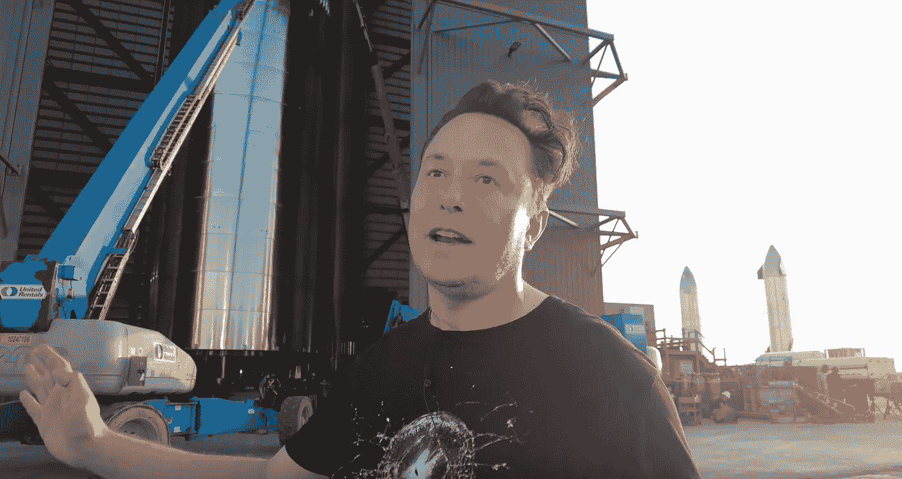

# 将 Elon Musk 的工程原理应用于软件开发

> 原文：<https://medium.com/geekculture/applying-elon-musks-engineering-principles-to-software-development-2e18acaa8d46?source=collection_archive---------6----------------------->

*五步流程及其与软件工程的关系*

Elon Musk describing his five engineering principles (screenshot from [Everyday Astronaut interview](https://youtu.be/t705r8ICkRw?t=865))

最近，我听了蒂姆·多德(Tim Dodd)对埃隆·马斯克(Elon Musk)的采访，当时埃隆带他参观了 SpaceX 的星际基地。那是[的一段 YouTube 视频](https://www.youtube.com/watch?v=t705r8ICkRw)，但我说*听了*而不是*看了*，因为我骑着自行车，手机放在口袋里。