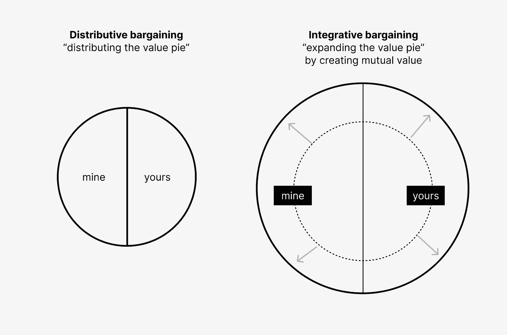
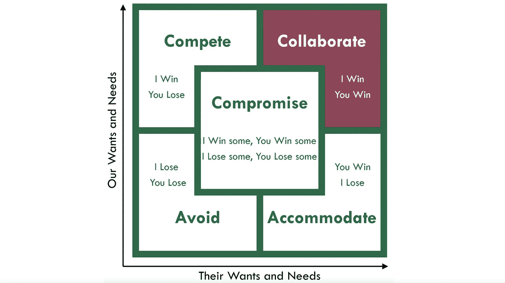
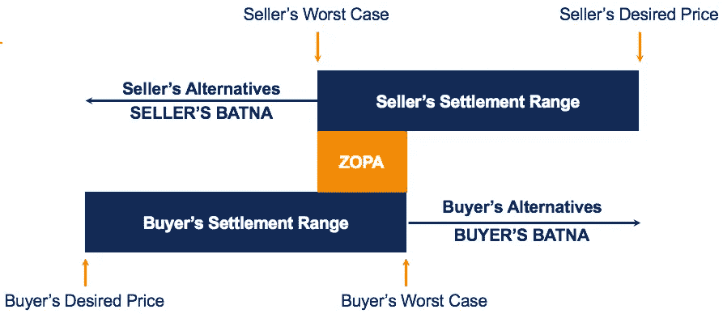
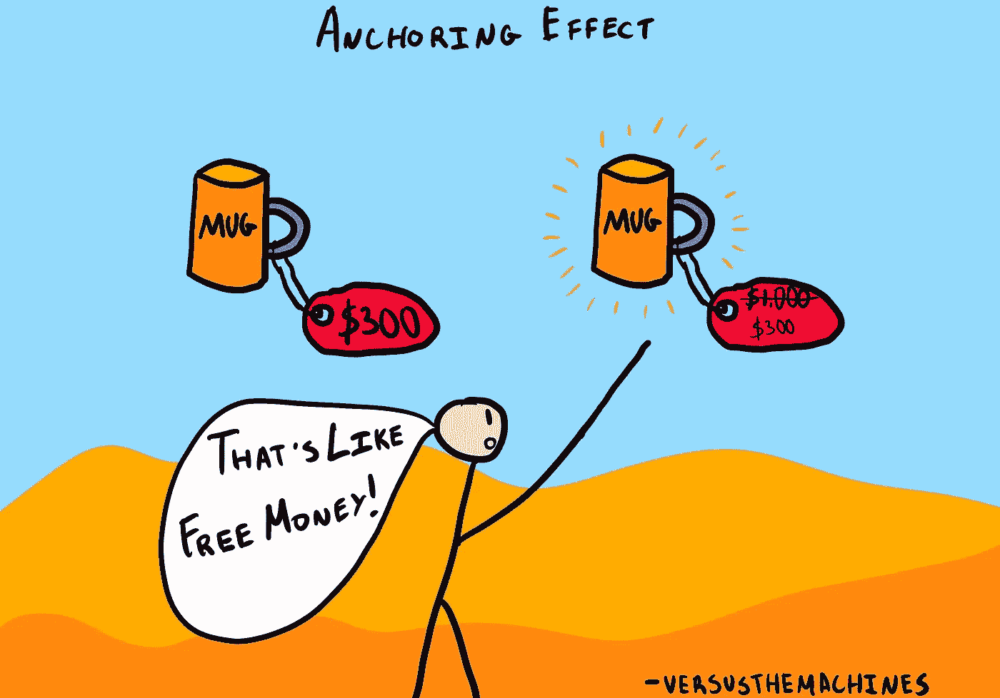

# 来自伯克利、大师班和哈佛的谈判原则

> 原文：<https://medium.com/geekculture/applying-negotiation-tips-from-harvard-berkeley-and-a-flea-market-e69bebe98dff?source=collection_archive---------6----------------------->

来自加州大学伯克利分校、律师、政治家和人质谈判专家的建议

image from [TrainingIndustry](https://trainingindustry.com/articles/sales/sales-iq-how-to-win-a-negotiation-in-a-recession/)

谈判是一项你会在工作、家庭和日常生活中用到的技能——在你人生的每个阶段。无论你是在为更高的薪水谈判，还是甚至是你的配偶哪天去学校接你的孩子，谈判在我们的生活中都扮演着重要的角色。

我在加州大学伯克利分校哈斯商学院(UC Berkeley Haas School of Business)选修了几门谈判课程，阅读了著名的[《去吧》(Getting to Yes)](https://www.amazon.com/dp/B0051SDM5Q/ref=dp-kindle-redirect?_encoding=UTF8&btkr=1)谈判书籍，参加了克里斯·沃斯(Chris Voss)的[谈判大师班](https://www.masterclass.com/classes/chris-voss-teaches-the-art-of-negotiation?campaignid=16961533333&adgroupid=136451353420&adid=593587045839&utm_term=chris%20voss%20negotiation&utm_campaign=%5BMC%5C+%7C+Search+%7C+NonBrand+%7C+Instructor_T1+%7C+USA+%7C+EN+%7C+tCPA%7CPP+%7C+BRD+%7C+US&utm_source=google&utm_medium=cpc&utm_content=593587045839&hsa_acc=9801000675&hsa_cam=16961533333&hsa_grp=136451353420&hsa_ad=593587045839&hsa_src=g&hsa_tgt=kwd-376791888949&hsa_kw=chris%20voss%20negotiation&hsa_mt=e&hsa_net=adwords&hsa_ver=3&gclid=Cj0KCQjwspKUBhCvARIsAB2IYuvOUAlvQvh9uAIxX6mwK5ubE-xY4blh8Pa506cC11spp1akArkzb4AaAgTHEALw_wcB)，然后在 Meta 和薪资谈判部门工作时将这些技巧应用于在职项目。

这些是我发现最有用的原则:

# 一般谈判原则

## 1.关注兴趣，而不是立场

Position v. interest

许多人有一种误解，认为谈判总是“从你的谈判伙伴那里获取尽可能多的东西”(分配价值)，而事实上，很多(如果不是大多数的话)谈判实际上是综合的(综合需要为双方创造共同的价值)

Integrative bargaining looks at finding mutual value first to expand the value pie before finding ways to allot it

与其关注谈判伙伴的立场，不如同情他们，理解他们的利益驱动，这样更可行，也更有效。

**一个著名的例子说明了这种差异:**

两兄弟超级饿，冰箱里只有一个橘子。他们两个同时要求。你是做什么的？

picture credit: istockphoto

*   分配交易可能是把它分成两半，分给每个人
*   在一个整合的方法中，他们可能会互相询问为什么他们想要橘子，并发现一个人想要吃里面的，而另一个人想要橘子皮来烤蛋糕。这创造了一个比半个橘子更有价值的机会。

就我个人而言，我发现在谈判前写下我认为我的谈判伙伴感兴趣的一些事情是非常有用的，然后当我向他们提问时更新这些事情。下面是[哈佛医学院的谈判工作表](https://hms.harvard.edu/sites/default/files/assets/Sites/Ombuds/files/HMS.HSDM_.HSPH%20Ombuds%20Office.Negotiation%20Preparation%20Worksheet.pdf)。

## 2.学习你的谈判风格

研究人员[肯尼斯·托马斯和拉尔夫·基尔曼](https://kilmanndiagnostics.com/overview-thomas-kilmann-conflict-mode-instrument-tki/)发现，人们自然会陷入五种谈判风格[。](https://www.shapironegotiations.com/what-are-the-5-negotiation-styles/#:~:text=From%20these%20patterns%20of%20communication,a%20conflict%20with%20multiple%20parties.)

pic credit: [CIO Office](https://cio-office.com/blog/f/five-negotiation-styles-what%E2%80%99s-your-preference)

1.  竞争风格:倾向于“我赢你输”和权力导向的谈判观。提示:尝试寻找更有创意的解决方案
2.  **协作:**喜欢谈判，喜欢创造价值。小贴士:在不失去合作精神的情况下，努力模仿自信
3.  **妥协:**寻求公平的结果。小贴士:不要匆忙行事
4.  **回避:**外交回避，躲避，容忍次优结果。小贴士:不要回避解决冲突，要更加自信
5.  **迁就:**迁就其他观点，对他人情绪状态敏感。小贴士:记住你的兴趣也很重要，设定更高的目标，试着模仿一个妥协者作为第一步

尽管在实践中，人们可能不会完全符合其中的一个或另一个，但我发现这些类别是一个有用的框架，可以了解我自己风格的优势和劣势，并帮助确定我的谈判策略。

## 3.使用战术移情来建立信任

pic credit: [Clever tap](https://clevertap.com/blog/empathy-marketing/)

合作解决冲突的方法有助于对你的谈判伙伴的动机表现出真正的兴趣。

我试图记住的一件事是注意我的语气，特别是在虚拟交流中失去了一些背景，并且由于疫情，潜在的情绪高涨。

实现这一点的一种技术是使用镜像

> 镜像就是重复你的谈判伙伴使用的关键词——克里斯·沃斯，人质谈判专家

我发现镜子不仅能显示你在集中注意力，还能帮助你记住说过的话。

## 4.理解并认可情感

**但是在日常环境中，这并不总是容易的。如果你个人在一个项目或一个个人话题上投入了大量时间，很难不产生情绪反应。**

****

**加上当前疫情、战争和虚拟通讯带来的压力，情绪已经很高了。**

**与其试图去除或忽视情绪，不如理解、处理并认可它们，这有助于将谈判引向更具建设性的方向。**

** [## 在谈判中控制自己的情绪

### 哈佛商学院助理教授艾莉森·伍德·布鲁克斯解释了情感是如何影响交易的。

hbr.org](https://hbr.org/video/4650021133001/controlling-your-emotions-during-a-negotiation) 

# 薪资谈判

## **5。确定 BATNAs、工资范围，并强化你自己的**

> “BATNA 是首字母缩略词，代表**谈判协议的最佳替代方案**。它被定义为谈判方在谈判失败并达成协议的情况下可以采取的最有利的替代方案。”— [公司金融机构](https://corporatefinanceinstitute.com/resources/knowledge/deals/what-is-batna/)

image from [slide salad](https://www.slidesalad.com/product/batna-negotiation-framework-powerpoint-template-diagram/)

本质上，如果谈判失败，这是你的 B 计划。相对于与你谈判的人来说，它的感知力量是谈判中优势的主要来源。

例如，在工资谈判中，如果谈判没有成功，你的 BATNA 可能会接受你已经得到的竞争性报价。

与此同时，招聘人员的 BATNA 将不得不寻找另一个申请人，这将花费时间和精力。如果他们已经给了你一份工作，他们可能不想这么做，因为这有谈判的空间(即使你认为你不能谈判，至少试一试也无妨)

 [## 薪资谈判准备:快速工作表

### 一想到薪水谈判就很容易紧张，但是如果你想说服…

www.ihire.com](https://www.ihire.com/resourcecenter/jobseeker/pages/salary-negotiation-prep-worksheet) 

如果你有一个竞争对手的出价比你现在的出价更高，我使用的一个技巧是透露你有另一个出价，希望它能增加你的议价能力。

## **6。ZOPA 和发明选择互惠互利**

确定你的 BATNA 也可以帮助你确定你的工资范围。这是从你的走道点(专业术语是[预约值](http://www.successfulnegotiators.com/negotiators-blog/2017/1/16/basic-negotiation-terminology-batna-reservation-value-zopa#:~:text=%22Reservation%20Value%22%20is%20the%20least,would%20be%20prepared%20to%20pay.))到你想要的金额的一个范围。

然后，寻求弄清楚招聘人员的薪资范围。四处询问或使用 [teamblind](https://www.teamblind.com/browse/Salary-Negotiation-13688) 查看该公司以往提供的服务。

这两个范围相交的地方是可能达成一致的区域(ZOPA)

How BATNA works with a ZOPA range

在这个区域，任何一方都会接受这个价格。招聘人员希望它在该范围内尽可能低，而申请人希望它在该范围内尽可能高。

如果 ZOPA 真的紧张或不一致，除了价格之外，还有其他方法让它重叠。例如，如果一家公司坚持他们不能提供足够高的工资，你可以尝试要求更多的福利、股票或 PTO。

## 7.利用锚定偏差

在开始薪资谈判时，先说一个在你工资范围高端的值可以利用锚定偏差。

> “当人们在做决策时过于依赖预先存在的信息或他们找到的第一个信息时，就会出现锚定偏差。”— [公司金融研究所](https://corporatefinanceinstitute.com/resources/knowledge/trading-investing/anchoring-bias/)

本质上，人们倾向于将还价与他们听到/看到的数字紧密联系起来。

Image from the decisionlab**