# 解决回归问题的方法

> 原文：<https://medium.com/geekculture/approach-to-solve-regression-problems-e67c6dd08537?source=collection_archive---------5----------------------->

许多数据科学家忘记考虑一些重要的事情


Photo by [h heyerlein](https://unsplash.com/@heyerlein?utm_source=medium&utm_medium=referral) on [Unsplash](https://unsplash.com?utm_source=medium&utm_medium=referral)

嗨伙计们！🌞

我希望，你们都会喜欢我的方法和我看待这个问题的小细节的方式。那么，让我们开始吧🏃

# 目录:

1.  介绍
2.  标准化和分布
3.  特征工程
4.  目标特征
5.  分类特征
6.  关系
7.  模型评估
8.  管道

首先，我想向您介绍自行车租赁的数据集。我们的目标功能是具有 13 个其他**数字**功能的租赁。相同的描述如下所述:

*   **instant** :唯一的行标识符
*   **dteday** :观察数据的日期——在这个例子中，数据是每天收集的；所以每个日期占一行。
*   **季节**:表示季节的数字编码值(1:春天，2:夏天，3:秋天，4:冬天)
*   **yr** :进行观察的研究年份(研究历时两年——0 年代表 2011 年，1 年代表 2012 年)
*   **月份**:观测的日历月份(1:1 月…12:12 月)
*   **假日**:一个二进制值，表示观察是否在公共假日进行
*   **工作日**:一周中进行观测的那一天(0:周日… 6:周六)
*   **工作日**:一个二进制值，表示这一天是否是工作日(不是周末或假日)
*   **weathersit** :表示天气状况的分类值(1:晴，2:雾/云，3:小雨/雪，4:大雨/冰雹/雪/雾)
*   **temp** :摄氏温度(归一化)
*   atemp :以摄氏度为单位的表观(“感觉上”)温度(归一化)
*   **嗡嗡声**:湿度水平(归一化)
*   **风速**:风速(归一化)
*   **租赁**:记录的自行车租赁次数。

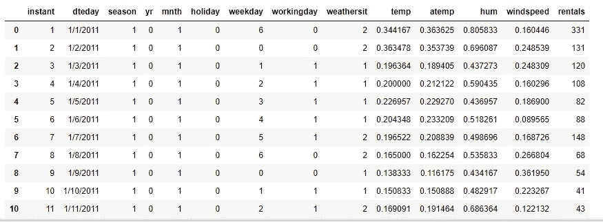

Image by [Author](https://harshkothari21.medium.com/)

> 我已经清理并预处理了数据集，因为你们大多数人都知道如何处理缺失值、应用归一化、将分类特征转换为数值以及其他预处理技术。

# 1.标准化和分布

如果仔细看数据，我已经归一化了`temp`、`atemp`、`hum`、`windspeed`等特征。标准化将防止模型出现偏差，并防止过度依赖其他功能。

现在让我们通过`Describe()`方法来探究这些特性。

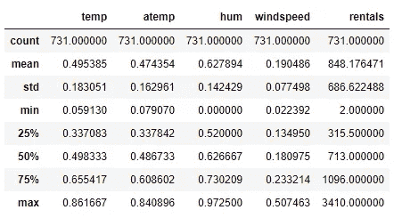

Image by [Author](https://harshkothari21.medium.com/)

*   统计数据揭示了每个数值字段中数据分布的一些信息。由此可见，日均租用次数在 848 左右；但是有一个相对较大的标准差，表明每天的租赁数量有很大的差异。通过可视化数据，我们可能会对租金值的分布有更清楚的了解。

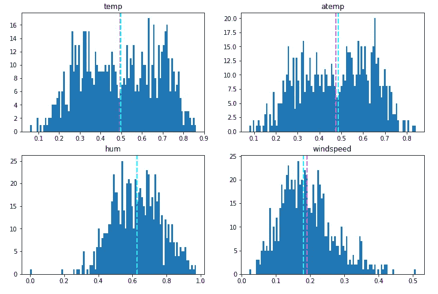

Photo by [Author](https://harshkothari21.medium.com/)

*   数字特征似乎更符合*正态*分布，平均值和中值更接近值范围的中间，与最常出现的值一致。

> **注意**:在统计意义上，分布并不是真正的*正态*，这将导致一个平滑、对称的“钟形曲线”直方图，其平均值和众数(最常见的值)位于中心；但是它们通常表明大部分的观察值接近中间值。

# 2.特征工程

例如，让我们通过从现有的 **dteday** 列中提取 day 组件，向 dataframe 添加一个名为 **day** 的新列。新列表示一个月中从 1 到 31 的某一天。

尽管如此，这个特性并没有多大用处——想知道为什么吗？

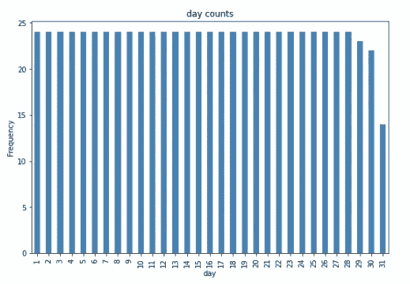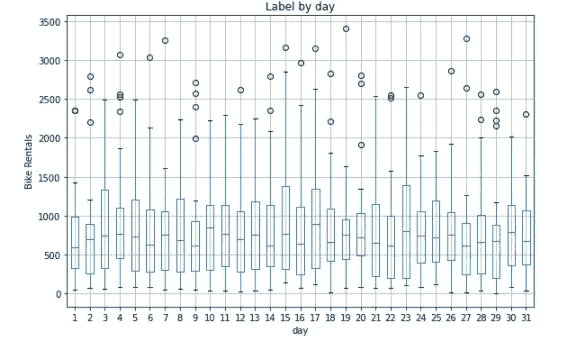

Photo by [Author](https://harshkothari21.medium.com/)

*   我们为一个月中的某一天创建的 **day** 特性显示变化很小，这表明它可能无法预测租赁数量，并且也是均匀分布的。

# 3.目标特征

*租金分布-我们来看 hist-plot 和 box plot。*

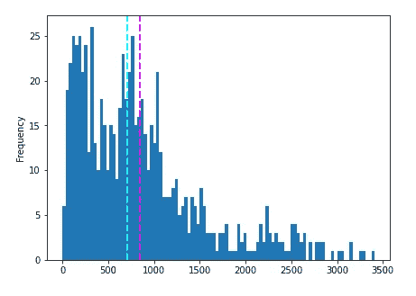

Histogram Distribution | Photo by [Author](https://harshkothari21.medium.com/)

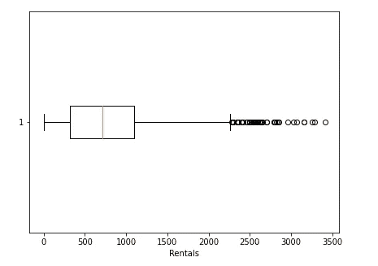

Box Plot | Photo by [Author](https://harshkothari21.medium.com/)

*   这些图显示日租金的数量范围从 0 到 3400 多一点。然而，日租金的平均数(和中位数)更接近该范围的低端，大多数数据在 0 到 2，200 次租赁之间。高于这个值的几个值在方框图中显示为小圆圈，表明它们是*异常值*——换句话说，超出大多数数据的典型范围的异常高值或低值。

# 4.分类特征

我们已经研究了数据集中数值的分布，但是分类特征呢？这些不是连续的数字，所以我们不能使用直方图，但我们可以绘制一个条形图，显示每个类别的每个离散值的计数。

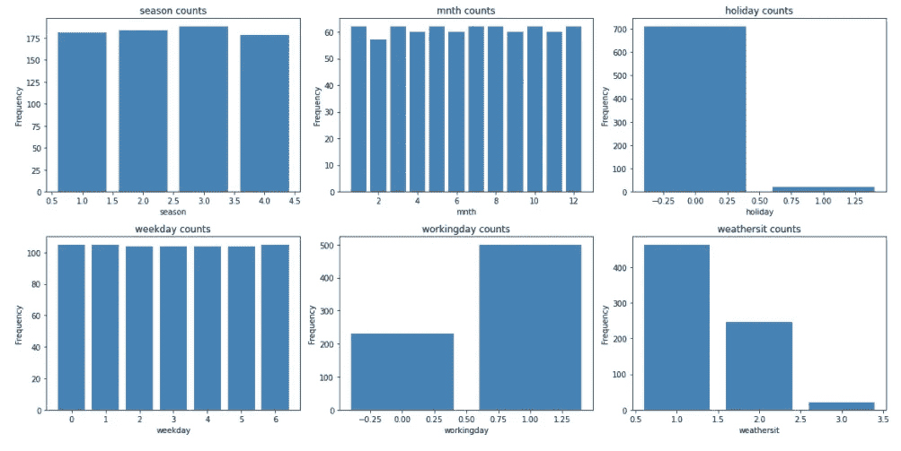

Photo by [Author](https://harshkothari21.medium.com/)

许多分类特征显示出或多或少的均匀分布(意味着每个类别的行数大致相同)。例外情况包括:

*   假日:假日比非假日要少得多。
*   **工作日**:工作日比非工作日多。
*   天气状况:大部分日子都是第一类*第一类*(晴)，第二类*第二类*(雾和云)最常见。第三类*(小雨或小雪)天气相对较少，根本没有第四类*(大雨、冰雹或大雾)天气。**

# **5.审视人际关系**

**现在我们已经了解了列中数据的分布情况，我们可以开始寻找特性和我们希望能够预测的**租赁**标签之间的关系。**

**对于数字要素，我们可以创建散点图来显示要素和标注值的交集。我们还可以计算*相关性*统计量来量化这种明显的关系。**

**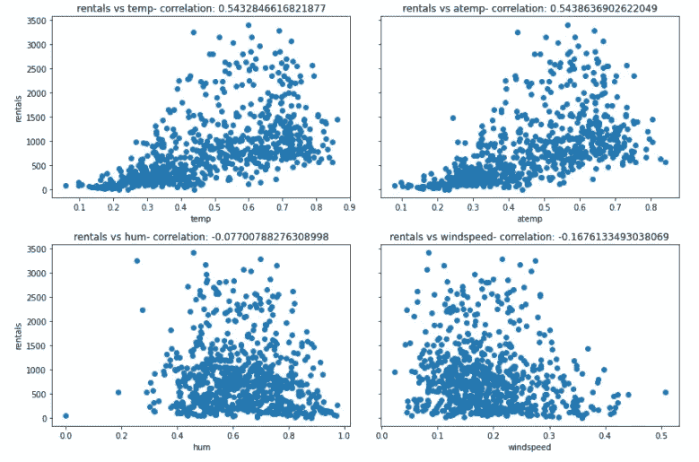**

**Photo by [Author](https://harshkothari21.medium.com/)**

**结果并不是决定性的，但是如果你仔细观察 **temp** 和 **atemp** 的散点图，你可以看到一个模糊的对角线趋势，表明较高的租赁数量往往与较高的温度相一致；这两个特征的相关值刚好超过 0.5 支持了这一观察。相反，**嗡嗡声**和**风速**的曲线图显示出轻微的负相关性，表明在高湿度或高风速的日子里租赁较少。**

## **现在让我们将分类特征与标签进行比较。**

**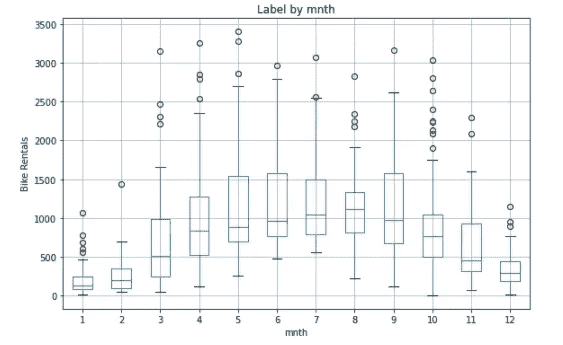****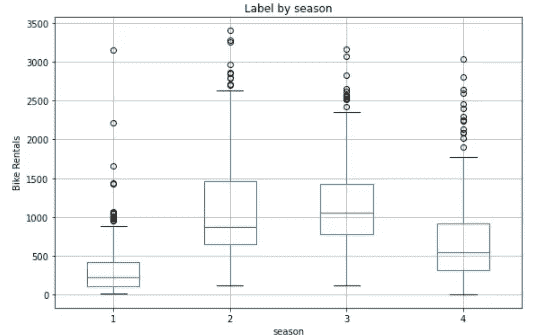**

**Photo by [Author](https://harshkothari21.medium.com/)**

*   **有一个明显的趋势显示，与春季和冬季相比，夏季和秋季的租金分布有所不同。**

**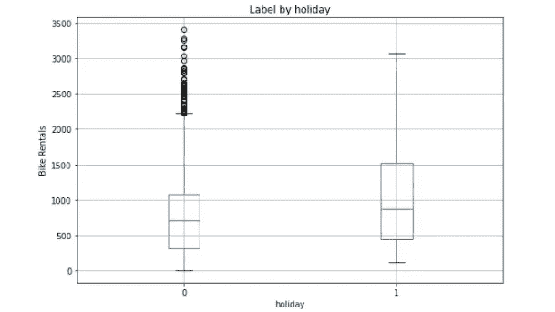****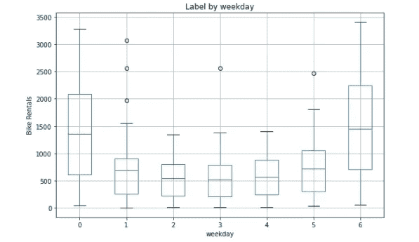**

**Photo by [Author](https://harshkothari21.medium.com/)**

*   **周末(**工作日** 0 和 6)和工作日(**工作日** 1 至 5)的租金分布有明显的不同。**

****

**Photo by [Author](https://harshkothari21.medium.com/)**

*   **同样，工作日类别也有明显的差异。**

# **6.模型评估**

**尝试不同的回归模型，对于模型评估，您可以使用 RMSE(均方根误差)、R2 等。使用**超参数** **调整**以获得更好的结果。**

> ****注**:您可以在 [Scikit-Learn 文档](https://scikit-learn.org/stable/modules/model_evaluation.html#regression-metrics)中找到更多关于评估回归模型的这些和其他指标的信息**

*   **对于这个示例，将每个预测与其对应的“基本事实”实际值进行比较并不是确定模型预测效果的非常有效的方法。让我们看看是否可以通过可视化散点图来比较预测和实际标签，从而获得更好的指示。**

## **一.线性回归**

```
****RMSE: 449.4135728595166
R2: 0.6040454736919189****
```

**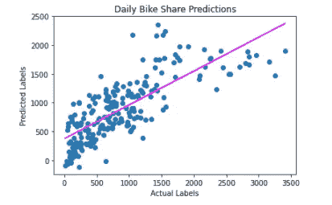**

**Photo by [Author](https://harshkothari21.medium.com/)**

## **二。套索回归**

```
**RMSE: 448.5038527519959
R2: 0.605646863782449**
```

**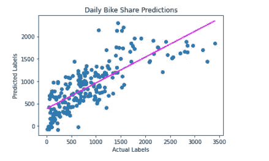**

**Photo by [Author](https://harshkothari21.medium.com/)**

## **三。决策图表**

```
**RMSE: 490.7097271948421
R2: 0.5279344839454737**
```

**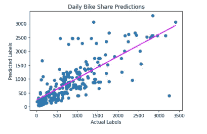**

**Photo by [Author](https://harshkothari21.medium.com/)**

## **四。随机森林**

```
**RMSE: 329.46670935564396
R2: 0.7871978460868888**
```

**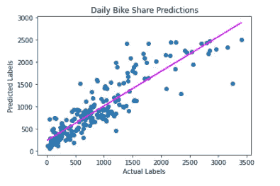**

**Photo by [Author](https://harshkothari21.medium.com/)**

> **F 还是好办法，让我们也试试一个*助推*集成算法。**

## **动词 （verb 的缩写）梯度推进**

```
**RMSE: 322.4734419735391
R2: 0.7961358554502365**
```

**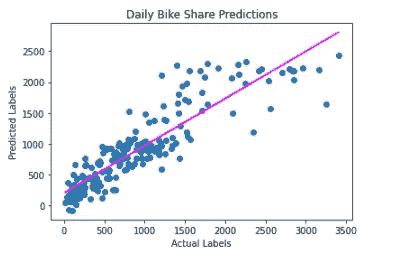**

**Photo by [Author](https://harshkothari21.medium.com/)**

# **7.管道**

**现在您已经知道使用哪种型号了！您可以使用管道封装所有预处理步骤以及回归算法。相同的示例代码如下所示:**

```
**from sklearn.compose import ColumnTransformer
from sklearn.pipeline import Pipeline
from sklearn.impute import SimpleImputer
from sklearn.preprocessing import StandardScaler, OneHotEncoder
from sklearn.linear_model import LinearRegression
import numpy as np**# Define preprocessing for numeric columns (scale them)**
numeric_features = [6,7,8,9]
numeric_transformer = Pipeline(steps=[
 (‘scaler’, StandardScaler())])**# Define preprocessing for categorical features (encode them)**
categorical_features = [0,1,2,3,4,5]
categorical_transformer = Pipeline(steps=[
 (‘onehot’, OneHotEncoder(handle_unknown=’ignore’))])**# Combine preprocessing steps**
preprocessor = ColumnTransformer(
 transformers=[
 (‘num’, numeric_transformer, numeric_features),
 (‘cat’, categorical_transformer, categorical_features)])**# Create preprocessing and training pipeline**
pipeline = Pipeline(steps=[(‘preprocessor’, preprocessor),
 (‘regressor’, GradientBoostingRegressor())])**# fit the pipeline to train model on the training set**
model = pipeline.fit(X_train, (y_train))**
```

**👉感谢你阅读这个故事，❤.**