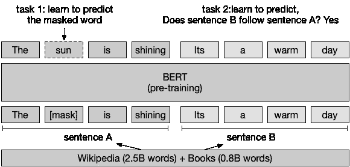
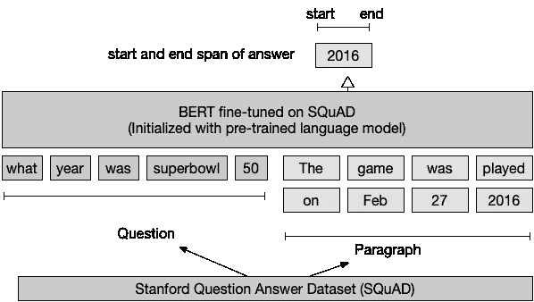
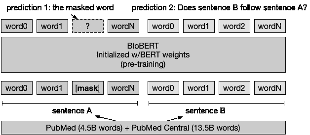
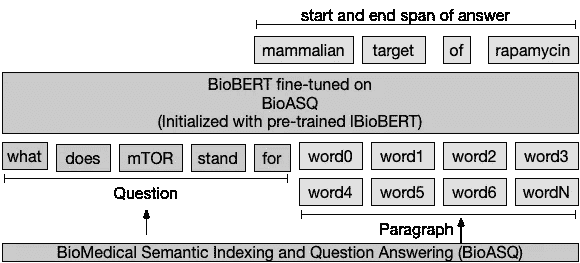
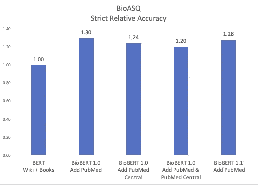
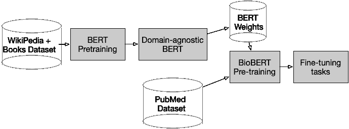
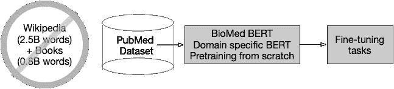

# 基于 BERT 的生物医学文本挖掘方法

> 原文：<https://medium.com/geekculture/approaches-to-biomedical-text-mining-dca3408397b0?source=collection_archive---------24----------------------->

我强调了降低进入生物医学文本处理的门槛和加快这个影响人类的极其重要的领域的进展的方法。

# 聚焦挑战

医学文档已经增长到这样的程度，即搜索引擎和生物医学研究文章的存储库 PubMed 每天增加 4，000 篇新论文，每年超过 100 万篇。用于挖掘这种数据雪崩的有监督的深度学习方法一直无法跟上，主要是因为医疗领域中标记训练数据的缺乏。

强调快速理解医学文本的需要的另一个数据点是疫情六个月内发表的 30，000 篇新冠肺炎文章(见下文)。

# 使用 BERT 的统一解决方案

BERT(来自变压器的双向编码器表示)是一种基于神经网络的语言模型，它为利用来自未标记文本的训练和转移学习(来自有限小的已标记文本)提供了统一的基础，以支持广泛的文本应用，如每个单词的实体标记、回答问题和提取关系。

# BERT 的优势

BERT 包括预训练步骤和微调步骤。

## (1)预训练步骤建立通用语言模型。

BERT 通过从左到右和从右到左的方式(双向)学习单词的上下文来建立语言模型。简而言之，它在训练过程中的工作方式是，所有单词的 15%在序列中被随机屏蔽(屏蔽)。训练过程使用标准的误差反向传播方法来预测被屏蔽的单词。BERT 还通过预测前一个句子之后的下一个句子是实际的*下一个*句子还是随机的句子来学习两个句子之间的关系。具体来说，当为每个训练样本选择两个句子 A 和 B 时，50%的情况下，B 是 A 后面的实际下一个句子，50%的情况下，它是文本中的随机句子。注意，两种情况下都不需要昂贵的标签。

BERT learns the masked word (“sun”) and Sentence B follows Sentence A

## (2)在用未标记数据进行预训练之后，用标记数据进行微调的步骤。

我强调下面几个微调任务中的一个，回答问题。微调受监督的下游任务的优势在于，只需用相对较小的带标签数据集学习几个附加参数。

伯特(在班上微调)学习两个额外的向量，标记答案跨度的开始和结束。它们是区分答案(来自段落)的开始标记分类器和结束标记分类器。

BERT fine-tuning on SQuAD learns the start and end vector that spans the answer

## 在生物医学领域的应用

一般文本领域(维基百科和大量书籍)中的单词分布和上下文与生物医学领域(PubMed)非常不同，因此需要进行微调或调整(然而，架构保持不变)。医学文献中医学术语占优势；生物医学研究者容易理解的专有名词(例如，BRCA1，c.248T>C)和术语(例如，转录、抗微生物)。

# 预训练生物机器人

步骤 1，用来自 BERT(迁移学习)的权重初始化 BioBERT。

第二步，对生物医学领域文本(PubMed 文摘和 PebMed 中心全文文章)进行预训练。

# 针对特定任务微调 BioBert

为了显示这种方法在生物医学文本挖掘中的有效性，BioBERT 在三个流行的生物医学文本挖掘任务(命名实体识别、关系提取和问题回答)上进行了微调和评估。我们展示了问答系统的高层架构。

# 比较结果

请注意，BioBERT 的所有变体在医学问题/答案上的表现都优于领域不可知的 BERT，准确率提高了 20%至 30%。

# 导语，第二种方法

微软的研究人员观察到，生物医学文本明显不同于普通领域的文本(维基百科和书籍),在普通领域的文本中，生物医学术语少之又少。以前补偿缺失术语的方法，如将它们分成子词，没有什么意义，例如，淋巴瘤被分成四个子词(l、#ym、#ph 或##oma)。相比之下，将生物医学术语视为“一等公民”可以通过避免不相关的域外文本来节省建模和计算带宽(特别是，因为特定于域的数据集同样大，不需要标记)。

下面，我展示了(1)传统的两步法(2)和直接法。

The conventional two-step approach

The direct approach

为了进一步验证这种方法，微软研究院为基于 PubMed 的生物医学文本应用程序创建了 BLURB 基准，[生物医学语言理解和推理基准](https://microsoft.github.io/BLURB/)。BLURB 由六个不同微调任务中的 13 个公开可用数据集组成，即:

*   命名实体识别，
*   循证医学信息提取，
*   关系提取，
*   句子相似度，
*   文件分类，以及
*   问题回答

BLURB 的主要目标是降低进入生物医学文本处理的门槛(跳过与领域无关的处理步骤)。

# 结论

BERT 对于文本处理任务就像 ResNet 对于计算机视觉任务一样。

作为主干子网，ResNet 加快了目标检测和场景分割的创新，因为它从图像中创建了一流的学习特征。ResNet 的关键创新在于它能够通过创建一个跳过连接来学习剩余函数。

同样，BERT 的语言建模和随后的向下游任务的转移，在特定领域的文本应用中也走上了类似的快速创新之路。BERT 的自我注意层(也包括跳过连接)和自我监督的无标签学习方法构成了文本处理的主干。

# 参考

[*人工智能工具旨在驯服冠状病毒*](https://www.nature.com/articles/d41586-020-01733-7)

[*BioASQ，组织生物医学语义标引和问答挑战赛。*](http://bioasq.org/)

[*微软研究博客:面向生物医学自然语言处理的特定领域语言模型预处理*](https://www.microsoft.com/en-us/research/blog/domain-specific-language-model-pretraining-for-biomedical-natural-language-processing/)