# APU2 固件更新

> 原文：<https://medium.com/geekculture/apu2-firmware-update-659e41b5c47a?source=collection_archive---------14----------------------->

## 来自 Mac OS X 的 APU2 固件更新演练

## 纸上的简单任务到开始时的繁琐任务


Photo by [Mor THIAM](https://unsplash.com/@alimor?utm_source=medium&utm_medium=referral) on [Unsplash](https://unsplash.com?utm_source=medium&utm_medium=referral)

# 介绍

我想发布固件更新，作为我关于在 APU2 硬件上安装 OPNSense 的文章的一部分。当我寻找固件文档时，我觉得任务不会那么容易。正如我所料，这是一项艰巨的任务。

我花了几天时间想办法升级。我积累了问题。文档中的链接已断开。下载所需文件的链接也被破坏。我找到的教程并不针对我的整个情况。

我最终编译了几个资源。有些问题对某些人来说是显而易见的。根据我的经验，我可以说达到目标的途径比目标本身更重要。当我遇到问题时，我学到的东西比直截了当时更多。

ℹ️在我的文章中，我提出了很多准备被粘贴的命令。我总是在我的命令中使用`**<placeholder>**`语法。如果您复制/粘贴它们，请替换这些项目。

# APU2 固件更新

OPNSense 安装后，我冒险更新了固件。更新固件总是有风险的，因为它可能会损坏设备。PCEngines 卖一个恢复模块，我可以把它插到你的 APU2 板上恢复一切。在写这篇文章的时候，我还没有这样一个模块，我完全没有一个安全网😃。一点风险也是乐趣的一部分。万一坏了什么，我就买个恢复模块。

为了获取安装在我的 APU2 上的固件版本，我启动它并获得如下信息。

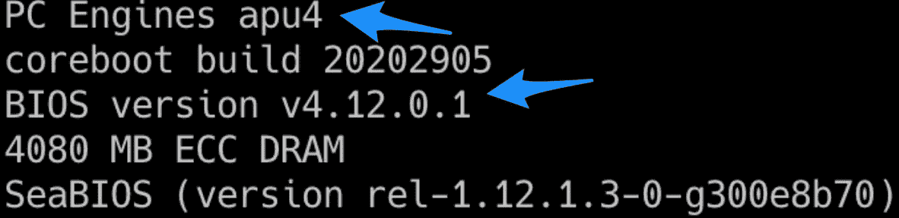

APU Firmware Version

我板上安装的版本是`apu4_4.12.0.1`。最新发布的是`apu4_4.12.0.3`(2020 年 7 月 29 日发布)。PCEngines 有一个包含所有可用下载的页面。我选择了包含所有文件(包括校验和和签名)的 zip 文件。

 [## PC 引擎— github 页面

### 描述 PC 引擎 apux 版本中的变更、修复和已知问题的发行说明。每个二进制文件(或归档文件，以防…

pcengines.github.io](https://pcengines.github.io) 

# 固件签名验证


Photo by [Cytonn Photography](https://unsplash.com/@cytonn_photography?utm_source=medium&utm_medium=referral) on [Unsplash](https://unsplash.com?utm_source=medium&utm_medium=referral)

下载后，我要验证签名。PCEngines 将软件部分委托给一家名为 [3mdeb 嵌入式系统咨询](https://3mdeb.com/)的公司。该公司的专长是固件开发。该公司维护 PCEngines 的固件，并管理 GitHub 页面。他们还在 asciinema 上发布了一段如何验证签名的屏幕记录。

[](https://asciinema.org/a/335785) [## 如何验证 PC 引擎开源固件版本 4.12.0.1 签名

### 2019-09-18 17:53:29(151 MB/s)-' apu2 _ v 4 . 10 . 0 . 0 . sha 256 . SIG '已保存[833/833]miczyg @ thanatos:/tmp $ gpg-fetch-keys…

asciinema.org](https://asciinema.org/a/335785) 

在屏幕录制中，他们用`wget`命令下载图像文件的每个部分(签名、校验和……)。然后，他们使用以下命令检索他们的 gpg 公钥:

```
❯ **gpg --fetch-keys https://raw.githubusercontent.com/3mdeb/3mdeb-secpack/master/keys/master-key/3mdeb-master-key.asc**gpg: requesting key from 'https://raw.githubusercontent.com/3mdeb/3mdeb-secpack/master/keys/master-key/3mdeb-master-key.asc'
gpg: key 4AFD81D97BD37C54: public key "3mdeb Master Key <contact@3mdeb.com>" imported
gpg: Total number processed: 1
gpg:               imported: 1❯ **gpg --fetch-keys https://raw.githubusercontent.com/3mdeb/3mdeb-secpack/master/open-source-firmware/3mdeb-open-source-firmware-master-key.asc**gpg: requesting key from 'https://raw.githubusercontent.com/3mdeb/3mdeb-secpack/master/open-source-firmware/3mdeb-open-source-firmware-master-key.asc'
gpg: key 028A752764CB97EC: public key "3mdeb Open Source Firmware Master Key <contact@3mdeb.com>" imported
gpg: Total number processed: 1
gpg:               imported: 1❯ **gpg --fetch-keys https://raw.githubusercontent.com/3mdeb/3mdeb-secpack/master/customer-keys/pcengines/release-keys/pcengines-open-source-firmware-release-4.12-key.asc**gpg: requesting key from 'https://raw.githubusercontent.com/3mdeb/3mdeb-secpack/master/customer-keys/pcengines/release-keys/pcengines-open-source-firmware-release-4.12-key.asc'
gpg: key 2AE058A9E9849FA4: public key "PC Engines Open Source Firmware Release 4.12 Signing Key" imported
gpg: Total number processed: 1
gpg:               imported: 1
```

他们列出导入的密钥作为验证。

```
❯ **gpg --list-sigs "3mdeb Master Key" "3mdeb Open Source Firmware 
Master Key" "PC Engines Open Source Firmware Release 4.12 Signing Key"**pub   rsa4096 2019-02-12 [SC]
      1B5785C2965D84CF85D1652B4AFD81D97BD37C54
uid           [ unknown] 3mdeb Master Key <contact@3mdeb.com>
sig 3        4AFD81D97BD37C54 2019-02-12  3mdeb Master Key...pub   rsa4096 2019-02-12 [SC]
      EA61CBADDA1C094A2540E596028A752764CB97EC
uid           [ unknown] 3mdeb Open Source Firmware Master Key ...
sig 3        028A752764CB97EC 2019-02-12  3mdeb Open Source...pub   rsa4096 2020-05-22 [SC] [expires: 2021-05-22]
      A5B64D59EFDD7BAB8BABD60B2AE058A9E9849FA4
uid           [ unknown] PC Engines Open Source Firmware...
sig 3        2AE058A9E9849FA4 2020-05-22  PC Engines Open...
sub   rsa4096 2020-05-22 [E] [expires: 2021-05-22]
sig          2AE058A9E9849FA4 2020-05-22  PC Engines Open...
```

之后，他们验证 SHA256 校验和以及签名是否正确。

```
❯ **sha256sum -c apu4_v4.12.0.3.SHA256**apu4_v4.12.0.3.rom: OK❯ **gpg -v --verify apu4_v4.12.0.3.SHA256.sig apu4_v4.12.0.3.SHA256**gpg: Signature made Mo  3 Aug 12:49:02 2020 CEST
gpg:                using RSA key A5B64D59EFDD7BAB8BABD60B2AE058A9E9849FA4
gpg: using pgp trust model
gpg: Good signature from "PC Engines Open Source Firmware Release 4.12 Signing Key" [unknown]
gpg: WARNING: This key is not certified with a trusted signature!
gpg:          There is no indication that the signature belongs to the owner.
Primary key fingerprint: A5B6 4D59 EFDD 7BAB 8BAB  D60B 2AE0 58A9 E984 9FA4
gpg: binary signature, digest algorithm SHA512, key algorithm rsa4096
```

签名是可以的。信任或不信任第三方公司的公钥取决于我们。这些密钥未经认证。我将继续下去，不再检查。

# SD 卡准备


Photo by [Markus Winkler](https://unsplash.com/@markuswinkler?utm_source=medium&utm_medium=referral) on [Unsplash](https://unsplash.com?utm_source=medium&utm_medium=referral)

我需要准备一个可启动的 SD 卡。我们将从这个卡启动来升级固件。首先，我需要擦除磁盘，并将其格式化为 FAT 文件系统。接下来的截图显示了格式化 SD 卡的步骤。

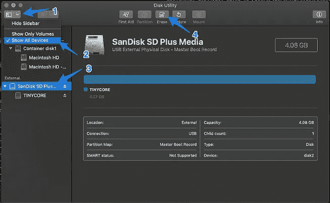

SD Card Preparation

从这一点上来说，我花了很多时间来排除故障，并试图使固件的更新。我尝试了很多不同的东西。我在接下来的部分中记录了它们。看不看这些失败就看你自己了。

当我写这篇文章的时候，PCEngines 网站上的`img`文件的链接被破坏了。我联系了他们，他们友好地修复了链接。感谢他们的快速行动(不到 24 小时)。

*   [http://pcengines.ch/file/apu2-tinycore6.4.img.gz](http://pcengines.ch/file/apu2-tinycore6.4.img.gz)

一旦我最终下载了`img`文件，我就可以用 Etcher 刷新我的 SD 卡了。

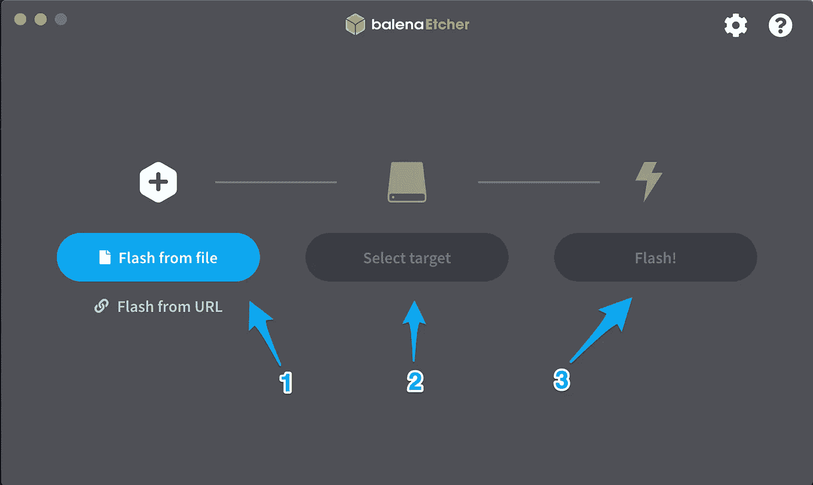

Flash SD Card

遗憾的是，当我尝试从 SD 卡启动时，才发现没有`/mnt/mmcblkp01`。我没有马上意识到问题出在哪里。所以在发现问题之前，我尝试了其他方法。你可以阅读我的第八次和第九次失败来了解更多细节。

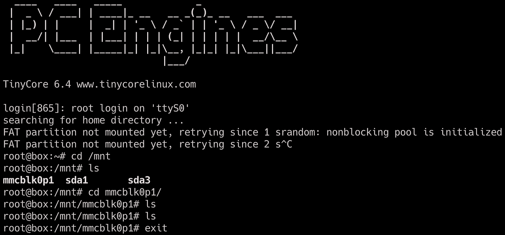

TinyCore without expected files

为什么文件不见了？又一次失败后，我回到了这个尝试。我意识到这可能是因为不正确的“*安装*”(或者根本没有完成)。所以，我试着登上`/media/mmcblk0p1`。说实话，我是凭感觉得出这个想法的。

```
root@box: **mount /media/mmcblk0p1 /mnt/mmcblk0p1**
```

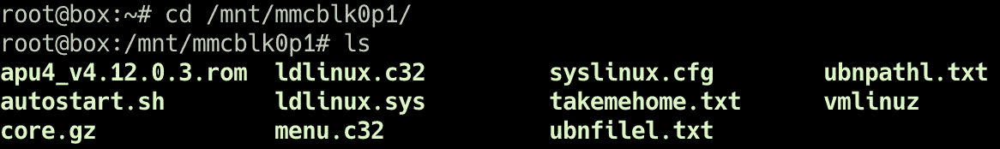

TinyCore with expected files 😊

# 固件更新


Photo by [Markus Winkler](https://unsplash.com/@markuswinkler?utm_source=medium&utm_medium=referral) on [Unsplash](https://unsplash.com?utm_source=medium&utm_medium=referral)

耶！我可以继续固件更新。SD 卡上的文件包含`apu4_v4.12.0.3.rom`，即用于刷新固件的`rom`。为此，我运行`flashrom`命令。`autostart.sh`脚本给出了运行命令。该脚本应该在 TinyCore 启动时运行。在我的例子中，包含脚本的挂载点不是预期的挂载点之一:`sd(a|b|c|d)`。

```
root@box: **flashrom -w apu4_v4.12.0.3.rom -p internal**
```


Firmware update complete

就是这样！我终于成功更新了固件。这并不容易，但我在路上学到了一些技巧。

# 失败


Photo by [chuttersnap](https://unsplash.com/@chuttersnap?utm_source=medium&utm_medium=referral) on [Unsplash](https://unsplash.com?utm_source=medium&utm_medium=referral)

描述如何安装/配置的技术文章只能提供成功的例子。很少，我发现一些文章与故障排除零件或遇到的故障。有时，人们寻求帮助的评论线程是可用的。

我决定揭露我的失败。有些人会说我不是什么都懂。我开始尝试我不喜欢的东西。这意味着我会遇到初学者的问题。通过这样做，我学到了新的东西。

# 问题从哪里开始


Photo by [Olav Ahrens Røtne](https://unsplash.com/@olav_ahrens?utm_source=medium&utm_medium=referral) on [Unsplash](https://unsplash.com?utm_source=medium&utm_medium=referral)

用一个好的用户界面格式化 SD 卡只是时间问题。您必须找到合适的按钮来点击，并在字段中输入正确的值。问题是从这一点开始的步骤。如何将 SD 卡设置为具有正确文件的引导驱动器。

为了准备启动驱动器，我需要下载两件东西。

 [## PC Engines GmbH - FAQ，HowTo 等。...

### 此网页包含了对常见问题和人们遇到的问题的回答。建议…

pcengines.ch](https://pcengines.ch/howto.htm#TinyCoreLinux) 

*   tiny core OS(PC engines 自己打包。APU2 硬件的配置已经完成。它支持串行控制台)
*   Syslinux 使引导驱动器准备好引导

我试着下载了 apu2-tinycore6.4.img.gz 的[和](http://pcengines.ch/file/apu2-tinycore6.4.img.gz)，但是链接断了。我得到了一个 404(我通知了 PCEngines 支持)。因此，我别无选择，只能使用 [TinyCore6.4_2017.tar.bz2](http://pcengines.ch/file/TinyCore6.4_2017.tar.bz2) 文件。哦，等等，一个压缩文件，它不是一个可以被刷新的图像文件😕。

好吧，我需要找到一个解决方案来使用这些文件，并制作一个可启动的 SD 卡。

环顾四周，我发现了一个很好的*如何*用可移动驱动器(u 盘，SD 卡)制作启动盘。这篇文章是 2013 年的旧文章，但它仍然是准确和有用的。

[](https://www.pyrosoft.co.uk/blog/2013/01/09/creating-a-bootable-usb-stick-from-osx/) [## 从 OSX 创建可启动的 u 盘

### 我在让我的 ML110 Proliant 实验室服务器从我用…创建的 USB 驱动器启动时遇到了一些问题

www.pyrosoft.co.uk](https://www.pyrosoft.co.uk/blog/2013/01/09/creating-a-bootable-usb-stick-from-osx/) 

我遵循指示。首先，我需要检索 SD 卡的名称。我用`diskutil`命令获取磁盘名。

```
❯ **diskutil list**
```

如果有其他连接的驱动器，它可能会不时变化。磁盘名称出现在不同的位置，如下图所示。

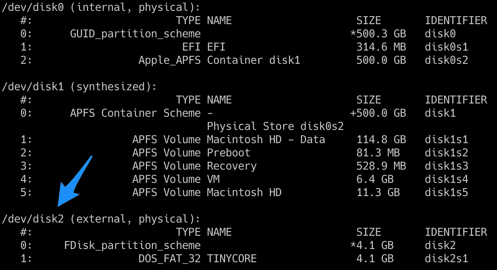

SD Card Disk Name

现在，我需要卸载磁盘。我再次使用了`diskutil`命令。

```
❯ **diskutil unmountDisk /dev/<disk>**Unmount of all volumes on <disk> was successful
```

然后我们将使用`fdisk`命令激活分区。我需要提升权限来执行此命令。

```
❯ **sudo fdisk -e /dev/<disk>**
p
f 1
w
p
q
```

此操作使操作系统再次挂载磁盘。我需要用`diskutil`命令再次卸载它。

```
❯ **diskutil unmountDisk /dev/<disk>**Unmount of all volumes on <disk> was successful
```

我需要下载 syslinux 来获得`<path>/syslinux-6.03/bios/mbr/mbr.bin`文件。

*   [https://mirrors . edge . kernel . org/pub/Linux/utils/boot/sys Linux/sys Linux-6.03 . zip](https://mirrors.edge.kernel.org/pub/linux/utils/boot/syslinux/syslinux-6.03.zip)

我将文件解压到我的`Downloads`文件夹中。我双击 zip 文件将其解压缩。现在我可以把 MBR(主引导记录)安装到 SD 卡上了。为此，我使用了带有`root`权限提升的`dd`命令。

```
❯ **sudo dd conv=notrunc bs=440 count=1 if=syslinux-6.03/bios/mbr/mbr.bin of=/dev/<disk>**1+0 records in
1+0 records out
440 bytes transferred in 0.002067 secs (212884 bytes/sec)
```

此操作还会重新安装 SD 卡。驱动器仍然是空的。

从这一点上，我回到了 PCEngines 文档。该文档包含:

> 用 FAT 文件系统格式化 u 盘或 SD 卡，然后用 syslinux 使其可引导。最后将[apu2-tinycore6.4.img.gz](http://pcengines.ch/file/apu2-tinycore6.4.img.gz)或[tiny core 6.4 _ 2017 . tar . bz2](http://pcengines.ch/file/TinyCore6.4_2017.tar.bz2)**中的文件提取出来，复制到 u 盘**中。— [PCEngines / TinyCore](https://pcengines.ch/howto.htm#TinyCoreLinux)

我正在跟随 TinyCore 句子的复制部分。我可以将解压后的文件夹中的所有内容复制到 SD 卡挂载卷中。

```
❯ **cp <path>/apu_tinycore/* /Volumes/<volumeName>**
```

我必须复制`rom`文件进行固件更新。

```
❯ **cp <path>/*.rom /Volumes/<volumeName>**
```

这些最初的步骤进展顺利，但这是一系列失败的前提。我不得不重复几次上面的步骤来再次准备 SD 卡。

# 首次失败

在我准备好复制了 MBR 和 TinyCore 文件的 SD 卡后，我试图从 SD 卡启动我的 APU2。我立即得到了`Non-system disk`错误。

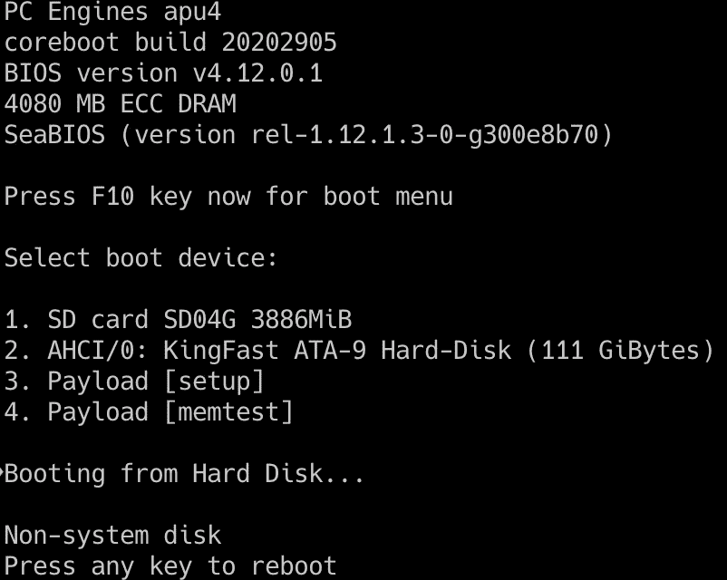

Non-System Disk Failure

我试了几次同样的动作:

1.  格式化 u 盘
2.  `diskutil unmountDisk` / `fdisk`命令
3.  `dd` syslinux 命令
4.  `cp`文件

每一次，我都以相同的结果结束，SD 卡没有被识别为启动驱动器。我不是这种低级事物的专家，我也不了解所有的事情。我不知道我是否在准备过程中错过了重要的步骤。

# 第二次失败

我回到了操作指南文档。`dd`命令之后的步骤与 PCEngines 不同。作者将磁盘映像安装到 SD 卡上。我没有磁盘映像，因为 PCEngines 上的链接已断开(等待支持人员的回答)。作者使用了一个叫做 unetbootin 的工具。

[](https://unetbootin.github.io/) [## UNetbootin

### UNetbootin 允许您为 Ubuntu 和其他 Linux 发行版创建可引导的实时 USB 驱动器，而无需刻录 CD…

unetbootin.github.io](https://unetbootin.github.io/) 

在尝试新工具之前，我想知道是否可以使用 Etcher 来创建我的可启动 SD 卡。我需要创建一个`img`或`dmg`文件。我发现 Mac OS X 上的磁盘工具应用程序可以从文件夹中创建磁盘映像。

您可以从菜单文件→新图像→文件夹中的图像创建图像…

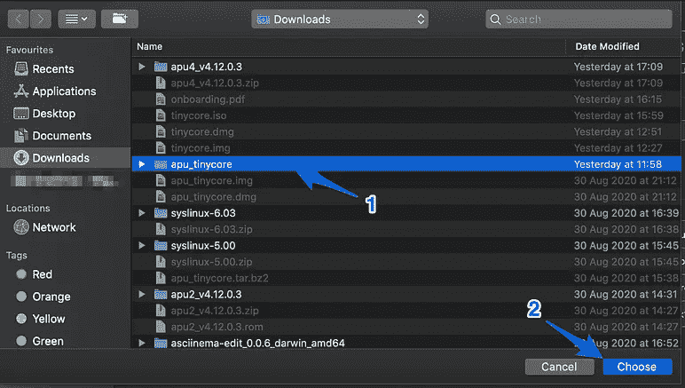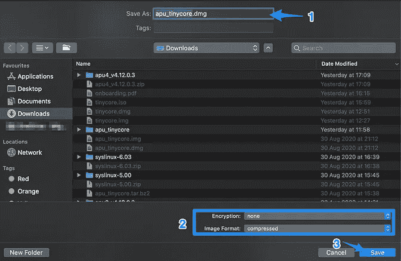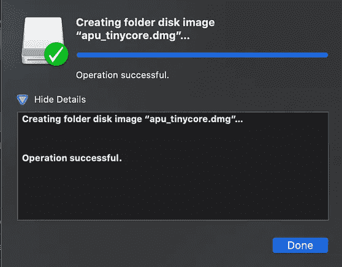

Disk Image Creation

但是等等，结果图像是一个`dmg`文件。蚀刻机负责`dmg`文件。我们可以用`dmg`闪一下 SD 卡。打开 Etcher 应用程序，选择`dmg`文件，选择 SD 卡和闪存。在闪卡之前，我使用了磁盘工具应用程序来格式化它，就像我之前做的那样。


Flash SD Card

是时候测试 APU2 中的 SD 卡了。我将卡连接到 APU2，并尝试启动。这是我的第二次失败。靴子冻僵了😕。

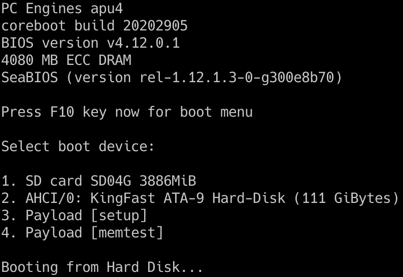

Boot Freeze

它停留在这个`Booting from Hard Disk...`上。我等了几分钟才决定关闭 APU2。

# 第三次失败

我天真地认为我的第二次失败是因为不正确的`dmg`格式。我把`dmg`文件转换成了`img`文件。为了进行转换，我使用了以下命令。

```
❯ **hdiutil convert <sourceFile>.dmg -format Rdxx -o <targetFile>.img**
```

然后，我像上次失败时一样，再次格式化并刷新了 SD 卡。一切都是绿色的，我准备做新的尝试。不幸的是，这是一个新的失败。我以和以前一样的结果结束。


Boot Freeze

同样，引导过程在`Booting from Hard Disk`仍然被阻止。我查看了 SD 卡的磁盘工具。我发现文件系统不再是 FAT32，而是 APFS。

 [## 苹果文件系统

### Apple 文件系统(APFS)是 macOS High Sierra (10.13)和更高版本、iOS 10.3 和更高版本的专有文件系统…

en.wikipedia.org](https://en.wikipedia.org/wiki/Apple_File_System) 

我认为 Etcher 使用了`dmg` / `img`文件中的信息，或者自己决定使用 APFS。事实是 APU2 不支持这个文件系统。

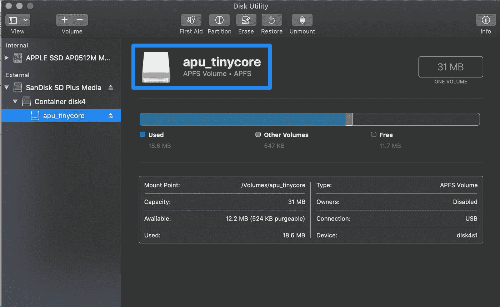

Wrong File System

# 第四次失败

我发现可以从“磁盘工具”创建空白映像。所以我试着创建了一个空的`dmg`图像。我去了菜单文件→新建图片→空白图片…

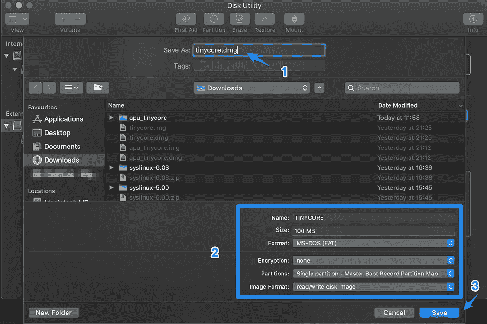

Blank Image Creation

这一次，我可以将磁盘映像格式指定为 FAT。一旦空白图像准备好了，我必须通过双击图像文件来挂载它。然后我复制了文件。

```
❯ **cp <tinyCorePath>/* /Volumes/<volumeName>**
```

然后，我像弹出任何可移动驱动器一样弹出了磁盘映像。我已经准备好使用蚀刻机来刷新 SD 卡，就像我在前两次失败中所做的那样。是时候看看结果了。这又是一个骗局。我得到了和以前一样的启动冻结的结果。


Boot Freeze

文件`dmg`又一次失败。我很沮丧。我不习惯做这样的事情。我感觉受到了挑战，这是令人兴奋的事情。我喜欢解决问题。

# 第五次失败

我还是太天真了。所以我测试了与前一个相同的过程，但是使用了一个`img`文件。我把我的`dmg`文件转换成一个`img`文件。你可以看看我第三次和第四次的失败来准备好图像。有这个命令作为提醒。

```
❯ **hdiutil convert <sourceFile>.dmg -format Rdxx -o <targetFile>.img**
```

结果又不尽如人意。我得到了同样的冷冻结果😠。


Boot Freeze

好吧，经过四次类似的尝试，我被卡住了。只有一种可能，在 u 盘上写文件并不意味着驱动器本身是可启动的。这对你们中的一些人来说可能是显而易见的，但是当你很少玩这些东西时，这就不那么容易了。

# 第六次失败

是时候测试 unetbootin 工具了。我通过自制软件安装了这个工具。

```
❯ **brew cask install unetbootin**
```

安装完成后，我试着用我在第二次失败中使用的`img`文件刷新 SD 卡。我必须输入我的密码(这需要管理员权限)，然后我可以闪存 SD 卡。

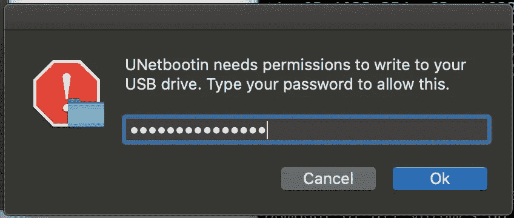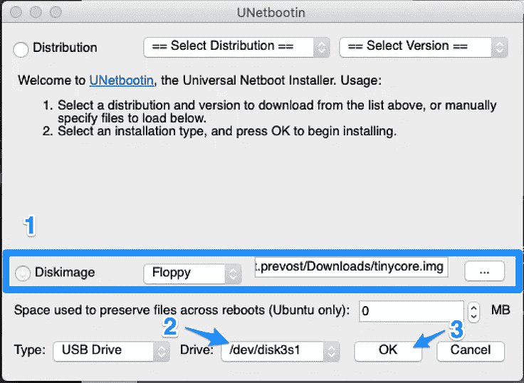

SD Card flashing by unetbootin

我像打开可移动驱动器一样打开 SD 卡，发现并不是所有预期的文件都在那里。

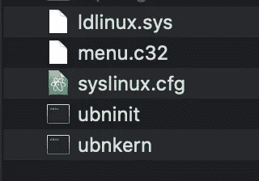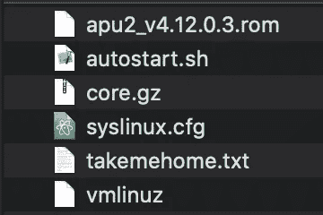

Left: Files Present, Right: Files Expected

我试图从我的 APU2 中的 SD 卡启动。它工作了，但是我发现`syslinux.cfg`不正确。因此，串行控制台没有配置，我无法在引导后在控制台上获得任何输出。

# 第七次失败

我还尝试使用我之前用 unetbootin 创建的空白`img`文件，但得到了同样的结果。我发现预期文件和 SD 卡上的文件不匹配。我没有从这个 SD 卡启动。`syslinux.cfg`的内容和我之前的失败一样。

在这种状态下，可以擦除 SD 卡卷中的所有文件并复制 TinyCore 文件。我试过了，而且成功了。这种方法的问题就像做手工一样。至少，如果我找不到其他东西，它给出了一个解决方法。

这也证实了 unetbootin 将比 Etcher 做更多的工作。它安装的东西使 SD 卡成为一个引导设备。应用程序正在小心地安装 syslinux。

# 第八次失败

在写作期间，我从 PCEngines 得到了一个答案。他们修复了断开的链接，我可以下载`img`文件了。

*   [http://pcengines.ch/file/apu2-tinycore6.4.img.gz](http://pcengines.ch/file/apu2-tinycore6.4.img.gz)

一旦下载完毕，我就可以用 Etcher 把我的 SD 卡和`img`文件一起刷新了。但是当我从 SD 卡启动时，我没有文件😕。


TinyCore without expected Files

没有`rom`档，没有`autostart.sh`。这有点奇怪。我不知道发生了什么事。我又进行了一次尝试。

# 第九次失败

在所有之前的失败之后，我从一个文件夹中创建了一个`iso`文件。它也使用`hdutil`命令。

```
❯ **hdiutil makehybrid -o <targetName>.iso <sourceFolder> -iso -joliet**
```

我使用了在 PCEngines 上找到的存档文件中的内容。

*   [http://pcengines.ch/file/TinyCore6.4_2017.tar.bz2](http://pcengines.ch/file/TinyCore6.4_2017.tar.bz2)

有了这个`iso`文件，我可以从 unetbootin 中刷新 SD 卡。在此阶段，SD 卡已准备好 MBR(准备 sd 卡的第一步)。

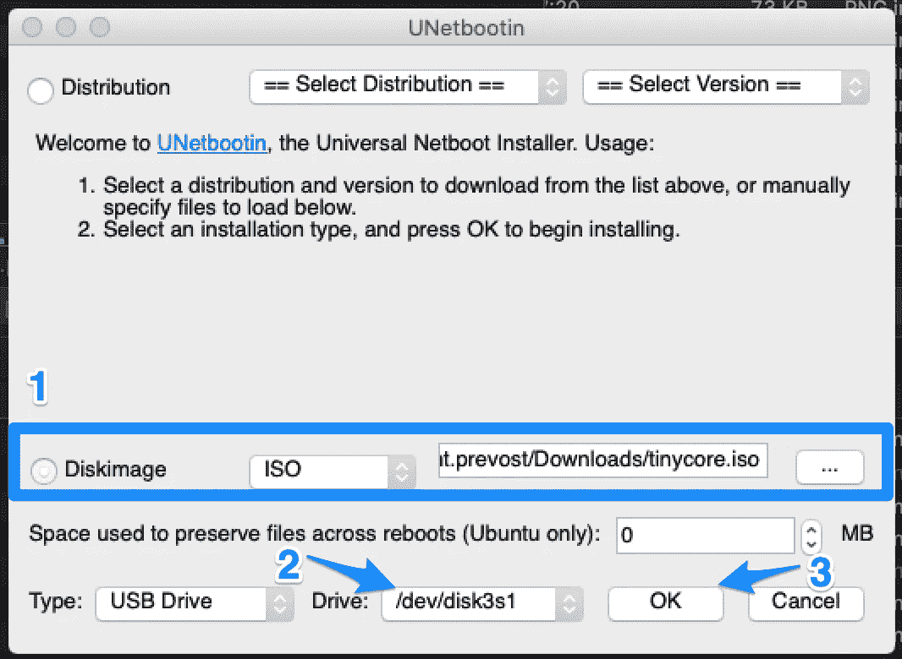

SD Card Flashing with ISO File

我将结果与 SD 卡的内容和预期结果进行了比较。

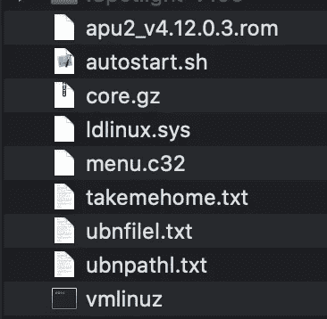

Left: Expected Files, Right: Present Files

这一次，我的文件比预期的多，有一个文件丢失了。当我试图在这种状态下启动时，我得到了以下错误。

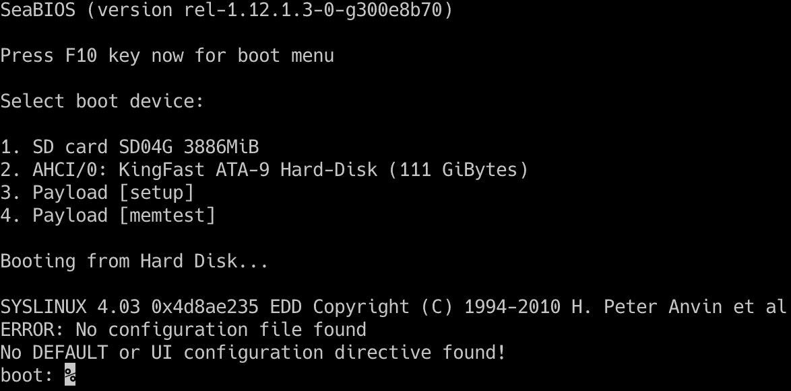

缺少的文件是`syslinux.cfg`。这可能是个问题。所以试图复制它并再次启动。

```
❯ **cp <path>/syslinux.cfg /Volumes/<volumeName>**
```

⁉️:我想不出为什么`syslinux.cfg`没有被复制，而其他文件都被复制了。这与联合国环境规划署的申请有关。应用程序的 wiki 页面给出了一些细节。我不知道如何用合适的`syslinux.cfg`文件创建图像。

[](https://github.com/unetbootin/unetbootin/wiki) [## 未脱丁/未脱丁

### 将 Linux/BSD 发行版安装到一个分区或 USB 驱动器上

github.com](https://github.com/unetbootin/unetbootin/wiki) 

这一次，我可以引导和进入 TinyCore。至少，我是这么想的。

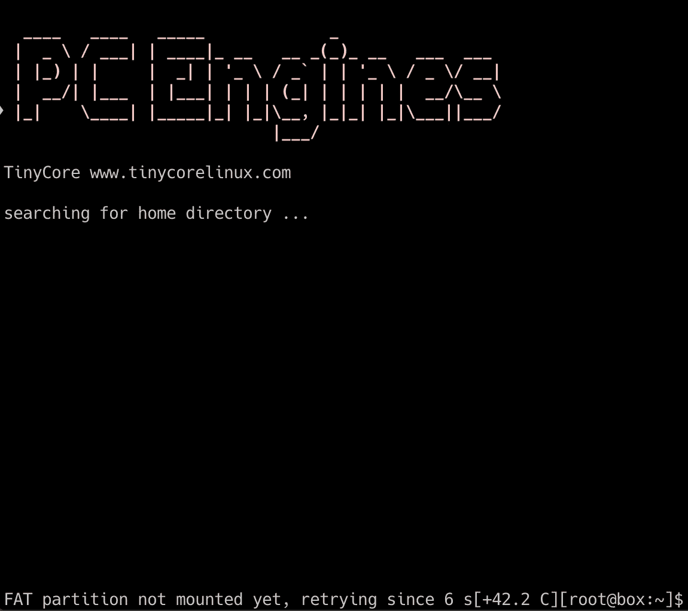

TinyCore Boot

我又遇到了一个小故障。从 SD 卡启动后立即执行的`takemehome.sh`脚本。它检查`sda`、`sdb`、`sdc`和`sdd`安装。对于找到的每个挂载，它检查文件`takemehome.txt`是否存在。如果它存在，它就`cd`到这个挂载并执行`autostart.sh`向你显示一个友好的消息。

在 Mac OS X 上刷新 SD 卡并使用 unetbootin 对从卡启动 APU2 有副作用。我发现包含`rom`和`takemehome.txt`的挂载有不同的名字。对我来说，名字是`mmcblk0p1`。命名不同，脚本找不到有效的权限。我没有观察到真正的影响，我忽略了这个问题。

我可以试试 flash 命令来更新固件。

```
root@box: **flashrom -w apu4_v4.12.0.3.rom -p interna**
```

但是我得到了下面的错误。

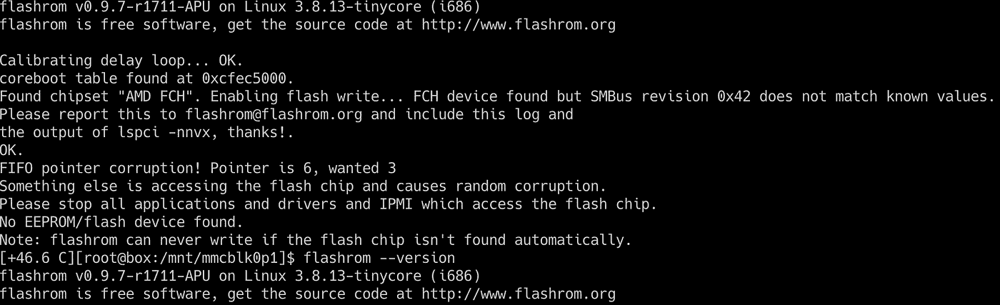

Hardware Version Mismatch

在网上搜索之后，我发现了一篇文章，这篇文章给了我一些启发。

[](http://pcengines.spruz.com/forums/?page=post&id=FCB33AC7-A937-43B9-8F4E-38D5FBD9D4D1&fid=DF5ACB70-99C4-4C61-AFA6-4C0E0DB05B2A) [## APU2 闪烁问题

### PC 引擎硬件支持论坛。

pcengines.spruz.com](http://pcengines.spruz.com/forums/?page=post&id=FCB33AC7-A937-43B9-8F4E-38D5FBD9D4D1&fid=DF5ACB70-99C4-4C61-AFA6-4C0E0DB05B2A) 

论坛上的话题提到 TinyCore 上的 flashrom 可能太老了。我想更新 TinyCore 上的 flashrom，但这并不容易，我放弃了一段时间。

然后，我回到以前失败的地方，尝试我脑海中的一个想法。您可以在固件更新的成功路径中了解更多信息。

# 结论

对于一个简单的固件更新来说，这是一个多么长的故事。这远不是一项简单的任务。我输了很多次；我做了很多尝试，但我终于成功了。我的 APU2 板安装了最新的固件版本。

以与升级相同的速度写这篇文章让我能够跟踪我的操作。下次我将不得不升级固件，这将对我有很大帮助。

# 参考

我发现了一个帖子，是关于基于 syslinux 创建可引导磁盘的参考。作者使用了一个叫做 unetbootin 的工具。我在 Mac OS X 上做所有的事情，我发现从 StackOverflow 到 blogs 都有很多关于这个端口的推荐。

[](https://www.pyrosoft.co.uk/blog/2013/01/09/creating-a-bootable-usb-stick-from-osx/) [## 从 OSX 创建可启动的 u 盘

### 我在让我的 ML110 Proliant 实验室服务器从我用…创建的 USB 驱动器启动时遇到了一些问题

www.pyrosoft.co.uk](https://www.pyrosoft.co.uk/blog/2013/01/09/creating-a-bootable-usb-stick-from-osx/) 

这篇博文也很有前途，但是我没有找到`img`文件。我不能使用 Etcher 来创建启动 SD 卡。除了开机设备部分，还有闪光部分在岗位上。还有一些我用过的有价值的命令。

[](https://www.alexander-pluhar.de/firmware-upgrade-apu2.html) [## PC 发动机 APU2 系统的固件更新

### 本指南于 2020 年 2 月 16 日发布，解释了如何更新基于 PC 引擎 APU2 平台的系统固件…

www.alexander-pluhar.de](https://www.alexander-pluhar.de/firmware-upgrade-apu2.html) 

创建可引导设备的另一个有趣的帖子。它专用于 Windows 启动设备。在本文中，我第一次遇到通过自制程序安装的 unetbootin。它也证实了我在之前的两个链接中使用的一些命令。

[](https://www.wdiaz.org/how-to-create-a-bootable-windows-usb/) [## 如何在 Mac 上创建可启动的 Windows 10 USB

### 最新版本的 Mac OS 不像以前的版本那样有从 Bootcamp 创建可引导 USB 的选项，而且…

www.wdiaz.org](https://www.wdiaz.org/how-to-create-a-bootable-windows-usb/) 

我从这个论坛话题中得到了从`dmg`文件到`img`文件的转换。一个答案(我写这篇文章时的最后一个)给了我正确的命令。

[](https://forums.macrumors.com/threads/create-a-blank-img-file.976742/) [## 创建一个空白。img 文件

### 我想创造一个空白。virtualbox 的 img 软盘映像，但我找不到创建它的程序。有没有办法…

forums.macrumors.com](https://forums.macrumors.com/threads/create-a-blank-img-file.976742/) 

在同样的趋势中，我从这篇短文中获得了创建一个`iso`文件的命令。这是我取得进步所缺少的最后一部分。

[](https://matt.berther.io/2008/12/14/creating-iso-images-from-a-folder-in-osx/) [## 从 OSX 的文件夹中创建 ISO 映像

### 然而我喜欢 OSX 的另一点是。iso 是一等公民。我能够安装/刻录 iso 文件，而无需…

马特·伯瑟·艾欧](https://matt.berther.io/2008/12/14/creating-iso-images-from-a-folder-in-osx/) 

另一篇文章交叉证实了我使用的各种命令和技术。我跳过了关于 Mac OS X 的 syslinux 的端口的部分，它确认了我使用的大多数命令。

[](https://www.oueta.com/tag/syslinux/) [## Syslinux - Oueta

### 在下面的过程中，我们将在 macOS 中创建一个 Microsoft Windows 可引导 USB 闪存驱动器，从头开始使用…

www.oueta.com](https://www.oueta.com/tag/syslinux/) 

最后，在官方的 PCEngines 页面上你可以找到操作方法。这一页假设你在任何事情上都是大师。你需要 flashing 和 OS 相关的知识。

 [## PC Engines GmbH - FAQ，HowTo 等。...

### 此网页包含了对常见问题和人们遇到的问题的回答。建议…

pcengines.ch](https://pcengines.ch/howto.htm#TinyCoreLinux)