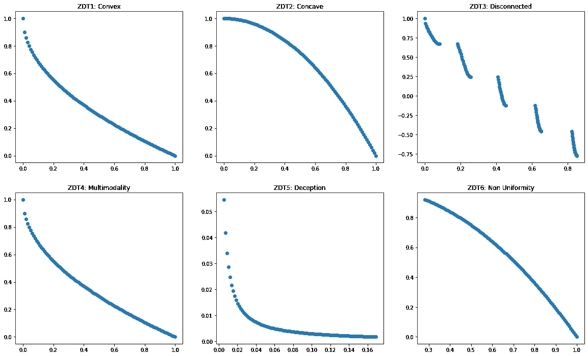
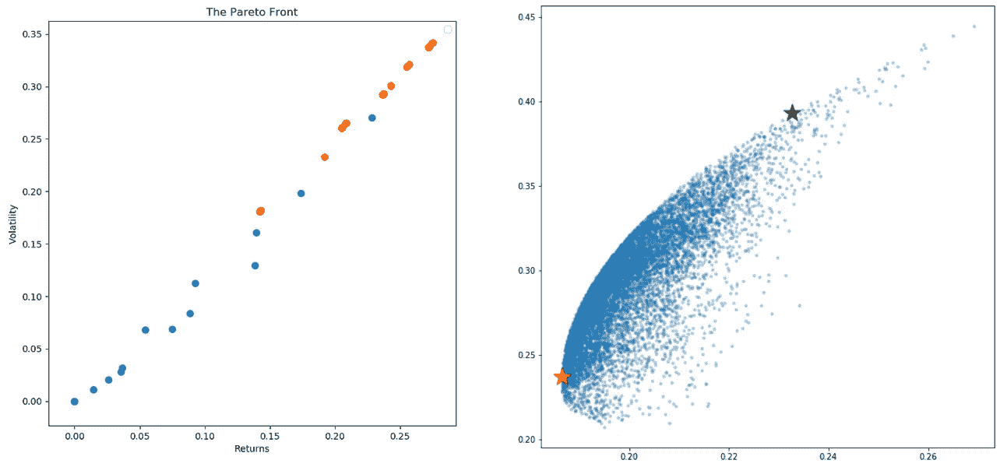
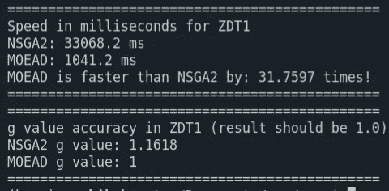

# Arc I:存在的理由

> 原文：<https://medium.com/geekculture/arc-i-raison-d%C3%AAtre-b755866f7844?source=collection_archive---------75----------------------->

这是 mlpack 下 GSoC 编码阶段第二周的结束。时间过得相当快。通过这篇文章，我想总结一下我在过去两周内的成就、失败和经验。

在开始之前，我想感谢我的导师马库斯·埃德尔、詹姆斯·巴拉穆塔和萨扬·戈斯瓦米。没有他们不懈的支持，这个项目不可能进展顺利。

Just Windows things :)

# 社区纽带

是时候见见大家并介绍我自己了。老实说，我不太擅长这种会议。谢天谢地，事情比预期的要顺利，我对导师和我的同事有了更多的了解。他们的爱好，他们的激情，他们喜欢的事情。有些人喜欢跳伞，有些人喜欢滑翔伞，有些人弹钢琴，有些人在驾驶中找到乐趣。

过去，ensmallen 图书馆广泛关注单目标问题(SOP)。这意味着，所有的回调、优化器和测试用例都是在牢记这个概念的情况下编写的。最初，计划是增加一些多目标优化器(MOO)。这很快转变为一场“革命”(我喜欢称之为:-)，以适应基于 MOO 的问题的库。因此我的项目名为“多目标优化框架”。

从头开始制作算法的一个关键部分包括彻底的测试。一个好的测试套件应该覆盖算法的长度和宽度。ZDT(齐兹勒、黛比和蒂勒)测试套件符合这一描述以及更多。它提供了无数的目标函数，专门用来测试算法克服各种困难情况的能力。编码部分不是很大的障碍，尽管我们跳过了一个测试，因为论文中的这部分对我来说是模糊的。

Fig 1\. The shapes of the Pareto Fronts of the ZDT test problems. For more info, see this [link](https://github.com/mlpack/ensmallen/pull/273).

然后注意力转移到实际应用的演示上。马库斯建议为此写一个 xeus-clish 笔记本。我们的想法是用它来平衡给定股票数据的用户的收益和波动性。同时优化相互冲突的目标是多目标进化算法(MOEA)的强项。

首先，需要一种在现场生成股票数据的方法。pandas-datareaderPython 模块被认为适合这个任务。通过几行代码，它允许用户查询 Yahoo Finance API 并输出一个 CSV 文件。下一步是在 Python 和 C++接口之间建立一个网关。输入:“Python C API”。很多人认为，Python C API 是哈迪斯在地狱无聊时出没的地方。玩笑归玩笑，在 Python C API 中调试可能会很累人，我在调试过程中遇到了这个令人捧腹的[回复](https://stackoverflow.com/q/17532371)(见第一条评论)。

> 你忘了用鸡血画五边形并点燃黑色蜡烛的步骤。当混合 C 和 Python 时，这通常对我有用

随着这一问题的解决，出现了新一轮回调的需要。它的工作是通过缓存当前的帕累托前沿来跟踪进化过程。mlpack 存储库在很大程度上依赖于模板元编程来将大部分工作推到编译阶段本身。回调利用了相同的思想，它们在这里作为模板参数传递。因为以前的回调是专门为 SOP 编写的，所以它必须从头开始构建才能在这里工作。

终于到了将我们的算法部署到现实世界的时候了，结果是…令人印象深刻。

Fig. 2: Left to right. The generated Pareto Front vs the expected Pareto Front.

失败之后，我开始怀疑我迄今为止所有工作的可信度。我写的所有代码都是错的吗？导师们确信，事实并非如此。彻底的事后分析表明，实现确实是正确的(耶！)，但人口规模太低，无法观察到任何有意义的东西。这标志着社区结合期的结束。

# 第一周

以前，人工问题集(ZDT)被合并，以测试算法对预定义挫折的鲁棒性。然而，帕累托集合(可变空间中的最终群体)形状惊人地简单。现实世界中的问题绝对没有理由会是这样的。艾尔。).这是本周的主题，寻找一种在变量空间和目标空间都表现良好的算法。

“使用分解的多目标进化算法—差分变异(MOEA/D-DE)”[1]。唷，好长的名字。这种算法有望完全符合上述标准。

这种算法的显著特点是:

A)参考方向:从目标空间中的单位单形采样的一组向量。他们引导人们走向真正的帕累托前沿。

b)分解:使用参考方向将多目标问题“分解”成标量优化问题的目标函数。

该研究论文就其相对于传统的 NSGA-II 算法的速度和准确性提出了一些大胆的主张，稍后将对此进行更多介绍。第一步是编写一些分解算法。

关于分解算法的一个有趣的见解，本质上它们将群体推向参考方向。对于 ex:加权平均分解，其目标是最小化参考方向和给定目标向量之间的点积。也就是说，最大化它们之间的相似性。这样的实现帮助我们理解算法的核心是什么。

在那个笔记上，发现基于策略的交集分解(PBI)在论文中被错误地实现。文中的参考方向在相乘之前没有归一化。检查其他著名的代码库，我的怀疑是正确的。我最后为它写了一个迷你 [*数学证明*](https://github.com/mlpack/ensmallen/pull/293#issuecomment-862655215)；D

# 第二周

本周的重点是生成这些“参考方向”。这些是进化过程的指路明灯，它允许对产生的种群的多样性进行明确的控制。群体中的均匀分布是期望的特征，因此仅期望参考方向分布是均匀的[2]。

这个问题的数学公式可以归结为一个简单的概念，“找到一种对单位单纯形进行均匀采样的方法”。向下堆栈溢出的巡视揭示了三种可行的方法:

a)贝叶斯自助
b)丹尼斯采样
c)狄利克雷采样

在所有这些中，Das-Dennis 是最难实现的。它涉及多层递归，所以堆栈限制可能会成为一个问题。值得庆幸的是，pymoo 有一个无递归的实现，优雅而简洁。

在将 MOEA/发展经济学与政策设计合并之后。Das Dennis 砝码初始化的当前拉式请求仍处于挂起状态。尽管如此，我还是冒昧地将我们的算法与 NSGA-II 进行了比较，观察到了以下情况。

我又运行了几次，但结果还是差不多。这意味着 MOEAD 不仅更准确，而且比 NSGA-II 平均快 30 倍。

大比分胜利！那是本周工作的致命一击。我们决定今天到此为止，稍微休息一下。

## 结束注释

在开始编写算法之前，我必须修改许多现有的代码。这包括编写全新的测试套件、重写回调、删除旧代码等等。我相信所有这些努力都是值得的，所有这些都使得移植代码变得更加容易。或者我应该说，它的“存在理由”已经实现了。

祝大家这周过得愉快！

## 文献学

1.  李，惠，张庆福。"具有复杂帕累托集的多目标最优化问题，MOEA/D 和 NSGA-II . "《IEEE 进化计算汇刊》13.2(2008):284–302。
2.  李，，姚昕。“什么重量适合你？在基于分解的进化多目标优化中为任何 Pareto 前沿形状调整权重。”*进化计算*28.2(2020):227–253。