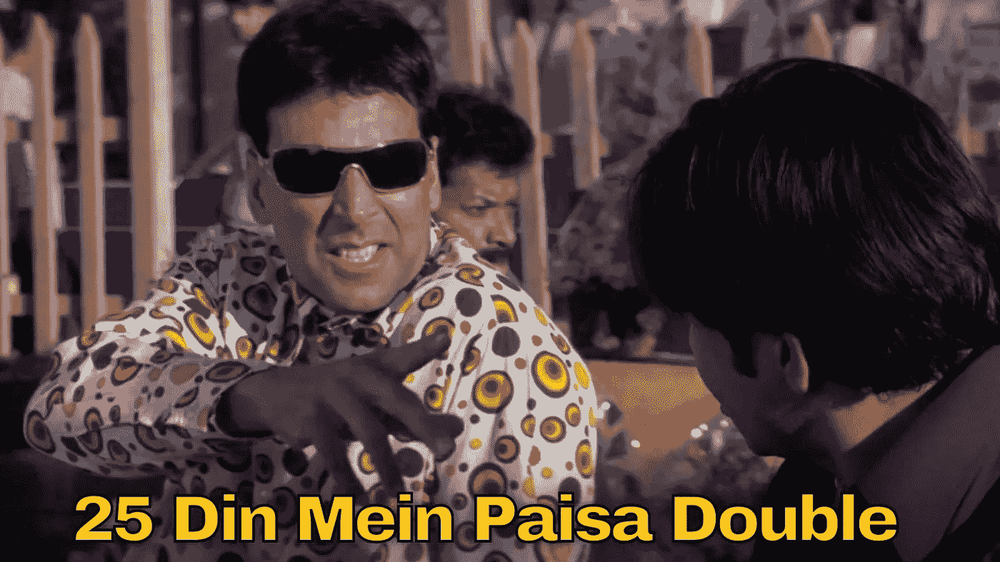
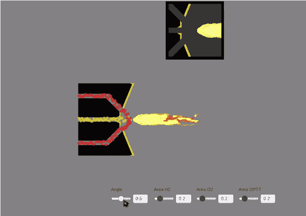

# Arc II:玛奇纳之战

> 原文：<https://medium.com/geekculture/arc-ii-deus-ex-machina-1122c2a887b9?source=collection_archive---------23----------------------->

过去的一个月发生了很多事情。作家很少有时间整理思绪。既然第一次评估已经过去了，他又有机会拿起生锈的钢笔了。首先，表示感谢。

我有幸与才华横溢的人共事:聪明有礼的马库斯·埃德尔，乐于助人的詹姆斯·j·巴拉穆塔。我很感激他们在指导我的努力。特别感谢谢赫·穆罕默德。你的工作无疑给这个项目注入了活力。

# 第 1 集:投资组合优化

读者可能还记得，在投资组合设计任务中应用多目标优化器的[尝试](/geekculture/arc-i-raison-dêtre-b755866f7844)。他们可能还记得，这是一个令人失望的结局。

我们的第一个成就是解决了笔记本的瓶颈。该算法计算帕累托前沿的时间太长。因此，为大量人口生成帕累托前沿是不可行的。结果是，目标函数一次又一次地执行昂贵的操作。为了解决这个问题，我们缓存了中间结果。瞧啊。笔记本现在运行得非常快。我们还加入了新的 MOEA/D-DE 算法，巩固了 MOEA/D-DE 比 NSGA-II 更好的观点。

Fig 1: The evolutionary process of the two algorithm for 30 generations.

出于好奇，我在这里记录了算法[之间的比较。此外，我鼓励读者在活页夹实例中运行](https://github.com/mlpack/ensmallen/issues/294)[这个笔记本](https://github.com/mlpack/examples/blob/master/portfolio_optimization/portfolio-optimization-cpp.ipynb)，以满足他们的好奇心。

# 第二集:新发布！我要双份面包

取决于你来自哪里，你要么会觉得这个标题非常滑稽，要么会觉得非常困惑。让我为后者澄清一下，ensmallen 图书馆最近见证了其贡献的激增(感谢，猜猜是谁？；)).发布新版本的时机已经成熟。mlpack 库有一个以滑稽的方式命名发布版本的传统。因此期望很高，我不打算让他们失望。

我突然想到:“还有什么比引用菲尔·赫拉·费里的一个迷因更好的方式来以最喜剧的方式留下印记呢？”，就这样。女士们，先生们，我向你们介绍，恩斯马伦图书馆最新发行的:*鼓声滚滚* " [Pachis Din me Pesa Double](https://github.com/mlpack/ensmallen/pull/308)

Fig 2: Akshay Kumar’s legendary dialogue from the movie “Phir Hera Pheri”.

不用说，每个人都笑得很开心。它也收到了很多反应(我当然为:D 感到骄傲)。你可以在这里下载最新的版本。

# 第三集:机会之窗

众所周知，核心 TensorFlow Lite C++ API 难以理解。“C++”这个术语是有误导性的。编码风格大部分是类似 C 语言的，并加入了标准库和 abseil 库。我的第一次实习包括创建一个框架，将这些“疯狂”的代码包装在一个安全易用的界面下。此外，我的任务是利用 GPU、Hexagon 等代理来提高性能。

输入:GSoC'21@TensorFlow。令我惊讶的是，TFLite 正在解决我在实习中遇到的同样的问题。他们在找人来完成姿态估计任务。我立即填写了申请表，显然，它被拒绝了。

不管怎样，我联系了组织。向[询问](https://github.com/tensorflow/tflite-support/issues/587)我是否能为那个项目出一份力。我有机会与谷歌高级软件工程师王陆讨论我的想法。我们决定了一个时间表。我们正致力于将超分辨率任务引入图书馆。在这样一个著名的图书馆工作，并得到如此有能力的人的指导，真是令人兴奋。

# 第四集:带我飞向月球！

“这不是火箭科学，吉米！”嗯，有点像。该是泄露秘密的时候了。任务？设计火箭系统的喷射器，使性能最大化，同时使热磨损最小化。

典型的火箭系统由两种液体推进剂组成，一种燃料和一种氧化剂。喷射器负责将推进剂混合成微小的液滴以备燃烧。积极的混合有利于提高性能，但可能会熔化喷油器表面，而低效的混合会导致性能不佳。看起来像是目标冲突的问题。我的蜘蛛感觉告诉我多目标优化器在这里会很有帮助。

但是等等！我们还没完呢。这个[笔记本](https://github.com/mlpack/examples/blob/master/rocket_injector_design/rocket-injector-design-cpp.ipynb)是我 GSoC 项目的标志之一。我不能让这个平凡的死去。我草拟了一些崇高的想法来进一步加强这个项目。第一，渲染 3D 交互图形，感受生成的 Pareto 前沿。詹姆斯建议使用散景来完成这项任务。第二，在 Jupyter 笔记本中模拟一个交互式火箭注射器。这些都是非常大胆的想法，我真的很感谢我的导师们给我力量并支持我的决定。

由于 bokeh 是一个 python 库，我们决定使用脚本的脚本(SoS)库。它是一个多核系统，允许在不同语言之间传递数据。这意味着我可以传递来自 c++的数据，并使用 python 渲染它，反之亦然。

我不太确定如何进行模拟部分。我试着在图书馆里搜索这个，但没有结果。幸运的是，Fauz 是这个任务的最佳人选。他对设计的东西有很深的理解，精通统一。因此，他根据规范从头开始构建了一个可视化库。与他人合作以实现共同的目标，这正是开源文化的精髓。最初是希腊语，“杀出玛奇纳”是一种文学手法，意思是一种意想不到的力量拯救了看似无望的局面。我认为它完全符合这里的背景。

Fig. 3: Visualization tool, built by [Fauz](https://medium.com/u/63b9f973a441?source=post_page-----1122c2a887b9--------------------------------)

你可以在这里找到动画[的存储库，在这里](https://github.com/FieryBlade-313/BusterinGaaz)找到演示应用[。](https://fieryblade.itch.io/busteringaaz)

# 尾声:最后一分钟的变化

按照最初的提议，接下来的任务是开发 SPEA-II 算法。它的功能与 NSGA II 非常相似，但有更好的人群控制机制。实现一个类似的算法有点无聊，所以我想出了一个改变我的提议。

我们计划进行多目标强化学习，而不是 SPEA II。在一般的强化学习任务中，代理人通过采取一些行动来最大化奖励。在多目标场景中，代理同时管理多个奖励函数！听起来令人兴奋不是吗？

请继续关注这方面的更多更新。