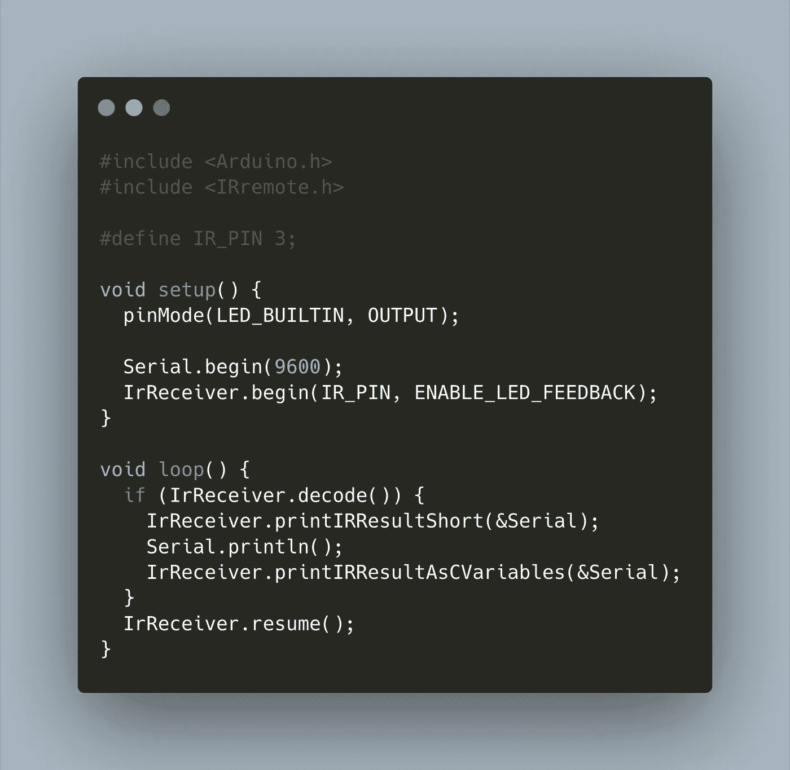

# Arduino:如何处理来自遥控器的红外信号

> 原文：<https://medium.com/geekculture/arduino-how-to-process-infrared-signals-from-a-remote-control-ee18c1c1f0ad?source=collection_archive---------5----------------------->



红外遥控器无处不在:电视、IOT 设备、玩具。有了 Arduino 和 IR 接收器，设置接收 IR 命令并处理它们以控制您的 Arduino 应用程序只需几分钟。

这篇博文向你展示了从你的一个遥控器处理任何红外命令的基本步骤。

*本文原载于我的博客*[*admantium.com*](https://admantium.com/blog/micro13_infra_red_commands/)。

# 设置

该项目的硬件要求很低:

*   Arduino Uno 或变体
*   红外遥控接收器模块
*   任何遥控器

要连接设备，请遵循以下说明。要识别正确的引脚，请参见 [Arduino 引脚布局](https://content.arduino.cc/assets/Pinout-UNOrev3_latest.pdf)。

*   将红外传感器 Y 引脚连接到任何 Arduino 模拟引脚
*   将红外传感器 R 引脚连接到 Arduino 5V 电源输出
*   将红外传感器 G 引脚连接到任何 Arduino 接地引脚

# 图书馆选择

按照我的指导，我检查了可用的库。对于一个基本的 ATmega328P Arduino Uno，最好的库是 [Arduino-IRremote](https://github.com/Arduino-IRremote/Arduino-IRremote) 。它正在开发中，有很好的文档，你可以找到有用的例子。我使用平台 IO 包管理器安装了这个库。

安装完成后，第一步是确定遥控器使用的具体协议。

# 识别协议

从[官方示例草图](https://github.com/Arduino-IRremote/Arduino-IRremote/blob/master/examples/ReceiveDump/ReceiveDump.ino)中，创建以下程序:

```
#include <Arduino.h>
#include <IRremote.h>#define IR_PIN 3;void setup() {
  pinMode(LED_BUILTIN, OUTPUT); Serial.begin(9600);   
  IrReceiver.begin(IR_PIN, ENABLE_LED_FEEDBACK);
}void loop() {
  if (IrReceiver.decode()) {  
    IrReceiver.printIRResultShort(&Serial);
    Serial.println();
    IrReceiver.printIRResultAsCVariables(&Serial);
  }
  IrReceiver.resume();
}
```

然后，上传程序，连接到串行监视器并按下遥控器上的一些键。您应该会看到如下输出:

```
Protocol=NEC Address=0x4 Command=0x11 Raw-Data=0xEE11FB04 32 bits LSB firstuint16_t address = 0x4;
uint16_t command = 0x11;
uint32_t data = 0xEE11FB04;
```

在极少数情况下，信号可能无法正确处理。在这种情况下，请尝试另一个遥控器。

# 接收和处理红外命令

当你知道了协议，就该创建真正的程序了。用以下语句开始您的源代码文件，并确保在包含头文件之前定义协议。

```
#define DECODE_NEC 1
#include <IRremote.h>int IR_RECEIVE_PIN = 11;
```

在程序的`setup()`部分，初始化`IrReceiver`事件。

```
IrReceiver.begin(IR_RECEIVE_PIN, ENABLE_LED_FEEDBACK, USE_DEFAULT_FEEDBACK_LED_PIN);
```

在`loop`部分，您等待`IrReceiver.decode()`中断发生。然后，您可以使用类型`IRData`访问接收到的数据。它的[定义](https://github.com/Arduino-IRremote/Arduino-IRremote/blob/d27b1e4e7280f7bb335dc57567e95e3881977b62/src/IRremoteInt.h)是这样的:

```
struct IRData {
    decode_type_t protocol;     ///< UNKNOWN, NEC, SONY, RC5, ...
    uint16_t address;           ///< Decoded address
    uint16_t command;           ///< Decoded command
    uint16_t extra;             ///< Used by MagiQuest and for Kaseikyo unknown vendor ID
    uint8_t numberOfBits; ///< Number of bits received for data (address + command + parity) - to determine protocol length if different length are possible (currently only Sony).
    uint8_t flags;              ///< See definitions above
    uint32_t decodedRawData;    ///< up to 32 bit decoded raw data, formerly used for send functions.
    irparams_struct *rawDataPtr; /// pointer of the raw timing data to be decoded
};
```

要打印出相关数据，请使用以下命令:

```
void loop() {
  if (IrReceiver.decode()) {
    Serial.print("COMMAND is ");
    Serial.println(IrReceiver.decodedIRData.command);
    Serial.print("ADDRESS is ");
    Serial.println(IrReceiver.decodedIRData.address);
    Serial.print("RAW DATA is ");
    Serial.println(IrReceiver.decodedIRData.decodedRawData); IrReceiver.resume();
  }
}
```

你差不多完成了。将此程序上传到您的 Arduino，然后从遥控器发送命令。程序的输出将类似于以下内容:

```
COMMAND is 18
ADDRESS is 4
RAW DATA is 3977444100
COMMAND is 64
ADDRESS is 4
RAW DATA is 3208706820
```

现在，使用这个程序测试遥控器的每个键，并记下它们的命令 ID。例如，在上面的例子中，当我按下`2`键时会识别出`COMMAND 18`，而`COMMAND 64`是向上箭头按钮。

# 定义应用程序逻辑

最后一部分很简单。在`loop()`方法中，使用`IrReceiver.decode()`检查是否收到新的 IR 命令:

```
void loop() {
   if (IrReceiver.decode()) {
    // handle cases
  }
}
```

在方法体中，定义被触发的自定义逻辑。我建议使用一个`switch`语句来确定当前按下的键，然后用一个专用的`case`语句来处理每种情况。基本结构如下。重要提示:在语句结束时，一定要调用`IrReceiver.resume()`来监听新的关键事件。

```
switch (IrReceiver.decodedIRData.command) {
    case (17): {
      // handle key 17
      break;
    }
    case (18): {
     // handle key 18
      break;
    }
    IrReceiver.resume();
}
```

在我的例子中，我检测遥控器的各种数字，并把它们打印在屏幕上。我也处理用于移动轮式车辆的方向指令。

```
void processIR() {
  switch (IrReceiver.decodedIRData.command) {
    case (17): {
      printCharOnMatrix('1');
      break;
    }
    case (18): {
      printCharOnMatrix('2');
      break;
    }
    case (19): {
      printCharOnMatrix('3');
      break;
    }
    // ....
    default : {
      printCharOnMatrix('@');
      break;
    }
  } 
    IrReceiver.resume();
}
```

# 最佳化

默认情况下，所有 IR 供应商协议——参见[完整协议列表](https://github.com/Arduino-IRremote/Arduino-IRremote/blob/master/examples/SimpleReceiver/SimpleReceiver.ino#L14)——将被编译到您的程序中。如果您知道确切的协议，只需使用如下所示的预处理程序指令:

```
#define DECODE_NEC 1#include <Arduino.h>
#include <IRemote.h>
```

对于微调，有许多由预处理器定义激活的编译选项，参见[官方文档](https://github.com/Arduino-IRremote/Arduino-IRremote#compile-options--macros-for-this-library)。

# 结论

由于出色的[Arduino-I remote](https://github.com/Arduino-IRremote/Arduino-IRremote)库，解析 IR 命令可以在几分钟内完成。本文向您展示了如何设置库并启动一个程序来采样遥控器的命令。然后，我们看到了如何为每个 IR 命令实现定制的控制逻辑。最后，我给了您一些提示，告诉您如何通过只包含所需的 IR 协议来优化整个程序。