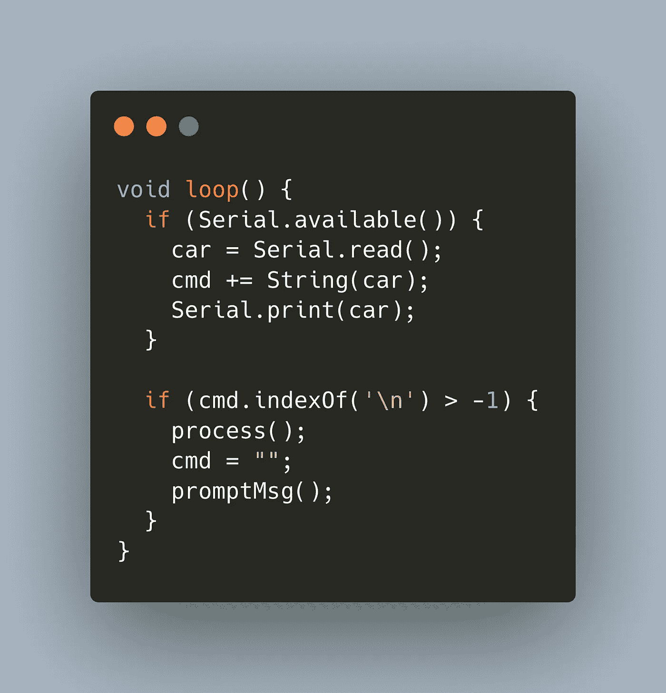

# Arduino:实现一个简单的终端提示符

> 原文：<https://medium.com/geekculture/arduino-implementing-a-simple-terminal-prompt-1ec756f99a3d?source=collection_archive---------33----------------------->



Arduinos 是嵌入式项目的优秀微控制器。在我的一个项目中，我希望有一个简单的命令提示符来触发 Arduino 上的命令，例如在 LCD 显示器上打印消息，或者移动连接有超声波传感器的伺服电机。听一个字符并把它当作一个命令是很容易的，但是如果你来自 Linux 或 Mac，你会习惯于使用丰富的 CLI 工具。

在下面的文章中，我将解释如何为您的 Arduino 构建一个简单的终端提示符。我在用[平台 IO](https://platformio.org/) IDE 写 Arduino 程序，所有代码示例都是 C++。

*本文原载于我的博客*[*admantium.com*](https://admantium.com/blog/micro10_tutorial_arduino_terminal_prompt/)。

# 终端提示基础

当 Arduino 启动时，它应该显示一个小的启动信息，然后列出所有可用的命令。命令应该提供一些关于如何操作它们的信息。然后，当我输入任何命令时，或者更具体地说，当我按下任何按钮时，我希望立即看到变化。按 enter 键终止命令，并将其发送到 Arduino 进行处理。

要启动提示，请使用以下方法:

```
void helpMsg() {
  Serial.println("\
Please select a command\n\
- LED {msg}     Print msg to LED Matrix \n\
- LOG {msg}     Log msg \n\
- EXIT          Restart the program\n");
}
```

我们定义一个多行字符串，表示为字符串文字，并打印到串行。

接下来是提示，表明用户需要输入。使用任何你喜欢的输入提示符号。

```
void promptMsg() {
  Serial.print("> ");
}
```

两种方法都在`setup()`期间被调用。

```
void setup() {
  Serial.begin(9600);
  helpMsg();
  promptMsg();
}void loop() { /* ... */ }
```

好了，第一部分完成了。让我们继续阅读输入。

# 阅读输入

Arduino 库提供了许多读取输入的方法。最常见的是`Serial.read()`，它按一个字节发送串行缓冲区，并返回一个`char`。我们需要使用这种方法，为了满足即时反馈的要求，我们不能使用任何`delay()`方法。然而，与此同时，我们还需要等待命令完成，需要等待用户按下 enter 按钮。

解决方案是在输入可用时立即读取任何输入，将该输入添加到缓冲区，并将其打印回串行。

```
String cmd;
char car;void loop() {  
  if (Serial.available()) {
    car = Serial.read();
    cmd += String(car);
    Serial.print(car);
  } if (cmd.indexOf('\n') > -1) {
    process();
    cmd = "";
    promptMsg();
  }
}
```

在这几行中，我们用`Serial.read()`读取用户输入，并将值存储在一个`Char`变量中。该字符被添加到`String` `cmd`中，并打印到屏幕上。

之后，我们检查`cmd`字符串是否包含一个新行字符，这意味着用户已经按下了 enter。如果是，我们调用方法`process()`——见下一节——然后重置`cmd`并再次显示提示。

# 指令处理

当用户按下 Enter 键时，调用`process()`功能。它调查输入的`cmd`并决定做什么。同样，我们使用来自`String`类的方法。使用`.indexOf()`我们可以确定字符串是否包含另一个子串。使用`.substring`，我们从字符串中提取部分。

在下面几行中，我们检查`cmd`是否包含任何关键字`LED`、`LOG`或`EXIT`。对于`LED`和`LOG`，我们还检查命令后是否有任何有效载荷。如果匹配，我们从索引`[4, cmd.length() -2]`中的`cmd`字符串中提取有效载荷，并进一步处理它。出于演示的目的，这里我们只打印匹配。

```
void process() {
  int index;
  if((index = cmd.indexOf("LOG")) > -1 && cmd.length() > 4) {
    String msg = cmd.substring(index + 4, cmd.length() -2);
    Serial.println("LOG >>" + msg + "<<");
  } else if((index = cmd.indexOf("LED")) > -1 && cmd.length() > 4) {
    String msg = cmd.substring(index + 4, cmd.length() -2 );
    Serial.println("LED >>" + msg + "<<");
    printStringOnMatrix(msg);
  } else if((index = cmd.indexOf("EXIT")) > -1) {
    Serial.println("Reboot ...");
  }
}
```

在所有其他情况下，什么都不会发生——对于一个小的 DIY 项目，我不关心捕捉任何输入错误。

# 完整程序

以下是完整的程序:

```
void bootupMsg() {
  Serial.println("+++ RADU MKI v0.2 Booting +++");
}void helpMsg() {
  Serial.println("\
Please select a command\n\
- LED {msg}- Print msg to LED Matrix \n\
- LOG {msg}- Log msg \n\
- EXIT - Restart the program\n");
}void promptMsg() {
  Serial.print("> ");
}void process() {
  int index;
  if((index = cmd.indexOf("LOG")) > -1) {
    String msg = cmd.substring(index + 4, cmd.length() -2);
    Serial.println("LOG >>" + msg + "<<");
  } else if((index = cmd.indexOf("LED")) > -1) {
    String msg = cmd.substring(index + 4, cmd.length() -2);
    Serial.println("LED >>" + msg + "<<");
    printStringOnMatrix(msg);
  } else if((index = cmd.indexOf("EXIT")) > -1) {
    Serial.println("Reboot ...");
    reboot();
  }
}void setup() {
  Serial.begin(9600);
  initMatrix();
  bootupMsg();
  helpMsg();
  promptMsg();
}void loop() {  
  if (Serial.available()) {
    car = Serial.read();
    cmd += String(car);
    Serial.print(car);
  } if (cmd.indexOf('\n') > -1) {
    process();
    cmd = "";
    promptMsg();
  }
}
```

# 结论

本文展示了如何在 Arduino 上实现一个简单的终端程序。有了它，你可以将 Arduino 连接到 seral 显示器，查看命令列表并开始与之交互。在我的项目中，我附加了一个 LED 点阵，任何带有`LED`前缀的输入文本都会被打印出来。另一个命令触发超声波传感器的测量。现在，你将如何在你的项目中使用终端程序？