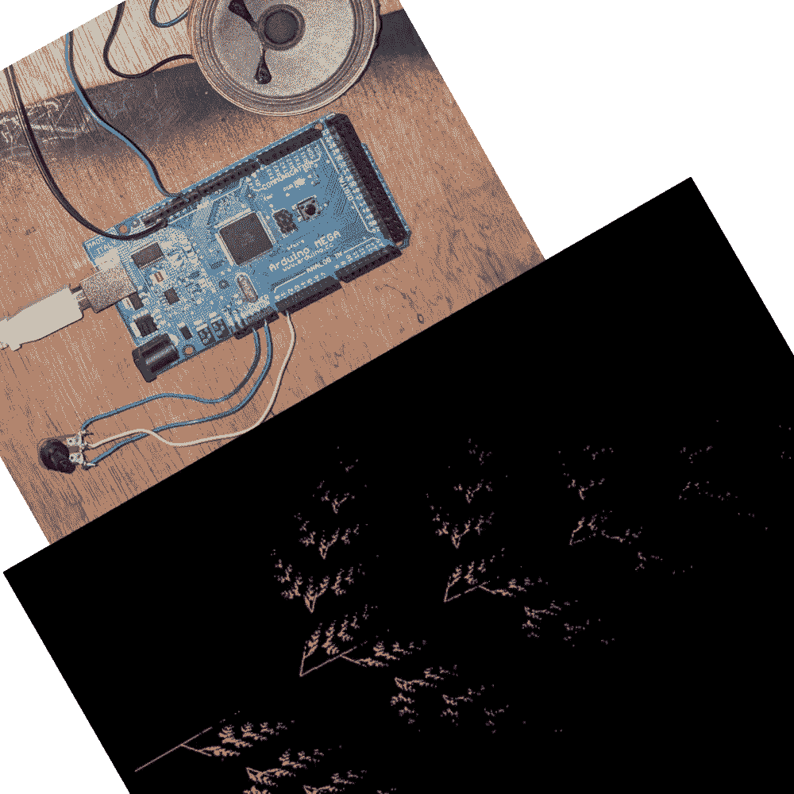
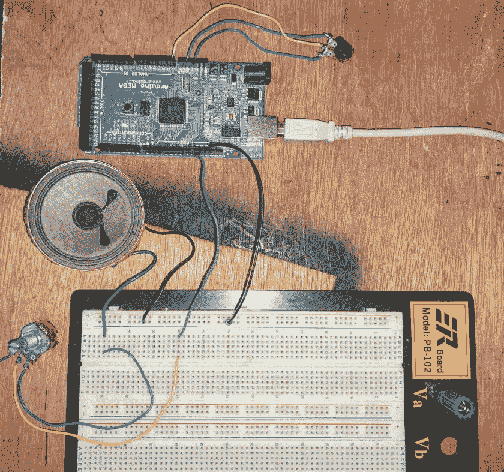
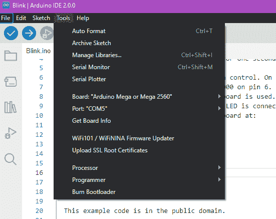

# 使用 IFS 分形的 Arduino Synth

> 原文：<https://medium.com/geekculture/arduino-synth-using-ifs-fractals-e52beb9c154a?source=collection_archive---------12----------------------->



我在用 Arduino Mega 做合成器。我一小步一小步地走，并记录下我的过程。最终目标是制作一个小型的、可播放的(至少)有两种声音的桌面合成器。我已经知道这听起来会很棒，因为我发现了一种特殊的技术——请看下面的演示。

synth 使用 IFS(迭代函数系统)分形作为生成音乐的算法。该算法通常用于制作图片(在这种情况下是蕨叶),并产生 x，y 坐标对。这些非常适合转换成音高和持续时间。因为这是生殖音乐，合成器只要一开机就会播放。我打算使用 Arduino 传感器来控制它，并播放西方音乐中的音高。我甚至可能添加 MIDI！我的代码将被其他人随意利用。

# 给我看看代码

好吧，专家。它在文章的底部。**也正是在这里:**【https://github.com/mogrifier/arduino】T2 却瞬息万变！在 fractalmusic 文件夹中查找，并确保开始和跟随！

# 秘密武器

即使使用带有音调功能的单一音频输出，您也可以通过一点小技巧获得美妙的声音。播放非常短的声音；例如，10 或 12 毫秒的音调持续时间和 15 毫秒的循环。除了音调之外，这产生了第二个可听见的波形。可以这样想——它每 15 毫秒播放 10 次。这是 67%的占空比。该脉冲具有 15 毫秒的周期，相当于 66Hz 的声音，这在技术上低于 Arduino 通过音调功能可以输出的声音(最低约为 100Hz)。将这种脉冲与音调功能结合起来，就可以听到下面的声音。

# 生成音乐

我想把重点放在声音上，而不是花时间做一个基于键盘的合成器。我确实有一台旧的卡西欧，还有它的钥匙扫描仪如何工作的说明，所以我将来可以用它。与此同时，我将使用软件生成音乐，但不是随机的。我写了一些使用迭代函数系统的软件，可以用来创建分形。这些数字界限分明，因此您可以将函数输出映射到音高。这使用很少的内存，不使用复数，所以它很快。每个价值都依赖于之前的价值，所以我希望这会带来更多的音乐品质。输出是二维的(一对坐标，通常是一个像素)，所以你可以得到一个音高和一个音长。持续时间的应用有点棘手，因为我仍然想要我的“同步”音调，但我知道我可以在相对于持续时间值的任何时间内锁定特定的音高，并且仍然可以获得我想要的声音。这也允许在改变音高时产生简单的滑音效果。

不同的起始矩阵产生全新的声音音乐段落。国际单项体育联合会的不同起点也会导致变化。矩阵值也可以实时改变，并由模拟传感器输入控制。您也可以使用电位计来控制音高值的范围或更改速度。可能需要某种方法来控制音高是否是适当的西方音符或其他音符。最终，该系统应该是可玩的，而不只是听起来像一个典型的采样和保持。

下面的视频是我的 Arduino synth 播放 IFS 分形数据的第一个片段。即使不使用 Eventide 空间，听起来也很棒。

Arduino Synth playing data from IFS Fractal formula

# 接线

这是这种代码最简单的布线设计。扬声器是 8 欧姆。音量壶是 100k(这太多了- 10K 欧姆是足够的)。颤音控制器小——500 欧姆？扬声器输出是数字引脚 9。颤音控制电位计连接到模拟引脚 0。它只是从电路板上获得 5v 电压，然后通过电位计降低电压。真的就这么简单。



Breadboard with simple Arduino speaker hookup with volume and a sensor

# 代码

如果你是 Arduino 新手，下面的提示会对你运行代码有所帮助。我使用的是带有 ATMega 1280 处理器的 Arduino Mega。你可以用放大镜从主板上最大的芯片上得到确切的处理器型号。在 IDE 2.0 中，你需要设置 3 个独立的东西来让它工作(这很烦人)。



从这个菜单中，您必须选择正确的板、它所在的端口和处理器。在我的例子中，Arduino Mega 上使用了两种不同的处理器。如果选择错误，您将无法上传草图，并将收到超时错误。上传代码时，还需要确保 IDE(或 Putty)中的串行终端没有运行，因为这将阻止使用串行数据连接来上传代码。

如果用传感器和其他电子元件来建造，请确保所有电源都有一个公共接地。我发现当我试图控制说话和拼写时，我的传感器无法工作，因为 Arduino 在一个电源上，而说话和拼写在另一个电源上。你必须统一电源。

值得注意的是，Arduino 使用闪存，所以一旦你上传一个程序到它，它会留在内存中，即使在电源关闭后。重新启动开发板，你的程序将开始运行。如果创造一个小装置，这是完全正确的行为！

```
/*
play tones. Uses Arduino MEGA 1280 or other mega. Not using too many resources so would run on other models.  This is creating really nice and usable sync-like tones. All with with output voice. 
Very worthwhile to put separate analog controls on the variables for freq, modRange, maxMod and maybe loop delay.
This is a continuous player- run through FX for sure! 
duration should be less than loopdelay.
*/const int SPEAKERPIN = 9;
const int MODPIN = 0;
const int FREQ = 500;
const int LOOPDELAY = 15;
const int DURATION = 12;  //you can hear down to 11ms or so. combined with LOOPDELAY this creates extra sound
const int MAXMOD = 10;
const float TWELFTHROOT = 1.05946;
const float LOWA = 27.5;int count = 0;
int deltaFreq = -5;
int inc = 3;
int totalIterations = 0;//array for pitch and duration (first value is pitch)
int music[2];
//starting point for IFS code. Store past and present for iteration.
float x = 0;
float y = 0;
float next_x = 0;
float next_y = 0;
int note_duration = 0;
int freq = 0;
//numbers of times a given note is played. cycles * duration >= note_duration
int cycles = 0;//arrays for holding IFS matrix
float a[4];
float b[4];
float c[4];
float d[4];
float e[4];
float f[4];void setup() {
  // put your setup code here, to run once:
  Serial.begin(57600); //random start points
  init_xy(); //initial IFS matrix data for a fern
  a[0] = 0;
  a[1] = 0.85;
  a[2] = 0.2;
  a[3] = -0.15; b[0] = 0;
  b[1] = 0.04;
  b[2] = -0.26;
  b[3] = 0.28; c[0] = 0;
  c[1] = -0.04;
  c[2] = 0.23;
  c[3] = 0.26; d[0] = 0.16;
  d[1] = 0.85;
  d[2] = 0.22;
  d[3] = 0.44; e[0] = 0;
  e[1] = 0;
  e[2] = 0;
  e[3] = 0; f[0] = 0;
  f[1] = 1.6;
  f[2] = 1.6;
  f[3] = 0.44; }// put your main code here, to run repeatedly:
void loop() {
  //reading a potentiometer for setting vibrato amount
  int sensor = analogRead(MODPIN); if (cycles * DURATION >= note_duration) {
    //note has played for at least the amount of milliseconds specified so get a new note
    //reset cycle counter
    cycles = 0;
    compute_music();
    freq = music[0];
    note_duration = music[1];
    char buffer[40];
    sprintf(buffer, "Pitch %d and duration %d", freq, note_duration);    
    Serial.println(buffer);    
  }  
  else {
    //use previous pitch and duration, but the duration has to "count down"
    freq = music[0];
    note_duration = music[1];
    cycles += 1;
  }
  //map vibrato sensor reading to range 5-30
  int modRange = map(sensor, 0, 1023, 5, 30);   
  //Serial.print("modrange= ");
  //Serial.println(modRange);
  count++;
  //this creates vibrato
  if (count % modRange == 0) {
    deltaFreq += inc;
    if (deltaFreq >= MAXMOD) {
      inc = -inc;
    }
    if (deltaFreq <= -MAXMOD) {
      inc = -inc;
    }
  } tone(SPEAKERPIN, freq + deltaFreq, DURATION);
  delay(LOOPDELAY);
} /*
Get the next pitch and duration from the IFS code. Just compute all as needed.
*/
void compute_music() { totalIterations += 1;
  int k = get_chance();
  next_x = a[k] * x + b[k] * y + e[k];
  next_y = c[k] * x + d[k] * y + f[k];
  x = next_x;
  y = next_y; //the next note to play is next_x with a duration of next_y //scale values so in bounds and make sense for pitch frequency and duration in milliseconds
  int scale_x = int(abs(x) * 100);
  if (scale_x > 100) {
    scale_x = 100;    
  }  
  //constrain the piano key range to one the arduino can play and also not too high since unpleasant
  int piano_key = map(scale_x, 0, 100, 25, 74);
  //y has a range up to 3.5 or so
  int scale_y = int(abs(y) * 600 + 400);

  music[0] = get_freq(piano_key);
  music[1] = scale_y;

  if (totalIterations > 100) {
    //reset to new starting point for iteration
    init_xy();
    totalIterations = 0;
  }}/*
Choose array indices based on a hard-coded probability distribution.
*/
int get_chance() {
    float r = (float)random(1, 100)/100;
    if (r <= 0.1)
        return 0;
    if (r <= 0.2)
        return 1;
    if ( r <= 0.4)
        return 2;
    else
        return 3;
}void init_xy() {
  x = (float)random(1, 100)/100;
  y = (float)random(1, 100)/100;
}
/*
Convert the piano key position (1 to 88) to the corresponding frequency
*/
int get_freq(int key) {
  int octave = (int)(key/12);
  int note = (key % 12) - 1;
  float freq = LOWA * pow(2, octave) * pow(TWELFTHROOT, note);
  return int(freq);
}
```

# 接下来呢？

添加第二个声音和更多的传感器！这将是一个多节的合成器。我知道我能控制下面的。

*   音高和持续时间值的范围
*   将时间长度量化为固定值
*   控制第二个音频通道，使其稍微去谐或进入和声的粗调
*   颤音量
*   改变音符模式的 IFS 矩阵参数(实际上是无限的)
*   控制 IFS 何时返回起点(创建琶音！)

可能会发现更多我能控制的事情。