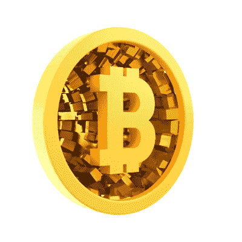

# 比特币真的都一样吗？

> 原文：<https://medium.com/geekculture/are-all-bitcoins-really-the-same-e7ac0f044251?source=collection_archive---------28----------------------->

是吗？似乎最合乎逻辑的答案是“是”。它们是纯粹的数字，是计算机上的数字，总共有 2100 万个，并且简单地以二进制形式存储。根据定义，它们是不可区分的。那么重新表述这个问题可能更好。比特币是完全可替代的吗？

不，他们不是。越来越多的交易历史正在玷污硬币。让我们来探索如何。