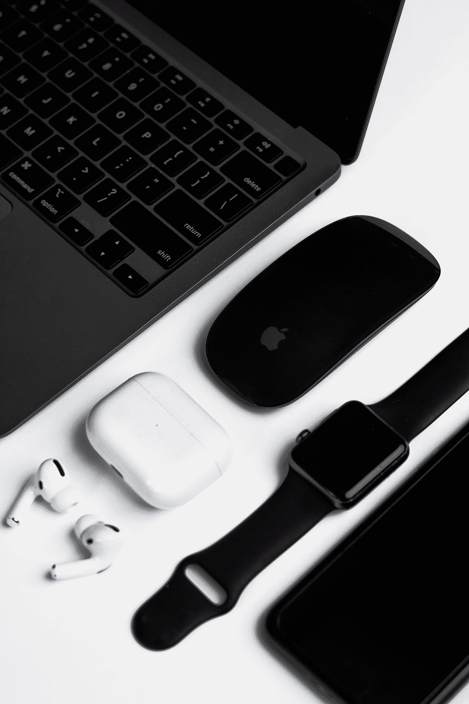
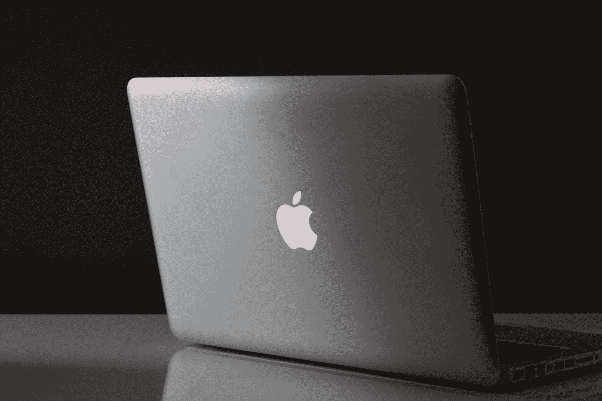
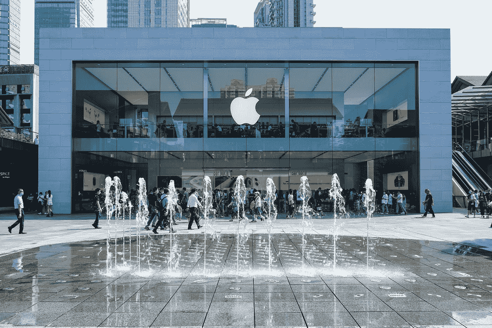
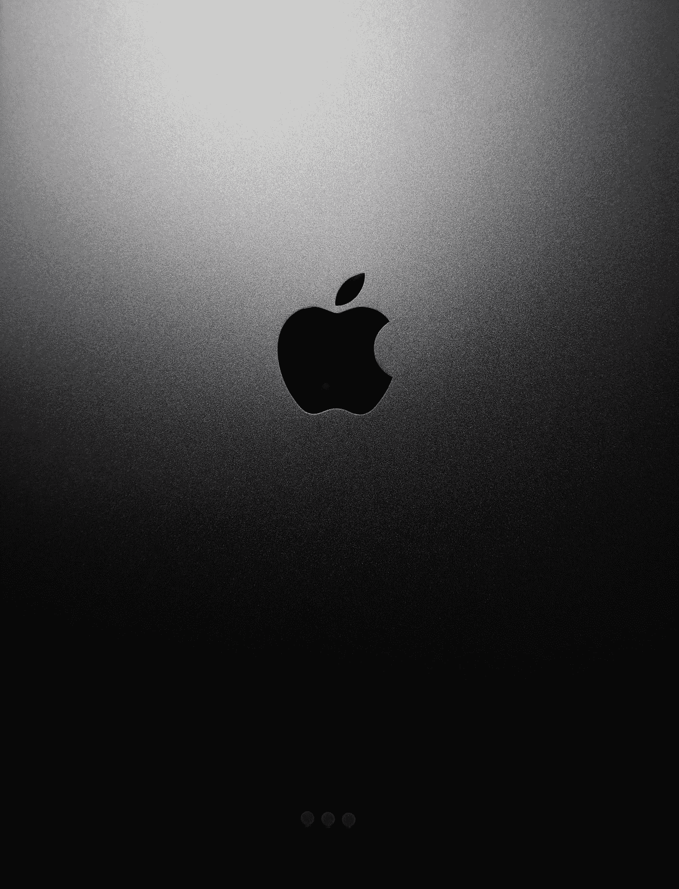

# 苹果产品真的值得吗？

> 原文：<https://medium.com/geekculture/are-apple-products-really-worth-it-b0631dee8ac2?source=collection_archive---------4----------------------->

或者只是有一个溢价标签

Photo by [Carlos Delgado](https://unsplash.com/@carlosdelgadx?utm_source=medium&utm_medium=referral) on [Unsplash](https://unsplash.com?utm_source=medium&utm_medium=referral)

iPhone、MacBook、iPad……每一个都给人一种时尚紧凑的印象。他们的母公司苹果公司已经成功地将自己和产品融入消费者意识。对于看重用户体验和生态系统的人来说，苹果产品是物有所值的。设备和服务之间的易用性和紧密集成比为许多苹果忠实客户定制的能力更有价值。

说到智能手机，那么智能手机市场主要有两个软件竞争对手:iOS 和 Android。iOS 是苹果公司设计用于 iPhone 和 iPad 的独特操作系统。另一方面，Android 基于开源的 Linux 操作系统。

Android 被许多智能手机制造商使用，包括三星、华为、索尼等。iOS 粉丝可以期待从一台设备到另一台设备的一致的用户体验，而 Android 用户在选择手机时将会看到更大的多样性和灵活性。

虽然苹果可能不是销售最多的手机，但他们仍然获得了更大的利润，使他们能够在形象和营销方面投入更多资金，进一步巩固他们作为智能手机市场大型参与者的地位。

产品的高利润率意味着制造成本低，价格高。因此，当谈到苹果时，要知道你可能会为体验而不是更好的显示器的原始处理能力支付额外的费用。

而且很明显，我们每个人都拥有过苹果产品，或者羡慕过朋友最新的 iPhone。然而，人们普遍认为，与功能相似的 Windows 或 Android 设备相比，iPhone、iPad、Mac 或 iPod 等苹果产品通常是最昂贵的玩具。

凭借苹果获得的品牌忠诚度，他们想出了如何将现有客户转化为额外产品的另一个市场基础。拥有苹果产品如 iPhone 并不止于此。支付更多的费用是苹果生态系统中那些人的习惯。有时候，价格就是很奇怪。这就是我们所说的苹果税。例如，一台 256GB 的 Mac 售价约为 1299 美元。然而，同样价格的 Windows 笔记本电脑会有更好的规格。在 2019 年的一份声明中，苹果公司透露了一款 5000 美元的 Mac Pro 及其支架，售价为 1000 美元。支付这些溢价是苹果税务议程的一部分。

Photo by [Marcin Nowak](https://unsplash.com/@marcin?utm_source=medium&utm_medium=referral) on [Unsplash](https://unsplash.com?utm_source=medium&utm_medium=referral)

另一种形式的苹果税是观察他们如何处理存储。当您希望升级您的存储空间时，您必须从 Apple 购买更多存储空间。同样不言而喻的是，一些设备在销售时，其存储能力是主要的差异化因素之一。可用的存储空间越大，这个小玩意就越贵。但与其他公司功能相似的设备相比，苹果的价格似乎过高了。

苹果昂贵的另一个原因是他们的配件。苹果销售的高端键盘价格约为 129 美元，高端鼠标价格为 79 美元。即使有这样一个令人敬畏的设计，它似乎不合逻辑，因为有来自不同公司的相同功能的许多项目。就连线缆等配件也很贵。

而耳机插孔和有线耳机的去除，也在慢慢让苹果用户因为兼容性问题转向纯苹果配件的专属使用。

当苹果首席执行官蒂姆·库克(Tim Cook)被问及苹果产品为何如此昂贵时，他重申该公司始终选择质量而非价格。苹果不想以牺牲质量来换取价格。这也是他们的客户如此看重苹果的众多原因之一。苹果重视其“神奇”的产品胜过一切，这意味着无论你从苹果购买什么产品，由于其质量，都绝对物有所值。

库克还声称，苹果公司的创新和新产品发布实际上是由以可承受的价格制造新设备的一贯愿望推动的。他说，苹果不只是不断质疑自己，检查他们如何才能降低 iPods、MacBook 和 iPhones 等产品的价格。

他们还会问，如何才能以一个消费者能承受的价格获得一个伟大的产品。许多技术专家也质疑苹果将 Mac 售价定在 1000 美元以下的决定。然而，首席执行官解释说，他们发现要以更低的价格获得 Mac，他们必须创造一个不合格的产品，这不是苹果的品牌所代表的。苹果声称将无休止地致力于提供超越价格和功能的高质量产品。那些拥有 iPhone 的人可能会解释当使用像 Android 类型的不同手机时的不同感觉。

Photo by [Chris Nagahama](https://unsplash.com/@nagahama_chris?utm_source=medium&utm_medium=referral) on [Unsplash](https://unsplash.com?utm_source=medium&utm_medium=referral)

苹果也有专门销售其设备的标志性商店。这些商店不仅在美国有，而且在全世界都有。谈论在世界上每个国家平均拥有五家以上的商店。每个国家，想想澳大利亚，想想南非，想想埃及，想想印度。苹果在这些商店上花费大量资金来维持品牌认知。

在一些高档城市也有一些商店。一个很好的例子是新加坡的浮动苹果商店，它被称为苹果迄今为止最雄心勃勃的零售项目之一。商店的名单是无穷无尽的，因为苹果有超过 500 个标志性的商店分布在世界各地。而你，作为使用者，为这些宏伟的建筑买单。

我们都遇到过这样一群人，他们购买苹果产品只是因为这让他们觉得自己很特别，很重要，很有价值。这些是大多数苹果用户寻求的生理满足。你会发现他们渴望购买一个新的苹果产品，即使他们拥有的不是一年前的产品，仍然可以充分发挥其功能。

苹果已经学会了利用这样的客户，并使用预购和为其产品制造疯狂的嗡嗡声来吸引这样的客户群。这个类别将从苹果购买任何东西，只要它有那个标志性的标志。价格标签通常不是他们关心的问题。苹果公司利用了这一点，将高价附加到一些高端设备上。

有一个故事讲的是史蒂夫·乔布斯如何把他的第一个 iPod 扔进水族馆，以证明它的尺寸可以缩小。一个开发第一代 iPod 的工程师团队向史蒂夫·乔布斯展示了一个原型，他第一眼就拒绝了，说它太大了。工程师们说不可能制造出更小的设备，在这一点上，史蒂夫把它扔进了水族馆。达到这样的质量水平需要大量的时间、研究和创新。

Photo by [Jhon Paul Dela Cruz](https://unsplash.com/@jpdelacruz?utm_source=medium&utm_medium=referral) on [Unsplash](https://unsplash.com?utm_source=medium&utm_medium=referral)

我们都喜欢苹果产品令人惊叹和不懈的精饰。即使没有这个标志，也很容易认出苹果在一些产品上的标志性边框，如 Mac、iWatch 和 iPhone。此外，苹果设备上使用的组件是市场上最可靠和最优质的。苹果很少出现 bug 问题。需要维修苹果产品的情况也很少见。这种产品也确实比大多数产品耐用。我们可能知道已经使用了 10 年以上的 MAC 电脑。

但是除了所有这些，间接成本也是与企业日常经营相关的成本。每当你购买苹果产品时，你不只是为产品的组件和包装付钱。

这个小玩意还隐藏着其他更大的成本。营销，这是所有商业的一个重要方面。即使苹果已经在市场上确立了自己的地位，并拥有一个声誉良好的品牌，他们仍然不得不营销新产品和软件更新。他们大力推销新产品。苹果公司到处张贴广告，甚至在路边的广告牌上。影响者营销在保持客户流向苹果生态系统方面也发挥着重要作用。苹果还支付了从高管团队到开发团队的大量职员和工人。苹果零部件制造商遍布德国、日本、瑞士和美国

苹果的竞争对手很多，比如华为、三星、微软、小米。然而，苹果仍然保持着对畅销产品的控制，如 iWatch 和 MacBook，它们被认为是各自领域中最好的产品。

然而，如果我们看看价格，那么你可以花 100 美元或 1000 多美元买一部安卓手机。这是一个巨大的客户选择范围，质量和性能。iPhones 通常起价 700 美元左右，高端机型很容易突破 1000 美元。因此，iPhones 更一致，更精致，也更贵，而 Android 允许更大的选择自由。

用户体验是苹果最关注的。他们坚持对应用程序、推送通知和时间线等进行人工审核。相比之下，Android 应用无需审核即可更新。

像安全、内存分区和手机主题这样的重要设置可以在 Android 上更改。苹果不会给你这种程度的自由。此外，Android 手机不仅允许软件定制，还允许甚至鼓励添加新电池和内存扩展 SD 卡。

然而，苹果强烈反对这一点，甚至开发了自己的螺丝，以至于难以置信地难以进入手机的内部。这导致了可修复性的问题。苹果希望客户只使用其商店进行维护，而安卓的多功能思维允许许多高质量的第三方维修选项。

Mac 电脑以时尚、设计为导向、易于使用而闻名，并且拥有大量的手势和键盘快捷键。Mac 的声誉依赖于传统和遗产，他们生产一些伟大的机器。但是在电脑市场，很明显世界选择了 Windows。苹果电脑有时贵得近乎可笑。当有人以 999 美元的价格建造了一台功能强大的游戏 PC 时，这一点得到了完美的说明，这与 Mac Pro 显示器支架的价格相同。是的，就是那块支撑显示器的金属和塑料。

对于这样一个巨大的价格标签，你会期望质量和性能是最好的。虽然苹果的质量可以说是业内最好的，但其性价比通常可以被价格只有一半的个人电脑击败。但 Mac 电脑的每一个斜面和边缘都经过了精心设计和审查，以满足客户的需求。他们的操作系统与硬件集成得非常好，因为他们把两者都组装起来了。个人电脑种类繁多。你可以买到从廉价的 Chromebook 到台式电脑的所有东西，价格相当于一辆二手小型汽车。

Photo by [Gabriel Beaudry](https://unsplash.com/@gbeaudry?utm_source=medium&utm_medium=referral) on [Unsplash](https://unsplash.com?utm_source=medium&utm_medium=referral)

但就个人电脑而言，质量和性能的差异就像价格一样大。我们能说的是，个人电脑通常提供与苹果电脑相同的规格，而价格只是苹果电脑的一小部分。例如，售价 1099 美元的 MacBook Air 几乎在所有领域都被售价 500 美元的惠普笔记本电脑轻松超越。

苹果生产高质量的产品，质量保证非常严格，用户体验也值得高价购买。除了一些计算错误，他们为大多数客户提供了简单可靠的产品系列，名副其实。但是，你的产品需要反映你的需求，所以专注于你最重视的功能。如果你想要市场上最好的设备，苹果是一个很好的选择。如果你想在相似的设备之间实现无缝转换，苹果是赢家。

然而，如果你想要万能的设备，最物有所值，简单便宜的维修，并且不介意更加小心网络安全，那么试试安卓或 PC。最终，是你自己决定什么对你最好。