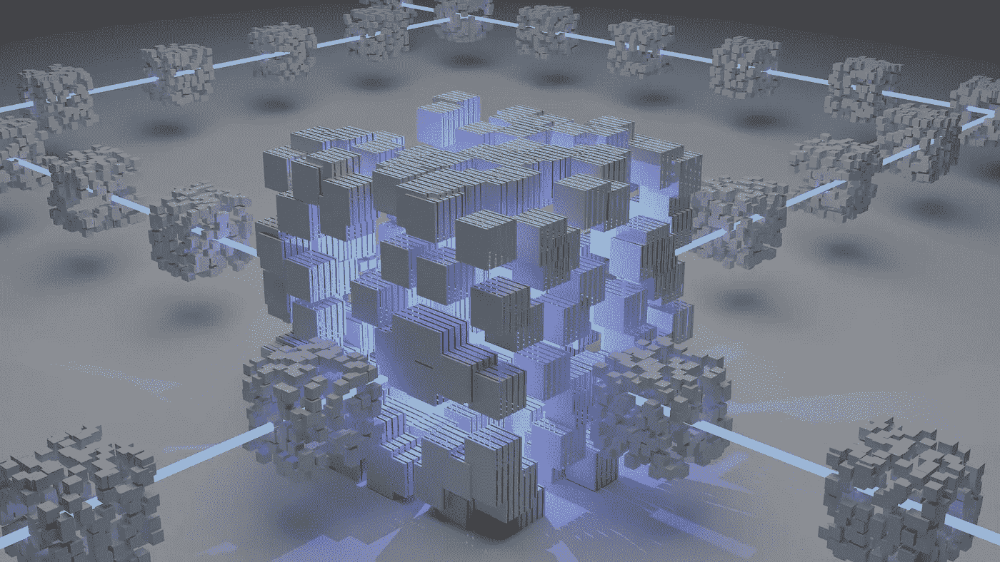

# 代码正在取代人类的工作吗？道斯解释道。

> 原文：<https://medium.com/geekculture/are-codes-taking-over-human-jobs-daos-explained-a3e84dd9e86?source=collection_archive---------13----------------------->

**Source: Unsplash.com**

投资、商业和创意产业的世界正在被一种新型的组织所颠覆。这些组织没有公司总部，用扁平的管理结构取代传统的等级制度，由密码持有者管理，并建立在自动执行的区块链规则之上。这些新的组织结构被称为 DAOs。

分散自治组织(DAO)是一种业务结构，其中控制是分布式的，而不是分层的。

参与者使用治理令牌对基金分配等主题进行投票。Dao 使用智能合约来组织。

分散自治公司(DAO)是 DAO (DAC)的另一个名称。

> **另见:** [**分权财政(DeFi) vs 集权财政(CeFi)。**](/@ilekeairende/decentralized-finance-defi-vs-centralized-finance-cefi-ede87a0bde07)

为什么 Dao 变得如此受欢迎？

Source: Unsplash.com

权力下放是本世纪的流行语，我们生活在其中。

每个人都希望政府减少对影响他们的系统和结构的控制。或者，更好的是，当涉及到影响他们的问题时，更多的人希望成为决策过程的一部分。这就是权力下放的全部意义:更少的控制，更多的基层参与，以及不可避免的更低的准入门槛。

这种新的分权文化开始渗透到人类生活的各个方面。然后是金融，然后是企业如何运营。

【DAOs 如何工作。

考虑一辆自动驾驶汽车，然后在一个组织的背景下想象它；这就是 Dao 的运作方式。Dao 的参与者使用智能契约和治理令牌来就如何分配组织的资源达成共识。

Dao 被设计来执行特定的规则，这些规则将从一开始就指导公司或组织。根据维基百科，DAO(去中心化自治组织)是一个组织，其规则被编码在一个透明的计算机程序中，并由其成员控制，而不是受中央政府的影响。不需要经理，因为规则嵌入在代码中，消除了任何官僚主义或等级障碍。

Dao 建立在以太坊智能合约的基础上，只有在满足某些标准的情况下，才能对其进行编程以执行特定的任务。这些智能合同被编程为自动执行常见的业务任务，例如只支付资金或招聘人才。

Dao 被许多人视为更坚定地保障民主的一种方式。利益相关者可以对诸如添加新规则、更改现有规则、删除成员等问题进行投票。一个道一旦被创造出来，除非有一定数量的人投票赞成，否则是不能改变的。因为它有程序化的规则，自主运行，并通过一个协商一致的协议进行协调，比特币被广泛认为是第一个完全功能化的 DAO。

**为什么要靠代码做生意？**

**Source: Unsplash.com**

支持者认为，Dao 的一个内在好处是，它们允许创建比人类管理的组织更公平的组织。

在当今的商业世界中，大多数公司的领导者偶尔会做出影响整个组织的单方面决策。这种类型的决策在"一体行动"模式下是不可能的，因为利益相关方(即公司投资者)将对公司如何运营拥有更直接的控制权。

当涉及某一特定情况的团体、组织或国家中只有一个在未经其他团体、组织或国家同意的情况下作出单方面决定或行动时，就发生了单方面决定。

**道斯的魅力何在？**

以下是刀的一些特征:

**1。没有层级管理:**层级管理并不总是存在。利益相关者，而不是领导者或管理者，通常会做出决策。

**2。透明:**因为代码是开源的，任何人都可以检查。任何人都可以回顾区块链，看看决策是如何制定的。

**3。开放访问:**任何有互联网连接的人都可以购买或持有 DAO 令牌，赋予他们在 DAO 中的投票权。

**4。民主变革:**通过对新提案进行投票，投资者可以改变 a 道的规则。

**5。招募:**因为作为管理者，阿刀理论上可以雇佣外部人才，因为有些任务只有人类才能完成。例如，基于传感器报告 DAO 的损坏，上述 DAO 中的无人驾驶汽车可以自动雇用修理工。

**第一把真人刀**

**Source: Unsplash.com**

是的。形成这样一个组织的最著名的尝试叫做“道”

2016 年推出的 DAO 仅在几个月后就失败了，但它仍然是人们听到区块链技术时所想到的最突出的例子。

德国初创公司 Slock.it 在 2016 年 5 月推出了“The DAO”，以支持他们的 Airbnb 去中心化版本。这在当时是一个巨大的成功，一项众筹活动在以太坊筹集了超过 1.5 亿美元。

不幸的是，他们使用的 DAO 代码有许多缺陷。因此，在 2016 年 6 月，黑客能够在 DAO 关闭之前从 DAO 窃取价值 5000 万美元的以太坊。尽管缺陷是在 [slock.it](http://slock.it) 代码中，而不是在底层技术中，但这次黑客攻击动摇了一些人对以太币和 DAOs 的信心。

显而易见,“不可阻挡的代码”可能是一个安全风险。

对于刀，这是一个问题。原来是有一个 bug 让一个剥削者窃取了组织的资金。旁观者看着攻击者慢慢地从 DAO 中抽干资金，但他们无力阻止。黑客在技术上遵循了实施的规则。

以太坊的主要建造者逆转了交易历史，将资金归还给合法的所有者，导致了社区的分裂。在未来类似的情况下，最好的行动方案是什么，这仍有待讨论。

**DAOs 有哪些缺点？**

如 DAO 所展示的，无法停止的代码可能是个问题。一旦部署了 DAO，就很难改变它的规则。阻止个人在没有社区批准的情况下改变组织的相同框架也可能导致问题，其中最重要的是框架中的任何缺口都很难弥合。这可能导致盗窃、经济损失或其他负面后果。

各种 Dao 的治理令牌的常见示例包括:

COMP 是复合货币市场协议的治理令牌，是目前市值最大的治理令牌。令牌的持有者可以投票决定化合物的重大变化。出于投票目的，还可以将薪酬委托给其他人。

Synthetix 的原生资产 SNX 也是另一个例子；一种基于以太坊的分散式合成资产，可以跟踪真实世界的资产，如货币、商品等。

广受欢迎的 DeFi 借款和稳定硬币项目 MakerDAO 的治理标志 MKR 是另一个例子。最后，治理令牌的另一个例子是 LEND，它是 Aave 的抵押品和治理令牌。