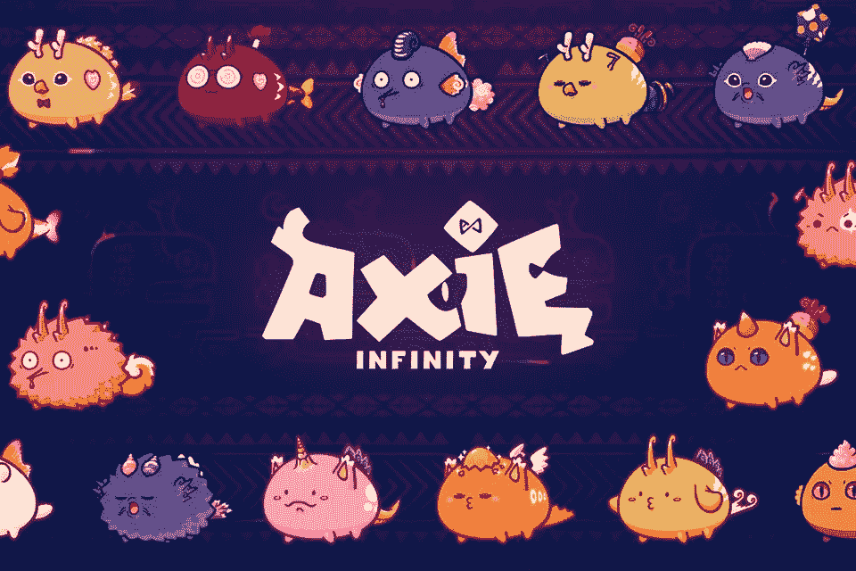

# 加密货币游戏是传销吗？

> 原文：<https://medium.com/geekculture/are-cryptocurrency-games-pyramid-schemes-53355579547f?source=collection_archive---------2----------------------->

抛开激进的点击诱饵标题不谈，在过去的六个月里，加密游戏的增长简直是爆炸性的。Axie Infinity 是这场热潮的核心游戏之一。在今年(2021 年)7 月的某个时候，他们的销售额超过了 OpenSea，达到近 7 亿美元，超过 9 万吨。他们现在有 25 万日活跃用户，这可能是一个数量级…