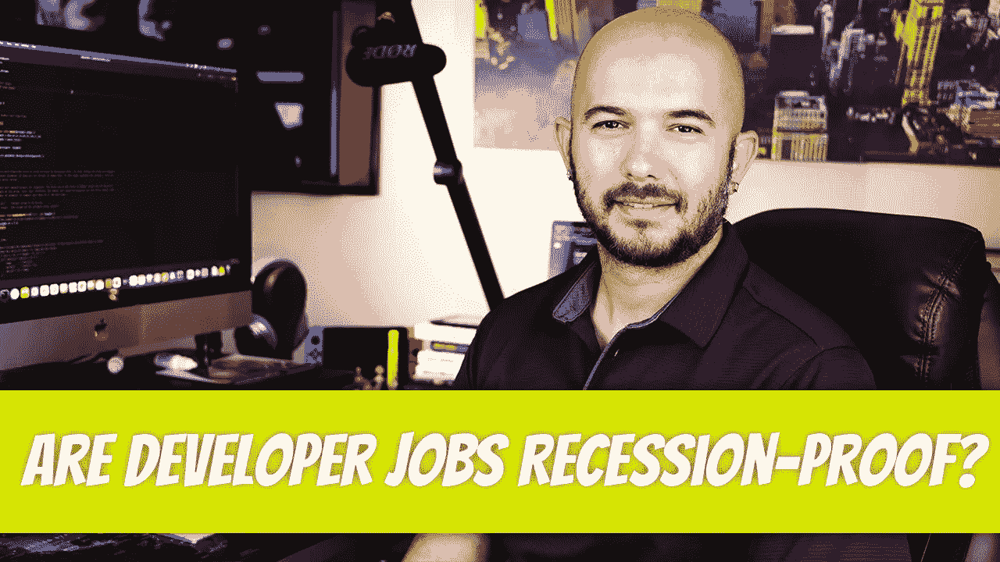

# 开发人员的工作能够抵御衰退吗？

> 原文：<https://medium.com/geekculture/are-developer-jobs-recession-proof-a10138d22144?source=collection_archive---------5----------------------->

最近几个月，我看到这个问题越来越受欢迎。不仅仅是软件开发商在寻找答案，每个人都想知道他们的领域是否不受经济衰退的影响。

软件开发人员也是人，与我共事过的每个人所说的相反(我们不是机器人)，他们也表现出最基本的人类情感，恐惧。担心他们会失业。害怕这是…