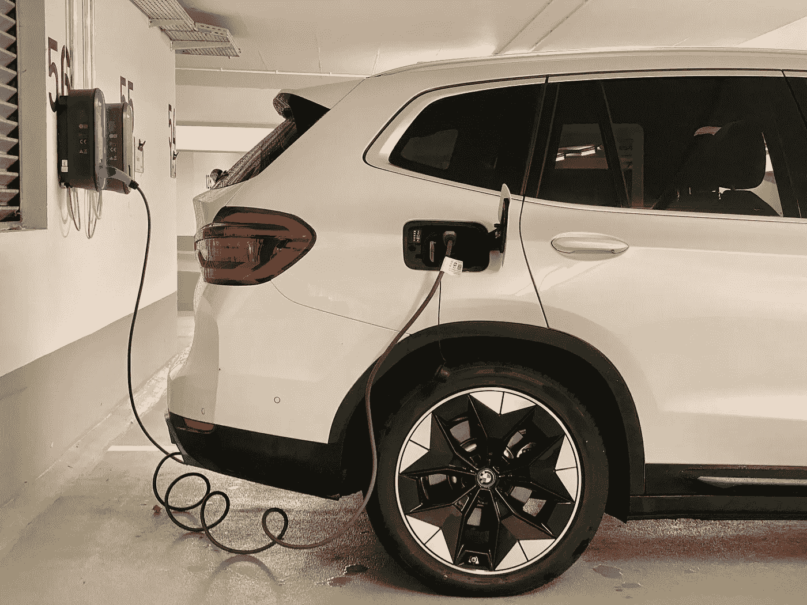

# 电动汽车真的是未来吗？

> 原文：<https://medium.com/geekculture/are-electric-vehicles-really-the-future-273c48e67f36?source=collection_archive---------3----------------------->

或许吧，但不是你想的那样。

Photo by [Eren Goldman](https://unsplash.com/@erengoldman?utm_source=unsplash&utm_medium=referral&utm_content=creditCopyText) on [Unsplash](https://unsplash.com/s/photos/electric-vehicles?utm_source=unsplash&utm_medium=referral&utm_content=creditCopyText)

我想你们称之为电动汽车的粉丝已经有一段时间了，但主要原因是，对于像我这样的软件工程师来说，它们很酷，媒体描绘了它们奇特的未来主义。

嗯，很酷，因为他们有很多有趣的技术，炫目而且经常是动画的数字仪表盘…