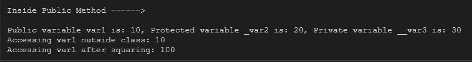
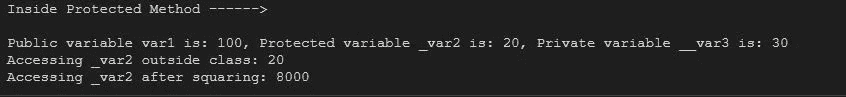
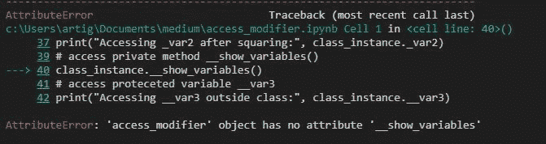
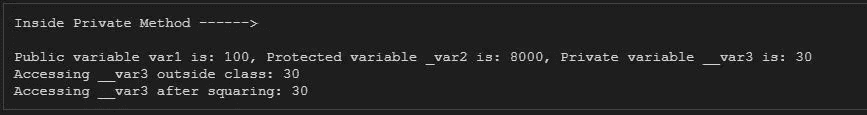

# Python 中真的存在公共的、受保护的和私有的访问修饰符吗？

> 原文：<https://medium.com/geekculture/are-there-really-public-protected-and-private-access-modifiers-present-in-python-74c7b578eb19?source=collection_archive---------2----------------------->

嘿！，欢迎回到另一篇内容丰富的文章。最近，我在 GitHub 上查看了一些代码，作者在变量名和方法名前面加了单下划线和双下划线。然后我开始了解到 Python 中的访问修饰符是通过使用命名约定来表示的。Python 并不严格提供任何访问修饰符，因此，默认情况下所有变量和方法都是公共的。因此，可以在类外部读取任何类成员。这种在变量和方法前面添加下划线的命名约定用于显示程序员对变量和方法的阅读范围的意图。


Photo by [Markus Spiske](https://unsplash.com/@markusspiske?utm_source=unsplash&utm_medium=referral&utm_content=creditCopyText) on [Unsplash](https://unsplash.com/s/photos/technology?utm_source=unsplash&utm_medium=referral&utm_content=creditCopyText)

与 Java 和 C++不同，Python 缺少 protected、public 和 private 访问修饰符来保护类成员免受不必要的访问。但是，可以在变量或方法名前面加上一个**单下划线来表示其行为受到保护。然而，这些变量可以在类的内部和外部访问。**

**变量或方法名前面可以有两个前导下划线，表示变量或方法的行为是私有的。这些变量可以在类内部访问。对于这些变量，Python 执行名称管理。所谓“名称混乱”，我们的意思是 Python 将前导下划线和类名放在私有变量(那些用两个前导下划线声明的变量或方法)的前面。因此，可以通过在变量或方法名前面加上一个前导下划线和类名来访问私有变量。**

这可能真的会让你感到困惑。让我们通过代码来理解这一点。下面是我创建一个名为 demo 的类的代码。在 __init__()构造函数中，我们添加了三个变量来描述公共、受保护和私有变量的行为。在这个类中，我们将定义三个方法来描述公共的、受保护的和私有的方法功能。

```
# Showing the Public, Protected and private access modifier
class access_modifier:
    def __init__(self,var1, var2, var3):
        self.var1 = var1 # public variable
        self._var2 = var2 # protected variable declared with single leading _
        self.__var3 = var3 # private variable declared with double leading __
    # Public method 
    def show_variables(self):
        print("Inside Public Method ------>\n")
        print(f'Public variable var1 is: {self.var1}, Protected variable _var2 is: {self._var2}, Private variable __var3 is: {self.__var3}')

    # Protected Method declared with single leading _
    def _show_variables(self):
        print("Inside Protected Method ------>\n")
        print(f'Public variable var1 is: {self.var1}, Protected variable _var2 is: {self._var2}, Private variable __var3 is: {self.__var3}')
    # Private Method declared with double leading __
    def _show_variables(self):
        print("Inside Private Method ------>\n")
        print(f'Public variable var1 is: {self.var1}, Protected variable _var2 is: {self._var2}, Private variable __var3 is: {self.__var3}')
```

**访问公共方法和变量:**

这里，var1 和 show_variables()分别是公共变量和方法，因此可以使用类的对象在类外部访问它们。

```
# create instance of access_modifier class
class_instance = access_modifier(10,20,30) 
# access public method show_variables()
class_instance.show_variables()
# access public variable var1
print("Accessing var1 outside class:", class_instance.var1)
# modify public variable outside class
class_instance.var1 = class_instance.var1**2
print("Accessing var1 after squaring:", class_instance.var1)
```



We can access the public variables and public methods outside of class

**访问受保护的方法和变量:**

在其他 OOPs 语言中，如 java 和 C++中，可以在类和子类中访问受保护的变量。但是 python 不限制用单个前导下划线(_)声明的变量的范围。

这里 _var2 和 _show_variables()分别被描述为受保护的变量和方法，但是可以在类外部访问。

```
# access protected method _show_variables()
class_instance._show_variables()
# access proteceted variable _var2
print("Accessing _var2 outside class:", class_instance._var2)
# modify public variable outside class
class_instance._var2 = class_instance._var2**3
print("Accessing _var2 after squaring:", class_instance._var2)
```



**访问私有方法和变量:**

在其他 OOPs 语言中，如 java 和 C++，私有变量可以在类内部访问。Python 不允许在类外访问以两个下划线开头的变量和方法。

这里 __var3 和 __show_variables()分别被描述为私有变量和方法，因此当在类外访问它们时，python 会给出属性错误。

```
# access private method __show_variables()
class_instance.__show_variables() # gives attribute error
# access proteceted variable __var3
print("Accessing __var3 outside class:", class_instance.__var3) #gives attribute error
# modify public variable outside class
class_instance.__var3 = class_instance.__var3**3 #gives attribute error
print("Accessing __var3 after squaring:", class_instance.__var3) #gives attribute error
```



**用 Python 命名 Mangling:**

如上所述，python 对以两个前导下划线开始的变量和方法执行名称管理。也就是说，python 通过在变量和方法前面加上单个下划线和类名来改变用两个下划线声明的变量和方法的名称。您可以使用 dir()命令查看变量和方法的修改名称，该命令将 class 的对象作为参数。因此，可以通过在变量或方法名前面加上一个前导下划线和类名来访问私有变量。

```
dir(class_instance)
```


python 名称 mangling 的结果，我们在上面的图片中可以看到，私有方法 __show_variable 改为 _ access _ modifier _ _ show _ variable，私有变量 __var3 改为 _access_modifier__var3。因此，我们可以使用这些修改后的名字来访问这个类的私有成员。

**访问私有方法和变量:**

```
# access private method __show_variables()
class_instance._access_modifier__show_variables() 
# access proteceted variable __var3
print("Accessing __var3 outside class:", class_instance._access_modifier__var3) 
# modify public variable outside class
class_instance.__var3 = class_instance._access_modifier__var3**3 
print("Accessing __var3 after squaring:", class_instance._access_modifier__var3)
```



**结论:**

我们已经看到，我们可以在类外部访问一个类的所有变量和方法。通过这个练习，我们了解到 python 不提供任何访问修饰符来控制类成员的可访问性。前导单下划线和双下划线仅用于描述程序员的意图，即他希望用前导下划线将这些成员声明为受保护的或私有的，因此它们应该在作用域方法中读取。

感谢您花时间阅读这篇文章。我希望这篇文章能为您提供信息，并让您清楚地理解为什么要在变量和方法名前面使用前导下划线。如果你喜欢这篇文章，别忘了点击“鼓掌”和“关注”按钮。继续查看新帖子。