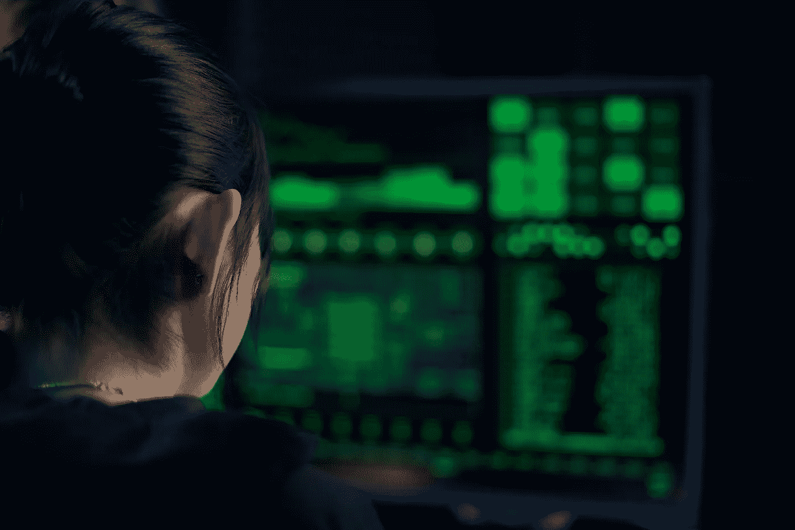

# 我们的网络安全吗？为什么保护自己的隐私至关重要

> 原文：<https://medium.com/geekculture/are-we-cyber-safe-why-its-paramount-to-take-care-of-own-privacy-826689f5a040?source=collection_archive---------24----------------------->

主要是在网络活动家和告密者提供了多次泄露信息之后，隐私问题开始变得越来越重要，当涉及到自己的在线体验时。

Photo by [Mikhail Nilov](https://www.pexels.com/@mikhail-nilov?utm_content=attributionCopyText&utm_medium=referral&utm_source=pexels) from [Pexels](https://www.pexels.com/photo/woman-in-black-shirt-looking-at-neon-lights-7534101/?utm_content=attributionCopyText&utm_medium=referral&utm_source=pexels)

在之前的[故事](/data-driven-fiction/before-vs-now-a-data-issue-540017944245)中，其中一个组成部分涉及到发现什么是**数据驱动的经济**，深化我们个人*数据*是如何被使用的，主要是由**大** …