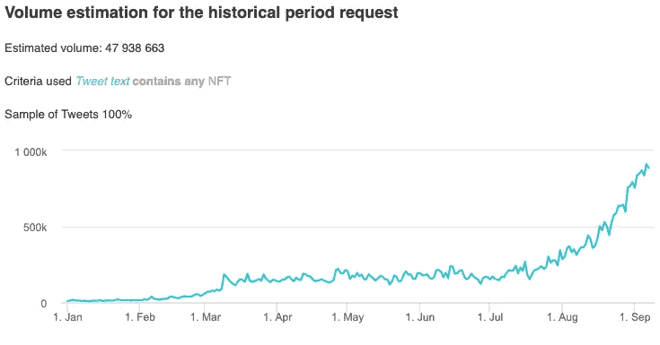

# 我们去 NFTs 还早吗？

> 原文：<https://medium.com/geekculture/are-we-still-early-for-nfts-77ab9ec68425?source=collection_archive---------7----------------------->

## 2021 年 NFT 主流采用时间表

随着扎克伯格最近披露将脸书的名字改为 [Meta](https://www.youtube.com/watch?v=Uvufun6xer8) ，以及[在 Web3](https://about.fb.com/news/2021/09/building-the-metaverse-responsibly/) 上下注 5000 万，人们不得不问，NFT 已经成为主流了吗？让我们来看看。

在这一年中，社交媒体对非功能性测试的提及一直在增加。但是与加密生态系统相比，这看起来像什么呢？

Twitter mentions of NFTs throughout 2021 — [Source: Fifty](https://fifty.io/blog/nfts-go-mainstream)