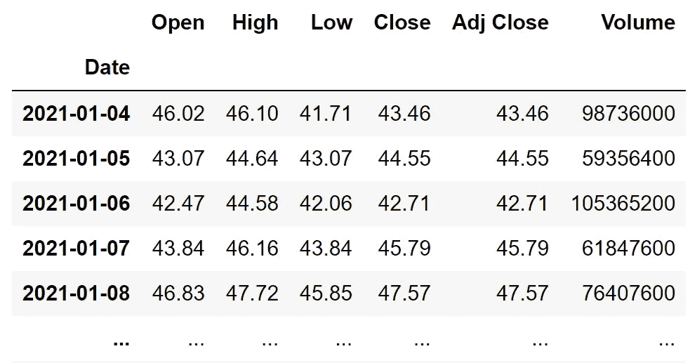
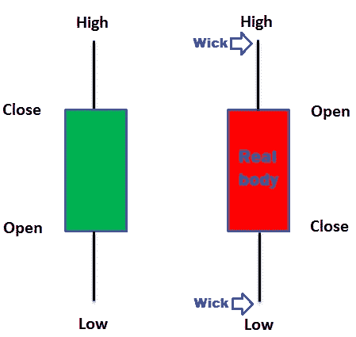
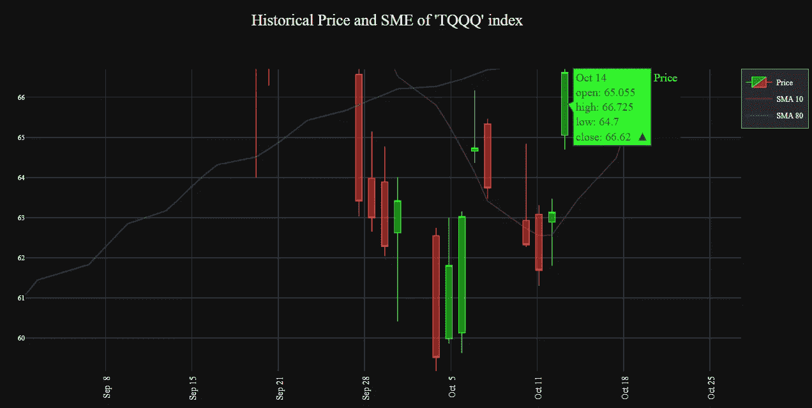
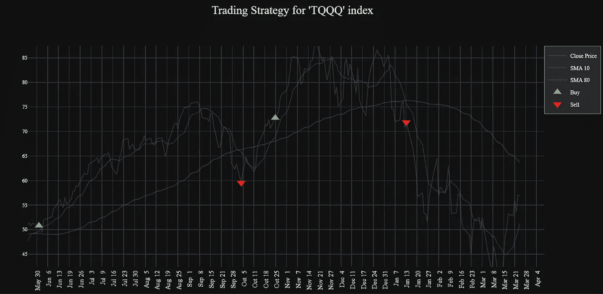
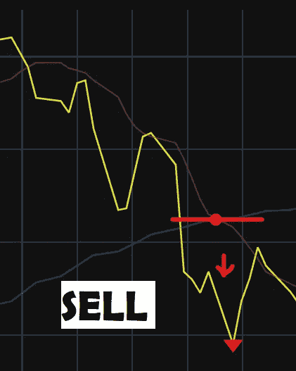
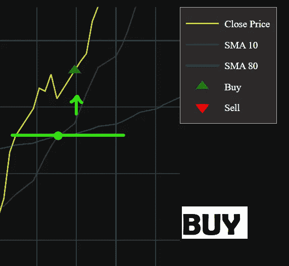

# 你是交易的初学者吗？用 Python 建立你的第一个交易策略

> 原文：<https://medium.com/geekculture/are-you-a-beginner-in-trading-build-your-first-trading-strategy-with-python-95fef3b313ab?source=collection_archive---------2----------------------->


如果你是交易界的新手，你肯定想知道什么时候你方便购买，或者，当你进入市场时，你应该注意什么指标？
使用 Python 和 Plotly，您可以建立自己的第一个交互式交易策略，这样分析您的行为就不是一场噩梦了！

## 导入 Python 库

首先，我们将导入熊猫库和 [Plotly](https://plotly.com/python/) 库进行可视化。

```
**#1 Import pandas**
import pandas as pd
import numpy as np
from pandas_datareader import data as pdr
import datetime as dt
from datetime import date, timedelta**#2 For Plotly**
import matplotlib.pyplot as plt
import plotly.graph_objects as go
import plotly.express as px
import plotly.io as pio
pio.templatesimport yfinance as yf
```

此外，我们将需要通过 **yfinance** 连接到雅虎金融 API，该 API 实时提供关于加密和其他金融工具的广泛数据。

## 加载财务数据

为了获得我们感兴趣的股票的数据，我们将要求输入交易股票代码，并将它保存在变量 ***股票*** (您可以在这里查阅一些符号[)。然后，我们将需要以 ***datatime*** 格式(“年-月-日”)指定要分析的日期范围，以最终在 dataframe 中收集数据。](https://finance.yahoo.com/lookup/)

```
yf.pdr_override()**#1 Asking for stock symbol**
stock = input ("Enter a stock ticker symbol: ")
print(stock)**#2 Set date**
start = dt.datetime(2021,1,1)
now=dt.datetime.now()
df = pdr.get_data_yahoo(stock, start, now)df.round(2)
```

获得的输出包含股票价格变量和每天的交易量。在本例中，我们将使用符号“TQQQ”的数据，从 2021 年 1 月 1 日到当前日期。



Output of price variables for “TQQQ” stock

## 定义策略:交易均线

为了识别历史模式，我们将使用简单移动平均线(SME)来计算股票在连续“x”天的平均价格。根据[资本投资平台](https://capital.com/the-moving-average-what-is-it-and-how-to-use-it)，短期趋势常用 10 天(“SMA 10”)，长期常用 80 天(“SMA 80”)，我们将使用这些周期。该策略被称为**交叉策略**，其一般原则是:

1.  如果价格在 SMA 线以上:趋势看涨，即方便买入值。
2.  如果价格在 SMA 线以下:趋势看跌，方便卖出价值。

所以，我们使用 ***rolling()*** 函数来计算调整后的 SMA 收盘价“Adj. Close”，其中 ***窗口*** 的大小是天数的范围平均值。让我们看看代码！

```
df = pd.DataFrame()sma10 ='sma10'
sma80 ='sma80'
df[sma10]= df.iloc[:,4].rolling(window=10).mean()
df[sma80]= df.iloc[:,4].rolling(window=80).mean()df.round(2)
```

因为 SMA 计算的是从当前时段开始计数的先前值的平均值，所以我们的数据集的第一行包含空值“Nan ”,因为没有值可用于计算平均值。

**带有历史价格的烛台图**
我们将使用烛台图来显示信息，它由两个元素组成:*灯芯*和*实体*。

*   灯芯:它们是显示变量“高”和“低”的极值点，是一段时间内谈判的最高价和最低价
*   真正的主体:是蜡烛的宽部分，主体的上下角显示股票的开盘价“开”和收盘价“闭”。如果当天的收盘价低于开盘价，蜡烛将显示为红色，因为结果是不利的。



Candlestick structure. Adapted from: [Warrior Trading](https://www.warriortrading.com/how-to-read-candlestick-charts/)

我们使用属性 ***go .烛台*** 将数据添加到图形中，并使用 go.Scatter 将 SMA 线添加到图形中。要定制设计，您可以在此处添加 plotty 在其文档[中提供的更多属性，或者您可以使用一个](https://plotly.com/python/)[plotty 模板](https://plotly.com/python/templates/)。

```
**#1 Adding data to Candlestick**
fig = go.Figure(data=[go.Candlestick(x=df.index, name = 'Price',
                open=df['Open'], high=df['High'], 
                low=df['Low'], close=df['Close']),
      go.Scatter(x=data1.index, y=data1.sma10, name='SMA 10'),
      go.Scatter(x=data1.index, y=data1.sma80,name='SMA 80')])**#2 Add template and custom layout**
for template in ["plotly_dark"]:

   fig.layout.font.family = 'Balto'
   fig.update_layout(template=template, 
        title="Historical Price and SME of '"+str(stock)+"' index")

   **#Legend format** fig.update_layout(legend=dict(bgcolor="#2b2929",borderwidth=0.5))

   **#Axis format**
   fig.update_xaxes(tickangle = -90, tickformat = '%b %e',)
   fig.update_yaxes(title_standoff = 8, tickfont=dict(size=8))

   **#Candles style**
   fig.update_traces(
       increasing_line_color="#2df726", 
       selector=dict(type='candlestick')) fig.update_traces(
       decreasing_line_color="#ff4038",
       selector=dict(type='candlestick'))fig.show()
```



Candlestick chart for “TQQQ” stock

## 创建买卖指标

为了显示买入或卖出指标，我们创建了一个函数，其中包含空列 ***mustBuy*** 和 ***mustSell*** ，用于存储收盘价“Adj close”。
变量 ***flag*** 会检测两条趋势线之间的交叉，如果表示“SMA 80”穿过了“SMA 10”，那么就方便卖出，“Adj close”的值会添加到 ***mustBuy*** 列，否则为空值“np.nan”。同样的事情发生在如果形态表明股票应该卖出，不方便买卖的话，要增加的价值就为 null。

接下来，我们将新变量保存在新的数据帧 ***data1*** 中。

```
**#1 Create function**def buy_sell(data1):
    mustBuy = []
    mustSell = []
    flag = -1 #when crosed bothfor i in range(len(data1)):
        close=df["Adj Close"][i] **#If short-term line crosses long-term line**
    if data1[sma10][i] > data1[sma80][i]:
            if flag != 1:
                pc=close
                mustBuy.append(pc)
                mustSell.append(np.nan)
                flag = 1
            else:
                pc=close
                mustBuy.append(np.nan)
                mustSell.append(np.nan) **#If long-term line crosses short-term line**    
    elif data1[sma10][i] < data1[sma80][i]: 
            if flag != 0:
                ps=close
                mustBuy.append(np.nan)
                mustSell.append(ps)
                flag=0
            else:
                ps=close
                mustBuy.append(np.nan)
                mustSell.append(np.nan)
        else:
            mustBuy.append(np.nan)
            mustSell.append(np.nan)

return (mustBuy, mustSell, close)**#2 Store buy and sell decition**
buy_sell = buy_sell(data1)
data1['Buy_Price'] = buy_sell[0]
data1['Sell_Price'] = buy_sell[1]
```

为了可视化，我们这次将使用折线图，在数据中我们将包括变量 ***mustBuy*** 和 ***mustSell*** 来显示买入或卖出标志，作为收盘价线的标记。让我们看看代码！

```
fig2 = go.Figure()**# 1 Add trace of Adj Close**
fig2.add_trace(go.Scatter(x=data1.index,             
                          y=data1["Adj Close"]))**# 2 Add SMA traces**
fig2.add_trace(go.Scatter(x=data1.index, y=data1[sma10], 
                          name='SMA 10'))
fig2.add_trace(go.Scatter(x=data1.index, y=data1[sma80], 
                          name = 'SMA 80'))**# 3 Create markers for BUY OR SELL** fig2.add_trace(go.Scatter(x=data1.index, y=data1["Buy_Price"],       
                          name='Buy',  mode = 'markers',
                          marker =dict(symbol='triangle-up'),
                          hovertemplate=('BUY on %{x}'))fig2.add_trace(go.Scatter(x=data1.index, y=data1["Sell_Price"],    
                          name='Sell', mode = 'markers',
                          marker =dict(symbol='triangle-down'),
                          hovertemplate=('SELL on %{x}'))**# 4 Custom layout and template**
for template in ["plotly_dark"]:

    fig2.update_layout(template=template, 
         title="Trading Strategy for '"+str(stock)+"' index") fig2.show()
```

如果你想改变三角形标记，你可以通过编辑***marker = dict(symbol)***属性和可用的符号[这里](https://plotly.com/python/marker-style/)，你也可以用***hover template****改变标志的弹出文本。*
看看最终结果吧！



Trading strategy with BUY and SELL flags

## 解释

我们可以看到，图表回答了这个问题:**我应该什么时候进场？我应该什么时候买入或卖出？**

通过放大图表，我们将能够注意到短期(SMA 10)和长期(SMA80)形态的交叉，以及当收盘价高于交叉时，旗帜如何显示 ***买入*** ，当收盘价低于交叉时， ***卖出*** 。



Enlarged Strategy Chart: the flags are the red and green triangles

所以，我们已经建立了我们的第一个交易策略。希望有帮助！

*您可以在* [*我的 Github*](https://github.com/Lu-Emperatriz/Trading-Strategy-with-Python/blob/main/Trading-Strategy-Notebook.ipynb) *中找到完整的代码，如果您想联系我，您可以通过* [*我的 Linkedin 个人资料*](https://www.linkedin.com/in/lucero-sovero/) *联系我。*

 [## Lucero Sovero |数据分析师|网站

### 卢塞罗是数据的分析者，是企业问题的解决方案的分析者

lu-emperatriz.github.io](https://lu-emperatriz.github.io/)