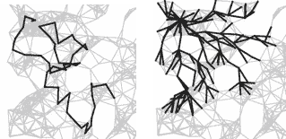

# 你是深度优先还是广度优先？

> 原文：<https://medium.com/geekculture/are-you-depth-first-person-or-breadth-first-person-5f27ae35102c?source=collection_archive---------15----------------------->

Photo by [delfi de la Rua](https://unsplash.com/@delfidelarua7?utm_source=medium&utm_medium=referral) on [Unsplash](https://unsplash.com?utm_source=medium&utm_medium=referral)

研究一个图的算法或任何基于拓扑的问题会让你有两种图的遍历方式——深度优先搜索和广度优先搜索。

## **深度优先和广度优先**

深度优先搜索对我们来说是非常自然的事情，通常发生在我们专注于预先定义的问题时，例如从迷宫中找到一条路径，或者解决数独难题。

Depth-first (left) vs Breadth-first

我们试图权衡目前所有的选择。一旦选择了一个选项，我们就快速应用它以进入下一步。然后，这就变成了一个相当递归的过程，直到我们可以评估这个路径查找的目标是否有效。

我们中的一些人认为，递归在人类推理中并不常见，即使在计算机科学编程中，我们也倾向于将递归作为一些高级主题来教授。然而在实践中，这是不正确的。我认为我们倾向于递归，例如，如果你一直在做类似的事情，很可能你在执行递归方法。仅以寻找迷宫为例，如果你一圈又一圈地走，如果每一个转弯对你来说都似曾相识。那么每一轮都是一次递归，信不信由你。我们只是不知道我们递归地做了。

## 工作风格

深度优先和广度优先搜索的区别主要在于风格。深度优先倾向于快速和目标导向。它试图以最快的速度到达某个地方，并希望在我们面前有一个解决方案。然而，广度优先倾向于有点保守，并且是面向家庭的。它试图在起点周围建立一个坚实的基础，当附近的东西被探索时，扇出去达到更多。这两种风格有没有让你想起现实生活中认识的某个人？

我确信这些风格在我们每个人心中和谐共存。我们有时会很有侵略性，当我们这样做时，我们更像是深度优先的人。当然，我们很容易筋疲力尽，所以我们有时会回顾一下，当我们这样做时，我们会回到以前更容易获得的机会，然后我们会变成广度优先的人。

对这两种工作方式的有趣发现是，它们在每一点上执行的任务没有区别，在每一点上权衡所有选项的方式也没有区别。他们最大的不同是他们携带的记忆，或者更准确地说，他们访问旧记忆的顺序，因为他们需要记住每个点的所有选项。

在深度优先的情况下，我们倾向于选择记忆中最近的选项。并以此为基础，我们形成更多的选项，从那里我们挑选另一个**最近的**选项。这就是我们似乎是如何快速做出决定并达到“远”的。当然，我们可能会用这种方法跑圈，但至于我们什么时候做，我们不知道。

在广度优先的情况下，我们倾向于不急于发现。我们选择一个旧的选项，并在此基础上，我们形成更多的选项，并从那里我们仍然选择另一个旧的选项。这就是为什么我们似乎只对熟悉的事物感兴趣。我们似乎也很慢，因为在我们发现新的东西之前，附近可能有很多东西等着我们去探索。但是当我们在做的时候，我们不知道外面有新的东西。

## 探索中的现实

现实是，我们中没有人能够做到纯粹的深度优先或广度优先。除此之外，我们不能记住过去所有的选项，我们也不记得每次使用什么风格。有时候我们打开深度优先一段时间，突然又切换回广度优先，只是因为我们喜欢它，这有点随机。所以在现实生活中，我们更像是两者的混合体。

那么问题来了，到底哪个更好呢？当然不好说。如果目标是穷尽一个领域中的所有选项，那么这两种方法最终实际上会相遇。当然，没有人有兴趣用尽我们过去所有的选择，也不是说它不可行。

从这两种风格的拓扑表示来看，有一点很难忽略:对于一个小的或有针对性的问题，深度优先在高效地找到解决方案方面有其优势。然而，一旦领域变得更大，我们很快就会遇到追尾巴的问题。在这种情况下，如果我们能有更多可行的选择，或容易回去的理由，我们就能感到更安全地继续这一进程，即使我们找不到快速的解决办法。知识和丰富的经验也可以通过使用广度优先的方法快速积累。

## 共同的风格

信不信由你，这两种风格在寻找解决方案上有很多共同点。一是它要求我们在每一步缩小选择的范围。如果一步导致十条可能的路径，你会很快迷失。但是如果你碰巧是一个挑剔的人，对于某些步骤，你最终只有一个选择，这将真正帮助我们找到解决方案。一种思考方式是，把三维空间简化成二维空间，这样就减少了很多复杂性。要快速到达某个地方，你必须快速给予。想要一切意味着无处可去。不太难理解。

两种风格都有一个共同点，那就是需要存储选项的内存空间。在计算机中，它们都需要完整的存储空间，这意味着你记住了过去访问过的所有选项！当然，这在现实生活中是不可能的，但是想象一下，你想要拥有这种能力，那可以存储无数的数据。但这并不意味着我们可以忽略它，相反，它非常重要。

例如，对于有限的内存，如果内存被限制，深度优先将被卡在一个地方，而不能回到旧的选项。另一方面，广度优先的人反而会被卡住，不知道他有更多的选择，这可能会使他偏向于第一印象。

只有在完美的全内存情况下，这两种风格才能达到它们设计的目标，考虑到我们在这张图片中没有运气。这意味着在大战略中更具成本效益，你可以考虑扩展你的内存。

# 摘要

人类的思维可能混合了深度优先和广度优先的方法。如果你想在不久的将来达成一个目标，你可以缩小你的选择范围，或者扩大你对过去选择的记忆。