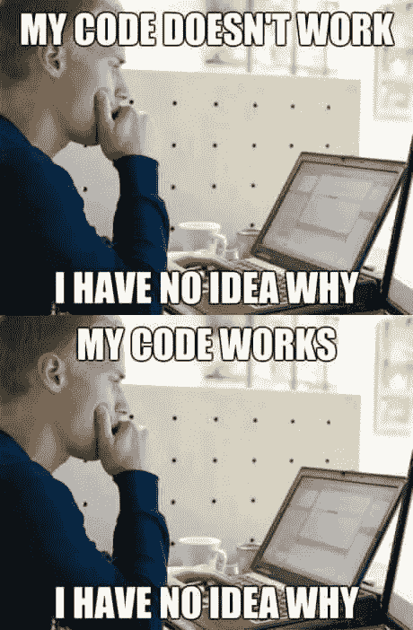
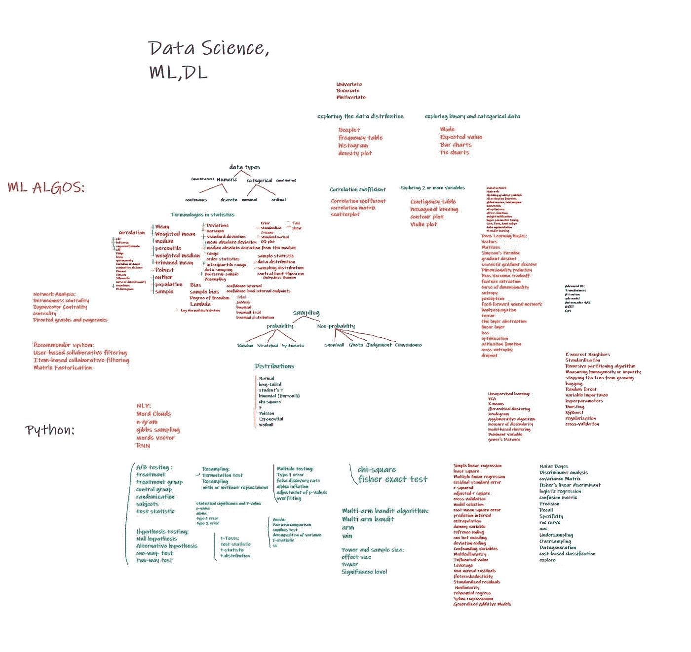
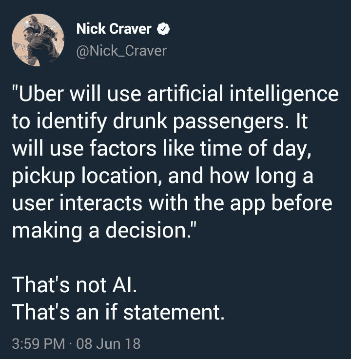

# 你有资格学数据科学吗？

> 原文：<https://medium.com/geekculture/are-you-eligible-for-data-science-a10f2154f82a?source=collection_archive---------18----------------------->

这是你以完美的方式接触数据科学、机器学习等所需的一切。

Clicked By Me [Amit Nikhade](https://medium.com/u/8cc2ede908a6?source=post_page-----a10f2154f82a--------------------------------) 😉

开始可能感觉困难，但如果指导得当，它可能会带来奇迹。开始学习数据科学和机器学习的人也是如此。人们只是直接潜入实际的机器学习代码，并试图掌握它的工作原理，不管他们是否理解它。人们相信他们能够破解代码背后的确切想法，而不是阅读文档或机器学习算法的实际工作…真的吗？我是在跟初学者开玩笑吗？

我也曾经是一个初学者，在我学习 ML 的最初阶段，我曾经只是从笔记本、存储库或其他人创建的任何博客中复制代码，只要对数据部分稍加修改，我就可以解决任何 ML 问题，这使我在镜子前假装**“我知道数据科学”**，但不是在数据科学知识的所有者面前，他们知道确切的问题解决方法。这种情况持续了很长时间，但突然有一天，一位先生(数据科学家)采访了我，这改变了我对学习数据科学的看法，改变了我对学习数据科学到底意味着什么的整体看法。因为我曾经申请一家公司的数据科学职位，这家公司给了我一次面试机会。

当我进入面试官的房间时，我看到一个简单的人坐在椅子上，他面前有一张中等大小的桌子，桌子上有一台笔记本电脑。我在等，面试官已经在问受访者问题了。我只听到了受访者要回答的最后三个问题，但他尝试了两个，剩下的一个他无法以适当的方式回答问题。然而，除了一个问题，他回答了所有的问题，据我所知，他的面试非常出色**。仅仅因为我没有意识到面试官提问的和受访者进一步阐述的任何问题或术语。但是在那个时候，我的情况很不寻常，因为我处于非常恐慌的状态，而在我离开家之前我并不是这样。**

****在那个特定的时刻脑海中闪现的想法****

> **他会问我什么，我甚至无法预测，因为我甚至不熟悉数据科学或 ML 这个术语，我只是用来运行代码，并认为我了解 ML。**

**他被录用了，并被提供了一个不错的职位，一个初级数据科学家的职位，按照我当时的想法，这是他应得的，即使是现在，如果想想他，我觉得他仍然值得。**

**他离开椅子后，轮到我了，面试官向我打招呼，表现得好像他是我最好的朋友之一，这使我的恐惧有所降低。事实上，他是一个脚踏实地的人。谁真的让我感觉很好，这并没有完全消除我的恐慌。他问我的介绍，这是每个面试官都有的问题。我一句话也说不出来，因为这是我第一次接受采访。尽管如此，我努力回答他，但当他开始问我第一个可怕的问题时，一切都变得明朗了。“什么是采样？”我被关了起来，我们两个都能够听到针下降的沉默，这使我更加恐慌。我的大脑一片空白。**

****我说****

***啊..玉米片..取样？？啊我..二…不记得了***

****好了，没问题了，让我们进入下一个问题“什么是 pdf？”，面试官说。****

****我那一刻的想法****

***哇，这是最简单的一个***

***pdf 代表可移植文档格式*，我回答。我对我的回答很满意，因为据我说，我写下了答案，也对他的问题感到困惑，我正在参加一个数据科学面试，为什么这个人一定要问我关于 pdf 的问题？？**

**面试官对我的回答感到非常惊讶，他鼓起掌来，又问了我一大堆问题。我甚至无法回答一个问题，这是我一生中最糟糕的面试，但却是一次改变游戏规则的面试。这次采访让我从我知道数据科学的误解中清醒过来，同样的事情影响了我以一种有机和真实的方式进一步学习它，最终我的数据科学之旅开始了。今天我离开了目的地。甚至目的地可能会想，这个家伙怎么这么轻松就超过了我。这背后的唯一原因是 ________。**

**没有什么是不可能的，也没有什么是直截了当的，这是我那天意识到的，在这个世界上学习任何东西都需要技巧和路线图，没有这两者，我们是不完整的。**

**那天我学到的东西，永远地改变了我的思维机制，甚至在今天也激励着我。从自己的错误中学习会让你变得巨大。是的。相信我。这就是生活的现实。**

****

****喊出来。****

1.  **知道一件事并不重要，但精确才重要。**
2.  **我们通常从其他来源复制代码，但在我们需要证明自己的时候，我们无法做到，因为我们意识到我们还没有手工编写任何代码。**
3.  **由于我们过于自信的天性，我们不会认真对待依赖、文档、需求和使用。*“这家伙到底写了什么，我不需要这些信息”***
4.  **我们羡慕的东西，我们试图为自己争取，但我们失败了，因为我们没有观察到它背后的努力。**
5.  **千万不要在社会上弄个假身份，假装“我什么都知道”。问问你自己你准备好了吗？？**
6.  **试着以这样一种方式学习和做任何事情，如果有人问你什么，你会足够自信，是的，我能很好地解释这一点。那一天你将值得庆祝。**
7.  **对自己诚实。这个世界不再真实。**
8.  **不要羞于提问>>问题<<. feel="" shame="" on="" knowing="" nothing="" that="" will="" play="" a="" crucial="" role="" in="" your="" life.=""/>**
9.  **Make reading a habit. Just consider reading as a bad habit which will make you adopt it as soon as possible.**
10.  **finally, be happy >>一个生命>>想想扩展它。**

****

**Roadmap**

## **说到重点了**

1.  **python 的完美是必须的。(Oop 的概念，熊猫，NumPy，数学等。)**
2.  **统计学，概率，基础扎实的线性代数。**
3.  **矩阵，向量，数组。**
4.  **ML 算法及其工作原理。**
5.  **深度神经网络及其工作原理。**
6.  **RNN，美国有线电视新闻网，DNN**
7.  **ML 和 DL 中的基本术语。我在下面提供了完整的学习地图。**
8.  **自然语言处理>单词嵌入、符号化和其他技术。**
9.  **计算机视觉>对图像的基本操作，如调整大小、应用滤镜。**

## **先进的**

1.  **结石**
2.  **试着阅读和理解研究论文**
3.  **生成模型，语言模型，编码器-解码器，自动编码器，图像模型。**
4.  **注意机制。**
5.  **变形金刚，伯特，GPT 等。**
6.  **部署。**

## **初学者的头脑**

**初学者认为 ML，数据科学只是编写代码并执行它..就是这样(涉及到更多的任务，其中数据收集、数据转换和分析几乎占了 60%的时间。后处理涉及部署部分。通过查看数据科学路线图，我们觉得目标很容易实现，但事实并非如此，需要学习的东西很多，我们需要不断更新。**

**我们梦想甚至试图获得所有技术的专家徽章，所以我们试图在所有方面工作，但不是成为所有技术的专家，我们甚至不能在单一方面达到精通。**

## **结论**

**不要认真对待任何事情，这一切都只是一个谎言，对不对？做评论。**

**我知道这个标题让你对文章有所期待，但却得到了意想不到的写作。希望你符合资格标准。**

**谢了。**

****

## **关于我**

** [## Amit Nikhade -人工智能工程师-自由职业者| LinkedIn

### 自由职业者:https://bit.ly/3riFHjr 在我的杯子里放了很多咖啡，为普通智力革命而工作。我…

www.linkedin.com](https://www.linkedin.com/in/theamitnikhade/)  [## -你好世界 2.o

### 你好，世界 2.o |欢迎来到人工智能和量子人工智能的世界|让我们深入研究量子位并…

amitnikhade.com](https://amitnikhade.com)**