# 攻击行为的影响范围

> 原文：<https://medium.com/geekculture/area-of-effect-attack-behavior-ec1cad5b9162?source=collection_archive---------30----------------------->

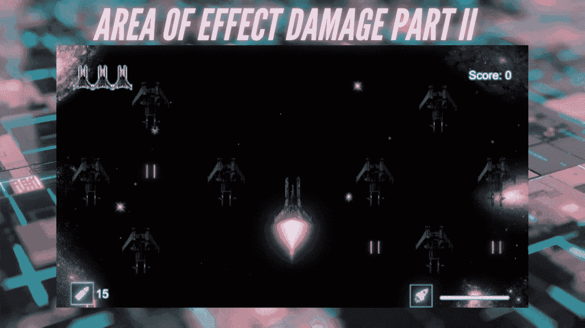

在[之前的文章](/geekculture/how-to-detect-colliders-surrounding-the-player-ebdcadf3ba61)中，我讲述了如何检测玩家周围的碰撞体，以及如何使用这种逻辑摧毁给定区域内的敌人。作为后续，这篇文章将涵盖 AoE 的视觉方面，以及如何在我的 2D 空间射击游戏中将它设置为临时辅助武器。

**目标**:创建一个冲击波动画，通过代码激活，以及我们在上一篇文章中创建的效果攻击方法。我们也将使得这个 AoE 攻击只有在玩家收集了全向射击能量后才可以执行，这种情况很少发生。

# 创建冲击波动画:

冲击波动画是使用 Unity Asset Store 中的简单盾牌泡泡精灵图像创建的。

1.  创建一个新的动画，并相应地命名。

2.缩放精灵并将其记录到关键帧上，使其像冲击波一样扩展。

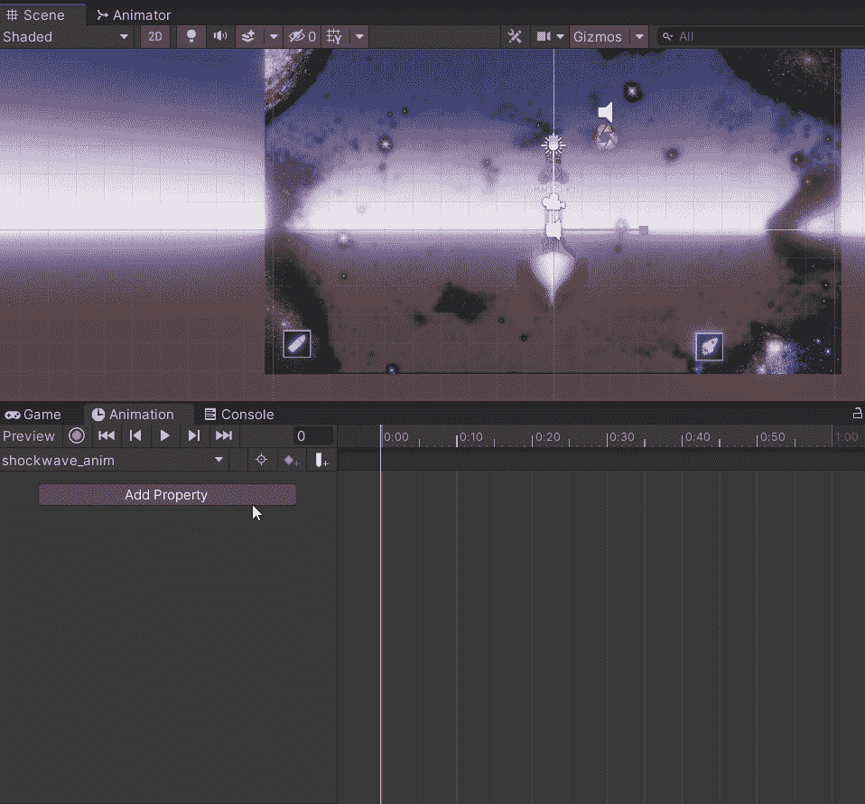

3.如果您需要调整动画的速度，请在项目文件夹中选择动画并打开它。在那里，一旦你点击动画节点，你将有选择。当您设置动画以匹配 AoE 攻击方法时，您可能需要稍后重新访问此步骤。

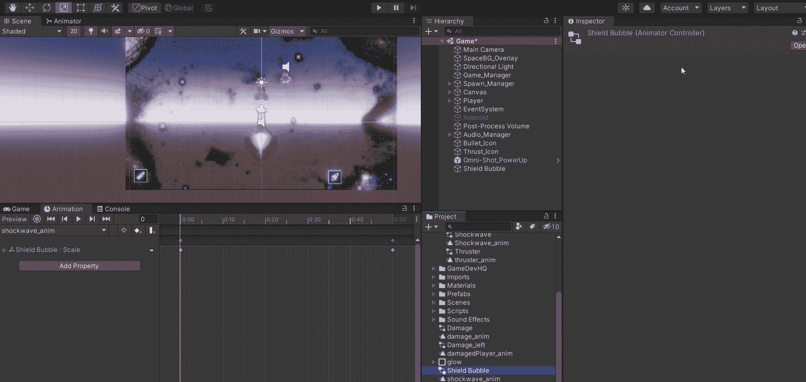

4.使 Shockwave sprite 成为 Player 对象的子对象，然后在检查器中停用它。

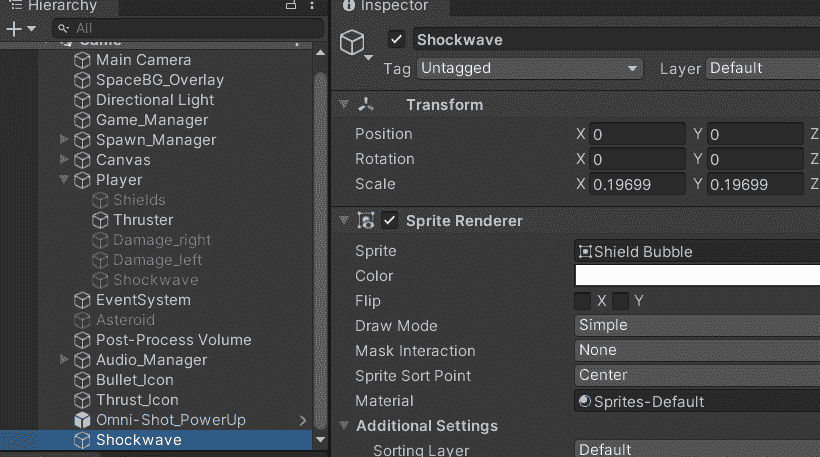

# 为 AoE 攻击行为制作协程

因为 shockwave 是 Player 对象的子对象，所以下面的代码被添加到我的 Player 脚本中。

1.  添加一个 bool 变量来跟踪何时启用 shockwave。

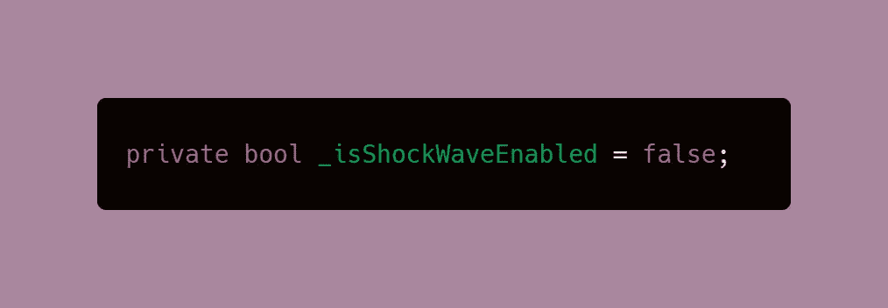

2.为 shockwave 可视化工具添加另一个带有 SerializeField 的全局变量。这将有助于我们通过代码激活和停用动画。创建变量后，将父级 shockwave 对象分配到检查器中新创建的槽中。

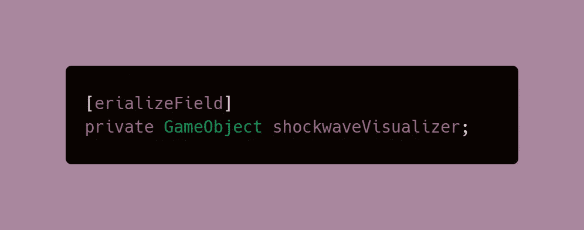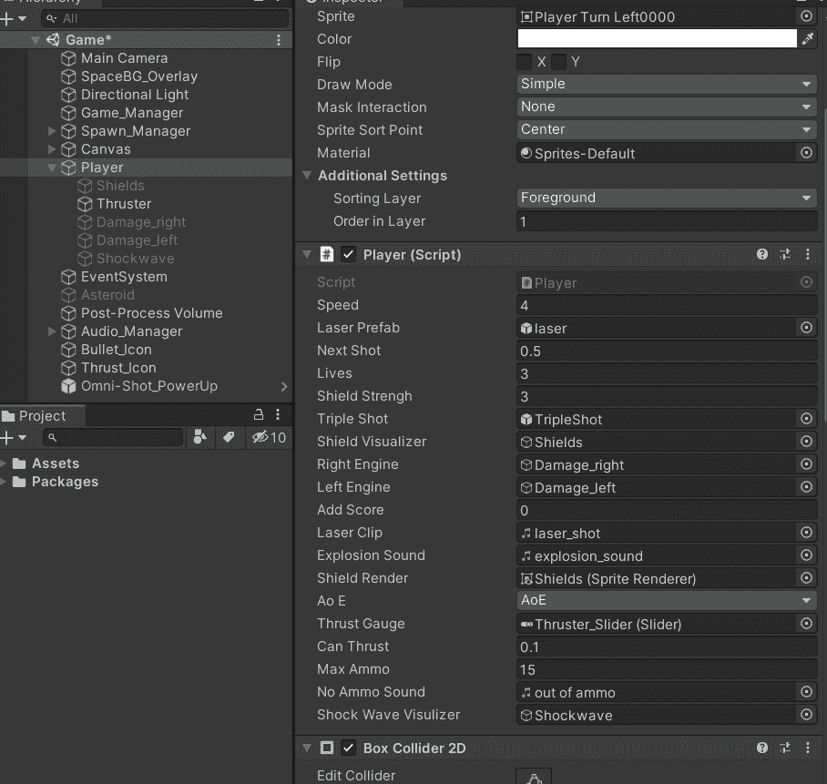

3.创建一个方法来处理在调用时更改 bool 变量的值。最佳实践是通过方法而不是动态地更改变量值。这个方法稍后将从一个[加电脚本](https://levelup.gitconnected.com/creating-modular-power-up-systems-bcf349e0020)中调用，该脚本处理玩家碰撞器的检测，并在收集时相应地激活。

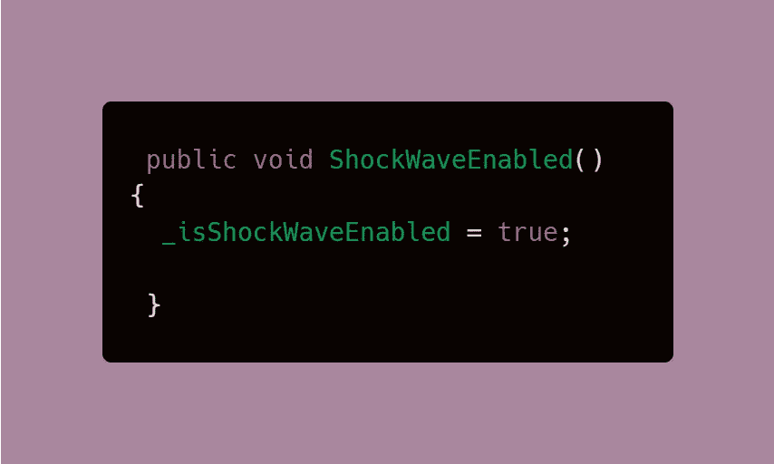

4.创建一个[协程](/codex/coroutines-with-unity-b5a2b3fc3426)，这将是 AoE 攻击行为的结构之一，因为它将处理何时激活和停用组成我们 AoE 代码的所有内容。因为在这个协程中有很多需要添加的东西，所以我将详细介绍每一行代码的作用。

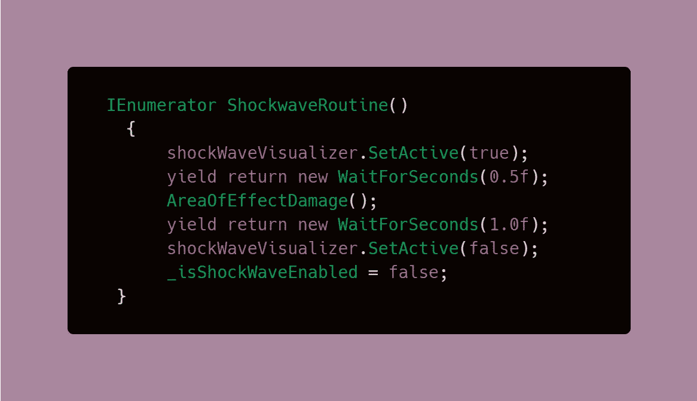

*   **SetActive(true)** 将激活冲击波的动画。
*   协程中的*产出*允许它在你设置的多长时间内进行**暂停，然后激活[上一篇文章](/geekculture/how-to-detect-colliders-surrounding-the-player-ebdcadf3ba61)中创建的**效果伤害法**。**
*   在动画再次失效之前，将有**另一个正好 1 秒的暂停**，并且我们之前创建的 bool 变量将被设置为 false 。
*   由于冲击波在一秒内变得不活跃，这意味着全向射击只允许玩家射击一次，因为它只在玩家按下按钮的那一秒活跃。然而，这个**并不意味着**一旦收集到能量，玩家就有一秒钟的窗口来使用 AoE 攻击。协程只有在玩家开火影响收集异能时才会启动。

# 激活全向射击/冲击波作为辅助武器

2D 太空射手使用空格键发射武器，一旦收集到能量，而不是发射普通的激光，玩家将发射冲击波。所有将通过使用相同的空格键，编程的交替是必要的。

1.  每当 _isShockWaveEnabled 变量设置为 true 时，协程将被设置为启动。这是我们之前创建的同一个 bool 变量。这将放在 if-else 语句(或 [switch 语句](https://levelup.gitconnected.com/switch-statements-to-the-rescue-277cb924c312))中，以确保与其他触发方法没有冲突。

> **注意**:下面的代码是我的 2D 空间射击游戏中的射击方法，但是，我在本教程中已经突出显示了需要的部分。

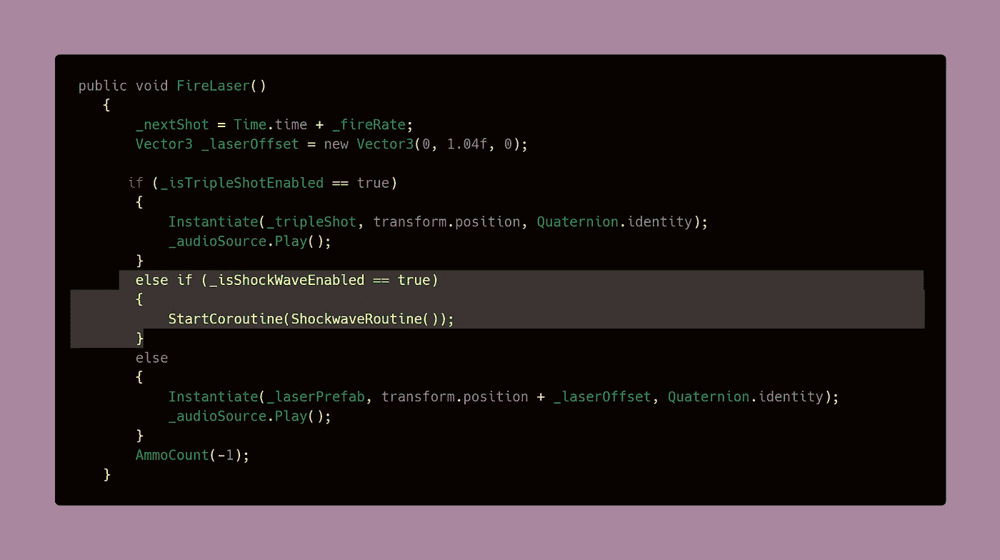

3.终于到了使用 ShockWaveEnabled 方法的时候了，该方法是之前创建的，用于在调用时将 bool 变量的值更改为 true。这个方法将从[加电脚本](https://levelup.gitconnected.com/creating-modular-power-up-systems-bcf349e0020)中调用，一旦玩家与加电对象碰撞，这将使 bool _isShockwaveEnabled = true，这将使协程在玩家第一次使用武器时启动。

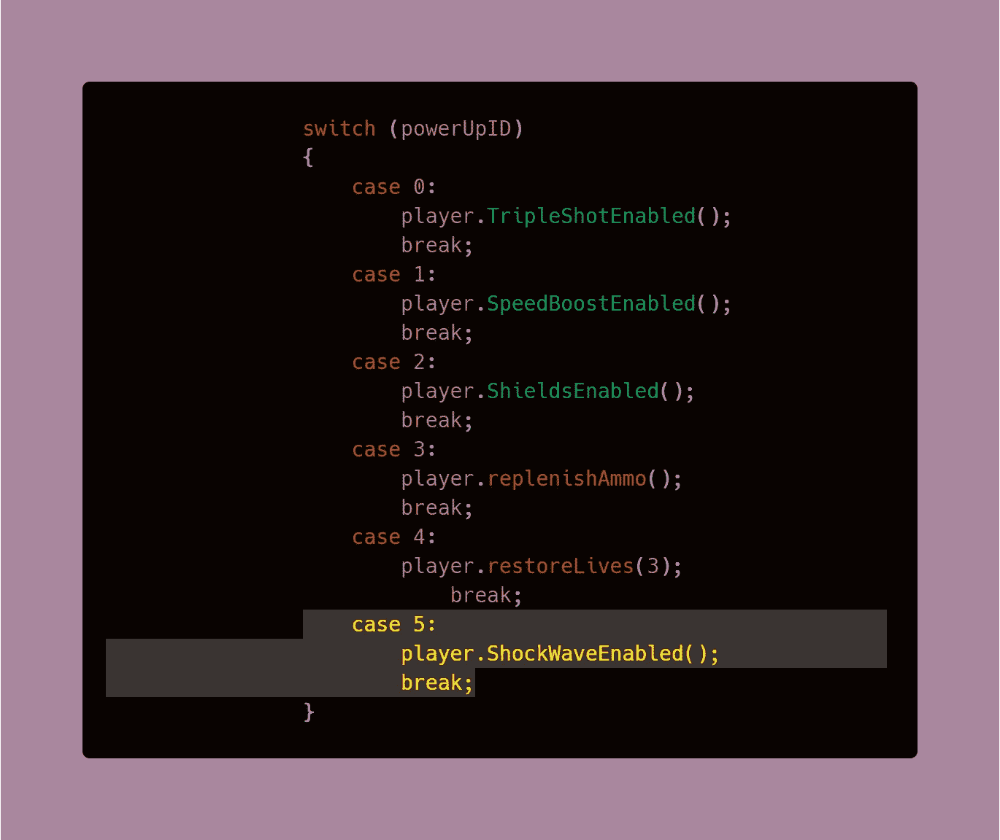

4.加电应该很少产卵，因为它是一个非常强大的武器，为了实现这一点，一个新的 if 语句被添加到产卵管理器脚本的产卵例程中。这是我们的第五个异能，以及它随机产生的频率，其他的包含了所有其他异能产生的频率。

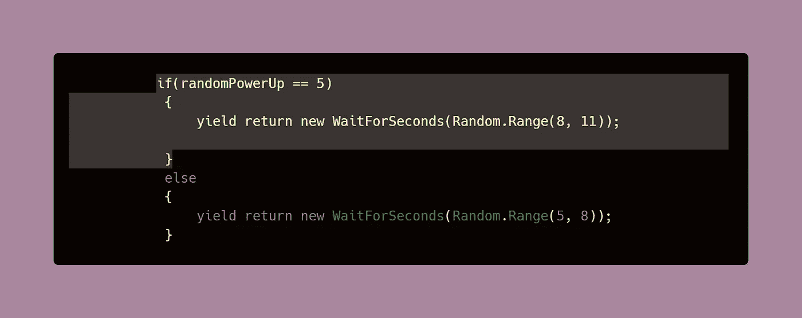

## 结果是:

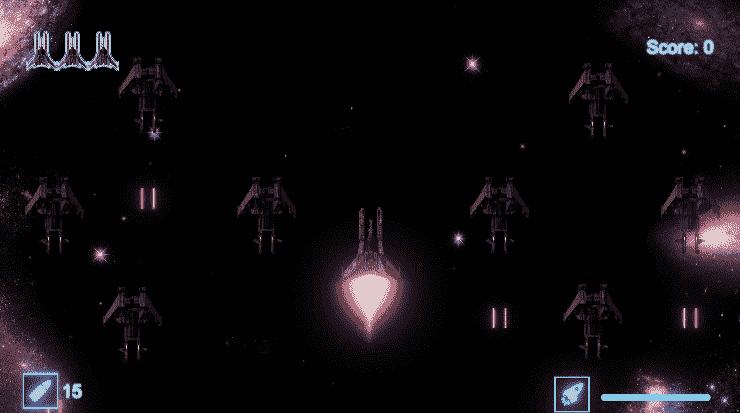