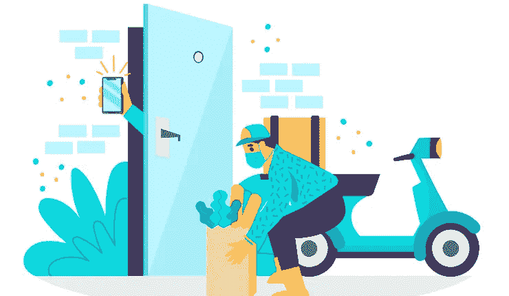
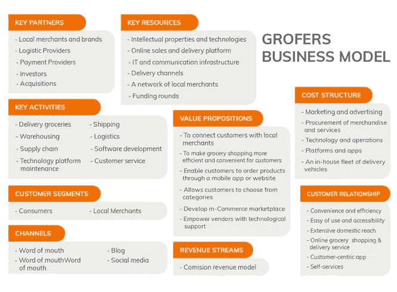
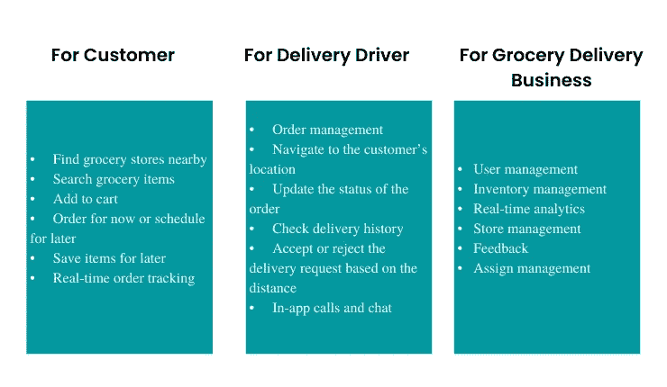

# 确定开发商成本的领域，如应用程序开发

> 原文：<https://medium.com/geekculture/areas-to-determine-cost-for-grofers-app-development-c1f9cab74272?source=collection_archive---------16----------------------->

Grocery Delivery App Like Grofers

疫情导致几乎所有的主要服务，如食品配送和杂货走上了在线服务的道路，因为客户仍然被困在他们的房子里。这导致企业很快意识到，除非他们有一个应用程序，使快速服务交付成为可能，否则很难让客户参与进来。超市对这一区域特别了解。因此，今天杂货交付应用程序及其用户的百分比已经隐喻性地上升了一个转型数字。如上所述，疫情使杂货交付解决方案的受欢迎程度呈指数级上升。您可能会想到一些主要应用程序的名称，这些应用程序对此负有特别的责任。因此，其中一些著名的名字是 Grofers，Instamart 等。

然而，在文章中，我们将更多地讨论 Grofers。

那么让我们来理解一下格罗佛人气飙升的原因。

# 格罗佛斯为什么受欢迎？

有了这款应用，顾客不仅能够快速获得家居用品。与此同时，企业已经获得了建立强大在线基础所需的实力。

浏览下图，深入了解这款杂货递送应用的商业模式，这款应用推动了它的流行。

Image Source — elluminatiinc.com

上图描绘了[杂货店送货](https://www.peppyocean.com/wp-content/uploads/2022/06/logistics-app-development-1024x768.png)应用程序中的组件——当地超市、用户和送货司机。这三者共同作用，让企业产生最大的利润。

所有这些因素最终都足以表明，Grofers 无疑已经成为那些开始为自己的杂货递送初创公司增加在线知名度的人的灵感来源。它鼓励他们建立一个类似的应用程序，这样他们就可以更好地为客户服务，让他们能够快速获得重要的家居用品。

在这里，我们解释了像 Grofers 这样的杂货交付应用程序的主要因素，除了其拥有一个有吸引力的商业模式外，Grofers 最初获得了如此大的人气。

# Grofers 等杂货交付应用受欢迎的其他原因

*   为消费者节省时间，让他们可以访问附近的超市，只需在应用程序上点击几下，就可以找到他们想要的商品。
*   允许客户根据自己的方便安排订单，并能够跟踪订单。
*   通过 it，订单管理成为一项无缝的任务。这有利于食品杂货递送企业，因为它们不再需要维护登记簿等。，为此。
*   为超市推广新的优惠和折扣以及吸引顾客提供便利。
*   应用程序的简单操作。这一独特的方面让 Grofers 这样的杂货交付应用脱颖而出。通过客户在进入应用程序后点击几下。这是在他们添加位置等细节后，首先为他们提供附近的杂货店列表。之后，顾客可以选择一家商店，点击他们想要的商品。执行此任务后，客户现在可以从不同的可用支付方式中选择一种支付方式，然后进行支付。订单得到确认，商店将其分配给送货司机。然后司机拿起订单，开始送货。客户收到不同交付阶段的通知。这是让应用程序脱颖而出的原因。
*   该应用程序为客户、杂货配送业务和配送司机提供了一些独特的功能，因此变得更加流行。

下面看看他们。

由于这些功能，越来越多的杂货交付初创公司被鼓励开发类似 Grofers 的应用程序。如果你也是其中之一，那你来对地方了。在下面的几行中，我们强调了开发像 Grofers 这样的杂货应用程序的成本，以及使这一成本易于确定的领域。

因此，让我们在下面的行中详细理解这一点。

# 开发像 Grofers 这样的杂货应用程序的成本——需要关注的领域

当你开始估算开发一个像 Grofers 这样的杂货应用程序的成本时，你需要评估这些方面。

*   基于区域。在印度，费用在每小时 20 到 40 美元之间。另一方面，在美国，每小时的费用在 100 到 150 美元之间。
*   根据应用程序开发阶段和花费的小时数，可以灵活地评估整体支出。
*   基于 app 类型，app 是最小可行产品，是现成的超级 app，还是定制的解决方案。

了解开发一个像 Grofers 这样的杂货应用程序的总成本，了解支出领域不断变化是很重要的。它根据不同的方面而变化，比如你从哪家公司获得服务，参与开发的团队实力等等。

因此，为了确保你不必花费太多，Grofers clone 应用程序是你的杂货店送货创业的正确途径。

以下是您需要了解的解决方案。

# 向您介绍 Grofers 克隆应用程序

Grofers clone 应用程序由可定制的 Grofers clone 脚本构建而成，是一款现成的杂货交付应用程序，具有可修改的功能。接下来是针对不同细分市场(用户、送货司机和杂货送货初创公司)的独立应用和网络面板的出现。所有这些领域允许他们有效地运行解决方案，并帮助企业，特别是，通过他们在根据不断变化的需求修改解决方案时获得的独立性，建立一个成功的杂货交付帝国。

了解了一点这个解决方案，你一定想知道它对于杂货递送创业公司的优势。

以下是其中的一些。

# Grofers Clone 应用程序对杂货配送初创公司的优势

*   允许杂货店创业立即开始
*   它拥有让不同的细分市场，如用户、送货司机和杂货店创业公司受益的功能
*   业务管理是 it 部门简化的任务。这是通过解决方案在管理
    驱动程序、用户、商店等方面提供的支持实现的。，不一而足。

因此，所有这些因素都让我们明白，如果开始着手建立一个成功、繁荣和盈利的杂货递送业务，Grofers clone 应用程序就是你的答案。

# 包扎

Grofers 让杂货配送企业建立了强大的在线可见性，使客户能够找到他们需要的家居用品，并相当轻松地购买它们。这与帮助送货司机获得许多就业机会和帮助杂货店建立稳固的基础是一致的。

因此，它是那些涉足杂货生意的人的灵感来源。这就是为什么新创企业朝着创造和开发像 Grofers 这样的杂货交付应用的方向发展。因此，如果你是他们中的一员，同样渴望建立一个强大的杂货配送帝国，那么评估一下成本区域。这将确保你可以节省资金，实现这一点没有障碍或路障。灌输 Grofers 克隆应用程序。该解决方案将帮助您从第一天起就获得最大的投资回报，并通过您为客户提供的独特杂货交付体验获得可观的收入。所以，不要再等了。踏上革命性的杂货递送业务之旅，开发类似应用程序的 Grofers 来转化利润。